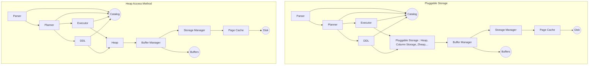

```mermaid
graph TD
  subgraph PluggableStorage[Pluggable Storage]
    Parser[Parser] --> Planner[Planner]
    Parser --> Catalog((Catalog))
    Planner --> Executor[Executor]
    Planner--> DDL[DDL] 
    Planner --> Catalog
    Executor --> PS[Pluggable Storage : Heap, Column Storage, Zheap,...]
    Executor --> Catalog
    DDL --> PS
    DDL --> Catalog
    PS --> BufferManager[Buffer Manager]
    BufferManager --> StorageManager[Storage Manager]
    BufferManager --> Buffers((Buffers))
    StorageManager --> PageCache[Page Cache]
    PageCache --> Disk((Disk))
  end
  subgraph HeapAccessMethod[Heap Access Method]
  Parser1[Parser] --> Planner1[Planner]
  Parser1 --> Catalog1((Catalog))
  Planner1 --> Executor1[Executor]
  Planner1--> DDL1[DDL] 
  Planner1 --> Catalog1
  Executor1 --> Heap1[Heap]
  Executor1 --> Catalog1
  DDL1 --> Heap1
  DDL1 --> Catalog1
  Heap1 --> BufferManager1[Buffer Manager]
  BufferManager1 --> StorageManager1[Storage Manager]
  BufferManager1 --> Buffers1((Buffers))
  StorageManager1 --> PageCache1[Page Cache]
  PageCache1 --> Disk1((Disk))
  end
```