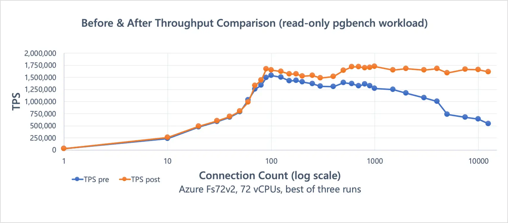

<!--
Les commits sur ce sujet sont :

* https://commitfest.postgresql.org/29/2500/

Discussion

* https://gitlab.dalibo.info/formation/workshops/-/issues/137

-->

(Les graphiques sont empruntés à l'article de blog d'Andres Freund cité plus bas.)
<!-- FIXME   on va dire que c'est couvert par le droit de citation ?  -->

Pour rappel, le mécanisme MVCC (_MultiVersion Concurrency Control_) de PostgreSQL
facilite l’accès concurrent de plusieurs utilisateurs (sessions) à la base en 
disposant en permanence de plusieurs versions différentes d’un même enregistrement.
Chaque session peut travailler simultanément sur la version qui s’applique à son
contexte (on parle d’« instantané » ou de _snapshot_).

Une série d'optimisations ont été apportées dans cette version 14 sur la gestion
des _snapshots_ induits par ce mécanisme lorsqu'un très grand nombre de connexions
est atteint. Dans un [mail destiné aux développeurs][20200301083601], Andres Freund
explique qu'une transaction consomme beaucoup de ressources pour actualiser l'état
_xmin_ de sa propre session, et que la méthode `GetSnapshotData()`, requise pour
obtenir les informations sur les transactions du système, nécessitait de consulter
l'état de chacune d'entre elles dans les zones mémoires de tous les CPU du serveur.

[20200301083601]: https://www.postgresql.org/message-id/flat/20200301083601.ews6hz5dduc3w2se@alap3.anarazel.de

Dans un [article à ce sujet][20201025-citusdata], l'auteur du patch indique que
les bénéfices sont également remarquables lorsqu'un grand nombre de sessions 
inactives (_idle_) sont connectées à l'instance. Dans le _benchmark_ suivant, on
peut constater que les performances (TPS : _Transactions Per Second_) restent
stables pour 48 sessions actives à mesure que le nombre de sessions inactives
augmentent.

[20201025-citusdata]: https://www.citusdata.com/blog/2020/10/25/improving-postgres-connection-scalability-snapshots/

La solution consiste à changer la méthode `GetSnapshotData()` afin que seules les
informations _xmin_ des transactions en écriture soient accessibles depuis un
cache partagé. Dans une architecture où les lectures sont majoritaires, cette
astuce permet de reconstituer les instantanés bien plus rapidement, augmentant 
considérablement la quantité d'opérations par transaction.

PostgreSQL 14 est donc un gros progrès pour les instances supportant de très nombreuses
connexions simultanées, actives ou non.

