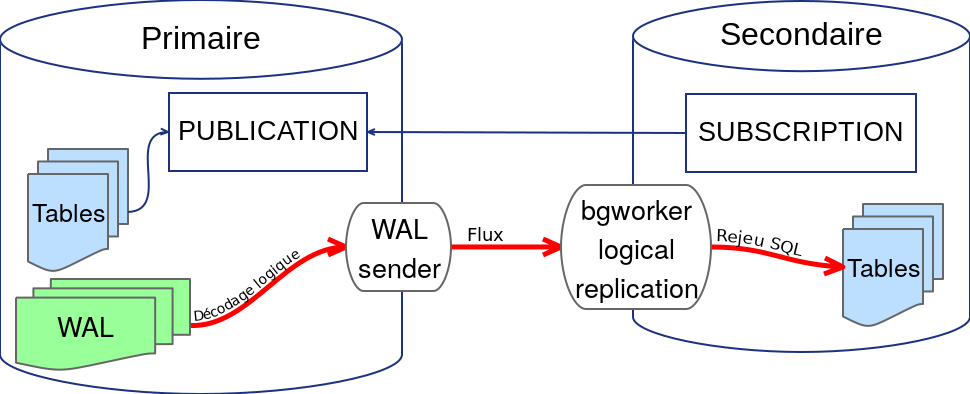

# Nouveautés de PostgreSQL 10


<div class="notes">
Photographie obtenue sur [urltarget.com](http://www.urltarget.com/elephant-rock-valley-of-fire.html).

Public Domain CC0.
</div>

-----

## Introduction

<div class="slide-content">
  * Développement depuis août 2016
  * Version beta 1 sortie le 18 mai
  * Sortie de la version finale le 5 octobre 2017
  * Plus de 1,4 million de lignes de code *C*
  * Des centaines de contributeurs
</div>

<div class="notes">
Le développement de la version 10 a suivi l'organisation habituelle : un
démarrage mi 2016, des Commit Fests tous les deux mois, un Feature Freeze en
mars, une première version beta mi-mai.

La version finale est sortie le 5 octobre 2017.

La version 10 de PostgreSQL contient plus de 1,4 millions de lignes de code *C*.
Son développement est assuré par des centaines de contributeurs répartis partout
dans le monde.

Si vous voulez en savoir plus sur le fonctionnement de la communauté PostgreSQL,
une présentation récente de *Daniel Vérité* est disponible en ligne :

  * [Vidéo](https://youtu.be/NPRw0oJETGQ)
  * [Slides](https://dali.bo/daniel-verite-communaute-dev-pgday)
</div>

-----

### Au menu

<div class="slide-content">
  * Changements importants
  * Partitionnement
  * Réplication logique
  * Performances
  * Sécurité
  * Autres nouveautés
  * Compatibilité
  * Futur
</div>

<div class="notes">
PostgreSQL 10 apporte un grand nombre de nouvelles fonctionnalités, qui sont
d'ores et déjà détaillées dans de nombreux articles. Voici quelques liens vers
des articles en anglais :

  * [New in postgres 10](https://dali.bo/new-in-postgres-10) du projet PostgreSQL
  * [New Features Coming in PostgreSQL 10](https://dali.bo/new-features-coming-in-postgresql-10) de *Robert Haas*
  * [PostgreSQL 10 New Features With examples](https://dali.bo/hp-new-features-pg10) de *HP*
</div>

-----

## Changements importants

<div class="slide-content">
  * Changement de la numérotation
  * Changement de nommage
  * Changement de configuration par défaut
</div>

<div class="notes">
</div>

-----

### Numérotation des versions

<div class="slide-content">
Ancienne numérotation exprimée sur 3 nombres :

```
  9 . 6 . 3 
  Majeure1 . Majeure2 . Mineure
```

Nouvelle numérotation exprimée sur 2 nombres uniquement :

```
  10 . 2
  Majeure . Mineure
```
</div>

<div class="notes">
La sortie de PostgreSQL 10 inaugure un nouveau système de numérotation des
versions. Auparavant, chaque version était désignée par 3 nombres, comme par
exemple *9.6.3*. La nouvelle numérotation sera désormais exprimée sur 2 nombres,
*10.3* sera par exemple la troisième version mineure de la version majeure *10*.

L'ancienne numérotation posait problème aux utilisateurs, mais aussi aux
développeurs.

Pour les développeurs, à chaque nouvelle version majeure, la question se posait
de changer les deux premiers nombres ou seulement le second ("Est-ce une version
9.6 ou 10.0 ?"). Ceci générait de grosses discussions et beaucoup de
frustrations. En passant à un seul nombre pour la version majeure, ce problème
disparaît et les développeurs peuvent ainsi se concentrer sur un travail plus
productif.

Pour les utilisateurs, principalement les nouveaux, cela apportait une confusion
peu utile notamment lors des mises à jour.

Vous trouverez plus de détails dans cet
[article](https://dali.bo/changing-postgresql-version-numbering) de Josh Berkus.
</div>

-----

### Nommage

<div class="slide-content">
  * Au niveau des répertoires                                                   
    * `pg_xlog` -> `pg_wal`                                                     
    * `pg_clog` -> `pg_xact`                                                    
  * Au niveau des fonctions                                                     
    * `xlog` -> `wal`                                                           
    * `location` -> `lsn`                                                       
  * Au niveau des outils                                                        
    * `xlog` -> `wal`    
</div>

<div class="notes">
Afin de clarifier le rôle des répertoires `pg_xlog` et `pg_clog` qui contiennent
non pas des *logs* mais des *journaux de transaction* ou de commits, les deux
renommages ont été effectués dans `$PGDATA`. Les fonctions dont les noms y
faisaient référence ont également été renommées.

Ainsi, voici le contenu actuel d'un répertoire de données PostgreSQL après son
initialisation :

```
drwx------. 5 postgres postgres  4096 Aug  3 17:24 base
drwx------. 2 postgres postgres  4096 Aug  3 17:24 global
drwx------. 2 postgres postgres  4096 Aug  3 17:24 pg_commit_ts
drwx------. 2 postgres postgres  4096 Aug  3 17:24 pg_dynshmem
-rw-------. 1 postgres postgres  4513 Aug  3 17:24 pg_hba.conf
-rw-------. 1 postgres postgres  1636 Aug  3 17:24 pg_ident.conf
drwx------. 4 postgres postgres  4096 Aug  3 17:24 pg_logical
drwx------. 4 postgres postgres  4096 Aug  3 17:24 pg_multixact
drwx------. 2 postgres postgres  4096 Aug  3 17:24 pg_notify
drwx------. 2 postgres postgres  4096 Aug  3 17:24 pg_replslot
drwx------. 2 postgres postgres  4096 Aug  3 17:24 pg_serial
drwx------. 2 postgres postgres  4096 Aug  3 17:24 pg_snapshots
drwx------. 2 postgres postgres  4096 Aug  3 17:24 pg_stat
drwx------. 2 postgres postgres  4096 Aug  3 17:24 pg_stat_tmp
drwx------. 2 postgres postgres  4096 Aug  3 17:24 pg_subtrans
drwx------. 2 postgres postgres  4096 Aug  3 17:24 pg_tblspc
drwx------. 2 postgres postgres  4096 Aug  3 17:24 pg_twophase
-rw-------. 1 postgres postgres     3 Aug  3 17:24 PG_VERSION
drwx------. 3 postgres postgres  4096 Aug  3 17:24 pg_wal
drwx------. 2 postgres postgres  4096 Aug  3 17:24 pg_xact
-rw-------. 1 postgres postgres    88 Aug  3 17:24 postgresql.auto.conf
-rw-------. 1 postgres postgres 22746 Aug  3 17:24 postgresql.conf
```

Si on regarde les fonctions contenant le mot clé `wal` :

```
postgres=# SELECT proname FROM pg_proc WHERE proname LIKE '%wal%'
     ORDER BY proname;
          proname
---------------------------
 pg_current_wal_flush_lsn
 pg_current_wal_insert_lsn
 pg_current_wal_lsn
 pg_is_wal_replay_paused
 pg_last_wal_receive_lsn
 pg_last_wal_replay_lsn
 pg_ls_waldir
 pg_stat_get_wal_receiver
 pg_stat_get_wal_senders
 pg_switch_wal
 pg_wal_lsn_diff
 pg_wal_replay_pause
 pg_wal_replay_resume
 pg_walfile_name
 pg_walfile_name_offset
(15 rows)
```

Pour les outils, cela concerne :

```
$ ls -l *wal*
-rwxr-xr-x. 1 postgres postgres 248832 Aug  2 11:09 pg_receivewal
-rwxr-xr-x. 1 postgres postgres 149576 Aug  2 11:09 pg_resetwal
-rwxr-xr-x. 1 postgres postgres 482344 Aug  2 11:09 pg_waldump
```

L'ensemble des contributions de l'écosystème PostgreSQL va également devoir
s'adapter à ces changements de nommage. Il sera donc nécessaire avant de migrer
sur cette nouvelle version de vérifier que les outils d'administration, de
maintenance et de supervision ont bien été rendus compatibles avec cette
version.

Pour en savoir plus sur le sujet, vous pouvez consulter l'article intitulé
[Rename “pg_xlog” directory to pg_wal](https://dali.bo/waiting-for-postgresql-10-rename-pg_xlog-directory-to-pg_wal).
</div>

-----

### Configuration

<div class="slide-content">
  * Changement des valeurs par défaut
  * postgresql.conf
    * wal_level : replica
    * max_wal_senders : 10
    * max_replication_slots : 10
    * hot_standby : on

  * pg_hba.conf
    * connexions de réplication autorisées sur localhost
</div>

<div class="notes">
Certains paramètres ont vu leur valeur par défaut modifiée. Ceci est
principalement en relation avec la réplication, l'idée étant qu'il ne soit
plus nécessaire de redémarrer l'instance pour activer la réplication.

+-----------------------+----------+---------+                                  
| Paramètre             | 9.6      | 10      |                                  
+=======================+==========+=========+                                  
| wal_level             | minimal  | replica |
+-----------------------+----------+---------+  
| max_wal_senders       | 0        | 10      |
+-----------------------+----------+---------+ 
| max_replication_slots | 0        | 10      | 
+-----------------------+----------+---------+ 
| hot_standby           | off      | on      | 
+-----------------------+----------+---------+  

</div>

-----

## Partitionnement

<div class="slide-content">
  * Petit rappel sur l'ancien partitionnement
  * Nouveau partitionnement
  * Nouvelle syntaxe
  * Quelques limitations
</div>

<div class="notes">
PostgreSQL dispose d'un contournement permettant de partitionner certaines
tables. La mise en place et la maintenance de ce contournement étaient
complexes. La version 10 améliore cela en proposant une intégration bien plus
poussée du partitionnement.
</div>

-----

### Ancien partitionnement

<div class="slide-content">
  * Le partitionnement par héritage se base sur
    * la notion d'héritage (1 table mère et des tables filles)
    * des triggers pour orienter les insertions vers les tables filles
    * des contraintes d’exclusion pour optimiser les requêtes
  * Disponible depuis longtemps
</div>

<div class="notes">
L'ancienne méthode de partitionnement dans PostgreSQL se base sur un
contournement de la fonctionnalité d'héritage. L'idée est de créer des 
tables filles d'une table parent par le biais de l'héritage. De ce fait,
une lecture de la table mère provoquera une lecture des données des tables
filles. Un ajout ultérieur à PostgreSQL a permis de faire en sorte que 
certaines tables filles ne soient pas lues si une contrainte CHECK permet
de s'assurer qu'elles ne contiennent pas les données recherchées. Les
lectures sont donc assurées par le biais de l'optimiseur.

Il n'en va pas de même pour les écritures. Une insertion dans la table
mère n'est pas redirigée automatiquement dans la bonne table fille. Pour
cela, il faut ajouter un trigger qui annule l'insertion sur la table mère
pour la réaliser sur la bonne table fille. Les mises à jour sont gérées
tant qu'on ne met pas à jour les colonnes de la clé de partitionnement.
Enfin, les suppressions sont gérées correctement de façon automatique.

Tout ceci génère un gros travail de mise en place. La maintenance n'est
pas forcément plus aisée, car il est nécessaire de s'assurer que les 
partitions sont bien créées en avance, à moins de laisser ce travail
au trigger sur insertion.

D'autres inconvénients sont également présents, notamment au niveau des index.
Comme il n'est pas possible de créer un index global (ie, sur plusieurs tables),
il n'est pas possible d'ajouter une clé primaire globale pour la table
partitionnée. En fait, toute contrainte unique est impossible.

En d'autres termes, ce contournement pouvait être intéressant dans certains
cas très particuliers et il fallait bien s'assurer que cela ne générait pas
d'autres soucis, notamment en termes de performances. Dans tous les autres cas,
il était préférable de s'en passer.
</div>

-----

### Nouveau partitionnement

<div class="slide-content">
  * Mise en place et administration simplifiées car intégrées au moteur
  * Plus de trigger
    * insertions plus rapides
    * routage des données insérées dans la bonne partition
    * erreur si aucune partition destinataire
  * Partitions
    * attacher/détacher une partition
    * contrainte implicite de partitionnement
    * expression possible pour la clé de partitionnement
    * sous-partitions possibles
  * Changement du catalogue système
    * nouvelles colonnes dans `pg_class`
    * nouveau catalogue `pg_partitioned_table`
</div>

<div class="notes">
La version *10* apporte un nouveau système de partitionnement se basant sur de
l'infrastructure qui existait déjà dans PostgreSQL.

Le but est de simplifier la mise en place et l'administration des tables
partitionnées. Des clauses spécialisées ont été ajoutées aux ordres SQL déjà
existants, comme `CREATE TABLE` et `ALTER TABLE` , pour ajouter, attacher,
et détacher des partitions.

Au niveau de la simplification de la mise en place, on peut noter qu'il n'est
plus nécessaire de créer une fonction trigger et d'ajouter des triggers pour
gérer les insertions et les mises à jour. Le routage est géré de façon automatique
en fonction de la définition des partitions. Si les données insérées ne
trouvent pas de partition cible, l'insertion est tout simplement en erreur.
Du fait de ce routage automatique, les insertions se révèlent aussi plus rapides.

Le catalogue `pg_class` a été modifié et indique désormais :

* si une table est une partition (dans ce cas : `relispartition = 't'`)
* si une table est partitionnée (`relkind = 'p'`) ou si elle est ordinaire (`relkind = 'r'`)
* la représentation interne des bornes de partitionnement (`relpartbound`)

Le catalogue `pg_partitioned_table` contient quant à lui les colonnes suivantes :

+---------------+------------------------------------------------------------------------------------------------------------------------+
| Colonne       | Contenu                                                                                                                |
+===============+========================================================================================================================+
| partrelid     | OID de la table partitionnée référencé dans `pg_class`                                                                 |
+---------------+------------------------------------------------------------------------------------------------------------------------+
| partstrat     | Stratégie de partitionnement ; l = par liste, r = par intervalle                                                       |
+---------------+------------------------------------------------------------------------------------------------------------------------+
| partnatts     | Nombre de colonnes de la clé de partitionnement                                                                        |
+---------------+------------------------------------------------------------------------------------------------------------------------+
| partattrs     | Tableau de partnatts valeurs indiquant les colonnes de la table faisant partie de la clé de partitionnement            |
+---------------+------------------------------------------------------------------------------------------------------------------------+
| partclass     | Pour chaque colonne de la clé de partitionnement, contient l'OID de la classe d'opérateur à utiliser                   |
+---------------+------------------------------------------------------------------------------------------------------------------------+
| partcollation | Pour chaque colonne de la clé de partitionnement, contient l'OID du collationnement à utiliser pour le partitionnement |
+---------------+------------------------------------------------------------------------------------------------------------------------+
| partexprs     | Arbres d'expression pour les colonnes de la clé de partitionnement qui ne sont pas des simples références de colonne   |
+---------------+------------------------------------------------------------------------------------------------------------------------+


Aucune donnée n'est stockée dans la table partitionnée. Il est possible de le
vérifier en utilisant un SELECT avec la clause `ONLY`.
</div>

-----

### Exemple de partitionnement par liste

<div class="slide-content">
  * Créer une table partitionnée :

    `CREATE TABLE t1(c1 integer, c2 text) PARTITION BY LIST (c1);`

  * Ajouter une partition :

    `CREATE TABLE t1_a PARTITION OF t1 FOR VALUES IN (1, 2, 3);`

  * Détacher la partition :

    `ALTER TABLE t1 DETACH PARTITION t1_a;`

  * Attacher la partition :

    `ALTER TABLE t1 ATTACH PARTITION t1_a FOR VALUES IN (1, 2, 3);`
</div>

<div class="notes">
**Exemple complet :**

Création de la table principale et des partitions :

```sql
postgres=# CREATE TABLE t1(c1 integer, c2 text) PARTITION BY LIST (c1);
CREATE TABLE

postgres=# CREATE TABLE t1_a PARTITION OF t1 FOR VALUES IN (1, 2, 3);
CREATE TABLE

postgres=# CREATE TABLE t1_b PARTITION OF t1 FOR VALUES IN (4, 5);
CREATE TABLE
```

Insertion de données :

```sql
postgres=# INSERT INTO t1 VALUES (0);
ERROR:  no PARTITION OF relation "t1" found for row
DETAIL:  Partition key of the failing row contains (c1) = (0).

postgres=# INSERT INTO t1 VALUES (1);
INSERT 0 1

postgres=# INSERT INTO t1 VALUES (2);
INSERT 0 1

postgres=# INSERT INTO t1 VALUES (5);
INSERT 0 1

postgres=# SELECT * FROM ONLY t1;
 c1 | c2 
----+----
(0 ligne)

postgres=# INSERT INTO t1 VALUES (6);
ERROR:  no PARTITION OF relation "t1" found for row
DETAIL:  Partition key of the failing row contains (c1) = (6).
```

Lors de l'insertion, les données sont correctement redirigées vers leurs
partitions.

On peut remarquer que la table partitionnée est vide.

Si aucune partition correspondant à la clé insérée n'est trouvée, une erreur se
produit.
</div>

-----

### Exemple de partitionnement par intervalles

<div class="slide-content">
  * Créer une table partitionnée :

    `CREATE TABLE t2(c1 integer, c2 text) PARTITION BY RANGE (c1);`

  * Ajouter une partition :

    `CREATE TABLE t2_1 PARTITION OF t2 FOR VALUES FROM (1) TO (100);`

  * Détacher une partition :

    `ALTER TABLE t2 DETACH PARTITION t2_1;`
</div>

<div class="notes">
**Exemple complet :**

Création de la table principale et d'une partition :

```sql
postgres=# CREATE TABLE t2(c1 integer, c2 text) PARTITION BY RANGE (c1);
CREATE TABLE

postgres=# CREATE TABLE t2_1 PARTITION OF t2 FOR VALUES FROM (1) to (100);
CREATE TABLE
```

Insertion de données :

```sql
postgres=# INSERT INTO t2 VALUES (0);
ERROR:  no PARTITION OF relation "t2" found for row
DETAIL:  Partition key of the failing row contains (c1) = (0).

postgres=# INSERT INTO t2 VALUES (1);
INSERT 0 1

postgres=# INSERT INTO t2 VALUES (2);
INSERT 0 1

postgres=# INSERT INTO t2 VALUES (5);
INSERT 0 1

postgres=# INSERT INTO t2 VALUES (101);
ERROR:  no PARTITION OF relation "t2" found for row
DETAIL:  Partition key of the failing row contains (c1) = (101).
```

Lors de l'insertion, les données sont correctement redirigées vers leurs
partitions.

Si aucune partition correspondant à la clé insérée n'est trouvée, une erreur se
produit.
</div>

-----

### Clé de partitionnement multi-colonnes

<div class="slide-content">
  * Clé sur plusieurs colonnes acceptée
    * uniquement pour le partitionnement par intervalles

  * Créer une table partitionnée avec une clé multi-colonnes :

    `CREATE TABLE t1(c1 integer, c2 text, c3 date)`
    `  PARTITION BY RANGE (c1, c3);`

  * Ajouter une partition :

    `CREATE TABLE t1_a PARTITION of t1 FOR VALUES`
    `  FROM (1,'2017-08-10') TO (100, '2017-08-11');`
</div>

<div class="notes">
Quand on utilise le partitionnement par intervalles, il est possible de créer
les partitions en utilisant plusieurs colonnes.

On profitera de l'exemple ci-dessous pour montrer l'utilisation conjointe de
tablespaces différents.

Commençons par créer les tablespaces :

```sql
postgres=# CREATE TABLESPACE ts0 LOCATION '/tablespaces/ts0';
CREATE TABLESPACE

postgres=# CREATE TABLESPACE ts1 LOCATION '/tablespaces/ts1';
CREATE TABLESPACE

postgres=# CREATE TABLESPACE ts2 LOCATION '/tablespaces/ts2';
CREATE TABLESPACE

postgres=# CREATE TABLESPACE ts3 LOCATION '/tablespaces/ts3';
CREATE TABLESPACE
```

Créons maintenant la table partitionnée et deux partitions :

```sql
postgres=# CREATE TABLE t2(c1 integer, c2 text, c3 date not null)
       PARTITION BY RANGE (c1, c3);
CREATE TABLE

postgres=# CREATE TABLE t2_1 PARTITION OF t2
       FOR VALUES FROM (1,'2017-08-10') TO (100, '2017-08-11')
       TABLESPACE ts1;
CREATE TABLE

postgres=# CREATE TABLE t2_2 PARTITION OF t2
       FOR VALUES FROM (100,'2017-08-11') TO (200, '2017-08-12')
       TABLESPACE ts2;
CREATE TABLE
```

Si les valeurs sont bien comprises dans les bornes :

```sql
postgres=# INSERT INTO t2 VALUES (1, 'test', '2017-08-10');
INSERT 0 1

postgres=# INSERT INTO t2 VALUES (150, 'test2', '2017-08-11');        
INSERT 0 1
```

Si la valeur pour `c1` est trop petite :

```sql
postgres=# INSERT INTO t2 VALUES (0, 'test', '2017-08-10');
ERROR:  no partition of relation "t2" found for row
DÉTAIL : Partition key of the failing row contains (c1, c3) = (0, 2017-08-10).
```

Si la valeur pour `c3` (colonne de type date) est antérieure :

```sql
postgres=# INSERT INTO t2 VALUES (1, 'test', '2017-08-09');
ERROR:  no partition of relation "t2" found for row
DÉTAIL : Partition key of the failing row contains (c1, c3) = (1, 2017-08-09).
```

Les valeurs spéciales  `MINVALUE` et `MAXVALUE` permettent de ne pas indiquer de
valeur de seuil limite. Les partitions `t2_0` et `t2_3` pourront par exemple
être déclarées comme suit et permettront d'insérer les lignes qui étaient
ci-dessus en erreur. Attention, certains articles en ligne ont été créés avant
la sortie de la version *beta3* et ils mentionnent la valeur spéciale
`UNBOUNDED` qui a depuis été remplacée par `MINVALUE` et `MAXVALUE`.

```sql
postgres=# CREATE TABLE t2_0 PARTITION OF t2
       FOR VALUES FROM (MINVALUE, MINVALUE) TO (1,'2017-08-10')
       TABLESPACE ts0;

postgres=# CREATE TABLE t2_3 PARTITION OF t2
       FOR VALUES FROM (200,'2017-08-12') TO (MAXVALUE, MAXVALUE)
       TABLESPACE ts3;
```

Enfin, on peut consulter la table `pg_class` afin de vérifier la présence des
différentes partitions :

```sql
postgres=# ANALYZE t2;
ANALYZE

postgres=# SELECT relname,relispartition,relkind,reltuples
           FROM pg_class WHERE relname LIKE 't2%';
 relname | relispartition | relkind | reltuples 
---------+----------------+---------+-----------
 t2      | f              | p       |         0
 t2_0    | t              | r       |         2
 t2_1    | t              | r       |         1
 t2_2    | t              | r       |         1
 t2_3    | t              | r       |         0
(5 lignes)
```
</div>

-----

### Performances en insertion

<div class="slide-content">
Table non partitionnée
```
INSERT INTO t1 SELECT i, 'toto'
  FROM generate_series(0, 9999999) i;
Time: 10097.098 ms (00:10.097)
```

Nouveau partitionnement
```
INSERT INTO t2 SELECT i, 'toto'
  FROM generate_series(0, 9999999) i;
Time: 11448.867 ms (00:11.449)
```

Ancien partitionnement
```
INSERT INTO t3 SELECT i, 'toto'
  FROM generate_series(0, 9999999) i;
Time: 125351.918 ms (02:05.352)
```
</div>

<div class="notes">
La table *t1* est une table non partitionnée. Elle a été créée comme suit :

```sql
CREATE TABLE t1 (c1 integer, c2 text);
```

La table *t2* est une table partitionnée utilisant les nouvelles
fonctionnalités de la version 10 de PostgreSQL :

```sql
CREATE TABLE t2 (c1 integer, c2 text) PARTITION BY RANGE (c1);
CREATE TABLE t2_1 PARTITION OF t2 FOR VALUES FROM (      0) TO ( 1000000);
CREATE TABLE t2_2 PARTITION OF t2 FOR VALUES FROM (1000000) TO ( 2000000);
CREATE TABLE t2_3 PARTITION OF t2 FOR VALUES FROM (2000000) TO ( 3000000);
CREATE TABLE t2_4 PARTITION OF t2 FOR VALUES FROM (3000000) TO ( 4000000);
CREATE TABLE t2_5 PARTITION OF t2 FOR VALUES FROM (4000000) TO ( 5000000);
CREATE TABLE t2_6 PARTITION OF t2 FOR VALUES FROM (5000000) TO ( 6000000);
CREATE TABLE t2_7 PARTITION OF t2 FOR VALUES FROM (6000000) TO ( 7000000);
CREATE TABLE t2_8 PARTITION OF t2 FOR VALUES FROM (7000000) TO ( 8000000);
CREATE TABLE t2_9 PARTITION OF t2 FOR VALUES FROM (8000000) TO ( 9000000);
CREATE TABLE t2_0 PARTITION OF t2 FOR VALUES FROM (9000000) TO (10000000);
```

Enfin, la table *t3* est une table utilisant l'ancienne méthode de
partitionnement :

```sql
CREATE TABLE t3 (c1 integer, c2 text);
CREATE TABLE t3_1 (CHECK (c1 BETWEEN       0 AND  1000000)) INHERITS (t3);
CREATE TABLE t3_2 (CHECK (c1 BETWEEN 1000000 AND  2000000)) INHERITS (t3);
CREATE TABLE t3_3 (CHECK (c1 BETWEEN 2000000 AND  3000000)) INHERITS (t3);
CREATE TABLE t3_4 (CHECK (c1 BETWEEN 3000000 AND  4000000)) INHERITS (t3);
CREATE TABLE t3_5 (CHECK (c1 BETWEEN 4000000 AND  5000000)) INHERITS (t3);
CREATE TABLE t3_6 (CHECK (c1 BETWEEN 5000000 AND  6000000)) INHERITS (t3);
CREATE TABLE t3_7 (CHECK (c1 BETWEEN 6000000 AND  7000000)) INHERITS (t3);
CREATE TABLE t3_8 (CHECK (c1 BETWEEN 7000000 AND  8000000)) INHERITS (t3);
CREATE TABLE t3_9 (CHECK (c1 BETWEEN 8000000 AND  9000000)) INHERITS (t3);
CREATE TABLE t3_0 (CHECK (c1 BETWEEN 9000000 AND 10000000)) INHERITS (t3);

CREATE OR REPLACE FUNCTION insert_into() RETURNS TRIGGER
LANGUAGE plpgsql
AS $FUNC$
BEGIN
  IF NEW.c1    BETWEEN       0 AND  1000000 THEN
    INSERT INTO t3_1 VALUES (NEW.*);
  ELSIF NEW.c1 BETWEEN 1000000 AND  2000000 THEN
    INSERT INTO t3_2 VALUES (NEW.*);
  ELSIF NEW.c1 BETWEEN 2000000 AND  3000000 THEN
    INSERT INTO t3_3 VALUES (NEW.*);
  ELSIF NEW.c1 BETWEEN 3000000 AND  4000000 THEN
    INSERT INTO t3_4 VALUES (NEW.*);
  ELSIF NEW.c1 BETWEEN 4000000 AND  5000000 THEN
    INSERT INTO t3_5 VALUES (NEW.*);
  ELSIF NEW.c1 BETWEEN 5000000 AND  6000000 THEN
    INSERT INTO t3_6 VALUES (NEW.*);
  ELSIF NEW.c1 BETWEEN 6000000 AND  7000000 THEN
    INSERT INTO t3_7 VALUES (NEW.*);
  ELSIF NEW.c1 BETWEEN 7000000 AND  8000000 THEN
    INSERT INTO t3_8 VALUES (NEW.*);
  ELSIF NEW.c1 BETWEEN 8000000 AND  9000000 THEN
    INSERT INTO t3_9 VALUES (NEW.*);
  ELSIF NEW.c1 BETWEEN 9000000 AND 10000000 THEN
    INSERT INTO t3_0 VALUES (NEW.*);
  END IF;
  RETURN NULL;
END;
$FUNC$;

CREATE TRIGGER tr_insert_t3 BEFORE INSERT ON t3
  FOR EACH ROW EXECUTE PROCEDURE insert_into();
```
</div>

-----

### Limitations

<div class="slide-content">
  * La table mère ne peut pas avoir de données
  * La table mère ne peut pas avoir d'index
    * ni PK, ni UK, ni FK pointant vers elle
  * Pas d'UPDATE impliquant un changement de partition
  * Pas de colonnes additionnelles dans les partitions
  * L'héritage multiple n'est pas permis
  * Valeurs nulles acceptées dans les partitions uniquement si la table partitionnée le permet
  * Partitions distantes uniquement en lecture
  * En cas d'attachement d'une partition
    * vérification du respect de la contrainte (verrou bloquant sur la partition)
    * sauf si ajout au préalable d'une contrainte `CHECK` identique
</div>

<div class="notes">
Toute donnée doit pouvoir être placée dans une partition. Dans le cas
contraire, la donnée ne sera pas placée dans la table mère (contrairement au
partitionnement traditionnel). À la place, une erreur sera générée :

```
ERROR:  no partition of relation "t2" found for row
```

Un `UPDATE` ne peut pas encore provoquer une migration de ligne entre deux partitions, il
faudra faire un `DELETE` puis un `INSERT`.
Pour le moment cela provoque cette erreur :
```
ERROR:  new row for relation "t1" violates partition constrain
```

De même, il n'est pas possible d'ajouter un index à la table mère, sous peine de
voir l'erreur suivante apparaître :

```
ERROR:  cannot create index on partitioned table "t1"
```

Ceci sous-entend qu'il n'est pas encore possible de mettre une clé primaire,
et une contrainte unique sur ce type de table. De ce fait, il n'est pas non plus
possible de faire pointer une clé étrangère vers ce type de table.

Il est possible d'attacher une table distante (notamment connectée
avec `postgres_fdw`) à une partition, mais l'accès ne se fera qu'en lecture.

Plusieurs articles contiennent des explications et des exemples concrets, comme
par exemple :

  * [Partitionnement et transaction autonomes avec PostgreSQL](https://dali.bo/pgday-2017-partitionnement)
  * [Cool Stuff in PostgreSQL 10: Partitioned Audit Table](https://dali.bo/cool-stuff-in-postgresql-10-partitioned)

Enfin, si PostgreSQL apporte de nombreuses fonctionnalités nativement, il peut
néanmoins être également pertinent d'utiliser les extensions
[pg_partman](https://dali.bo/pg-partman) ou
[pg_pathman](https://dali.bo/pg-pathman).
</div>

-----

## Réplication logique

<div class="slide-content">
  * Petit rappel sur la réplication physique
  * Qu'est-ce que la réplication logique ?
  * Fonctionnement
  * Limitations
  * Supervision
  * Exemples
</div>

<div class="notes">
</div>

-----

### Réplication physique

<div class="slide-content">
  * Réplication de toute l'instance
    * au niveau bloc
    * par rejeu des journaux de transactions
  * Quelques limitations :
    * intégralité de l’instance
    * même architecture (x86, ARM…)
    * même version majeure
    * pas de requête en écriture sur le secondaire
</div>

<div class="notes">
Dans le cas de la réplication dite « physique », le moteur ne réplique pas les
requêtes, mais le résultat de celles-ci, et plus précisément les modifications
des blocs de données. Le serveur secondaire se contente de rejouer les journaux
de transaction.

Cela impose certaines limitations. Les journaux de transactions ne contenant
comme information que le nom des fichiers (et pas les noms et / ou type des
objets SQL impliqués), il n'est pas possible de ne rejouer qu'une partie. De ce
fait, on réplique l'intégralité de l'instance.

La façon dont les données sont codées dans les fichiers dépend de l'architecture
matérielle (32 / 64 bits, little / big endian) et des composants logiciels du
système d'exploitation (tri des données, pour les index). De ceci, il en découle
que chaque instance du cluster de réplication doit fonctionner sur un matériel
dont l'architecture est identique à celle des autres instances et sur un système
d'exploitation qui trie les données de la même façon.

Les versions majeures ne codent pas forcément les données de la même façon,
notamment dans les journaux de transactions. Chaque instance du cluster de
réplication doit donc être de la même version majeure.

Enfin, les serveurs secondaires sont en lecture seule. Cela signifie (et c'est
bien) qu'on ne peut pas insérer / modifier / supprimer de données sur les tables
répliquées. Mais on ne peut pas non plus ajouter des index supplémentaires ou
des tables de travail, ce qui est bien dommage dans certains cas.
</div>

-----

### Réplication logique - Principe

<div class="slide-content">
  * Réutilisation de l'infrastructure existante
    * réplication en flux
    * slots de réplication
  * Réplique les changements sur une seule base de données
    * d'un ensemble de tables défini
  * Uniquement INSERT / UPDATE / DELETE
    * pas les DDL, ni les TRUNCATE
</div>

<div class="notes">
Contrairement à la réplication physique, la réplication logique ne réplique pas
les blocs de données. Elle décode le résultat des requêtes qui sont transmis au
secondaire. Celui-ci applique les modifications SQL issues du flux de
réplication logique.

La réplication logique utilise un système de publication / abonnement avec un ou
plusieurs abonnés qui s'abonnent à une ou plusieurs publications d'un nœud
particulier.

Une publication peut être définie sur n'importe quel serveur primaire de
réplication physique. Le nœud sur laquelle la publication est définie est nommé
éditeur. Le nœud où un abonnement a été défini est nommé abonné.

Une publication est un ensemble de modifications générées par une table ou un
groupe de table. Chaque publication existe au sein d'une seule base de données.

Un abonnement définit la connexion à une autre base de données et un ensemble de
publications (une ou plus) auxquelles l'abonné veut souscrire.  </div>

-----

### Fonctionnement



<div class="notes">
Schéma obtenu sur
[blog.anayrat.info](https://blog.anayrat.info/img/2017/schema-repli-logique.png).

Source : Adrien Nayrat -
[Série sur la réplication logique](https://blog.anayrat.info/2017/07/29/postgresql-10-et-la-replication-logique-fonctionnement/)

  * Une publication est créée sur le serveur éditeur
  * L'abonné souscrit à cette publication, c’est un « souscripteur »
  * Un processus spécial est lancé : le  « bgworker logical replication ». Il va
    se connecter à un slot de réplication sur le serveur éditeur
  * Le serveur éditeur va procéder à un décodage logique des journaux de
    transaction pour extraire les résultats des ordres SQL
  * Le flux logique est transmis à l'abonné qui les applique sur les tables
</div>

-----

### Limitations

<div class="slide-content">
  * Non répliqué :
    * Schéma
    * Séquences
    * *Large objects*

  * Pas de publication des tables parents du partitionnement
  * Ne convient pas comme fail-over
  * Contrainte d'unicité nécessaire pour `UPDATE` et `DELETE`
</div>

<div class="notes">
Le schéma de la base de données ainsi que les commandes `DDL` ne sont pas
répliquées, y compris l'ordre `TRUNCATE`. Le schéma initial peut être créé en
utilisant par exemple `pg_dump --schema-only`. Il faudra dès lors répliquer
manuellement les changements de structure.

Il n'est pas obligatoire de conserver strictement la même structure des deux
côtés. Afin de conserver sa cohérence, la réplication s'arrêtera en cas de
conflit.

Il est d'ailleurs nécessaire d'avoir des contraintes de type `PRIMARY KEY` ou
`UNIQUE` et `NOT NULL` pour permettre la propagation des ordres `UPDATE` et
`DELETE`.

Les triggers des tables abonnées ne seront pas défaut pas déclenchés
par les modifications reçues via la réplication. Il est possible de le demander
explicitement trigger par trigger (`ENABLE REPLICA TRIGGER`).

En cas d'utilisation du partitionnement, il n'est pas possible d'ajouter des
tables parents dans la publication.

Les séquences et *large objects* ne sont pas répliqués.

De manière générale, il serait possible d'utiliser la réplication logique en cas
de fail-over en propageant manuellement les mises à jour de séquences et de
schéma. La réplication physique est cependant plus appropriée pour cela.

La réplication logique vise d'autres objectifs, tels que la génération de
rapports ou la mise à jour de version majeure de PostgreSQL.
</div>

-----

### Supervision

<div class="slide-content">
  * Nouveaux catalogues
    * pg_publication
    * pg_subscription
    * pg_stat_subscription
  * Anciens catalogues
    * pg_stat_replication
	* pg_replication_slot
	* pg_replication_origin_status
</div>

<div class="notes">
De nouveaux catalogues ont été ajoutés pour permettre la supervision de la
réplication logique. En voici la liste :

+------------------------------+--------------------------------------------------------------------------+
| Catalogue                    | Commentaires                                                             |
+==============================+==========================================================================+
| pg_publication               | Informations sur les publications                                        |
+------------------------------+--------------------------------------------------------------------------+
| pg_publication_tables        | Correspondance entre les publications et les tables qu'elles contiennent |
+------------------------------+--------------------------------------------------------------------------+
| pg_stat_subscription         | État des journaux de transactions reçus en souscription                  |
+------------------------------+--------------------------------------------------------------------------+
| pg_subscription              | Informations sur les souscriptions existantes                            |
+------------------------------+--------------------------------------------------------------------------+
| pg_subscription_rel          | État de chaque relation répliquée dans chaque souscription               |
+------------------------------+--------------------------------------------------------------------------+

D'autres catalogues déjà existants peuvent également être utiles :

+------------------------------+--------------------------------------------------------------------------+
| Catalogue                    | Commentaires                                                             |
+==============================+==========================================================================+
| pg_stat_replication          | Une ligne par processus d'envoi de WAL, montrant les statistiques sur la réplication vers le serveur standby connecté au processus |
+------------------------------+--------------------------------------------------------------------------+
| pg_replication_slot          | Liste des slots de réplication qui existent actuellement sur l'instance, avec leur état courant |
+------------------------------+--------------------------------------------------------------------------+
| pg_replication_origin_status | Informations sur l'avancement du rejeu des transactions sur l'instance répliquée |
+------------------------------+--------------------------------------------------------------------------+


</div>

-----

### Exemple - Création d'une publication

<div class="slide-content">
  * Définir wal_level à logical
  * Initialiser une base de données et sauvegarder son schéma
  * Créer une publication pour toutes les tables

    `CREATE PUBLICATION ma_publication FOR ALL TABLES;`

  * Créer une publication pour une table

    `CREATE PUBLICATION ma_publication FOR TABLE t1;`
</div>

<div class="notes">
**Exemple complet :**

Définir le paramètre `wal_level` à la valeur `logical` dans le fichier
`postgresql.conf` des serveurs éditeur et abonné.

Initialiser une base de données :

```bash
$ createdb bench
$ pgbench -i -s 100 bench
```

Sauvegarder son schéma :

```bash
$ pg_dump --schema-only bench > bench-schema.sql
```

Créer la publication :

```sql
postgres@bench=# CREATE PUBLICATION ma_publication FOR ALL TABLES;
CREATE PUBLICATION
```

Une publication doit être créée par base de données. Elle liste les tables dont
la réplication est souhaitée. L'attribut `FOR ALL TABLES` permet de ne pas
spécifier cette liste. Pour utiliser cet attribut, il faut être
super-utilisateur.

Créer ensuite l'utilisateur qui servira pour la réplication :

```bash
$ createuser --replication repliuser
```

Lui autoriser l'accès dans le fichier `pg_hba.conf` du serveur éditeur et lui
permettre de visualiser les données dans la base :

```sql
postgres@bench=# GRANT SELECT ON ALL TABLES IN SCHEMA public TO repliuser;
GRANT
```
</div>

-----

### Exemple - Création d'une souscription

<div class="slide-content">
  * Initialiser une base de données et importer son schéma
  * Créer l'abonnement :

```sql
CREATE SUBSCRIPTION ma_souscription
CONNECTION 'host=127.0.0.1 port=5433 user=repliuser dbname=bench'
PUBLICATION ma_publication;
```
</div>

<div class="notes">
**Exemple complet :**

Initialiser la base de données et son schéma :

```bash
$ createdb bench
$ psql -f bench-schema.sql --single-transaction bench
```

Créer l'utilisateur pour la réplication :

```bash
$ createuser --replication repliuser
```

En tant que super-utilisateur, créer l'abonnement :

```sql
postgres@bench=# CREATE SUBSCRIPTION ma_souscription
  CONNECTION 'host=127.0.0.1 port=5433 user=repliuser dbname=bench'
  PUBLICATION ma_publication;
NOTICE:  created replication slot "ma_souscription" on publisher
CREATE SUBSCRIPTION
```
</div>

-----

### Exemple - Visualisation de l'état de la réplication

<div class="slide-content">
  * Sur l'éditeur
    * `pg_stat_replication` pour l'état de la réplication
    * `pg_replication_slots` pour la définition des slots de réplication
    * `pg_publication` pour la définition des publications
    * `pg_publication_tables` pour la liste des tables publiées par publication
  * Sur l'abonné
    * `pg_subscription` pour la définition des abonnements
    * `pg_replication_origin_status` pour l'état de la réplication
</div>

<div class="notes">
De nouvelles colonnes ont été ajoutées à `pg_stat_replication` pour mesurer les
délais de réplication :

```sql
postgres@bench=# SELECT * FROM pg_stat_replication;
-[ RECORD 1 ]----+------------------------------
pid              | 26537
usesysid         | 16405
usename          | repliuser
application_name | ma_souscription
client_addr      | 127.0.0.1
client_hostname  | 
client_port      | 59272
backend_start    | 2017-08-11 16:15:01.505706+02
backend_xmin     | 
state            | streaming
sent_lsn         | 0/9CA63FA0
write_lsn        | 0/9CA63FA0
flush_lsn        | 0/9CA63FA0
replay_lsn       | 0/9CA63FA0
write_lag        | 
flush_lag        | 
replay_lag       | 
sync_priority    | 0
sync_state       | async
```

Ces trois nouvelles informations concernent la réplication synchrone.

* `write_lag` mesure le délai en cas de `synchronous_commit` à `remote_write`.
Cette configuration fera que chaque `COMMIT` attendra la confirmation de la
réception en mémoire de l'enregistrement du `COMMIT` par le standby et son
écriture via le système d'exploitation, sans que les données du cache du système
ne soient vidées sur disque au niveau du serveur en standby.

* `flush_lag` mesure le délai jusqu'à confirmation que les données modifiées
soient bien écrites sur disque au niveau du serveur standby.

* `replay_lag`  mesure le délai en cas de `synchronous_commit` à `remote_apply`.
Cette configuration fera en sorte que chaque `COMMIT` devra attendre le retour
des standbys synchrones actuels indiquant qu'ils ont bien rejoué la transaction,
la rendant visible aux requêtes des utilisateurs.

`pg_replication_slots` nous permet de savoir si un slot de réplication est
temporaire ou non (`temporary`) :

```sql
postgres@bench=# SELECT * FROM pg_replication_slots;
-[ RECORD 1 ]-------+----------------
slot_name           | ma_souscription
plugin              | pgoutput
slot_type           | logical
datoid              | 16384
database            | bench
temporary           | f
active              | t
active_pid          | 26537
xmin                | 
catalog_xmin        | 115734
restart_lsn         | 0/9CA63F68
confirmed_flush_lsn | 0/9CA63FA0
```

De nouvelles vues ont été créées afin de connaître l'état et le contenu des
publications :

```sql
postgres@bench=# SELECT * FROM pg_publication;
-[ RECORD 1 ]+---------------
pubname      | ma_publication
pubowner     | 10
puballtables | t
pubinsert    | t
pubupdate    | t
pubdelete    | t

postgres@bench=# SELECT * FROM pg_publication_tables;
    pubname     | schemaname |    tablename     
----------------+------------+------------------
 ma_publication | public     | pgbench_history
 ma_publication | public     | pgbench_tellers
 ma_publication | public     | pgbench_branches
 ma_publication | public     | pgbench_accounts
(4 rows)
```

De même, une nouvelle vue est disponible pour connaître l'état des abonnements :

```sql
postgres@bench=# SELECT * FROM pg_subscription;
-[ RECORD 1 ]---+-----------------------------------------------------
subdbid         | 16384
subname         | ma_souscription
subowner        | 10
subenabled      | t
subconninfo     | host=127.0.0.1 port=5433 user=repliuser dbname=bench
subslotname     | ma_souscription
subsynccommit   | off
subpublications | {ma_publication}

```

**Exemple de suivi de l'évolution de la réplication :**

Simulation de l'activité :

```bash
$ pgbench -T 300 bench
```

On peut suivre l'évolution des `LSN` (*Log Sequence Number* ou *Numéro de
Séquence de Journal*, pointeur vers une position dans les journaux de
transactions) envoyés et reçus.

Sur l'éditeur grâce à `pg_stat_replication` :

```sql
postgres@bench=# SELECT * FROM pg_stat_replication;
-[ RECORD 1 ]----+------------------------------
pid              | 26537
usesysid         | 16405
usename          | repliuser
application_name | ma_souscription
client_addr      | 127.0.0.1
client_hostname  | 
client_port      | 59272
backend_start    | 2017-08-11 16:15:01.505706+02
backend_xmin     | 
state            | streaming
sent_lsn         | 0/A6131DA0
write_lsn        | 0/A6131DA0
flush_lsn        | 0/A611DA10
replay_lsn       | 0/A6131DA0
write_lag        | 
flush_lag        | 
replay_lag       | 
sync_priority    | 0
sync_state       | async
```

Sur l'abonné grâce à `pg_replication_origin_status` :

```sql
postgres@bench=# SELECT * FROM pg_replication_origin_status;
 local_id | external_id | remote_lsn | local_lsn  
----------+-------------+------------+------------
        1 | pg_16404    | 0/A6A96110 | 0/C730EBB8
(1 row)
```
</div>

-----

## Performances

<div class="slide-content">
  * Tris
  * Agrégats
  * Statistiques multi-colonnes
  * Parallélisme
</div>

<div class="notes">
</div>

-----

### Gain sur les tris

<div class="slide-content">
  * Gains significatifs pour les tris sur disque
    * nœud `Sort Method: external merge`
  * Test avec installation par défaut et disques SSD
    * 9.6 : 2,2 secondes
    * 10 : 1,6 secondes
</div>

<div class="notes">
Commençons par créer la table de test, peuplons-la avec un jeu de données, et
calculons les statistiques sur ses données :

```sql
CREATE TABLE test AS SELECT i FROM generate_series(1, 1000000) i;
INSERT INTO test SELECT i FROM test;
INSERT INTO test SELECT i FROM test;
VACUUM ANALYZE test;
```

Requête avec PostgreSQL 9.6 :

```sql
postgres=# EXPLAIN (ANALYZE, BUFFERS, COSTS off) SELECT i FROM test ORDER BY i DESC;
                                QUERY PLAN
--------------------------------------------------------------------------
 Sort (actual time=1506.804..2093.048 rows=4000000 loops=1)
   Sort Key: i DESC
   Sort Method: external merge  Disk: 54752kB
   Buffers: shared hit=15419 read=2281, temp read=15264 written=15264
   ->  Seq Scan on test (actual time=0.023..225.907 rows=4000000 loops=1)
         Buffers: shared hit=15419 read=2281
 Planning time: 0.062 ms
 Execution time: 2236.924 ms
(8 rows)
```

Requête avec PostgreSQL 10 :

```sql
postgres=# EXPLAIN (ANALYZE, BUFFERS, COSTS off) SELECT i FROM test ORDER BY i DESC;
                                QUERY PLAN
--------------------------------------------------------------------------
 Sort (actual time=1170.566..1547.257 rows=4000000 loops=1)
   Sort Key: i DESC
   Sort Method: external merge  Disk: 54872kB
   Buffers: shared hit=15419 read=2281, temp read=14287 written=14358
   ->  Seq Scan on test (actual time=0.057..220.840 rows=4000000 loops=1)
         Buffers: shared hit=15419 read=2281
 Planning time: 0.289 ms
 Execution time: 1691.378 ms
(8 rows)
```
</div>

-----

### Gain sur les agrégats

<div class="slide-content">
  * Exécution d'un agrégat par hachage (HashAggregate)
    * lors de l'utilisation d'un ensemble de regroupement 
      (par exemple, un GROUP BY)
  * Test avec installation par défaut et disques SSD :
    * 9.6 : 4,9 secondes
    * 10 : 2,6 secondes
</div>

<div class="notes">
L'exemple ci-dessous provient de la formation SQL2.

```bash
$ createdb sql2
$ pg_restore -1 -O -d sql2 formation/formation/sql2/base_tp_sql2_avec_schemas.dump
$ psql -q sql2
sql2=# SET search_path TO magasin;
sql2=# EXPLAIN (ANALYZE, BUFFERS, COSTS off) SELECT
GROUPING(type_client,code_pays)::bit(2),
       GROUPING(type_client)::boolean g_type_cli,
       GROUPING(code_pays)::boolean g_code_pays,
       type_client,
       code_pays,
       SUM(quantite*prix_unitaire) AS montant
  FROM commandes c
  JOIN lignes_commandes l
    ON (c.numero_commande = l.numero_commande)
  JOIN clients cl
    ON (c.client_id = cl.client_id)
  JOIN contacts co
    ON (cl.contact_id = co.contact_id)
 WHERE date_commande BETWEEN '2014-01-01' AND '2014-12-31'
GROUP BY CUBE (type_client, code_pays);
```
Avec PostgreSQL 9.6, on termine par un nœud de type `GroupAggregate` :

```sql
                             QUERY PLAN
--------------------------------------------------------------------------------
 GroupAggregate  (actual time=2720.032..4971.515 rows=40 loops=1)
   Group Key: cl.type_client, co.code_pays
   Group Key: cl.type_client
   Group Key: ()
   Sort Key: co.code_pays
     Group Key: co.code_pays
   Buffers: shared hit=8551 read=47879, temp read=32236 written=32218
   ->  Sort  (actual time=2718.534..3167.936 rows=1226456 loops=1)
         Sort Key: cl.type_client, co.code_pays
         Sort Method: external merge  Disk: 34664kB
         Buffers: shared hit=8551 read=47879, temp read=25050 written=25032
     ->  Hash Join  (actual time=525.656..1862.380 rows=1226456 loops=1)
           Hash Cond: (l.numero_commande = c.numero_commande)
           Buffers: shared hit=8551 read=47879, temp read=17777 written=17759
       ->  Seq Scan on lignes_commandes l  
             (actual time=0.091..438.819 rows=3141967 loops=1)
             Buffers: shared hit=2241 read=39961
       ->  Hash  (actual time=523.476..523.476 rows=390331 loops=1)
             Buckets: 131072  Batches: 8  Memory Usage: 3162kB
             Buffers: shared hit=6310 read=7918, temp read=1611 written=2979
         ->  Hash Join  
               (actual time=152.778..457.347 rows=390331 loops=1)
               Hash Cond: (c.client_id = cl.client_id)
               Buffers: shared hit=6310 read=7918, temp read=1611 written=1607
           ->  Seq Scan on commandes c  
                 (actual time=10.810..132.984 rows=390331 loops=1)
                 Filter: ((date_commande >= '2014-01-01'::date)
                           AND (date_commande <= '2014-12-31'::date))
                 Rows Removed by Filter: 609669
                 Buffers: shared hit=2241 read=7918
           ->  Hash  (actual time=139.381..139.381 rows=100000 loops=1)
                 Buckets: 131072  Batches: 2  Memory Usage: 3522kB
                 Buffers: shared hit=4069, temp read=515 written=750
                 ->  Hash Join  
                     (actual time=61.976..119.724 rows=100000 loops=1)
                     Hash Cond: (co.contact_id = cl.contact_id)
                     Buffers: shared hit=4069, temp read=515 written=513
                   ->  Seq Scan on contacts co  
                         (actual time=0.051..18.025 rows=110005 loops=1)
                         Buffers: shared hit=3043
                   ->  Hash  
                         (actual time=57.926..57.926 rows=100000 loops=1)
                         Buckets: 65536  Batches: 2  Memory Usage: 3242kB
                         Buffers: shared hit=1026, temp written=269
                     ->  Seq Scan on clients cl  
                           (actual time=0.060..21.896 rows=100000 loops=1)
                           Buffers: shared hit=1026
 Planning time: 1.739 ms
 Execution time: 4985.385 ms
(41 rows)
```

Avec PostgreSQL 10, on note l'apparition d'un nœud `MixedAggregate` qui
utilise bien un hachage et est deux fois plus rapide :

```sql
                             QUERY PLAN
--------------------------------------------------------------------------------
 MixedAggregate  (actual time=2640.531..2640.561 rows=40 loops=1)
   Hash Key: cl.type_client, co.code_pays
   Hash Key: cl.type_client
   Hash Key: co.code_pays
   Group Key: ()
   Buffers: shared hit=8418 read=48015, temp read=17777 written=17759
   ->  Hash Join  (actual time=494.339..1813.743 rows=1226456 loops=1)
       Hash Cond: (l.numero_commande = c.numero_commande)
       Buffers: shared hit=8418 read=48015, temp read=17777 written=17759
       ->  Seq Scan on lignes_commandes l
             (actual time=0.019..417.992 rows=3141967 loops=1)
             Buffers: shared hit=2137 read=40065
       ->  Hash  (actual time=493.558..493.558 rows=390331 loops=1)
             Buckets: 131072  Batches: 8  Memory Usage: 3162kB
             Buffers: shared hit=6278 read=7950, temp read=1611 written=2979
           ->  Hash Join  (actual time=159.207..429.528 rows=390331 loops=1)
                 Hash Cond: (c.client_id = cl.client_id)
                 Buffers: shared hit=6278 read=7950, temp read=1611 written=1607
               ->  Seq Scan on commandes c
	             (actual time=2.562..103.812 rows=390331 loops=1)
                     Filter: ((date_commande >= '2014-01-01'::date)
                               AND (date_commande <= '2014-12-31'::date))
                     Rows Removed by Filter: 609669
                     Buffers: shared hit=2209 read=7950
               ->  Hash  (actual time=155.728..155.728 rows=100000 loops=1)
                     Buckets: 131072  Batches: 2  Memory Usage: 3522kB
                     Buffers: shared hit=4069, temp read=515 written=750
                   ->  Hash Join
		         (actual time=73.906..135.779 rows=100000 loops=1)
                         Hash Cond: (co.contact_id = cl.contact_id)
                         Buffers: shared hit=4069, temp read=515 written=513
                       ->  Seq Scan on contacts co  
                             (actual time=0.011..18.347 rows=110005 loops=1)
                             Buffers: shared hit=3043
                       ->  Hash  (actual time=70.006..70.006 rows=100000 loops=1)
                             Buckets: 65536  Batches: 2  Memory Usage: 3242kB
                             Buffers: shared hit=1026, temp written=269
                           ->  Seq Scan on clients cl  
                                 (actual time=0.014..26.689 rows=100000 loops=1)
                                 Buffers: shared hit=1026
 Planning time: 1.910 ms
 Execution time: 2642.349 ms
(36 rows)
```
</div>

-----

### Statistiques multi-colonnes

<div class="slide-content">
  * `CREATE STATISTICS`
    * création de statistiques sur plusieurs colonnes d'une même table
  * Corrige les erreurs d'estimation en cas de colonnes fortement corrélées
  * Deux statistiques calculables
    * nombre de valeurs distinctes
	* dépendances fonctionnelles
</div>

<div class="notes">
Il est désormais possible de créer des statistiques sur plusieurs colonnes d'une
même table. Cela améliore les estimations des plans d'exécution dans le cas de
colonnes fortement corrélées.

Par exemple :

```sql
postgres=# CREATE TABLE t (a INT, b INT);
CREATE TABLE

postgres=# INSERT INTO t SELECT i % 100, i % 100 FROM generate_series(1, 10000) s(i);
INSERT 0 10000

postgres=# ANALYZE t;
ANALYZE
```

La distribution des données est très simple; il n'y a que 100 valeurs
différentes dans chaque colonne, distribuées de manière uniforme.

L'exemple suivant montre le résultat de l'estimation d'une condition `WHERE` sur
la colonne a : 

```sql
postgres=# EXPLAIN (ANALYZE, TIMING OFF) SELECT * FROM t WHERE a = 1;
                                  QUERY PLAN
-------------------------------------------------------------------------------
 Seq Scan on t  (cost=0.00..170.00 rows=100 width=8) (actual rows=100 loops=1)
   Filter: (a = 1)
   Rows Removed by Filter: 9900
 Planning time: 0.293 ms
 Execution time: 2.570 ms
(5 rows)
```
L'optimiseur examine la condition et détermine que la sélectivité de cette
clause est d'1% (`rows=100` parmi les 10000 lignes insérées).

Une estimation similaire peut être obtenue pour la colonne b.

Appliquons maintenant la même condition sur chacune des colonnes en les
combinant avec `AND` :

```sql
postgres=# EXPLAIN (ANALYZE, TIMING OFF) SELECT * FROM t WHERE a = 1 AND b = 1;
                                 QUERY PLAN
-----------------------------------------------------------------------------
 Seq Scan on t  (cost=0.00..195.00 rows=1 width=8) (actual rows=100 loops=1)
   Filter: ((a = 1) AND (b = 1))
   Rows Removed by Filter: 9900
 Planning time: 0.201 ms
 Execution time: 4.413 ms
(5 rows)
```

L'optimiseur estime la sélectivité pour chaque condition individuellement, en
arrivant à la même estimation d'1 % comme au-dessus. Puis, il part du principe
que les conditions sont indépendantes et multiple donc leurs sélectivités.
L'estimation de sélectivité finale est donc d'uniquement 0,01 %, ce qui est une
sous-estimation importante (différence entre `cost` et `actual`).

Pour améliorer l'estimation, il est désormais possible de créer des statistiques
multi-colonnes :

```sql
postgres=# CREATE STATISTICS s1 (dependencies) ON a, b FROM t;
CREATE STATISTICS

postgres=# ANALYZE t;
ANALYZE
```

Vérifions ensuite :

```sql
postgres=# EXPLAIN (ANALYZE, TIMING OFF) SELECT * FROM t WHERE a = 1 AND b = 1;
                                  QUERY PLAN
-------------------------------------------------------------------------------
 Seq Scan on t  (cost=0.00..195.00 rows=100 width=8) (actual rows=100 loops=1)
   Filter: ((a = 1) AND (b = 1))
   Rows Removed by Filter: 9900
 Planning time: 0.400 ms
 Execution time: 3.816 ms
(5 rows)
```

Pour compléter ces informations, vous pouvez également consulter :
[Implement multivariate n-distinct coefficients](https://dali.bo/waiting-for-postgresql-10-implement-multivariate-n-distinct-coefficients).
</div>

-----

### Parallélisme - nouvelles opérations supportées

<div class="slide-content">
  * Nœuds désormais gérés :
    * parcours d'index (`Index Scan` et `Index Only Scan`)
    * jointure-union (`Merge Join`)
  * Nouveau nœud :
    * collecte de résultats en préservant l'ordre de tri (`Gather Merge`)
  * Support également des :
    * requêtes préparées
    * sous-requêtes non-corrélées
</div>

<div class="notes">
La version 9.6 intègre la parallélisation pour différentes opérations : les
parcours séquentiels, les jointures et les agrégats. Mais attention, cela ne
concerne que les requêtes en lecture : pas les `INSERT`/`UPDATE`/`DELETE`, pas les CTE en
écriture, pas les opérations de maintenance (`CREATE INDEX`, `VACUUM`, `ANALYZE`).

La version 10 propose la parallélisation de nouvelles opérations :

  * parcours d'index (`Index Scan` et `Index Only Scan`)
  * jointure-union (`Merge Join`)
  * collecte de résultats en préservant l'ordre de tri (`Gather Merge`)
  * requêtes préparées
  * sous-requêtes non-corrélées

La jointure-union (`Merge Join`) est fondée sur le principe d'ordonner les
tables gauche et droite et ensuite de les comparer en parallèle.

Le nœud `Gather` introduit en 9.6 collecte les résultats de tous les *workers*
dans un ordre arbitraire. Si chaque *worker* retourne des résultats triés, le
nœud `Gather Merge` préservera l'ordre de ces résultats déjà triés.

Pour en savoir plus sur le sujet du parallélisme, le lecteur pourra consulter
l'article [Parallel Query v2](https://dali.bo/parallel-query-v2) de *Robert
Haas*.
</div>

-----

### Parallélisme - paramétrage

<div class="slide-content">
  * nouveaux paramètres
    * `min_parallel_table_scan_size` : taille minimale d'une table (8 Mo)
	* `min_parallel_index_scan_size` : taille minimale d'un index (512 ko)
  * suppression de `min_parallel_relation_size`
    * jugé trop générique
  * `max_parallel_workers` : nombre maximum de workers que le système peut supporter pour le besoin des requêtes parallèles
</div>

<div class="notes">
`min_parallel_table_scan_size` spécifie la quantité minimale de données de la
table qui doit être parcourue pour qu'un parcours parallèle soit envisagé.

`min_parallel_index_scan_size` spécifie la quantité minimale de données d'index
qui doit être parcourue pour qu'un parcours parallèle soit envisagé.

`max_parallel_workers` positionne le nombre maximum de workers que le système
peut supporter pour le besoin des requêtes parallèles. La valeur par défaut est 8. 
Lorsque cette valeur est augmentée ou diminuée, pensez également à modifier
`max_parallel_workers_per_gather`.

Pour rappel, `max_parallel_workers_per_gather` configure le nombre maximum de
processus parallèles pouvant être lancé par un seul nœud Gather. La valeur par
défaut est 2. Positionner cette valeur à 0 désactive l'exécution parallélisée de
requête (c'était le défaut en 9.6).
</div>

-----

## Sécurité

<div class="slide-content">
  * pg_hba.conf
  * Row-Level Security
  * Nouveaux rôles
</div>

<div class="notes">
</div>

-----

### pg_hba.conf

<div class="slide-content">
  * Nouvelle méthode d'authentification `SCRAM-SHA-256`
  * Vue `pg_hba_file_rules`
  * Par défaut, connexion locale de réplication possibles
</div>

<div class="notes">
La vue `pg_hba_file_rules` fournit un résumé du contenu du fichier de
configuration `pg_hba.conf`. Une ligne apparaît dans cette vue pour chaque ligne
non vide et qui n'est pas un commentaire, avec des annotations indiquant si la
règle est interprétée sans erreur. Attention, il s'agit bien d'afficher le contenu
du fichier présent sur le disque et non de la configuration en cours !

```sql
postgres=# SELECT type,database,user_name,auth_method FROM pg_hba_file_rules;

 line_number | type  |   database    | user_name | auth_method 
-------------+-------+---------------+-----------+-------------
          84 | local | {all}         | {all}     | trust       
          86 | host  | {all}         | {all}     | trust       
          88 | host  | {all}         | {all}     | trust       
          91 | local | {replication} | {all}     | trust       
          92 | host  | {replication} | {all}     | trust       
          93 | host  | {replication} | {all}     | trust       
(6 rows)
```

Les valeurs par défaut relatives à la réplication, contenues dans le fichier
`pg_hba.conf` ont été modifiées. En version 9.6, les connexions locales étaient
présentes mais commentées. Elles ont été décommentées dans la version 10 et sont
donc maintenant possibles par défaut en local.

Une nouvelle méthode d'authentification, `SCRAM-SHA-256`, fait également son
apparition. Il s'agit de l'implémentation du **Salted Challenge Response
Authentication Mechanism**. Ceci est basé sur un schéma de type
question-réponse, qui empêche le _sniffing_ de mot de passe sur les connexions
non fiables. Cette méthode est plus sûre que la méthode md5, mais peut ne pas
être supportée par d'anciens clients.

Pour plus d'information à ce sujet, vous pouvez consulter : 
[SCRAM-SHA-256](https://dali.bo/support-scram-sha-256-authentication)
</div>

-----

### Row-Level Security

<div class="slide-content">
  * Politique de sécurité pour l'accès aux lignes d'une table
  * Nouvel attribut pour l'instruction `CREATE POLICY`
    * `PERMISSIVE` : politiques d’une table reliées par des `OR`
    * `RESTRICTIVE` : politiques d’une table reliées par des `AND`
  * `PERMISSIVE` par défaut
</div>

<div class="notes">
Les tables peuvent avoir des politiques de sécurité pour l'accès aux lignes qui
restreignent, utilisateur par utilisateur, les lignes qui peuvent être renvoyées
par les requêtes d'extraction ou les commandes d'insertions, de mises à jour ou
de suppressions. Cette fonctionnalité est aussi connue sous le nom de `Row-Level
Security`.

Lorsque la protection des lignes est activée sur une table, tous les accès
classiques à la table pour sélectionner ou modifier des lignes doivent être
autorisés par une politique de sécurité.

Cependant, le propriétaire de la table n'est typiquement pas soumis aux
politiques de sécurité. Si aucune politique n'existe pour la table, une
politique de rejet est utilisé par défaut, ce qui signifie qu'aucune ligne n'est
visible ou ne peut être modifiée.

Par défaut, les politiques sont permissives, ce qui veut dire que quand
plusieurs politiques sont appliquées, elles sont combinées en utilisant
l'opérateur booléen `OR`. Depuis la version 10, il est possible de combiner des
politiques permissives avec des politiques restrictives (combinées en utilisant
l'opérateur booléen `AND`).

**Remarque** 

Afin de rendre l'exemple suivant plus lisible, le prompt psql a été modifié avec
la commande suivante :

```
\set PROMPT1 '%n@%/%R%# '
```

Il est possible de rendre ce changement permanent en ajoutant la commande
ci-dessus dans le fichier `~/.psqlrc`.

**Exemple**

Soit 2 utilisateurs :

```sql
postgres@postgres=# CREATE ROLE u1 WITH LOGIN;
CREATE ROLE

postgres@postgres=# CREATE ROLE u2 WITH LOGIN;
CREATE ROLE
```

Créons une table *comptes*, insérons-y des données et permettons aux
utilisateurs d'accéder à ces données :

```sql
u1@db1=> CREATE TABLE comptes (admin text, societe text, contact_email text);
CREATE TABLE

u1@db1=> INSERT INTO comptes VALUES ('u1', 'dalibo', 'u1@dalibo.com');
INSERT 0 1

u1@db1=> INSERT INTO comptes VALUES ('u2', 'dalibo', 'u2@dalibo.com');
INSERT 0 1

u1@db1=> INSERT INTO comptes VALUES ('u3', 'paris', 'u3@paris.fr');
INSERT 0 1

u1@db1=> GRANT SELECT ON comptes TO u2;
GRANT
```

Activons maintenant une première politique permissive :

```sql
u1@db1=> ALTER TABLE comptes ENABLE ROW LEVEL SECURITY;
ALTER TABLE

u1@db1=> CREATE POLICY compte_admins ON comptes
   USING (admin = current_user);
CREATE POLICY

u1@db1=> SELECT * FROM comptes;
 admin | societe | contact_email 
-------+---------+---------------
 u1    | dalibo  | u1@dalibo.com
 u2    | dalibo  | u2@dalibo.com
 u3    | paris   | u3@paris.fr
(3 rows)
```

Connectons-nous avec l'utilisateur *u2* et vérifions que la politique est bien
appliquée :

```sql
u1@db1=> \c db1 u2
You are now connected to database "db1" as user "u2".

u2@db1=> SELECT * FROM comptes;
 admin | societe | contact_email 
-------+---------+---------------
 u2    | dalibo  | u2@dalibo.com
(1 row)
```

Créons une autre politique de sécurité permissive :

```sql
u2@db1=> \c db1 u1
You are now connected to database "db1" as user "u1".

u1@db1=> CREATE POLICY pol_societe ON comptes USING (societe = 'paris');
CREATE POLICY
```

Vérifions maintenant comment elle s'applique à l'utilisateur *u2* :

```sql
u1@db1=> \c db1 u2
You are now connected to database "db1" as user "u2".

u2@db1=> SELECT * FROM comptes;
 admin | societe | contact_email 
-------+---------+---------------
 u2    | dalibo  | u2@dalibo.com
 u3    | paris   | u3@paris.fr
(2 rows)

```

*u1* étant propriétaire de cette table, les politiques ne s'appliquent pas à
lui, au contraire de *u2*.

Comme le montre ce plan d'exécution, les deux politiques permissives se
combinent bien en utilisant l'opérateur booléen `OR` :

```sql
u2@db1=> EXPLAIN(COSTS off) SELECT * FROM comptes;
                               QUERY PLAN
-------------------------------------------------------------------------
 Seq Scan on comptes
   Filter: ((societe = 'paris'::text) OR (admin = (CURRENT_USER)::text))
(2 rows)
```

Remplaçons maintenant l'une de ces politiques permissives par une politique
restrictive :

```sql
u2@db1=> \c db1 u1
You are now connected to database "db1" as user "u1".

u1@db1=> DROP POLICY compte_admins ON comptes;
DROP POLICY

u1@db1=> DROP POLICY pol_societe ON comptes;
DROP POLICY

u1@db1=> CREATE POLICY compte_admins ON comptes AS RESTRICTIVE
  USING (admin=current_user);
CREATE POLICY

u1@db1=> CREATE POLICY pol_societe ON comptes USING (societe = 'dalibo');
CREATE POLICY
```

Vérifions enfin avec l'utilisateur *u2* :
```sql
u1@db1=> \c db1 u2
You are now connected to database "db1" as user "u2".

u2@db1=> SELECT * FROM comptes;
 admin | societe | contact_email 
-------+---------+---------------
 u2    | dalibo  | u2@dalibo.com
(1 row)

u2@db1=> EXPLAIN(COSTS off) SELECT * FROM comptes;
                                QUERY PLAN
---------------------------------------------------------------------------
 Seq Scan on comptes
   Filter: ((societe = 'dalibo'::text) AND (admin = (CURRENT_USER)::text))
(2 rows)
```
Le plan d'exécution indique bien l'application de l'opérateur booléen `AND`.
</div>

-----

### Nouveaux rôles

<div class="slide-content">
  * Supervision normalement réservée aux super-utilisateurs
  * Nouveaux rôles
    * pg_monitor
    * pg_read_all_settings
    * pg_read_all_stats
    * pg_stat_scan_tables
</div>

<div class="notes">
PostgreSQL fournit une série de rôles par défaut qui donnent accès à certaines
informations et fonctionnalités privilégiées, pour lesquelles il est
habituellement nécessaire d'être super-utilisateur pour en profiter. Les
administrateurs peuvent autoriser ces rôles à des utilisateurs et/ou à d'autres
rôles de leurs environnements, fournissant à ces utilisateurs les
fonctionnalités et les informations spécifiées.

Ils accordent un ensemble de privilèges permettant au rôle de lire les
paramètres de configuration, les statistiques et les informations systèmes
normalement réservés aux super-utilisateurs.

La version 10 implémente les nouveaux rôles suivants :

+----------------------+------------------------------------------------------+
| Rôle                 | Accès autorisé                                       |
+======================+======================================================+
| pg_monitor           | Lit et exécute plusieurs vues et fonctions de        |
|                      | monitoring. Ce rôle est membre de                    |
|                      | pg_read_all_settings, pg_read_all_stats et pg_stat_scan_tables. |
+----------------------+------------------------------------------------------+
| pg_read_all_settings | Lit toutes les variables de configuration, y compris celles normalement visibles des seuls super-utilisateurs. |
+----------------------+------------------------------------------------------+ 
| pg_read_all_stats    | Lit toutes les vues pg_stat_* et utilise plusieurs extensions relatives aux statistiques, y compris celles normalement visibles des seuls super-utilisateurs. |
+----------------------+------------------------------------------------------+ 
| pg_stat_scan_tables  | Exécute des fonctions de monitoring pouvant prendre des verrous ACCESS SHARE sur les tables, potentiellement pour une longue durée. |
+----------------------+------------------------------------------------------+ 

</div>

-----

## Administration

<div class="slide-content">
  * pg_stat_activity
  * Architecture
  * SQL/MED
  * Quorum réplication synchrone
  * Changements dans pg_basebackup
  * pg_receivewal
  * Index hash
  * Renommage d'un enum
</div>

<div class="notes">
</div>

-----

### pg_stat_activity

<div class="slide-content">
  * Affichage des processus auxiliaires
    * nouvelle colonne `backend_type`
  * Nouveaux types d'événements pour lesquels le processus est en attente
    * Activity
    * Extension
    * Client
    * IPC
    * Timeout
    * IO
  * Renommage des types LWLockNamed et LWLockTranche en LWLock
  * Impact sur les outils de supervision
</div>

<div class="notes">
`pg_stat_activity` n'affichait que les processus backend, autrement dit les
processus gérant la communication avec les clients, et donc responsables de
l'exécution des requêtes SQL. En version 10, cette vue affiche en plus les
processus auxiliaires connectés à la mémoire partagée. Ceci ne concerne donc
pas les processus d'archivage de journaux de transactions (`archiver process`)
et de récupération des traces (`logger process`).

Comme il est nécessaire de pouvoir différencier les types de processus dans la
vue `pg_stat_activity`, une nouvelle colonne `backend_type` a été ajoutée.

Les types possibles sont : autovacuum launcher, autovacuum worker, background
worker, background writer, client backend, checkpointer, startup, walreceiver,
walsender et walwriter.

Voici ce que pourrait donner une lecture de cette vue sur une version 10 :

```sql
postgres@postgres=# SELECT pid,application_name,wait_event_type,wait_event,backend_type
  FROM pg_stat_activity ;
 pid  | application_name | wait_event_type |     wait_event      |    backend_type     
------+------------------+-----------------+---------------------+---------------------
 4938 |                  | Activity        | AutoVacuumMain      | autovacuum launcher
 4940 |                  | Activity        | LogicalLauncherMain | background worker
 4956 | psql             |                 |                     | client backend
 4936 |                  | Activity        | BgWriterHibernate   | background writer
 4935 |                  | Activity        | CheckpointerMain    | checkpointer
 4937 |                  | Activity        | WalWriterMain       | walwriter
```

On y voit aussi de nouveaux types d'événements pour lesquels un processus peut
être en attente. En voici la liste :

  * Activity : Le processus serveur est inactif. En attente d'activité d'un processus d'arrière-plan.
  * Extension : Le processus serveur est en attente d'activité d'une extension.
  * Client : Le processus serveur est en attente d'activité sur une connexion utilisateur.
  * IPC : Le processus serveur est en attente d'activité d'un autre processus serveur.
  * Timeout : Le processus serveur attend qu'un timeout expire.
  * IO : Le processus serveur attend qu'une opération I/O se termine.

Les types d'événements `LWLockNamed` et `LWLockTranche` ont été renommés en
`LWLock`.

Ce changement va avoir un impact fort sur les outils de supervision et
notamment sur leur sonde. Par exemple, certaines sondes ont pour but de
compter le nombre de connexions au serveur. Elles font généralement un
simple `SELECT count` sur la vue `pg_stat_activity`. Sans modification, elles
vont se retrouver avec un nombre plus important de connexions, étant donné
qu'elles incluront les processus auxiliaires. De ce fait, avant de mettre une
version 10 en production, assurez-vous que votre système de supervision ait été
mis à jour.
</div>

-----

### Architecture

<div class="slide-content">
  * Amélioration des options de connexion de la librairie *libpq* :
```
psql --dbname="postgresql://127.0.0.1:5432,127.0.0.1:5433/ma_db?target_session_attrs=any"
```
  * Ajout des slots de réplication temporaires
  * Support de la librairie ICU pour la gestion des collations
</div>

<div class="notes">
**Amélioration des options de connexion de la librairie libpq **

Il est possible de spécifier plusieurs instances aux options de connexions host et port.

Exemple avec psql :

```bash
$ psql --host=127.0.0.1,127.0.0.1 --port=5432,5433
psql: could not connect to server: Connection refused
  Is the server running on host "127.0.0.1" and accepting
  TCP/IP connections on port 5432?
could not connect to server: Connection refused
  Is the server running on host "127.0.0.1" and accepting
  TCP/IP connections on port 5433?
```

Il est également désormais possible de fournir l'attribut target_session_attrs à
l'URI de connexion afin de spécifier si l'on souhaite seulement une connexion
dans laquelle une transaction `read-write` est possible ou n'importe quel type
de transaction (`any`).

Cela peut s'avérer utile pour établir une chaîne de connexion entre plusieurs
instances en réplication et permettre l'exécution des requêtes en écriture sur
le serveur primaire.

Exemple avec psql :

```bash
$ psql --dbname="postgresql://127.0.0.1:5432,127.0.0.1:5433/ma_db?target_session_attrs=any"

```

**Slots de réplication temporaires**

Un slot de réplication (utilisation par la réplication, par `pg_basebackup`,...)
peut désormais être créé temporairement :

```sql
postgres=# SELECT pg_create_physical_replication_slot('workshop', true, true);
pg_create_physical_replication_slot 
-------------------------------------
(workshop,0/1620288)
(1 row)
```

Dans ce cas, le slot de réplication n'est valide que pendant la durée de vie
de la connexion qui l'a créé. À la fin de la connexion, le slot temporaire est
automatiquement supprimé.

Remarque pour *pg_basebackup* :

Par défaut, l'envoi des journaux dans le flux de réplication utilise un slot de
réplication. Si l'option `-S` n'est pas spécifiée et que le serveur les
supporte, un slot de réplication temporaire sera utilisé.  De cette manière, il
est certain que le serveur ne supprimera pas les journaux nécessaires entre le
début et la fin de la sauvegarde (ce qui peut arriver sans archivage et sans
configuration assez forte du paramètre `wal_keep_segments`).

**Support de la librairie ICU**

Une collation est un objet du catalogue dont le nom au niveau SQL correspond à
une locale fournie par les bibliothèques installées sur le système. Une
définition de la collation a un fournisseur spécifiant quelle bibliothèque
fournit les données locales. L'un des fournisseurs standards est libc, qui
utilise les locales fournies par la bibliothèque C du système. Ce sont les
locales les plus utilisées par des outils du système. Cependant, ces locales
sont fréquemment modifiées lors de la sortie de nouvelles versions de la libc.
Or ces modifications ont parfois des conséquences sur l'ordre de tri des chaînes
de caractères, ce qui n'est pas acceptable pour PostgreSQL et ses index.

La version 10 permet l'utilisation des locales ICU si le support d'ICU a été
configuré lors de la construction de PostgreSQL via l'option de configuration
`--with-icu`. Les locales ICU sont beaucoup plus stables et sont aussi bien plus
performantes.

Attention, certaines fonctionnalités ne sont disponibles que pour les versions
de la librairie ICU supérieures ou égales à la 5.4.  Vous pouvez vérifier la
version de la librairie ICU utilisée par PostgreSQL avec la commande `ldd` :

```
# ldd /usr/pgsql-10/bin/postgres  | grep icu
	libicui18n.so.42 => /usr/lib64/libicui18n.so.42 (0x00007f9351222000)
	libicuuc.so.42 => /usr/lib64/libicuuc.so.42 (0x00007f9350ed0000)
	libicudata.so.42 => /usr/lib64/libicudata.so.42 (0x00007f934d1e1000)
```

Sur Centos 6 et 7, la version utilisée sont respectivement les versions 4.2 et
5.0. Sur ces systèmes d'exploitation, avant d'utiliser une fonctionnalité liée
au collationnement, pensez à vérifier son bon fonctionnement.
</div>

-----

### SQL/MED, Foreign Data Wrappers

<div class="slide-content">
  * `file_fdw`
    * Récupération du résultat d'un programme comme entrée
  * `postgres_fdw`
    * Support des agrégations et jointures (`FULL JOIN`) sur le serveur distant
</div>

<div class="notes">
**file_fdw : exemple**

Soit le script bash suivant :

```bash
$ cat /opt/postgresql/file_fdw.sh 
#!/bin/bash
for (( i=0; i <= 1000; i++ ))
do
    echo "$i,test"
done
```

Créons l'extension et le serveur distant :

```sql
postgres=# CREATE EXTENSION file_fdw ;
CREATE EXTENSION

postgres=# CREATE SERVER fs FOREIGN DATA WRAPPER file_fdw ;
CREATE SERVER
```

Associons ensuite une table étrangère au script bash :

```sql
postgres=# CREATE FOREIGN TABLE tfile1 (id NUMERIC, val VARCHAR(10)) 
             SERVER fs OPTIONS (program '/opt/postgresql/file_fdw.sh', delimiter ',');
CREATE FOREIGN TABLE
```

Il est désormais possible d'accéder aux données de cette table :

```sql
postgres=# SELECT * FROM tfile1 LIMIT 1;
 id | val  
----+------
  0 | test
(1 row)
```

Seul le superutilisateur peut définir la clause `OPTIONS` et donc le script,
ce qui est préférable car le script a un accès en écriture au PGDATA !

**postgres_fdw**

postgres_fdw peut désormais, dans certains cas, exécuter ses agrégations et
jointures (`FULL JOIN`) sur le serveur distant au lieu de ramener toutes les
données et les traiter localement.

*Exemple :*

Création et initialisation d'une base de données exemple :

```sql
postgres=# CREATE DATABASE db1;
CREATE DATABASE

postgres=# \c db1
You are now connected to database "db1" as user "postgres".

db1=# CREATE TABLE t1 (c1 integer);
CREATE TABLE

postgres@db1=# INSERT INTO t1 SELECT * FROM generate_series(0,10000);
INSERT 0 10001
```

Création de l'extension :

```sql
db1=# \c postgres
You are now connected to database "postgres" as user "postgres".

postgres=# CREATE EXTENSION postgres_fdw;
CREATE EXTENSION
```

Création du serveur distant (ici notre base *db1* locale) :

```sql
postgres=# CREATE SERVER fs1 FOREIGN DATA WRAPPER postgres_fdw 
	     OPTIONS (host '127.0.0.1', port '5432', dbname 'db1');
CREATE SERVER
```

Création d'une correspondance entre notre utilisateur local et l'utilisateur distant :

```sql
postgres=# CREATE USER MAPPING FOR postgres SERVER fs1 OPTIONS (user 'postgres');
CREATE USER MAPPING
```

Création localement de la table distante :

```sql
postgres=# CREATE FOREIGN TABLE remote_t1 (c1 integer)
             SERVER fs1 OPTIONS (table_name 't1');
CREATE FOREIGN TABLE
```

Vérification de son bon fonctionnement :

```sql
postgres=# SELECT * FROM remote_t1 LIMIT 3;
 c1 
----
  0
  1
  2
(3 rows)
```

Exécution d'une opération d’agrégation sur le serveur distant :

```sql
postgres=# EXPLAIN (VERBOSE, COSTS off) SELECT COUNT(*), AVG(c1), SUM(c1) FROM remote_t1;
                           QUERY PLAN
----------------------------------------------------------------
 Foreign Scan
   Output: (count(*)), (avg(c1)), (sum(c1))
   Relations: Aggregate on (public.remote_t1)
   Remote SQL: SELECT count(*), avg(c1), sum(c1) FROM public.t1
(4 rows)
```

Même requête sur PostgreSQL 9.6 :

```sql
postgres=# EXPLAIN (VERBOSE, COSTS off) SELECT COUNT(*), AVG(c1), SUM(c1) FROM remote_t1;
                  QUERY PLAN
----------------------------------------------
 Aggregate
   Output: count(*), avg(c1), sum(c1)
   ->  Foreign Scan on public.remote_t1
         Output: c1
         Remote SQL: SELECT c1 FROM public.t1
(5 rows)
```

Pour plus d'information à ce sujet, vous pouvez consulter : 
[postgres_fdw: Push down aggregates to remote servers](https://dali.bo/waiting-for-postgresql-10-postgres_fdw-push-down-aggregates-to-remote-servers)
</div>

-----

### Quorum réplication synchrone

<div class="slide-content">
  * Possibilités existantes de réplication synchrone avec une liste de plusieurs esclaves
    * Tous : 

       `synchronous_standby_names = (s1, s2, s3, s4)`

    * Certains par ordre de priorité : 

       `synchronous_standby_names = [FIRST] 3 (s1, s2, s3, s4)`

  * Nouveauté
    * Certains sur la base d'un quorum : 

       `synchronous_standby_names = [ANY] 3 (s1, s2, s3, s4)`
</div>

<div class="notes">
Il est possible d'appliquer arbitrairement une réplication synchrone à un
sous-ensemble d'un groupe d'instances grâce au paramètre suivant :

`synchronous_standby_names = [FIRST]|[ANY] num_sync (node1, node2,...)`.

Le mot-clé `FIRST`, utilisé avec `num_sync`, spécifie une réplication synchrone
basée sur la priorité, si bien que chaque validation de transaction attendra
jusqu'à ce que les enregistrements des WAL soient répliqués de manière synchrone
sur `num_sync` serveurs secondaires, choisis en fonction de leurs priorités.

Par exemple, utiliser la valeur `FIRST 3 (s1, s2, s3, s4)` forcera chaque commit
à attendre la réponse de trois serveurs secondaires de plus haute priorité
choisis parmi les serveurs secondaires s1, s2, s3 et s4. Si l'un des serveurs
secondaires actuellement synchrones se déconnecte pour quelque raison que ce
soit, il sera remplacé par le serveur secondaire de priorité la plus proche.

Le mot-clé `ANY`, utilisé avec `num_sync`, spécifie une réplication synchrone
basée sur un quorum, si bien que chaque validation de transaction attendra
jusqu'à ce que les enregistrements des WAL soient répliqués de manière synchrone
sur au moins `num_sync` des serveurs secondaires listés.

Par exemple, utiliser la valeur `ANY 3 (s1, s2, s3, s4)` ne bloquera chaque
commit que le temps qu'au moins trois des serveurs de la liste s1, s2, s3 et s4
aient répondu, quels qu'ils soient.
</div>

-----

### Changements dans pg_basebackup

<div class="slide-content">
  * Suppression de l'option `-x`
  * Modification de la méthode de transfert des WAL par défaut
    * `none` : pas de récupération des WAL
    * `fetch` : récupération des WAL à la fin de la copie des données
    * `stream` : streaming (par défaut)
  * Nommage des arguments longs
    * --xlog-method -> --wal-method
    * --xlogdir -> --waldir
</div>

<div class="notes">
Le projet PostgreSQL a considéré que dans la majeure partie des cas, les
utilisateurs de `pg_basebackup` souhaitaient obtenir une copie cohérente des
données, sans dépendre de l'archivage. La méthode `stream` est donc devenue le
choix par défaut.
</div>

-----

### pg_receivewal

<div class="slide-content">
  * Gestion de la compression dans `pg_receivewal`
    * niveau 0 : pas de compression
    * niveau 9 : meilleure compression possible
</div>

<div class="notes">
L'option `-Z`/`--compress` active la compression des journaux de transaction, et
spécifie le niveau de compression (de 0 à 9, 0 étant l'absence de compression et
9 étant la meilleure compression). Le suffixe .gz sera automatiquement ajouté à
tous les noms de fichiers.
</div>

-----

### Index Hash

<div class="slide-content">
  * Journalisation
  * Amélioration des performances
  * Amélioration de l'efficacité sur le grossissement de ces index
</div>

<div class="notes">
Les index de type Hash sont désormais journalisés. Ils résistent donc
désormais aux éventuels crashs et sont utilisables sur un environnement
répliqué.

Pour en savoir plus :
[hash indexing vs. WAL](https://dali.bo/waiting-for-postgresql-10-hash-indexing-vs-wal)
</div>

-----

### Renommage d'un enum

<div class="slide-content">

Renommage possible de la valeur d'un enum

```sql
ALTER TYPE nom RENAME VALUE valeur_enum_existante
TO nouvelle_valeur_enum;
```
</div>

<div class="notes">
Exemple :

```sql
postgres=# CREATE TYPE mood AS ENUM ('sad', 'ok', 'happy') ;
CREATE TYPE

postgres=# ALTER TYPE mood RENAME VALUE 'ok' TO 'good' ;
ALTER TYPE
```

Documentation complète : [ALTER TYPE](https://dali.bo/sql-altertype)
</div>

-----

## Utilisateurs

<div class="slide-content">
  * Full Text Search sur du json
  * Nouvelle fonction XMLTABLE
  * psql, nouvelles méta-commandes
  * Tables de transition
  * Amélioration sur les séquences
  * Nouveau type de colonne identity
</div>

<div class="notes">
</div>

-----

### Full Text Search sur du json

<div class="slide-content">
  * Type `json` et `jsonb`
  * Impacte les fonctions `ts_headline()` et `to_tsvector()`
</div>

<div class="notes">
Les fonctions `ts_headline()` et `to_tsvector()` peuvent désormais être
utilisées sur des colonnes de type *JSON* et *JSONB*.

En voici un exemple :

```sql
postgres=# SELECT jsonb_pretty(document) FROM stock_jsonb;
                jsonb_pretty                
--------------------------------------------
 {                                         +
     "vin": {                              +
         "type_vin": "blanc",              +
         "recoltant": {                    +
             "nom": "Mas Daumas Gassac",   +
             "adresse": "34150 Aniane"     +
         },                                +
         "appellation": {                  +
             "region": "Provence et Corse",+
             "libelle": "Ajaccio"          +
         }                                 +
     },                                    +
     "stocks": [                           +
         {                                 +
             "annee": 1999,                +
             "nombre": 12,                 +
             "contenant": {                +
                 "libelle": "bouteille",   +
                 "contenance": 0.75        +
             }                             +
         },                                +
         {                                 +
             "annee": 1999,                +
             "nombre": 8,                  +
             "contenant": {                +
                 "libelle": "magnum",      +
                 "contenance": 1.5         +
             }                             +
         },                                +
         {                                 +
             "annee": 1999,                +
             "nombre": 10,                 +
             "contenant": {                +
                 "libelle": "jeroboam",    +
                 "contenance": 4.5         +
             }                             +
         }                                 +
     ]                                     +
 }
(1 row)

postgres=# SELECT to_tsvector('french', document) FROM stock_jsonb;
                             to_tsvector                                                                  
--------------------------------------------------------------------------------
 '34150':7 'ajaccio':14 'anian':8 'blanc':1 'bouteil':16,24 'cors':12 'daum':4
 'gassac':5 'jeroboam':20,26 'magnum':18,22 'mas':3 'provenc':10
(1 row)

postgres=# SELECT jsonb_pretty(ts_headline(document, 'jeroboam'::tsquery))
  FROM stock_jsonb;
                 jsonb_pretty                  
-----------------------------------------------
 {                                            +
     "vin": {                                 +
         "type_vin": "blanc",                 +
         "recoltant": {                       +
             "nom": "Mas Daumas Gassac",      +
             "adresse": "34150 Aniane"        +
         },                                   +
         "appellation": {                     +
             "region": "Provence et Corse",   +
             "libelle": "Ajaccio"             +
         }                                    +
     },                                       +
     "stocks": [                              +
         {                                    +
             "annee": 1999,                   +
             "nombre": 12,                    +
             "contenant": {                   +
                 "libelle": "bouteille",      +
                 "contenance": 0.75           +
             }                                +
         },                                   +
         {                                    +
             "annee": 1999,                   +
             "nombre": 8,                     +
             "contenant": {                   +
                 "libelle": "magnum",         +
                 "contenance": 1.5            +
             }                                +
         },                                   +
         {                                    +
             "annee": 1999,                   +
             "nombre": 10,                    +
             "contenant": {                   +
                 "libelle": "<b>jeroboam</b>",+
                 "contenance": 4.5            +
             }                                +
         }                                    +
     ]                                        +
 }
(1 row)
```

Plus d'information : [Full Text Search support for json and jsonb](https://dali.bo/waiting-for-postgresql-10-full-text-search-support-for-json-and-jsonb)

</div>

-----

### XMLTABLE

<div class="slide-content">
  * Transformation d'un document XML en table
  * Nécessite libxml
</div>

<div class="notes">
La fonction `xmltable()` produit une table basée sur la valeur XML donnée. Cette
table pourra ensuite être utilisée par exemple comme table primaire d'une clause
`FROM`.

L'utilisation de cette fonctionnalité nécessite d'installer PostgreSQL avec
l'option de configuration `--with-libxml`.

Exemple :

```sql
postgres=# WITH x AS (
    SELECT '<people>
                <person>
                    <first_name>Hubert</first_name>
                    <last_name>Lubaczewski</last_name>
                    <nick>depesz</nick>
                </person>
                <person>
                    <first_name>Andrew</first_name>
                    <last_name>Gierth</last_name>
                    <nick>RhodiumToad</nick>
                </person>
                <person>
                    <first_name>Devrim</first_name>
                    <last_name>Gündüz</last_name>
                </person>
            </people>'::xml AS source_xml
)
SELECT decoded.*
FROM
    x,
    xmltable(
        '//people/person'
        PASSING source_xml
        COLUMNS
            first_name text,
            last_name text,
            nick_name text PATH 'nick'
    ) AS decoded;
    
first_name |  last_name  |    nick     
------------+-------------+-------------
Hubert     | Lubaczewski | depesz
Andrew     | Gierth      | RhodiumToad
Devrim     | Gündüz      | [null]
(3 rows)
```

Pour en savoir plus :

  * [Support XMLTABLE query expression](https://dali.bo/waiting-for-postgresql-10-support-xmltable-query-expression)
  * [Xmltable-intro](https://dali.bo/xmltable-intro)
  * [xmltable](https://docs.postgresql.fr/10/functions-xml.html#functions-xml-processing-xmltable)
</div>

-----

### psql, nouvelles méta-commandes

<div class="slide-content">
  * \\gx, force l'affichage étendu de \\g
  * structure conditionnelle \\if, \\elif, \\else, \\endif
</div>

<div class="notes">
**\\gx**

\\gx est équivalent à \\g, mais force l'affichage étendu pour cette requête.

Exemple :

```sql
postgres=# SELECT * FROM t1 LIMIT 2;
 a | b 
---+---
 0 | 0
 0 | 0
(2 rows)

postgres=# \g
 a | b 
---+---
 0 | 0
 0 | 0
(2 rows)

postgres=# \gx
-[ RECORD 1 ]
a | 0
b | 0
-[ RECORD 2 ]
a | 0
b | 0

```

Pour en savoir plus : [psql: Add \\gx command](https://dali.bo/waiting-for-postgresql-10-psql-add-gx-command)

**\\if, \\elif, \\else, \\endif**

Ce groupe de commandes implémente les blocs conditionnels imbriqués. Un bloc
conditionnel doit commencer par un \\if et se terminer par un \\endif. Entre les
deux, il peut y avoir plusieurs clauses \\elif, pouvant être suivies
facultativement par une unique clause \\else.

Pour en savoir plus :
[Support \\if … \\elif … \\else … \\endif in psql scripting](https://dali.bo/waiting-for-postgresql-10-support-if-elif-else-endif-in-psql-scripting)

</div>

-----

### Tables de transition

<div class="slide-content">
  * Pour les triggers de type AFTER et de niveau STATEMENT
  * Possibilité de stocker les lignes avant et/ou après modification
    * `REFERENCING OLD TABLE`
    * `REFERENCING NEW TABLE`

  * Par exemple
```sql
CREATE TRIGGER tr1
AFTER DELETE ON t1
REFERENCING OLD TABLE AS oldtable
FOR EACH STATEMENT
EXECUTE PROCEDURE log_delete();
```
  * Gain en performance

</div>


<div class="notes">
Dans le cas d'un trigger en mode instruction, il n'est pas possible d'utiliser
les variables `OLD` et `NEW` car elles ciblent une seule ligne. Pour cela, le
standard SQL parle de tables de transition.

La version 10 de PostgreSQL permet donc de rattraper le retard à ce sujet par
rapport au standard SQL et SQL Server.

Voici un exemple de leur utilisation.

Nous allons créer une table t1 qui aura le trigger et une table archives qui a
pour but de récupérer les enregistrements supprimés de la table t1.

```sql
postgres=# CREATE TABLE t1 (c1 integer, c2 text);
CREATE TABLE

postgres=# CREATE TABLE archives (id integer GENERATED ALWAYS AS IDENTITY, 
			dlog timestamp DEFAULT now(),
  			t1_c1 integer, t1_c2 text);
CREATE TABLE
```

Maintenant, il faut créer le code de la procédure stockée :

```sql
postgres=# CREATE OR REPLACE FUNCTION log_delete() RETURNS trigger LANGUAGE plpgsql AS $$
			BEGIN
			  INSERT INTO archives (t1_c1, t1_c2) SELECT c1, c2 FROM oldtable;
			  RETURN null;
			END
			$$;
CREATE FUNCTION
```

Et ajouter le trigger sur la table t1 :

```sql
postgres=# CREATE TRIGGER tr1
			AFTER DELETE ON t1
			REFERENCING OLD TABLE AS oldtable
			FOR EACH STATEMENT
			EXECUTE PROCEDURE log_delete();
CREATE TRIGGER
```

Maintenant, insérons un million de ligne dans t1 et supprimons-les :

```sql
postgres=# INSERT INTO t1 SELECT i, 'Ligne '||i FROM generate_series(1, 1000000) i;
INSERT 0 1000000

postgres=# DELETE FROM t1;
DELETE 1000000
Time: 2141.871 ms (00:02.142)
```

La suppression avec le trigger prend 2 secondes. Il est possible de connaître
le temps à supprimer les lignes et le temps à exécuter le trigger en utilisant
l'ordre `EXPLAIN ANALYZE` :

```sql
postgres=# TRUNCATE archives;
TRUNCATE TABLE

postgres=# INSERT INTO t1 SELECT i, 'Ligne '||i FROM generate_series(1, 1000000) i;
INSERT 0 1000000

postgres=# EXPLAIN (ANALYZE) DELETE FROM t1;
                                QUERY PLAN
--------------------------------------------------------------------------
 Delete on t1  (cost=0.00..14241.98 rows=796798 width=6) 
               (actual time=781.612..781.612 rows=0 loops=1)
   ->  Seq Scan on t1  (cost=0.00..14241.98 rows=796798 width=6) 
                       (actual time=0.113..104.328 rows=1000000 loops=1)
 Planning time: 0.079 ms
 Trigger tr1: time=1501.688 calls=1
 Execution time: 2287.907 ms
(5 rows)
```

Donc la suppression des lignes met 0,7 seconde alors que l'exécution du
trigger met 1,5 seconde.

Pour comparer, voici l'ancienne façon de faire (configuration d'un trigger en
mode ligne) :

```sql
postgres=# CREATE OR REPLACE FUNCTION log_delete() RETURNS trigger LANGUAGE plpgsql AS $$
			BEGIN
			  INSERT INTO archives (t1_c1, t1_c2) VALUES (old.c1, old.c2);
			  RETURN null;
			END
			$$;
CREATE FUNCTION

postgres=# DROP TRIGGER tr1 ON t1;
DROP TRIGGER

postgres=# CREATE TRIGGER tr1
			AFTER DELETE ON t1
			FOR EACH ROW
			EXECUTE PROCEDURE log_delete();
CREATE TRIGGER

postgres=# TRUNCATE archives;
TRUNCATE TABLE

postgres=# TRUNCATE t1;
TRUNCATE TABLE

postgres=# INSERT INTO t1 SELECT i, 'Ligne '||i FROM generate_series(1, 1000000) i;
INSERT 0 1000000

postgres=# DELETE FROM t1;
DELETE 1000000
Time: 8445.697 ms (00:08.446)

postgres=# TRUNCATE archives;
TRUNCATE TABLE

postgres=# INSERT INTO t1 SELECT i, 'Ligne '||i FROM generate_series(1, 1000000) i;
INSERT 0 1000000

postgres=# EXPLAIN (ANALYZE) DELETE FROM t1;
                                QUERY PLAN
--------------------------------------------------------------------------
 Delete on t1  (cost=0.00..14241.98 rows=796798 width=6) 
               (actual time=1049.420..1049.420 rows=0 loops=1)
   ->  Seq Scan on t1  (cost=0.00..14241.98 rows=796798 width=6) 
                       (actual time=0.061..121.701 rows=1000000 loops=1)
 Planning time: 0.096 ms
 Trigger tr1: time=7709.725 calls=1000000
 Execution time: 8825.958 ms
(5 rows)
```

Donc avec un trigger en mode ligne, la suppression du million de lignes met presque 9
secondes à s'exécuter, dont 7,7 pour l'exécution du trigger. Sur le trigger
en mode instruction, il faut compter 2,2 secondes, dont 1,5 sur le trigger. Les
tables de transition nous permettent de gagner en performance.

Le gros intérêt des tables de transition est le gain en performance que cela
apporte.

Pour en savoir plus :

  * [Implement syntax for transition tables in AFTER triggers](https://dali.bo/waiting-for-postgresql-10-implement-syntax-for-transition-tables-in-after-triggers)
  * [Cool Stuff in PostgreSQL 10: Transition Table Triggers](https://dali.bo/cool-stuff-in-postgresql-10-transition)
</div>

-----

### Amélioration sur les séquences

<div class="slide-content">
  * Création des catalogues système `pg_sequence` et `pg_sequences`
  * Ajout de l'option `CREATE SEQUENCE AS type_donnee`
</div>

<div class="notes">
**Catalogues système pg_sequence et pg_sequences**

```sql
postgres=# SELECT * FROM pg_sequences;
-[ RECORD 1 ]-+-----------
schemaname    | public
sequencename  | t1_id_seq
sequenceowner | postgres
data_type     | integer
start_value   | 1
min_value     | 1
max_value     | 2147483647
increment_by  | 1
cycle         | f
cache_size    | 1
last_value    | 101

postgres=# SELECT * FROM pg_sequence;
-[ RECORD 1 ]+-----------
seqrelid     | 16384
seqtypid     | 23
seqstart     | 1
seqincrement | 1
seqmax       | 2147483647
seqmin       | 1
seqcache     | 1
seqcycle     | f
```

Plus d'information :
[Add pg_sequence system catalog](https://dali.bo/waiting-for-postgresql-10-add-pg_sequence-system-catalog)

**Nouvelle option pour CREATE SEQUENCE**

La clause facultative `AS type_donnee` spécifie le type de données de la
séquence. Les types valides sont `smallint`, `integer`, et `bigint` (par
défaut). Le type de données détermine les valeurs minimales et maximales par
défaut pour la séquence.

Il est possible de changer le type de données avec l'ordre `ALTER SEQUENCE AS
type_donnee`.
</div>

-----

### Colonne identity

<div class="slide-content">
  * Nouvelle contrainte `IDENTITY`
  * Similaire au type `serial` mais conforme au standard SQL
  * Géré par PostgreSQL ou modifiable :
```sql
CREATE TABLE t1 (id int PRIMARY KEY GENERATED ALWAYS AS IDENTITY) ;
CREATE TABLE t2 (id int PRIMARY KEY GENERATED BY DEFAULT AS IDENTITY) ;
```

</div>

<div class="notes">
La contrainte `GENERATED AS IDENTITY` a été ajoutée à l'ordre `CREATE TABLE`
pour assigner automatiquement une valeur unique à une colonne.

Comme le type `serial`, une colonne d'identité utilisera une séquence.

Pour en savoir plus :
[Waiting for identity columns](https://dali.bo/waiting-for-postgresql-10-identity-columns)
[Identity columns](https://dali.bo/postgresql-10-identity-columns)
</div>

-----

## Compatibilité

<div class="slide-content">
  * Changements dans les outils
  * Les outils de la sphère Dalibo
</div>

<div class="notes">
</div>

-----

### Changements dans les outils

<div class="slide-content">
  * Changements de comportement :
    * `pg_ctl` attend désormais que l'instance soit démarrée avant de rendre 
      la main (identique au comportement à l'arrêt)

  * Fin de support ou suppression :
    * Type `floating point timestamp`
    * Contribution `tsearch2`
    * Support des versions < 8.0 dans `pg_dump`
    * Protocole client/serveur 1.0
    * Clause `UNENCRYPTED` pour les mots de passe
</div>

<div class="notes">
Chaque version majeure introduit son lot d'incompatibilités, et il demeure
important d'opérer régulièrement, en fonction des contraintes métier, des mises
à jour de PostgreSQL.
</div>

-----

### Les outils de la sphère Dalibo

<div class="slide-content">
Les outils Dalibo sont à présent compatibles :

+----------------------+------------------------------------------------------+ 
| Outil                | Compatibilité avec PostgreSQL 10 |
+======================+======================================================+
| pgBadger             | Oui |
+----------------------+------------------------------------------------------+
| pgCluu               | Oui, depuis 2.6 |
+----------------------+------------------------------------------------------+
| ora2Pg               | Oui (support du partitionnement déclaratif) |
+----------------------+------------------------------------------------------+
| pg_stat_kcache       | Oui, depuis 2.0.3 |
+----------------------+------------------------------------------------------+
| ldap2pg              | Oui |
+----------------------+------------------------------------------------------+ 

</div>

<div class="notes">

Voici une grille de compatibilité des outils Dalibo au 31 janvier 2017 :

+----------------------+------------------------------------------------------+ 
| Outil                | Compatibilité avec PostgreSQL 10 |
+======================+======================================================+ 
| pg_activity          | Oui, depuis 1.4.0 |
+----------------------+------------------------------------------------------+
| check_pgactivity     | Oui, depuis 2.3 |
+----------------------+------------------------------------------------------+
| pgBadger             | Oui |
+----------------------+------------------------------------------------------+
| pgCluu               | Oui, depuis 2.6 |
+----------------------+------------------------------------------------------+
| ora2Pg               | Oui (support du partitionnement déclaratif) |
+----------------------+------------------------------------------------------+
| powa-archivist       | Oui, depuis 3.1.1 |
+----------------------+------------------------------------------------------+
| pg_qualstats         | Oui, depuis 1.0.3 |
+----------------------+------------------------------------------------------+
| pg_stat_kcache       | Oui, depuis 2.0.3 |
+----------------------+------------------------------------------------------+
| hypopg               | Oui, depuis 1.1.0 |
+----------------------+------------------------------------------------------+
| PAF                  | Oui, depuis 2.2 |
+----------------------+------------------------------------------------------+
| temboard             | À venir dans 1.0a3 |
+----------------------+------------------------------------------------------+
| ldap2pg              | Oui |
+----------------------+------------------------------------------------------+ 

</div>

-----

## Futur

<div class="slide-content">
  * Branche de développement de la version 11 créée le 15 août
    * ... quelques améliorations déjà présentes
  * Nouvelle fonctionnalité de préchauffage automatique du cache pour
	pg_prewarm
  * Améliorations du partitionnement
    * partition par défaut
    * par hachage
	* possibilité de mise à jour de la clé de partitionnement
  * Améliorations de la parallélisation
    * pour les InitPlan
	* pour les hachages
  * Améliorations de la réplication logique
    * Fast Forward
</div>

<div class="notes">
La [roadmap](https://dali.bo/pg-roadmap) du projet détaille les prochaines
grandes étapes.

Les développements de la version 11 ont commencé. Les premiers commit fests
nous laissent entrevoir une continuité dans l'évolution des thèmes principaux
suivants : parallélisme, partitionnement et réplication logique.

Robert Haas détaille d'ailleurs quels sont les plans pour l'évolution du
partitionnement en version 11 dans cet
[article](https://dali.bo/plans-for-partitioning-in-v11).

Un bon nombre de commits ont déjà eu lieu, que vous pouvez consulter sur :
  * septembre 2017  : <https://commitfest.postgresql.org/14/?status=4>
  * novembre : <https://commitfest.postgresql.org/15/?status=4>
  * janvier 2018 : <https://commitfest.postgresql.org/16/?status=4>
  * mars : <https://commitfest.postgresql.org/17/?status=4>
</div>

-----

## Questions

<div class="slide-content">
`SELECT * FROM questions;`
</div>

-----
# Atelier

<div class="slide-content">
À présent, place à l'atelier...

  * Installation
  * Découverte de PostgreSQL 10
  * Authentification avec SCRAM-SHA-256
  * Vue pg_hba_file_rules
  * Vue pg_sequence
  * Modifications dans pg_basebackup
  * Parallélisation
  * Partitionnement
  * Performances
  * Collations ICU
  * Réplication logique
</div>

-----

## Installation

<div class="notes">
Les machines de la salle de formation utilisent CentOS 6. L'utilisateur dalibo 
peut utiliser sudo pour les opérations système.

Le site postgresql.org propose son propre dépôt RPM, nous allons donc 
l'utiliser pour installer PostgreSQL 10.

On commence par installer le RPM du dépôt `pgdg-centos10-10-1.noarch.rpm` :

```
# export pgdg_yum=https://download.postgresql.org/pub/repos/yum/
# wget $pgdg_yum/testing/10/redhat/rhel-6-x86_64/pgdg-centos10-10-1.noarch.rpm
# yum install -y pgdg-centos10-10-1.noarch.rpm
Installing:
 pgdg-centos10                     noarch                     10-1

# yum install -y postgresql10 postgresql10-server postgresql10-contrib
Installing:
 postgresql10                        x86_64                10.0-beta4_1PGDG.rhel6
 postgresql10-contrib                x86_64                10.0-beta4_1PGDG.rhel6
 postgresql10-server                 x86_64                10.0-beta4_1PGDG.rhel6
Installing for dependencies:
 postgresql10-libs                   x86_64                10.0-beta4_1PGDG.rhel6
```

On peut ensuite initialiser une instance :

```
# service postgresql-10 initdb
Initializing database:                                     [  OK  ]
```

Enfin, on démarre l'instance, car ce n'est par défaut pas automatique sous 
RedHat et CentOS :

```
# service postgresql-10 start
Starting postgresql-10 service:                            [  OK  ]
```

Pour se connecter à l'instance sans modifier `pg_hba.conf` :

```
# sudo -iu postgres /usr/pgsql-10/bin/psql
```

Enfin, on vérifie la version :

```sql
postgres=# SELECT version();
                                      version
--------------------------------------------------------------------------------
 PostgreSQL 10beta4 on x86_64-pc-linux-gnu, compiled by gcc (GCC) 4.4.7 20120313
 (Red Hat 4.4.7-18), 64-bit
(1 ligne)
```

On répète ensuite le processus d'installation de façon à installer PostgreSQL 
9.6 aux côtés de PostgreSQL 10.

Le RPM du dépôt est `pgdg-centos96-9.6-3.noarch.rpm` :

```
# export pgdg_yum=https://download.postgresql.org/pub/repos/yum/
# wget $pgdg_yum/9.6/redhat/rhel-6-x86_64/pgdg-centos96-9.6-3.noarch.rpm
# yum install -y pgdg-centos96-9.6-3.noarch.rpm
Installing:
 pgdg-centos96                    noarch                    9.6-3

# yum install -y postgresql96 postgresql96-server postgresql96-contrib
Installing:
 postgresql96                      x86_64        9.6.5-1PGDG.rhel6
 postgresql96-contrib              x86_64        9.6.5-1PGDG.rhel6
 postgresql96-server               x86_64        9.6.5-1PGDG.rhel6
Installing for dependencies:
 postgresql96-libs                 x86_64        9.6.5-1PGDG.rhel6

# service postgresql-9.6 initdb
Initializing database:                                     [  OK  ]

# sed -i "s/#port = 5432/port = 5433/" \
  /var/lib/pgsql/9.6/data/postgresql.conf

# service postgresql-9.6 start
Starting postgresql-9.6 service:                           [  OK  ]

# sudo -iu postgres /usr/pgsql-9.6/bin/psql -p 5433
```

Dans cet atelier, les différentes sorties des commandes `psql` utilisent :

```
\pset columns 80
\pset format wrapped 
```
</div>

-----

## Découverte de PostgreSQL 10

<div class="notes">
Vous pouvez à présent consulter l'arborescence des répertoires et fichiers.

Vous devriez pouvoir observer quelque chose de similaire :

```
$ ls -al 10/data/
total 140
drwx------. 21 postgres postgres  4096 Aug  7 16:41 .
drwx------.  4 postgres postgres  4096 Aug  7 11:28 ..
drwx------.  7 postgres postgres  4096 Jul 25 15:44 base
-rw-------.  1 postgres postgres    30 Aug  7 16:37 current_logfiles
drwx------.  2 postgres postgres  4096 Aug  7 16:37 global
drwx------.  2 postgres postgres  4096 Aug  7 11:31 log
drwx------.  2 postgres postgres  4096 Jul 25 14:43 pg_commit_ts
drwx------.  2 postgres postgres  4096 Jul 25 14:43 pg_dynshmem
-rw-------.  1 postgres postgres  4420 Aug  7 16:41 pg_hba.conf
-rw-------.  1 postgres postgres  1636 Jul 25 14:43 pg_ident.conf
drwx------.  2 postgres postgres  4096 Jul 25 14:43 pg_log
drwx------.  4 postgres postgres  4096 Aug  7 16:42 pg_logical
drwx------.  4 postgres postgres  4096 Jul 25 14:43 pg_multixact
drwx------.  2 postgres postgres  4096 Aug  7 16:37 pg_notify
drwx------.  2 postgres postgres  4096 Jul 25 14:43 pg_replslot
drwx------.  2 postgres postgres  4096 Jul 25 14:43 pg_serial
drwx------.  2 postgres postgres  4096 Jul 25 14:43 pg_snapshots
drwx------.  2 postgres postgres  4096 Aug  7 16:37 pg_stat
drwx------.  2 postgres postgres  4096 Aug  7 16:45 pg_stat_tmp
drwx------.  2 postgres postgres  4096 Jul 25 14:43 pg_subtrans
drwx------.  2 postgres postgres  4096 Jul 25 14:43 pg_tblspc
drwx------.  2 postgres postgres  4096 Jul 25 14:43 pg_twophase
-rw-------.  1 postgres postgres     3 Jul 25 14:43 PG_VERSION
drwx------.  3 postgres postgres  4096 Aug  7 15:14 pg_wal
drwx------.  2 postgres postgres  4096 Jul 25 14:43 pg_xact
-rw-------.  1 postgres postgres    88 Jul 25 14:43 postgresql.auto.conf
-rw-------.  1 postgres postgres 22675 Aug  7 16:36 postgresql.conf
-rw-------.  1 postgres postgres    57 Aug  7 16:37 postmaster.opts
-rw-------.  1 postgres postgres   103 Aug  7 16:37 postmaster.pid
```

On peut constater la présence des répertoires `pg_wal` et `pg_xact`.

Au niveau des fonctions, on peut également constater les effets des différents 
renommages. Par exemple :

```sql
postgres=# \df *switch_xlog*
                       List of functions
 Schema | Name | Result data type | Argument data types | Type 
--------+------+------------------+---------------------+------
(0 rows)

postgres=# \df *switch_wal*
                              List of functions
   Schema   |     Name      | Result data type | Argument data types |  Type  
------------+---------------+------------------+---------------------+--------
 pg_catalog | pg_switch_wal | pg_lsn           |                     | normal
(1 row)
```
</div>

-----

## Authentification avec SCRAM-SHA-256

<div class="notes">
Créons tout d'abord un utilisateur sans préciser l'algorithme de chiffrement :

```sql
postgres=# CREATE USER testmd5 WITH PASSWORD 'XXX';
CREATE ROLE
```

Si on veut modifier l'algorithme par défaut au niveau de la session PostgreSQL, 
on peut constater que seuls `md5` et `scram-sha-256` sont supportés si l'on 
demande à psql de compléter l'ordre SQL à l'aide de la touche tabulation :

```sql
postgres=# SET password_encryption TO <tab> 
DEFAULT          md5              "scram-sha-256"
```

On va à présent modifier ce paramètre de session afin d'utiliser `SCRAM-SHA-256` :

```sql
postgres=# SET password_encryption TO "scram-sha-256";
SET

postgres=#  CREATE USER testscram WITH PASSWORD 'YYY';
CREATE ROLE
```

Si on regarde la vue `pg_shadow`, on peut constater que l'algorithme est bien 
différent :

```sql
postgres=# SELECT usename, passwd FROM pg_shadow WHERE usename ~ '^test';
  usename  |                               passwd                               
-----------+--------------------------------------------------------------------
 testscram | SCRAM-SHA-256$4096:ZnsfXch56A+PtxLS$CcXGokTlOeBIw/ZGa/tTZ1rz0w5wKL.
           |.ibEuuqVd0QCY8=:6+sWvAwqa4XU6cwVXA0doLAVJarfZTVK4ePp5CTMDqg=
 testmd5   | md5456b263399eb9de93ec8f395d6f45256
(2 rows)
```

Enfin, si on souhaite rendre ce changement permanent, on peut utiliser :

```sql
postgres=# ALTER SYSTEM SET password_encryption TO "scram-sha-256";
ALTER SYSTEM

postgres=# SELECT pg_reload_conf();
 pg_reload_conf 
----------------
 t
(1 row)
```

Il est possible d'utiliser une authentification `md5` (dans le fichier 
`pg_hba.conf`) avec un mot de passe `scram-sha-256`, mais pas l'inverse.
</div>

-----

## Vue pg_hba_file_rules

<div class="notes">
La vue `pg_hba_file_rules` permet de consulter en lecture les règles d'accès 
qui sont configurées :

```sql
postgres=# SELECT type,database,user_name,auth_method FROM pg_hba_file_rules;
 type  |   database    |  user_name  | auth_method  
-------+---------------+-------------+--------------
 local | {all}         | {testmd5}   | md5
 local | {all}         | {testscram} | scram-sha256
 local | {all}         | {all}       | peer
 local | {replication} | {all}       | peer
 host  | {replication} | {all}       | ident
 host  | {replication} | {all}       | ident
(6 rows)
```

Attention, on voit les lignes dès lors qu'elles sont présentes dans le fichier
 `pg_hba.conf`, même si elles ne sont pas en application.
</div>

-----

## Vue pg_sequence

<div class="notes">
On commence par se connecter à PostgreSQL de façon à créer une base de données 
de test sur les 2 instances en version 9.6 (`workshop96`) et 10 (`workshop10`) :

```sql
postgres=# CREATE DATABASE workshopXX;
CREATE DATABASE

postgres=# \c workshopXX
You are now connected to database "workshopXX" as user "postgres".
```

On peut alors créer deux tables `t1` et `t2` dans l'instance de la version 10 
en utilisant une colonne d'identité :

```sql
workshop10=# CREATE TABLE t1 (id int GENERATED BY DEFAULT AS IDENTITY, data text);
CREATE TABLE

workshop10=# CREATE TABLE t2 (id int GENERATED BY DEFAULT AS IDENTITY, data text);
CREATE TABLE
```

Et deux tables `t1` et `t2` dans l'instance de la version 9.6 en utilisant une séquence :

```sql
workshop96=# CREATE TABLE t1 (id serial, data text);
CREATE TABLE

workshop96=# CREATE TABLE t2 (id serial, data text);
CREATE TABLE
```

On insère des valeurs dans les 2 tables des 2 instances :

```sql
workshopXX=# INSERT INTO t1 (data) SELECT 'test' || i FROM generate_series(1,10) i;
INSERT 0 10

workshopXX=# INSERT INTO t2 (data) SELECT 'test' || i FROM generate_series(1,20) i;
INSERT 0 20
```

et on vérifie leurs schémas :

```sql
workshop10=# \d t1
                            Table "public.t1"
 Column |  Type   | Collation | Nullable |            Default             
--------+---------+-----------+----------+--------------------------------
 id     | integer |           | not null | generated by default as identity
 data   | text    |           |          | 

workshop10=# \d t2
                            Table "public.t2"
 Column |  Type   | Collation | Nullable |            Default             
--------+---------+-----------+----------+--------------------------------
 id     | integer |           | not null | generated by default as identity
 data   | text    |           |          | 
```

```sql
workshop96=# \d t1
                            Table "public.t1"
 Column |  Type   |                    Modifiers                    
--------+---------+-------------------------------------------------
 id     | integer | not null default nextval('t1_id_seq'::regclass)
 data   | text    | 

workshop96=# \d t2
                            Table "public.t2"
 Column |  Type   |                    Modifiers                    
--------+---------+-------------------------------------------------
 id     | integer | not null default nextval('t2_id_seq'::regclass)
 data   | text    | 
```

Dans l'instance utilisant PostgreSQL 9.6, on a uniquement accès aux contenus 
des séquences :

```sql
workshop96=# SELECT * FROM t1_id_seq;
-[ RECORD 1 ]-+--------------------
sequence_name | t1_id_seq
last_value    | 10
start_value   | 1
increment_by  | 1
max_value     | 9223372036854775807
min_value     | 1
cache_value   | 1
log_cnt       | 23
is_cycled     | f
is_called     | t

workshop96=# SELECT * FROM t2_id_seq;
-[ RECORD 1 ]-+--------------------
sequence_name | t2_id_seq
last_value    | 20
start_value   | 1
increment_by  | 1
max_value     | 9223372036854775807
min_value     | 1
cache_value   | 1
log_cnt       | 13
is_cycled     | f
is_called     | t
```

Pour avoir une vue agrégée, il est nécessaire d'utiliser une requête SQL adaptée :

```sql
workshop96=#  SELECT * FROM t1_id_seq UNION ALL SELECT * FROM t2_id_seq;
-[ RECORD 1 ]-+--------------------
sequence_name | t1_id_seq
last_value    | 10
start_value   | 1
increment_by  | 1
max_value     | 9223372036854775807
min_value     | 1
cache_value   | 1
log_cnt       | 23
is_cycled     | f
is_called     | t
-[ RECORD 2 ]-+--------------------
sequence_name | t2_id_seq
last_value    | 20
start_value   | 1
increment_by  | 1
max_value     | 9223372036854775807
min_value     | 1
cache_value   | 1
log_cnt       | 13
is_cycled     | f
is_called     | t
```

Dans l'instance utilisant PostgreSQL 10, on a également accès aux contenus des 
séquences, mais on constate qu'il y a moins d'informations :

```sql
workshop10=# SELECT * FROM t1_id_seq;
-[ RECORD 1 ]--
last_value | 10
log_cnt    | 23
is_called  | t

workshop10=# SELECT * FROM t2_id_seq;
-[ RECORD 1 ]--
last_value | 20
log_cnt    | 13
is_called  | t
```

Une requête avec un UNION ALL reste possible pour agréger les résultats mais la 
table `pg_sequence` et la vue `pg_sequences` permettent d'accéder facilement à 
de telles informations :

```sql
workshop10=# SELECT * FROM pg_sequence;
-[ RECORD 1 ]+-----------
seqrelid     | 40983
seqtypid     | 23
seqstart     | 1
seqincrement | 1
seqmax       | 2147483647
seqmin       | 1
seqcache     | 1
seqcycle     | f
-[ RECORD 2 ]+-----------
seqrelid     | 40994
seqtypid     | 23
seqstart     | 1
seqincrement | 1
seqmax       | 2147483647
seqmin       | 1
seqcache     | 1
seqcycle     | f

workshop10=# SELECT * FROM pg_sequences;
-[ RECORD 1 ]-+-----------
schemaname    | public
sequencename  | t1_id_seq
sequenceowner | postgres
data_type     | integer
start_value   | 1
min_value     | 1
max_value     | 2147483647
increment_by  | 1
cycle         | f
cache_size    | 1
last_value    | 10
-[ RECORD 2 ]-+-----------
schemaname    | public
sequencename  | t2_id_seq
sequenceowner | postgres
data_type     | integer
start_value   | 1
min_value     | 1
max_value     | 2147483647
increment_by  | 1
cycle         | f
cache_size    | 1
last_value    | 20
```
</div>

-----

## Modifications dans pg_basebackup

<div class="notes">
On commence par regarder l'aide :

```
bash-4.1$ pg_basebackup --help
pg_basebackup takes a base backup of a running PostgreSQL server.

Usage:
  pg_basebackup [OPTION]...

Options controlling the output:
  -D, --pgdata=DIRECTORY receive base backup into directory
  -F, --format=p|t       output format (plain (default), tar)
  -r, --max-rate=RATE    maximum transfer rate to transfer data directory
                         (in kB/s, or use suffix "k" or "M")
  -R, --write-recovery-conf
                         write recovery.conf for replication
  -S, --slot=SLOTNAME    replication slot to use
      --no-slot          prevent creation of temporary replication slot
  -T, --tablespace-mapping=OLDDIR=NEWDIR
                         relocate tablespace in OLDDIR to NEWDIR
  -X, --wal-method=none|fetch|stream
                         include required WAL files with specified method
      --waldir=WALDIR    location for the write-ahead log directory
  -z, --gzip             compress tar output
  -Z, --compress=0-9     compress tar output with given compression level

General options:
  -c, --checkpoint=fast|spread
                         set fast or spread checkpointing
  -l, --label=LABEL      set backup label
  -n, --no-clean         do not clean up after errors
  -N, --no-sync          do not wait for changes to be written safely to disk
  -P, --progress         show progress information
  -v, --verbose          output verbose messages
  -V, --version          output version information, then exit
  -?, --help             show this help, then exit

Connection options:
  -d, --dbname=CONNSTR   connection string
  -h, --host=HOSTNAME    database server host or socket directory
  -p, --port=PORT        database server port number
  -s, --status-interval=INTERVAL
                         time between status packets sent to server (in seconds)
  -U, --username=NAME    connect as specified database user
  -w, --no-password      never prompt for password
  -W, --password         force password prompt (should happen automatically)

Report bugs to <pgsql-bugs@postgresql.org>.
```

L'option `-x` a bien disparu.

On créé à présent un slot de réplication permanent :

```sql
workshop10=# SELECT pg_create_physical_replication_slot('reptest', 't', 'f');
-[ RECORD 1 ]-----------------------+---------------------
pg_create_physical_replication_slot | (reptest,3/B7000C88)
```

On vérifie ensuite qu'il a bien été créé :

```sql
workshop10=# SELECT * FROM pg_replication_slots;
-[ RECORD 1 ]-------+-----------
slot_name           | reptest
plugin              | 
slot_type           | physical
datoid              | 
database            | 
temporary           | f
active              | f
active_pid          | 
xmin                | 
catalog_xmin        | 
restart_lsn         | 3/B7000C88
confirmed_flush_lsn |
```

Et on lance la recopie de la base de données :

```
$ pg_basebackup --progress --verbose --write-recovery-conf \
  --pgdata=10/datanew3/ --slot=reptest
pg_basebackup: initiating base backup, waiting for checkpoint to complete
pg_basebackup: checkpoint completed
pg_basebackup: write-ahead log start point: 3/B3000028 on timeline 1
pg_basebackup: starting background WAL receiver
8946810/8946810 kB (100%), 1/1 tablespace                                         
pg_basebackup: write-ahead log end point: 3/B3000130
pg_basebackup: waiting for background process to finish streaming ...
pg_basebackup: base backup completed
```

Il faut noter que les slots de réplication temporaires sont incompatibles par 
nature. En effet, le slot sera supprimé après le transfert des données, et il 
ne sera donc plus utilisable pour les WAL :

```sql
workshop10=# SELECT pg_create_physical_replication_slot('reptest2', 't', 't');
 pg_create_physical_replication_slot 
-------------------------------------
 (reptest2,3/B3000028)
(1 row)
```

Lors du lancement, on obtient :

```
$ pg_basebackup --progress --verbose --write-recovery-conf \
  --pgdata=10/datanew3/ -S reptest2
pg_basebackup: initiating base backup, waiting for checkpoint to complete
pg_basebackup: checkpoint completed
pg_basebackup: write-ahead log start point: 3/B5000028 on timeline 1
pg_basebackup: starting background WAL receiver
pg_basebackup: could not send replication command "START_REPLICATION": 
               ERROR:  replication slot "reptest2" does not exist
[...]
```
</div>

-----

## Parallélisation

<div class="notes">
Dans les 2 instances, on crée les tables `p1` et `p2` :

```sql
workshopXX=# CREATE TABLE p1 AS
   SELECT row_number() OVER() AS id, generate_series%100 AS c_100,
          generate_series%500 AS c_500 FROM generate_series(1,20000000); 
SELECT 20000000 
workshopXX=# ALTER TABLE p1 ADD CONSTRAINT pk_p1 PRIMARY KEY (id); 
ALTER TABLE 
workshopXX=# CREATE INDEX idx_p1 ON p1 (c_100); 
CREATE INDEX
workshopXX=# CREATE TABLE p2 AS
   SELECT row_number() OVER() AS id, generate_series%100 AS c_100,
          generate_series%500 AS c_500 FROM generate_series(1,200000);
SELECT 200000
workshopXX=# ALTER TABLE p2 ADD CONSTRAINT pk_p2 PRIMARY KEY (id); 
ALTER TABLE
workshopXX=# CREATE INDEX idx_p2 ON p2 (c_100);
CREATE INDEX

```

On modifie également le paramètre `max_parallel_workers_per_gather` afin de 
permettre la parallélisation :

```sql
postgres=# ALTER SYSTEM SET max_parallel_workers_per_gather TO 3;
ALTER SYSTEM

postgres=# SELECT pg_reload_conf();
 pg_reload_conf 
----------------
 t
(1 row)
```

</div>

-----

## Parallélisation : Parallel Bitmap Heap Scan

<div class="notes">

Pour déclencher la parallélisation d'une requête, le table doit être lue avec 
une technique permettant la parallélisation. En PostgreSQL 9.6, la seule lecture 
permettant la parallélisation était le `parallel sequential scan`. Le 
planificateur devait donc choisir entre utiliser la parallélisation et utiliser
 les index.

En PostgreSQL 10, grâce au `parallel bitmap heap scan`, un processus scanne les
 index et construit une structure de donnée en mémoire partagée indiquant 
toutes les pages de la pile devant être lues. Les workers peuvent alors lire 
les données de façon parallèle.


```sql
workshop96=# EXPLAIN ANALYSE VERBOSE SELECT count(*), c_100 FROM p1
    WHERE c_100 <10 GROUP BY c_100;
                                     QUERY PLAN
----------------------------------------------------------------------------------
 HashAggregate  (cost=180259.56..180260.56 rows=100 width=12)
                (actual time=1203.280..1203.282 rows=10 loops=1)
   Output: count(*), c_100
   Group Key: p1.c_100
   ->  Bitmap Heap Scan on public.p1
                        (cost=37290.48..170299.54 rows=1992005 width=4)
			(actual time=309.612..826.041 rows=2000000 loops=1)
         Output: id, c_100, c_500
         Recheck Cond: (p1.c_100 < 10)
         Heap Blocks: exact=108109
         ->  Bitmap Index Scan on idx_p1
	                      (cost=0.00..36792.47 rows=1992005 width=0)
			      (actual time=276.489..276.489 rows=2000000 loops=1)
               Index Cond: (p1.c_100 < 10)
 Planning time: 0.341 ms
 Execution time: 1203.404 ms
(11 lignes)
```


```sql
workshop10=# EXPLAIN ANALYSE VERBOSE SELECT count(*), c_100 FROM p1
    WHERE c_100 <10 GROUP BY c_100;
                                     QUERY PLAN
--------------------------------------------------------------------------------------
 Finalize GroupAggregate  (cost=158141.99..158145.24 rows=100 width=12)
                          (actual time=770.753..770.766 rows=10 loops=1)
   Group Key: c_100
   ->  Sort  (cost=158141.99..158142.74 rows=300 width=12)
             (actual time=770.747..770.751 rows=40 loops=1)
         Sort Key: c_100
         Sort Method: quicksort  Memory: 27kB
         ->  Gather  (cost=158098.64..158129.64 rows=300 width=12)
	             (actual time=769.859..770.724 rows=40 loops=1)
               Workers Planned: 3
               Workers Launched: 3
               ->  Partial HashAggregate
	              (cost=157098.64..157099.64 rows=100 width=12)
		      (actual time=765.184..765.188 rows=10 loops=4)
                     Group Key: c_100
                     ->  Parallel Bitmap Heap Scan on p1
		            (cost=37639.11..153855.63 rows=648602 width=4)
			    (actual time=242.999..600.416 rows=500000 loops=4)
                           Recheck Cond: (c_100 < 10)
                           Heap Blocks: exact=31663
                           ->  Bitmap Index Scan on idx_p1
			          (cost=0.00..37136.44 rows=2010667 width=0)
				  (actual time=213.409..213.409 rows=2000000 loops=1)
                                 Index Cond: (c_100 < 10)
 Planning time: 0.118 ms
 Execution time: 780.670 ms
(17 lignes)

```

</div>

-----

## Parallélisation : Parallel Index-Only Scan et Parallel Index Scan

<div class="notes">

Les requêtes parallèles sont maintenant disponibles pour les scan d'index.

**Parallel Index-Only Scan**

Regardons les plans d'exécution renvoyés par :

```sql
EXPLAIN ANALYSE SELECT count(*) FROM p1 WHERE id > 10 AND id < 500000;
```

Sur les deux instances, on vérifie la présence d'un noeud `Gather`.

Regardons à présent les plans d'exécution renvoyés par :

```sql
workshop96=# EXPLAIN ANALYSE SELECT count(*) FROM p1 WHERE id > 10 AND id < 5000000;
                                     QUERY PLAN                                          
--------------------------------------------------------------------------------
 Aggregate  (cost=198337.55..198337.56 rows=1 width=8)
            (actual time=1266.779..1266.779 rows=1 loops=1)
   ->  Index Only Scan using pk_p1 on p1
                              (cost=0.44..185582.54 rows=5102005 width=0)
                              (actual time=0.071..947.370 rows=4999989 loops=1)
         Index Cond: ((id > 10) AND (id < 5000000))
         Heap Fetches: 4999989
 Planning time: 0.334 ms
 Execution time: 1266.849 ms
(6 lignes)
```

```sql
workshop10=# EXPLAIN ANALYSE SELECT count(*) FROM p1 WHERE id > 10 AND id < 5000000;
                                     QUERY PLAN                         
--------------------------------------------------------------------------------
 Finalize Aggregate  (cost=153795.71..153795.72 rows=1 width=8)
                     (actual time=790.310..790.310 rows=1 loops=1)
   ->  Gather  (cost=153795.39..153795.70 rows=3 width=8)
               (actual time=790.079..790.304 rows=4 loops=1)
         Workers Planned: 3
         Workers Launched: 3
         ->  Partial Aggregate  (cost=152795.39..152795.40 rows=1 width=8)
	                        (actual time=785.157..785.157 rows=1 loops=4)
               ->  Parallel Index Only Scan using pk_p1 on p1
	                      (cost=0.44..148742.92 rows=1620987 width=0)
		              (actual time=0.045..616.159 rows=1249997 loops=4)
                     Index Cond: ((id > 10) AND (id < 5000000))
                     Heap Fetches: 1286187
 Planning time: 0.147 ms
 Execution time: 799.842 ms
(10 lignes)
```


**Parallel Index Scan**

Regardons les plans d'exécution renvoyés par :

```sql
EXPLAIN ANALYSE SELECT count(c_100) FROM p1 WHERE id < 5000000;
```


```sql
workshop96=# EXPLAIN ANALYSE SELECT count(c_100) FROM p1 WHERE id < 5000000;
                                     QUERY PLAN 
--------------------------------------------------------------------------------
 Aggregate  (cost=185582.74..185582.75 rows=1 width=8)
            (actual time=1191.432..1191.433 rows=1 loops=1)
   ->  Index Scan using pk_p1 on p1
                              (cost=0.44..172827.70 rows=5102015 width=4)
                              (actual time=0.047..754.709 rows=4999999 loops=1)
         Index Cond: (id < 5000000)
 Planning time: 0.198 ms
 Execution time: 1191.500 ms
(5 lignes)
```


```sql
workshop10=# EXPLAIN ANALYSE SELECT count(c_100) FROM p1 WHERE id < 5000000;
                                     QUERY PLAN          
--------------------------------------------------------------------------------
 Finalize Aggregate  (cost=141233.16..141233.17 rows=1 width=8)
                     (actual time=775.335..775.335 rows=1 loops=1)
   ->  Gather  (cost=141232.84..141233.15 rows=3 width=8)
               (actual time=775.211..775.328 rows=4 loops=1)
         Workers Planned: 3
         Workers Launched: 3
         ->  Partial Aggregate  (cost=140232.84..140232.85 rows=1 width=8)
	                        (actual time=769.012..769.012 rows=1 loops=4)
               ->  Parallel Index Scan using pk_p1 on p1
	                      (cost=0.44..136180.37 rows=1620990 width=4)
			      (actual time=0.051..588.808 rows=1250000 loops=4)
                     Index Cond: (id < 5000000)
 Planning time: 0.344 ms
 Execution time: 784.448 ms
(9 lignes)
```

</div>

-----

## Parallélisation : transmission des requêtes aux workers

<div class="notes">

En effectuant une requête sur une autre session, il est possible en version 10 
de lire le texte des requêtes effectuées par les différents workers dans la vue 
`pg_stat_activity` :

```sql
workshop96=# SELECT pid,application_name,backend_start,query FROM pg_stat_activity;
-[ RECORD 1 ]----+--------------------------------------------------------------
pid              | 1071
application_name | psql
backend_start    | 2017-08-30 09:50:15.376798-04
query            | EXPLAIN (ANALYZE,BUFFERS,VERBOSE) SELECT COUNT(id) FROM p1;
-[ RECORD 2 ]----+--------------------------------------------------------------
pid              | 1832
application_name | psql
backend_start    | 2017-08-30 10:42:46.235495-04
query            | SELECT pid,application_name,backend_start,query
                 | FROM pg_stat_activity ;
-[ RECORD 3 ]----+--------------------------------------------------------------
pid              | 1855
application_name | psql
backend_start    | 2017-08-30 10:44:27.902368-04
query            | 
-[ RECORD 4 ]----+--------------------------------------------------------------
pid              | 1856
application_name | psql
backend_start    | 2017-08-30 10:44:27.902921-04
query            | 
-[ RECORD 5 ]----+--------------------------------------------------------------
pid              | 1857
application_name | psql
backend_start    | 2017-08-30 10:44:27.903122-04
query       
```
  
```sql
workshop10=# SELECT pid,application_name,backend_start,backend_type,query
FROM pg_stat_activity WHERE state='active';
-[ RECORD 1 ]----+-------------------------------------------------------------
pid              | 3347
application_name | psql
backend_start    | 2017-08-30 13:07:24.958714-04
backend_type     | client backend
query            | EXPLAIN (ANALYZE,BUFFERS,VERBOSE) SELECT COUNT(id) FROM p1;
-[ RECORD 2 ]----+-------------------------------------------------------------
pid              | 4928
application_name | psql
backend_start    | 2017-08-30 15:03:40.525836-04
backend_type     | client backend
query            | SELECT pid,application_name,backend_start,backend_type,query+
                 | FROM pg_stat_activity WHERE state='active';
-[ RECORD 3 ]----+-------------------------------------------------------------
pid              | 4937
application_name | psql
backend_start    | 2017-08-30 15:04:07.385615-04
backend_type     | background worker
query            | EXPLAIN (ANALYZE,BUFFERS,VERBOSE) SELECT COUNT(id) FROM p1;
-[ RECORD 4 ]----+-------------------------------------------------------------
pid              | 4938
application_name | psql
backend_start    | 2017-08-30 15:04:07.385803-04
backend_type     | background worker
query            | EXPLAIN (ANALYZE,BUFFERS,VERBOSE) SELECT COUNT(id) FROM p1;
-[ RECORD 5 ]----+-------------------------------------------------------------
pid              | 4939
application_name | psql
backend_start    | 2017-08-30 15:04:07.386252-04
backend_type     | background worker
query            | EXPLAIN (ANALYZE,BUFFERS,VERBOSE) SELECT COUNT(id) FROM p1;
```

</div>


-----

## Partitionnement : création

<div class="notes">

Nous allons étudier les différences entre la version 9.6 et la version 10 en 
termes d'utilisation des tables partitionnées.

Nous allons créer une table de mesure des températures suivant le lieu et la 
date. Nous allons partitionner ces tables pour chaque lieu et chaque mois.

Ordre de création de la table en version 9.6 :

```sql
CREATE TABLE meteo (
   t_id serial,
   lieu text NOT NULL,
   heure_mesure timestamp DEFAULT now(),
   temperature real NOT NULL
 );
CREATE TABLE meteo_lyon_201709 (
   CHECK ( lieu = 'Lyon'
           AND heure_mesure >= TIMESTAMP '2017-09-01 00:00:00'
	   AND heure_mesure < TIMESTAMP '2017-10-01 00:00:00' )
) INHERITS (meteo);
CREATE TABLE meteo_lyon_201710 (
   CHECK ( lieu = 'Lyon'
           AND heure_mesure >= TIMESTAMP '2017-10-01 00:00:00'
	   AND heure_mesure < TIMESTAMP '2017-11-01 00:00:00' )
) INHERITS (meteo);
CREATE TABLE meteo_nantes_201709 (
   CHECK ( lieu = 'Nantes'
           AND heure_mesure >= TIMESTAMP '2017-09-01 00:00:00'
	   AND heure_mesure < TIMESTAMP '2017-10-01 00:00:00' )
) INHERITS (meteo);
CREATE TABLE meteo_nantes_201710 (
   CHECK ( lieu = 'Nantes'
           AND heure_mesure >= TIMESTAMP '2017-10-01 00:00:00'
	   AND heure_mesure < TIMESTAMP '2017-11-01 00:00:00' )
) INHERITS (meteo);
CREATE TABLE meteo_paris_201709 (
   CHECK ( lieu = 'Paris'
           AND heure_mesure >= TIMESTAMP '2017-09-01 00:00:00'
	   AND heure_mesure < TIMESTAMP '2017-10-01 00:00:00' )
) INHERITS (meteo);
CREATE TABLE meteo_paris_201710 (
   CHECK ( lieu = 'Paris'
           AND heure_mesure >= TIMESTAMP '2017-10-01 00:00:00'
	   AND heure_mesure < TIMESTAMP '2017-11-01 00:00:00' )
) INHERITS (meteo);
CREATE OR REPLACE FUNCTION meteo_insert_trigger()
RETURNS TRIGGER AS $$
BEGIN
    IF ( NEW.lieu = 'Lyon' ) THEN
      IF ( NEW.heure_mesure >= TIMESTAMP '2017-09-01 00:00:00' AND
           NEW.heure_mesure < TIMESTAMP '2017-10-01 00:00:00' ) THEN
          INSERT INTO meteo_lyon_201709 VALUES (NEW.*);
      ELSIF ( NEW.heure_mesure >= TIMESTAMP '2017-10-01 00:00:00' AND
              NEW.heure_mesure < TIMESTAMP '2017-11-01 00:00:00' ) THEN
          INSERT INTO meteo_lyon_201710 VALUES (NEW.*);
      ELSE
        RAISE EXCEPTION 'Date non prévue dans meteo_insert_trigger(Lyon)';
      END IF;
    ELSIF ( NEW.lieu = 'Nantes' ) THEN
      IF ( NEW.heure_mesure >= TIMESTAMP '2017-09-01 00:00:00' AND
           NEW.heure_mesure < TIMESTAMP '2017-10-01 00:00:00' ) THEN
          INSERT INTO meteo_nantes_201709 VALUES (NEW.*);
      ELSIF ( NEW.heure_mesure >= TIMESTAMP '2017-10-01 00:00:00' AND
              NEW.heure_mesure < TIMESTAMP '2017-11-01 00:00:00' ) THEN
          INSERT INTO meteo_nantes_201710 VALUES (NEW.*);
      ELSE
        RAISE EXCEPTION 'Date non prévue dans meteo_insert_trigger(Nantes)';
      END IF;
    ELSIF ( NEW.lieu = 'Paris' ) THEN
      IF ( NEW.heure_mesure >= TIMESTAMP '2017-09-01 00:00:00' AND
           NEW.heure_mesure < TIMESTAMP '2017-10-01 00:00:00' ) THEN
          INSERT INTO meteo_paris_201709 VALUES (NEW.*);
      ELSIF ( NEW.heure_mesure >= TIMESTAMP '2017-10-01 00:00:00' AND
              NEW.heure_mesure < TIMESTAMP '2017-11-01 00:00:00' ) THEN
          INSERT INTO meteo_paris_201710 VALUES (NEW.*);
      ELSE
        RAISE EXCEPTION 'Date non prévue dans meteo_insert_trigger(Paris)';
      END IF;
    ELSE
        RAISE EXCEPTION 'Lieu non prévu dans meteo_insert_trigger() !';
    END IF;
    RETURN NULL;
END;
$$
LANGUAGE plpgsql;
CREATE TRIGGER insert_meteo_trigger
    BEFORE INSERT ON meteo
    FOR EACH ROW EXECUTE PROCEDURE meteo_insert_trigger();
```

Ordre de création de la table en version 10 ;

```sql
CREATE TABLE meteo (
   t_id integer GENERATED BY DEFAULT AS IDENTITY,
   lieu text NOT NULL,
   heure_mesure timestamp DEFAULT now(),
   temperature real NOT NULL
 ) PARTITION BY RANGE (lieu, heure_mesure);
CREATE TABLE meteo_lyon_201709 PARTITION of meteo FOR VALUES
   FROM ('Lyon', '2017-09-01 00:00:00') TO ('Lyon', '2017-10-01 00:00:00');
CREATE TABLE meteo_lyon_201710 PARTITION of meteo FOR VALUES
   FROM ('Lyon', '2017-10-01 00:00:00') TO ('Lyon', '2017-11-01 00:00:00');
CREATE TABLE meteo_nantes_201709 PARTITION of meteo FOR VALUES
   FROM ('Nantes', '2017-09-01 00:00:00') TO ('Nantes', '2017-10-01 00:00:00');
CREATE TABLE meteo_nantes_201710 PARTITION of meteo FOR VALUES
   FROM ('Nantes', '2017-10-01 00:00:00') TO ('Nantes', '2017-11-01 00:00:00');
CREATE TABLE meteo_paris_201709 PARTITION of meteo FOR VALUES
   FROM ('Paris', '2017-09-01 00:00:00') TO ('Paris', '2017-10-01 00:00:00');
CREATE TABLE meteo_paris_201710 PARTITION of meteo FOR VALUES
   FROM ('Paris', '2017-10-01 00:00:00') TO ('Paris', '2017-11-01 00:00:00');
```

On remarque que la déclaration est bien plus facile en version 10. Comme nous 
le verrons le plus fastidieux est de faire évoluer la fonction trigger en 
version 9.6.

Voici une fonction permettant d'ajouter des entrées aléatoires dans la table :

```sql
CREATE OR REPLACE FUNCTION peuple_meteo()
RETURNS TEXT AS $$
DECLARE
   lieux text[] := '{}';
   v_lieu text;
   v_heure timestamp;
   v_temperature real;
   v_nb_insertions integer := 500000;
   v_insertion integer;
BEGIN
   lieux[0]='Lyon';
   lieux[1]='Nantes';
   lieux[2]='Paris';
   FOR v_insertion IN 1 .. v_nb_insertions LOOP
      v_lieu=lieux[floor((random()*3))::int];
      v_heure='2017-09-01'::timestamp
                   + make_interval(days => floor((random()*60))::int,
                              secs => floor((random()*86400))::int);
      v_temperature:=round(((random()*14))::numeric+10,2);
      IF EXTRACT(MONTH FROM v_heure) = 10 THEN
          v_temperature:=v_temperature-4;
      END IF;
      IF EXTRACT(HOUR FROM v_heure) <= 9
         OR EXTRACT(HOUR FROM v_heure) >= 20 THEN
          v_temperature:=v_temperature-5;
      ELSEIF EXTRACT(HOUR FROM v_heure) >= 12
         AND EXTRACT(HOUR FROM v_heure) <= 17 THEN
          v_temperature:=v_temperature+5;
      END IF;
      INSERT INTO meteo (lieu,heure_mesure,temperature)
        VALUES (v_lieu,v_heure,v_temperature);
   END LOOP;
   RETURN v_nb_insertions||' mesures de température insérées';
END;
$$
LANGUAGE plpgsql;
```

Insérons des lignes dans les 2 tables :

```sql
workshop96=# EXPLAIN ANALYSE SELECT peuple_meteo();
                        QUERY PLAN
-----------------------------------------------------------
 Result  (cost=0.00..0.26 rows=1 width=32)
         (actual time=20154.769..20154.769 rows=1 loops=1)
 Planning time: 0.031 ms
 Execution time: 20154.790 ms
(3 lignes)

workshop10=# EXPLAIN ANALYSE SELECT peuple_meteo();
                        QUERY PLAN
-----------------------------------------------------------
 Result  (cost=0.00..0.26 rows=1 width=32)
         (actual time=15823.882..15823.882 rows=1 loops=1)
 Planning time: 0.042 ms
 Execution time: 15823.920 ms
(3 lignes)
```

Nous constatons un gain de 25% en version 10 sur l'insertion de données.

</div>

-----

## Partitionnement : limitations

<div class="notes">

**Index**

La création d'index n'est toujours pas disponible en version 10 :

```sql
workshop10=# CREATE INDEX meteo_heure_mesure_idx ON meteo (heure_mesure);
ERROR:  cannot create index on partitioned table "meteo"
```

Il est donc toujours impossible de créer une clé primaire, une contrainte unique 
ou une contrainte d'exclusion pouvant s'appliquer sur toutes les partitions.

De ce fait, il est également impossible de référencer via une clé étrangère 
une table partitionnée.

Il est cependant possible de créer des index sur chaque partition fille, comme 
avec la version 9.6 :

```sql
workshop10=# CREATE INDEX meteo_lyon_201710_heure_idx
  ON meteo_lyon_201710 (heure_mesure);
CREATE INDEX
```

**Mise à jour**

Une mise à jour qui déplacerait des enregistrements d'une partition à une autre
 n'est pas encore possible en version 10 :

```sql
workshop10=# UPDATE meteo SET lieu='Nantes' WHERE lieu='Lyon';
ERROR:  new row for relation "meteo_lyon_201709" violates partition constraint
DÉTAIL : Failing row contains (5, Nantes, 2017-09-15 05:09:23, 9.43).
```

**Insertion de données hors limite**

Le partitionnement en version 10 permet de déclarer 

```sql
CREATE TABLE meteo_lyon_ancienne PARTITION of meteo FOR VALUES
   FROM ('Lyon', MINVALUE) TO ('Lyon', '2017-09-01 00:00:00');
CREATE TABLE meteo_nantes_ancienne PARTITION of meteo FOR VALUES
   FROM ('Nantes', MINVALUE) TO ('Nantes', '2017-09-01 00:00:00');
CREATE TABLE meteo_paris_ancienne PARTITION of meteo FOR VALUES
   FROM ('Paris', MINVALUE) TO ('Paris', '2017-09-01 00:00:00');
```

</div>

-----

## Partitionnement : administration

<div class="notes">

Avec les tables partitionnées via l'héritage, il était nécessaire de lister 
toutes les tables partitionnées pour effectuer des tâches de maintenance.

```sql
workshop96=# SELECT 'VACUUM ANALYZE '||relname AS operation
  FROM pg_stat_user_tables WHERE relname LIKE 'meteo_%';
             operation              
------------------------------------
 VACUUM ANALYZE meteo_lyon_201709
 VACUUM ANALYZE meteo_lyon_201710
 VACUUM ANALYZE meteo_nantes_201709
 VACUUM ANALYZE meteo_nantes_201710
 VACUUM ANALYZE meteo_paris_201709
 VACUUM ANALYZE meteo_paris_201710
(6 lignes)

workshop96=# \gexec
VACUUM
VACUUM
VACUUM
VACUUM
VACUUM
VACUUM
```

Avec la version 10, il est maintenant possible d'effectuer des opérations de 
VACUUM et ANALYSE sur toutes les tables partitionnées via la table mère.

```sql
workshop10=# VACUUM ANALYZE meteo;
VACUUM
workshop10=# SELECT now() AS date,relname,last_vacuum,last_analyze
  FROM pg_stat_user_tables WHERE relname LIKE 'meteo_nantes%';
-[ RECORD 1 ]+------------------------------
date         | 2017-09-01 08:39:02.052168-04
relname      | meteo_nantes_201709
last_vacuum  | 2017-09-01 08:38:54.068208-04
last_analyze | 2017-09-01 08:38:54.068396-04
-[ RECORD 2 ]+------------------------------
date         | 2017-09-01 08:39:02.052168-04
relname      | meteo_nantes_201710
last_vacuum  | 2017-09-01 08:38:54.068482-04
last_analyze | 2017-09-01 08:38:54.068665-04
```


</div>

-----

## Performances

<div class="notes">
Importer le dump tp_workshop10.dump dans l'instance PostgreSQL 10 :

```
$ wget http://192.168.1.3/dumps/tp_workshop10.dump -P /tmp
$ createdb tp
$ pg_restore -1 -O -d tp  \
     /tmp/tp_workshop10.dump
```

Importer également le dump tp_workshop10.dump dans l'instance PostgreSQL 9.6 :

```
$ createdb -p 5433 tp
$ pg_restore -p 5433 -1 -O -d tp \
     /tmp/tp_workshop10.dump
```

Validez toujours les temps d'exécution en exécutant les requêtes plusieurs
fois. Les temps de réponse peuvent en effet fortement varier en fonction de la
présence ou non des données dans le cache de PostgreSQL et de Linux.


Vérifions le gain de performance sur les tris, en exécutant tout d'abord
la requête suivante sur l'instance 9.6 :

```sql
$ psql -q tp -p 5433
tp=# SET search_path TO magasin;
tp=# EXPLAIN (ANALYZE, BUFFERS, COSTS off)
SELECT type_client,
       code_pays
  FROM commandes c
  JOIN lignes_commandes l
    ON (c.numero_commande = l.numero_commande)
  JOIN clients cl
    ON (c.client_id = cl.client_id)
  JOIN contacts co
    ON (cl.contact_id = co.contact_id)
 WHERE date_commande BETWEEN '2014-01-01' AND '2014-12-31'
 ORDER BY type_client, code_pays;
                         QUERY PLAN
---------------------------------------------------------------
 Sort (actual time=3121.067..3804.446 rows=1226456 loops=1)
   Sort Key: cl.type_client, co.code_pays
   Sort Method: external merge  Disk: 17944kB
(...)
 Planning time: 0.743 ms
 Execution time: 3875.253 ms
```

Voyons maintenant le gain avec PostgreSQL 10, en prenant soin de désactiver le
parallélisme :
```
$ psql -q tp -p 5432
tp=# SET search_path TO magasin;
tp=# SET max_parallel_workers = 0;
tp=# SET max_parallel_workers_per_gather = 0;
tp=# EXPLAIN (ANALYZE, BUFFERS, COSTS off)
SELECT type_client,
       code_pays
  FROM commandes c
  JOIN lignes_commandes l
    ON (c.numero_commande = l.numero_commande)
  JOIN clients cl
    ON (c.client_id = cl.client_id)
  JOIN contacts co
    ON (cl.contact_id = co.contact_id)
 WHERE date_commande BETWEEN '2014-01-01' AND '2014-12-31'
 ORDER BY type_client, code_pays;
                         QUERY PLAN
-------------------------------------------------------------
 Sort (actual time=1850.503..2045.610 rows=1226456 loops=1)
   Sort Key: cl.type_client, co.code_pays
   Sort Method: external merge  Disk: 18024kB
(...)
 Planning time: 0.890 ms
 Execution time: 2085.996 ms
```

Le temps d'exécution de cette requête est quasi doublé en version 9.6. On 
observe que le tri sur disque (Sort) est réalisé en 195ms en 10, contre 683ms 
en 9.6.


Maintenant, vérifions le gain de performance sur les GROUPING SETS.

Exécuter la requête suivante sur l'instance 9.6 :

```sql
$ psql -q tp -p 5433
tp=# SET search_path TO magasin;
tp=# EXPLAIN (ANALYZE, BUFFERS, COSTS off)
SELECT GROUPING(type_client,code_pays)::bit(2),
       GROUPING(type_client)::boolean g_type_cli,
       GROUPING(code_pays)::boolean g_code_pays,
       type_client,
       code_pays,
       SUM(quantite*prix_unitaire) AS montant
  FROM commandes c
  JOIN lignes_commandes l
    ON (c.numero_commande = l.numero_commande)
  JOIN clients cl
    ON (c.client_id = cl.client_id)
  JOIN contacts co
    ON (cl.contact_id = co.contact_id)
 WHERE date_commande BETWEEN '2014-01-01' AND '2014-12-31'
GROUP BY CUBE (type_client, code_pays);
                           QUERY PLAN
----------------------------------------------------------------------
 GroupAggregate (actual time=2565.848..5344.539 rows=40 loops=1)
   Group Key: cl.type_client, co.code_pays
   Group Key: cl.type_client
   Group Key: ()
   Sort Key: co.code_pays
     Group Key: co.code_pays
   Buffers: shared hit=14678 read=41752, temp read=32236 written=32218
   ->  Sort (actual time=4066.492..4922.885 rows=1226456 loops=1)
         Sort Key: cl.type_client, co.code_pays
         Sort Method: external merge  Disk: 34664kB
(...)
 Planning time: 1.868 ms
 Execution time: 8177.263 ms
```

On remarque que l'opération de tri est effectué sur disque. Vérifions le temps 
d'exécution avec un tri en mémoire : 

```sql
$ psql -q tp -p 5433
tp=# SET search_path TO magasin;
tp=# set work_mem='128MB';
tp=# EXPLAIN (ANALYZE, BUFFERS, COSTS off)
SELECT GROUPING(type_client,code_pays)::bit(2),
       GROUPING(type_client)::boolean g_type_cli,
       GROUPING(code_pays)::boolean g_code_pays,
       type_client,
       code_pays,
       SUM(quantite*prix_unitaire) AS montant
  FROM commandes c
  JOIN lignes_commandes l
    ON (c.numero_commande = l.numero_commande)
  JOIN clients cl
    ON (c.client_id = cl.client_id)
  JOIN contacts co
    ON (cl.contact_id = co.contact_id)
 WHERE date_commande BETWEEN '2014-01-01' AND '2014-12-31'
GROUP BY CUBE (type_client, code_pays);
                             QUERY PLAN
------------------------------------------------------------------
 GroupAggregate (actual time=2389.425..4398.910 rows=40 loops=1)
   Group Key: cl.type_client, co.code_pays
   Group Key: cl.type_client
   Group Key: ()
   Sort Key: co.code_pays
     Group Key: co.code_pays
   Buffers: shared hit=14806 read=41624
   ->  Sort (actual time=2387.920..2538.658 rows=1226456 loops=1)
         Sort Key: cl.type_client, co.code_pays
         Sort Method: quicksort  Memory: 126065kB
(...)
 Planning time: 1.298 ms
 Execution time: 4412.666 ms
```


Exécutons la requête suivante sur l'instance 10 :

```sql
$ psql -q tp -p 5432
tp=# SET search_path TO magasin;
tp=# EXPLAIN (ANALYZE, BUFFERS, COSTS off)
SELECT GROUPING(type_client,code_pays)::bit(2),
       GROUPING(type_client)::boolean g_type_cli,
       GROUPING(code_pays)::boolean g_code_pays,
       type_client,
       code_pays,
       SUM(quantite*prix_unitaire) AS montant
  FROM commandes c
  JOIN lignes_commandes l
    ON (c.numero_commande = l.numero_commande)
  JOIN clients cl
    ON (c.client_id = cl.client_id)
  JOIN contacts co
    ON (cl.contact_id = co.contact_id)
 WHERE date_commande BETWEEN '2014-01-01' AND '2014-12-31'
GROUP BY CUBE (type_client, code_pays);
                           QUERY PLAN
-----------------------------------------------------------------
 MixedAggregate (actual time=3014.902..3014.928 rows=40 loops=1)
   Hash Key: cl.type_client, co.code_pays
   Hash Key: cl.type_client
   Hash Key: co.code_pays
   Group Key: ()
(...)
 Planning time: 2.207 ms
 Execution time: 3728.788 ms
```

L'amélioration des performances provient du noeud `MixedAggregate` qui fait son 
apparition en version 10. Il permet de peupler plusieurs tables de hachages 
en même temps qu'est effectué le tri des groupes.

Les performances sont évidemment améliorées si suffisamment de mémoire est 
allouée pour l'opération :

```sql
$ psql -q tp -p 5432
tp=# SET search_path TO magasin;
tp=# SET work_mem = '24MB';
tp=# EXPLAIN (ANALYZE, BUFFERS, COSTS off)
SELECT GROUPING(type_client,code_pays)::bit(2),
       GROUPING(type_client)::boolean g_type_cli,
       GROUPING(code_pays)::boolean g_code_pays,
       type_client,
       code_pays,
       SUM(quantite*prix_unitaire) AS montant
  FROM commandes c
  JOIN lignes_commandes l
    ON (c.numero_commande = l.numero_commande)
  JOIN clients cl
    ON (c.client_id = cl.client_id)
  JOIN contacts co
    ON (cl.contact_id = co.contact_id)
 WHERE date_commande BETWEEN '2014-01-01' AND '2014-12-31'
GROUP BY CUBE (type_client, code_pays);
(...)
 Planning time: 2.205 ms
 Execution time: 3018.079 ms
```

</div>

-----

## Collations ICU

<div class="notes">

La version 10 supporte la librairie [ICU](http://site.icu-project.org/).


Certaines fonctionnalités ne sont cependant disponibles que pour des versions de
la librairie ICU supérieures ou égales à la version 5.4. La version 4.2 est
utilisée par défaut :


```bash
# ldd /usr/pgsql-10/bin/postgres  | grep icu
	libicui18n.so.42 => /usr/lib64/libicui18n.so.42 (0x00007f9351222000)
	libicuuc.so.42 => /usr/lib64/libicuuc.so.42 (0x00007f9350ed0000)
	libicudata.so.42 => /usr/lib64/libicudata.so.42 (0x00007f934d1e1000)
```

Pour permettre le test des fonctionnalités liées aux collations ICU, nous allons
télécharger les sources de la librairie ICU en version 5.8 et recompiler
PostgreSQL en utilisant cette version de la librairie :

```bash
yum groupinstall -y "Development Tools"
yum install -y wget tar flex bison readline-devel zlib-devel git
mkdir test_icu
cd test_icu
wget https://kent.dl.sourceforge.net/project/icu/ICU4C/58.1/icu4c-58_1-src.tgz
tar xf icu4c-58_1-src.tgz
cd icu/source
./configure
make -j3
make install
echo '/usr/local/lib/' > /etc/ld.so.conf.d/local-libs.conf
ldconfig
mkdir ~/pg_src
cd ~/pg_src
git clone git://git.postgresql.org/git/postgresql.git
cd postgresql
./configure ICU_CFLAGS='-I/usr/local/include/unicode/' \
  ICU_LIBS='-L/usr/local/lib -licui18n -licuuc -licudata' --with-icu
make -j3
make install
sudo -iu postgres mkdir -p /var/lib/pgsql/10_icu58/data
sudo -iu postgres /usr/local/pgsql/bin/initdb --data /var/lib/pgsql/10_icu58/data
sed -i "s/#port = 5432/port = 5458/" /var/lib/pgsql/10_icu58/data/postgresql.conf
sudo -iu postgres /usr/local/pgsql/bin/pg_ctl -D /var/lib/pgsql/10_icu58/data \
    -l logfile start
```

Il est maintenant possible de se connecter à la nouvelle instance via la commande :

```bash
sudo -iu postgres /usr/local/pgsql/bin/psql -p 5458
psql (11devel)
Type "help" for help.
```

Voici un premier exemple de changement de collationnement : nous voulons que 
les chiffres soient placés après les lettres :

```sql
postgres=# SELECT * FROM (
      SELECT '1a' i UNION SELECT '1b' UNION SELECT '1c'
      UNION SELECT 'a1' UNION SELECT 'b2' UNION SELECT 'c3'
   ) j ORDER BY i COLLATE "en-x-icu";
 i  
----
 1a
 1b
 1c
 a1
 b2
 c3
(6 rows)

postgres=# CREATE COLLATION digitlast (provider=icu, locale='en-u-kr-latn-digit');
CREATE COLLATION
postgres=# SELECT * FROM (
     SELECT '1a' i UNION SELECT '1b' UNION SELECT '1c' 
     UNION SELECT 'a1' UNION SELECT 'b2' UNION SELECT 'c3'
  ) j ORDER BY i COLLATE "digitlast";
 i  
----
 a1
 b2
 c3
 1a
 1b
 1c
(6 rows)
```

Nous pouvons également effectuer un changement de collationnement pour classer 
les majuscules après les minuscules :

```sql
postgres=# SELECT * FROM (
    SELECT 'B' i UNION SELECT 'b' UNION SELECT 'A' UNION SELECT 'a'
  ) j ORDER BY i COLLATE "en-x-icu";
 i 
---
 a
 A
 b
 B
(4 rows)

postgres=# CREATE COLLATION capitalfirst (provider=icu, locale='en-u-kf-upper');
CREATE COLLATION
postgres=# SELECT * FROM (
    SELECT 'B' i UNION SELECT 'b' UNION SELECT 'A' UNION SELECT 'a'
  ) j ORDER BY i COLLATE "capitalfirst";
 i 
---
 A
 a
 B
 b
(4 rows)
```

Nous travaillons en UTF, nous pouvons donc aussi changer l'ordre de classement
des émoticônes  :-)

```sql
SELECT chr(x) FROM generate_series(x'1F634'::int, x'1F643'::int)
    AS _(x) ORDER BY chr(x) COLLATE "en-x-icu";
CREATE COLLATION "und-u-co-emoji-x-icu" (provider = icu, locale = 'und-u-co-emoji');
SELECT chr(x) FROM generate_series(x'1F634'::int, x'1F643'::int)
    AS _(x) ORDER BY chr(x) COLLATE "und-u-co-emoji-x-icu";
```


</div>

-----

## Réplication logique : publication

<div class="notes">

Nous allons créer une base de donnée `souscription` et y répliquer de façon
logique la table partitionnée `meteo` crée précédemment.

Tout d'abord, nous devons nous assurer que notre instance est configurée pour
permettre la réplication logique. Le paramètre `wal_level` doit être fixé à 
`logical` dans le fichier `postgresql.conf`.
Ce paramètre a un impact sur les informations stockées dans les fichiers WAL, un
redémarrage de l'instance est donc nécessaire en cas de changement.

Ensuite, créons la base de donnée `souscription` dans notre instance 10 :

```sql
psql -c "CREATE DATABASE souscription"
```

Dans la base de données `workshop10`, nous allons tenter de créer la publication
sur la table partitionnée :
```sql
workshop10=# CREATE PUBLICATION local_publication FOR TABLE meteo;
ERROR:  "meteo" is a partitioned table
DÉTAIL : Adding partitioned tables to publications is not supported.
ASTUCE : You can add the table partitions individually.
```

Comme précisé dans le cours, il est impossible de publier les tables parents.
Nous allons devoir publier chaque partition. Nous partons du principe que seul
le mois de septembre nous intéresse :
```sql
CREATE PUBLICATION local_publication FOR TABLE
  meteo_lyon_201709, meteo_nantes_201709, meteo_paris_201709;
SELECT * FROM pg_create_logical_replication_slot('local_souscription','pgoutput');
```

Comme nous travaillons en local, il est nécessaire de créer le slot de
réplication manuellement. Il faudra créer la souscription de manière à ce
qu'elle utilise le slot de réplication que nous venons de créer. Si ce n'est pas
fait, nous nous exposons à un blocage de l'ordre de création de souscription. Ce
problème n'arrive pas lorsque l'on travaille sur deux instances séparées.


</div>

-----

## Réplication logique : souscription

<div class="notes">

Après avoir géré la partie publication, passons à la partie souscription.

Nous allons maintenant créer un utilisateur spécifique qui assurera la
réplication logique :

```bash
$ createuser --replication replilogique
```

Lui donner un mot de passe et lui permettre de visualiser les données dans la
base `workshop10` :

```sql
workshop10=# ALTER ROLE replilogique PASSWORD 'pwd';
ALTER ROLE
workshop10=# GRANT SELECT ON ALL TABLES IN SCHEMA public TO replilogique;
GRANT
```

Nous devons également lui autoriser l'accès dans le fichier `pg_hba.conf` de
l'instance :

```
host    all            replilogique    127.0.0.1/32             md5
```

Sans oublier de recharger la configuration :

```sql
workshop10=# SELECT pg_reload_conf();
 pg_reload_conf 
----------------
 t
(1 ligne)
```

Dans la base de données `souscription`, créer les tables à répliquer :

```sql
CREATE TABLE meteo (
   t_id integer GENERATED BY DEFAULT AS IDENTITY,
   lieu text NOT NULL,
   heure_mesure timestamp DEFAULT now(),
   temperature real NOT NULL
 ) PARTITION BY RANGE (lieu, heure_mesure);
CREATE TABLE meteo_lyon_201709 PARTITION of meteo FOR VALUES
   FROM ('Lyon', '2017-09-01 00:00:00') TO ('Lyon', '2017-10-01 00:00:00');
CREATE TABLE meteo_nantes_201709 PARTITION of meteo FOR VALUES
   FROM ('Nantes', '2017-09-01 00:00:00') TO ('Nantes', '2017-10-01 00:00:00');
CREATE TABLE meteo_paris_201709 PARTITION of meteo FOR VALUES
   FROM ('Paris', '2017-09-01 00:00:00') TO ('Paris', '2017-10-01 00:00:00');
```

Nous pouvons maintenant créer la souscription à partir de la base de donnée
`souscription` :

```sql
souscription=# CREATE SUBSCRIPTION souscription 
 CONNECTION 'host=127.0.0.1 port=5432 user=replilogique dbname=workshop10 password=pwd'
 PUBLICATION local_publication with (create_slot=false,slot_name='local_souscription');
CREATE SUBSCRIPTION
```

Vérifier que les données ont bien été répliquées sur la base `souscription`.

N'hésitez pas à vérifier dans les logs dans le cas où une opération ne semble pas
fonctionner.

</div>

-----

## Réplication logique : modification des données

<div class="notes">

Maintenant que la réplication logique est établie, nous allons étudier les
possibilités offertes par cette dernière.

Contrairement à la réplication physique, il est possible de modifier les données
de l'instance en souscription :

```sql
souscription=# SELECT * FROM meteo WHERE t_id=1;
 t_id | lieu |    heure_mesure     | temperature 
------+------+---------------------+-------------
    1 | Lyon | 2017-09-24 04:10:59 |       18.59
(1 ligne)

souscription=# DELETE FROM meteo WHERE t_id=1;
DELETE 1
souscription=# SELECT * FROM meteo WHERE t_id=1;
 t_id | lieu | heure_mesure | temperature 
------+------+--------------+-------------
(0 ligne)
```

Cette suppression n'a pas eu d'impact sur l'instance principale :

```sql
workshop10=# SELECT * FROM meteo WHERE t_id=1;
 t_id | lieu |    heure_mesure     | temperature 
------+------+---------------------+-------------
    1 | Lyon | 2017-09-24 04:10:59 |       18.59
(1 ligne)
```

Essayons maintenant de supprimer ou modifier des données de l'instance
principale :

```sql
workshop10=# UPDATE meteo SET temperature=25 WHERE temperature<15;
ERROR:  cannot update table "meteo_lyon_201709" because it does not have
        replica identity and publishes updates
ASTUCE : To enable updating the table, set REPLICA IDENTITY using ALTER TABLE.

workshop10=# DELETE FROM meteo WHERE temperature < 15;
ERROR:  cannot delete from table "meteo_lyon_201709" because it does not have
        replica identity and publishes deletes
ASTUCE : To enable deleting from the table, set REPLICA IDENTITY using ALTER TABLE.
```

Il nous faut créer un index unique sur les tables répliquées puis déclarer cet
index comme `REPLICA IDENTITY` dans la base de donnée `workshop10` :

```sql
CREATE UNIQUE INDEX meteo_lyon_201709_pkey ON meteo_lyon_201709 (t_id);
CREATE UNIQUE INDEX meteo_nantes_201709_pkey ON meteo_nantes_201709 (t_id);
CREATE UNIQUE INDEX meteo_paris_201709_pkey ON meteo_paris_201709 (t_id);
ALTER TABLE meteo_lyon_201709 REPLICA IDENTITY USING INDEX meteo_lyon_201709_pkey;
ALTER TABLE meteo_nantes_201709 REPLICA IDENTITY USING INDEX meteo_nantes_201709_pkey;
ALTER TABLE meteo_paris_201709 REPLICA IDENTITY USING INDEX meteo_paris_201709_pkey;
```

Vérifions l'effet de nos modifications :
```sql
workshop10=# UPDATE meteo SET temperature=25 WHERE temperature<15;
UPDATE 150310
workshop10=# SELECT count(*) FROM meteo WHERE temperature<15;
 count 
-------
     0
(1 ligne)
```

La mise à jour a été possible sur la base de données principale. Quel effet cela
a-t-il produit sur la base de données répliquée :

```sql
souscription=# SELECT count(*) FROM meteo WHERE temperature<15;
 count 
-------
 75291
(1 ligne)
```

La mise à jour ne semble pas s'être réalisée. Vérifions dans les logs 
applicatifs :

```
LOG:  logical replication apply worker for subscription "souscription"
      has started
LOG:  starting logical decoding for slot "local_souscription"
DETAIL:  streaming transactions committing after 0/F4FFF450, 
         reading WAL from 0/F33E5B18
LOG:  logical decoding found consistent point at 0/F33E5B18
DETAIL:  There are no running transactions.
ERROR:  logical replication target relation "public.meteo_lyon_201709" has
        neither REPLICA IDENTITY index nor PRIMARY KEY and published relation
	does not have REPLICA IDENTITY FULL
LOG:  could not send data to client: Connection reset by peer
CONTEXT:  slot "local_souscription", output plugin "pgoutput", in the change
          callback, associated LSN 0/F33EC9B0
LOG:  worker process: logical replication worker for subscription 17685
      (PID 3743) exited with exit code 1
```

Les ordres DDL ne sont pas transmis avec la réplication logique. Nous devons
toujours penser à appliquer tous les changements effectués sur l'instance
principale sur l'instance en réplication.

```sql
souscription=# CREATE UNIQUE INDEX meteo_lyon_201709_pkey
   ON meteo_lyon_201709 (t_id);
CREATE INDEX
souscription=# CREATE UNIQUE INDEX meteo_nantes_201709_pkey 
   ON meteo_nantes_201709 (t_id);
CREATE INDEX
souscription=# CREATE UNIQUE INDEX meteo_paris_201709_pkey 
   ON meteo_paris_201709 (t_id);
CREATE INDEX
souscription=# ALTER TABLE meteo_lyon_201709 REPLICA IDENTITY 
   USING INDEX meteo_lyon_201709_pkey;
ALTER TABLE
souscription=# ALTER TABLE meteo_nantes_201709 REPLICA IDENTITY 
   USING INDEX meteo_nantes_201709_pkey;
ALTER TABLE
souscription=# ALTER TABLE meteo_paris_201709 REPLICA IDENTITY 
   USING INDEX meteo_paris_201709_pkey;
ALTER TABLE
```

La réplication logique est de nouveau fonctionnelle. Cependant les modifications
effectuées sur la base principale sont dorénavant perdues :

```sql
souscription=# SELECT count(*) FROM meteo WHERE temperature<15;
 count 
-------
 75291
(1 ligne)
```

Réappliquons la modification sur la base `workshop10` :
```sql
workshop10=# UPDATE meteo SET temperature=25 WHERE temperature<15;
UPDATE 0
```

Vérifions l'effet sur la base de donnée répliquée :
```sql
souscription=# SELECT count(*) FROM meteo WHERE temperature<15;
 count 
-------
     0
(1 ligne)

souscription=# SELECT count(*) FROM meteo WHERE temperature=25;
 count 
-------
 75291
(1 ligne)
```

</div>
