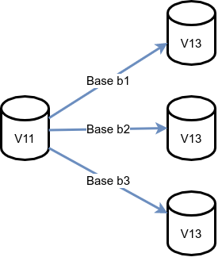
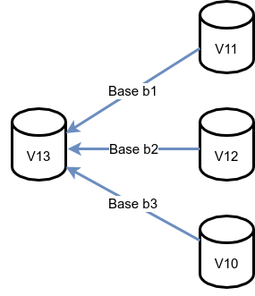
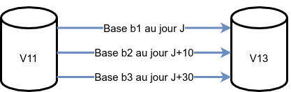
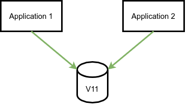
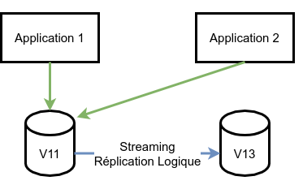
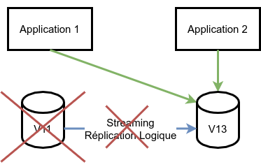

## Au menu

<div class="slide-content">
* Principes de la réplication logique
* Rappels sur les migrations de versions majeures
* Exemples d'utilisation
* Mise en place d'une mise à jour majeure
</div>

---

## Principes de la réplication logique

<div class="slide-content">
* Fonctionnement
* Quelques termes
* Processus et paramètres
* Granularité et Type de réplication
* Limitations
</div>

---

### Fonctionnement

<div class="slide-content">
* Réplication logique avant la version 10
  * Non native
  * Uniquement grâce à des outils externes par triggers (slony, bucardo,...)
* Réplication logique après la 10
  * Native
  * Asymétrique
  * Asynchrone / synchrone
</div>

<div class="notes">
La réplication logique est une réplication du contenu des tables. Plus précisément,
elle réplique les résultats des ordres SQL exécutés sur la table publiée
et l'applique sur la table cible. La table cible peut être modifiée et
son contenu différer de la table source. Elle se paramètre donc table par table, et même opération par opération.

Elle est asymétrique dans le sens où il existe une seule origine des écritures pour une
table. Cependant, il est possible de réaliser des réplications croisées où un
ensemble de tables est répliqué de l'instance 1 vers l'instance 2 et un autre
ensemble de tables est répliqué de l'instance 2 vers l'instance 1.

Comme la réplication physique, la réplication logique peut être configurée en
asynchrone comme en synchrone, suivant le même paramétrage (`synchronous_commit`, `synchronous_standby_names`).
</div>

---

### Quels termes

<div class="slide-content">
* Sur l'instance d'**origine** (ou **primaire**)
  * Publication
* Sur l'instance de **destination** (ou **réplicat**)
  * Abonnement
</div>

<div class="notes">
Dans le cadre de la réplication logique, on ne réplique pas une instance vers
une autre. On publie les modifications effectuées sur le contenu d'une table à
partir d'une instance. Cette instance est l'instance origine. De cette instance sont
enregistrées les modifications qu'une ou plusieurs autres instances pourront récupérer. Ces
instances de destination indiquent leur intérêt sur ces modifications en
s'abonnant à la publication.
De ceci, il découle que :

* l'instance origine est l'instance où les écritures sur une table sont
  enregistrées pour publication vers d'autres instances ;
* les instances intéressés par ces enregistrements sont les instances
  destinations ;
* une instance origine doit proposer une publication des modifications ;
* les instances destinations intéressés doivent s'abonner à une publication.

Dans un cluster de réplication, une instance peut avoir un rôle d'instance
origine ou d'instance destination. Elle peut aussi avoir les deux rôles. Dans ce
cas, elle sera origine pour certaines tables et destination pour d'autres. Elle
ne peut pas être à la fois origine et destination pour la même table.
</div>

---

### Les processus et les paramètres

<div class="slide-content">
* Sur l'instance d'origine (primaire)
  * Paramètre `wal_level` = logical
  * Processus `wal sender` (`max_wal_senders`)
  * Slot de réplication créé automatiquement (`max_replication_slots`)

* Sur l'instance de destination (réplicat)
  * Processus `logical replication worker`
  * Autorisation de connexion sur l'instance de publication
</div>

<div class="notes">
La réplication logique utilise le même canal d'informations que la réplication
physique, à savoir, les enregistrements des journaux de transactions. Pour que les
journaux disposent de suffisamment d'informations, le paramètre `wal_level`
doit être configuré à `logical`.
Une fois cette configuration effectuée et PostgreSQL redémarré sur l'instance origine, l'instance destination pourra se connecter à l'instance origine dans le
cadre de la réplication. Lorsque cette connexion est faite, un processus `wal sender` apparaîtra sur l'instance origine. Ce processus sera en communication avec un processus `logical replication worker` sur l'instance destination.
Chaque abonné maintient un slot de réplication sur l'instance de l'éditeur. Par
défaut il est créé et supprimé automatiquement. La copie initiale des données
crée également des slots de réplication temporaires.
</div>

---

### Granularité de la réplication logique

<div class="slide-content">
* Par table
  * publication pour toutes les tables
  * publications pour des tables spécifiques
* Par opération
  * insert, update, delete
</div>

<div class="notes">
La granularité de la réplication physique est simple : c'est l'instance et
rien d'autre.
Avec la réplication logique, la granularité est la table. Une publication se
crée en indiquant la table pour laquelle on souhaite publier les
modifications. On peut en indiquer plusieurs. On peut en ajouter après en
modifiant la publication. Cependant, une nouvelle table ne sera pas ajoutée
automatiquement à la publication. Ceci n'est possible que dans un cas précis :
la publication a été créée en demandant la publication de toutes les tables
(clause `FOR ALL TABLES`).
La granularité peut aussi se voir au niveau des opérations de modification
réalisées. On peut très bien ne publier que les opérations d'insertion, de
modification ou de suppression. Par défaut, tout est publié.
</div>

---

### Type de réplication logique

<div class="slide-content">
* Réplication complète
  * `CREATE PUBLICATION bd1_publication FOR ALL TABLES;`
* Réplication partielle
  * `CREATE PUBLICATION bd1_publication FOR TABLE t1,t2,...;`
  * `CREATE PUBLICATION bd1_publication FOR TABLE t1 WHERE (c1 = 'xxx');` à partir de la V15
* Réplication croisée
</div>

<div class="notes">
La réplication physique a le désavantage notamment de ne pouvoir répliquer que l'intégralité de l'instance. A contrario, la réplication logique peut répliquer de façon plus granulaire une ou plusieurs tables d'une base de données de l'instance.

* Si l'on souhaite une réplication complète de l'instance, pour chaque base de données, il faudra publier l'intégralité de ses tables.

```sql
\c bd1
CREATE PUBLICATION bd1_publication FOR ALL TABLES;
\c bd2 
CREATE PUBLICATION bd2_publication FOR ALL TABLES;
```

* Si l'on souhaite une réplication partielle de l'instance, il faudra choisir les objects à répliquer.

```sql
\c bd1
CREATE PUBLICATION bd1_publication FOR TABLE t1,t2,...;
\c bd2 
CREATE PUBLICATION bd2_publication FOR t4;
```

* Si l'on souhaite une réplication partielle (conditionnelle) d'une table, il faudra ajouter la condition lors de la publication.

```sql
\c bd1
CREATE PUBLICATION bd1_publication FOR TABLE t1 WHERE (c1 = 'xxx');
```
* Il est possible également de croiser les publications sur différentes tables, mais une table ne peut être à la fois publiée et abonnée.
</div>

---

### Limitations de la réplication logique

<div class="slide-content">

* Pas de réplication des requêtes DDL (et `TRUNCATE` pour PostgreSQL < 11)
* Pas de réplication des valeurs des séquences
* Pas de réplication des LO (table système)
* Pas de réplication (automatique) des partitions (<13)
* Pas de réplication des vues, vues matérialisées, tables non journalisées
* Réplication déclenchée uniquement lors du COMMIT (< v14)
* Coût en CPU et I/O

</div>

<div class="notes">
La réplication logique n'a pas que des atouts, elle a aussi ses propres
limitations.

La première, et plus importante, est qu'elle ne réplique que les changements
de données des tables. Donc une table nouvellement créée ne sera pas forcément
répliquée. L'ajout (ou la suppression) d'une colonne ne sera pas répliqué,
causant de ce fait un problème de réplication quand l'utilisateur y ajoutera
des données.

Il n'y a pas non plus de réplication des valeurs des séquences. Les valeurs
des séquences sur les serveurs destinations seront donc obsolètes.

Les `Large Objects` étant stockés dans une table système, ils ne sont pas pris
en compte par la réplication logique.

Il faut que PostgreSQL sache opérer une correspondance entre les lignes des deux instances pour gérer correctement les opérations `UPDATE` et `DELETE`.
Pour cela, il est chaudement conseillé qu’il y ait une clé primaire sur chaque table répliquée. Sinon, il faut définir une clause  `REPLICA IDENTITY` sur la table origine. Utiliser un index unique peut convenir :
```sql
ALTER TABLE nomtable REPLICA IDENTITY USING INDEX nomtable_col_idx ;
```

Pour répliquer une table partitionnée, il est nécessaire d'ajouter les partitions individuellement à la publication. En version 13 de PostgreSQL lorsqu'une table partitionnée est ajoutée à la réplication, toutes les partitions ou futures partitions sont publiées.

Enfin, la réplication logique a un coût en CPU (sur les deux instances concernées) comme en écritures disques relativement important : attention aux petites configurations.
</div>

---

## Rappels sur les migrations de versions majeures

<div class="slide-content">
* pg_dump / pg_restore
* pg_upgrade mode normal
* pg_upgrade mode lien physique
* réplication logique
</div>

---

<div class="slide-content">
| Outil                | Coupure production                        | Retour arrière | Fragmentation |
| ---------------------- | ------------------------------------------- | ----------------- | --------------- |
| pg_dump / pg_restore | Elevé = sauvegarde + restauration        | OUI             | NON           |
| pg_upgrade           | Moyen = copie physique des données       | OUI             | OUI           |
| pg_upgrade           | Court = mise à jour directe des fichiers | NON             | OUI           |
| réplication logique | Très Court = mais préparation en amont  | OUI             | OUI           |
</div>

<div class="notes">
Il existe plusieurs méthodes pour mettre à jour une instance PostgreSQL vers une version supérieure.

**pg_dump/pg_restore**

La première méthode : utiliser `pg_dump` suivi de `pg_restore`. Cette méthode reste la plus sûre et à privilégier sur de petites volumétries.

Les avantages sont :

* Une  suppression totale de la fragmentation des tables et des index.
* La vérification de l'intégrité des données.
* L'affranchissement de saut de versions.
* La mise à jour granulaire.

L' inconvénient majeur de cette méthode est sa lenteur d'exécution. L'arrêt de production durera le temps du début de la sauvegarde, jusqu'à la fin de la restauration.

**pg_upgrade**

La deuxième méthode : utiliser `pg_upgrade`.

`pg_upgrade` va récupérer la déclaration des objets sur l'ancienne instance et l'intégrer dans la nouvelle instance. Il va traiter la mise à jour de ces objets et copier les fichiers de données de l'ancienne instance vers la nouvelle.

L'avantage est la rapidité (elle dépend tout de même de la rapidité du réseau et d'écriture sur la nouvelle instance).

L'inconvénient majeur est que `pg_upgrade` conserve la fragmentation des tables et des index. Il est souvent conseillé de faire une réindexation après un `pg_upgrade`.

Il est possible d'accélérer le processus de mise à jour avec `pg_ugrade` en utilisant les liens physiques (hardlink). On s'affranchit ainsi de la copie des données. Ceci implique bien sûr que la nouvelle instance se trouve sur le même serveur.

Note importante : `pg_upgrade` n'est pas granulaire, la mise à jour est pour la totalité des données de l'instance.

**Réplication logique**

La troisième méthode : la réplication logique.

Cette méthode a le très gros avantage de minimiser au maximum le temps de coupure de la production.
Le principe est de répliquer l'intégralité des données, à chaud, de l'ancienne instance vers la nouvelle, puis au moment décidé, de basculer sur la nouvelle instance en quelques minutes.
</div>

---

## Exemples d'utilisation

### 1 : Partage de bases

<div class="slide-content">

</div>

<div class="notes">
Quelques cas d'usage de migration avec la réplication logique que l'on ne peut pas notamment faire avec `pg_upgrade`.

Premier cas : profiter de la mise à jour majeure pour partager les bases sur plusieurs instances. Par exemple 3 bases migrées sur 3 instances différentes pour respecter des exigences de cloisonnement client.
</div>

---

### 2 : Rassemblement de bases

<div class="slide-content">

</div>

<div class="notes">
Deuxième cas : profiter de la mise à jour majeure pour rassembler des bases sur une même instance. Processus inverse du premier cas, par exemple pour des questions de rationalisation de coût.
</div>

---

### 3 : Migration échelonnée

<div class="slide-content">

</div>

<div class="notes">
Troisième cas : la mise à jour majeure échelonnée.

C'est un cas souvent rencontré lorsqu'on a plusieurs bases de clients différents sur une même instance, mais ces clients n'ont pas les mêmes horaires de maintenance pour leurs bases de données. A ce moment là, on pourra migrer base après base dans des tranches horaires différentes sans impacter les bases entre elles.
</div>

---

## Mise en place

<div class="slide-content">

</div>

<div class="notes">
Le principe est simple.

On dispose d'une instance de base de données contenant une ou plusieurs bases accédées par différentes applications. Cette instance est en version majeure inférieure à l'instance de destination.

La première étape est la configuration de l'instance origine (primaire), afin de la préparer à la réplication logique.
</div>

---

### Préparation de l'instance origine (primaire)

<div class="slide-content">
* `wal_level` = logical (attention redémarrage requis)
* Création de la publication
  * `CREATE PUBLICATION ... FOR ALL TABLES`;

* Création de l'utilisateur pour la réplication
* Attribution des droits sur les objets répliqués
  * `GRANT SELECT ON ALL TABLES IN SCHEMA public TO user_repli`;
</div>

<div class="notes">
L'instance origine (primaire) doit être préparée afin de pouvoir utiliser la réplication logique. Pour cela il faut tout d'abord vérifier et modifier si besoin le paramètre `wal_level`. Par défaut ce paramètre à la valeur `replica`. Cette valeur permet à PostgreSQL d'écrire dans les journaux de transactions `WAL` des informations nécessaires à la réplication physique. Mais ces informations ne sont pas suffisantes pour la réplication logique. Pour cela, La valeur du paramètre `wal_level` doit être `logical`. Attention le changement du paramètre `wal_level` implique un redémarrage de l'instance pour être pris en compte.

Autre paramètre à vérifier : `max_wal_senders`, par défaut ce paramètre a la valeur 10, donc souvent suffisant pour mettre en place la réplication logique. Attention le changement du paramètre `max_wal_senders` implique un redémarrage de l'instance pour être pris en compte.

La réplication logique s'appuie également sur un slot de réplication afin de ne pas perdre d'informations lors d'une coupure longue de la réplication. De ce fait il est nécessaire de vérifier que le paramètre `max_replication_slots` soit également suffisant. Par défaut ce paramètre a la valeur 10. Attention le changement du paramètre `max_replication_slots` implique un redémarrage de l’instance pour être pris en compte.

Une fois les paramètres configurés, la publication des tables peut être initiée.

Voici la syntaxe :

```sql
CREATE PUBLICATION name
    [ FOR TABLE [ ONLY ] table_name [ * ] [, ...]
      | FOR ALL TABLES ]
    [ WITH ( publication_parameter [= value] [, ... ] ) ]
```

L'accès aux données publiées sur l'instance origine (primaire) se fait via un slot de réplication qui sera créé lors de l'abonnement du réplicat. Il faut pour cela créer un rôle (ou utilisateur) et les autorisations de connexion nécessaires pour ce rôle.

Création du rôle :

```sql
CREATE ROLE user_repli LOGIN REPLICATION;
```

Cet utilisateur doit pouvoir lire le contenu des tables répliquées. Il lui faut donc le droit `SELECT` sur celles-ci :

```sql
GRANT SELECT ON ALL TABLES IN SCHEMA public TO logrepli;
```

N'oublions pas la configuration des autorisations au niveau du fichier `pg_hba.conf`, et également d'utiliser le fichier `.pgpass` pour stocker les informations d'identification. Cela évite notamment les `trust` (trou de sécurité) dans le fichier `pg_hba.conf`.

```sql
host      base_origine      user_repli       xxx.xxx.xxx.xxx/xx        scram-sha-256
```
</div>

---

<div class="slide-content">

</div>

<div class="notes">
L'instance destination (réplicat) est configurée comme une instance normale : en lecture/écriture. Elle est de version majeure supérieure à l'instance d'origine (primaire).
Les données de la base à migrer de l'instance d'origine (primaire) sont répliquées de façon logique sur l'instance de destination (réplicat).  </div>

---

### Réplication des schémas

<div class="slide-content">
* Récupération et création des objets globaux (utilisateurs, tablespaces)
  * utiliser `pg_dumpall -g`  pour générer le script
* Récupération et création des objets des bases à répliquer
  * utiliser `pg_dump --schema-only` pour générer le script
</div>

<div class="notes">
Avant de lancer la réplication logique entre les 2 instances, il faut dupliquer les objets globaux (utilisateurs, rôles, groupes, tablespaces, ...) sur l'instance de destination (réplicat). Il faut également dupliquer le schéma des bases de données à répliquer sur l'instance de destination.

Pour cela, sur l'instance origine (primaire), il suffit de récupérer tous les objets avec les utilitaires `pg_dumpall` ou `pg_dump`.

Exemple :

```shell
$ pg_dumpall -g > objets_globaux.sql
Et pour chaque base : 
$ pg_dump -s  ma_base > mabase.sql
```

Ou plus simplement :

```shell
$ pg_dumpall --schema-only > all.sql
```
</div>

---

### Abonnement à la publication

<div class="slide-content">
Sur l'instance destination (replicat)

* Création de l'abonnement
  * `CREATE SUBSCRIPTION ... CONNECTION ... PUBLICATION ...`
* Contrôle de la réplication
  * `SELECT * FROM pg_subscription_rel`
</div>

<div class="notes">
Les 2 instances sont prêtes pour commencer la réplication logique des données.

Pour chaque base de données à répliquer sur l'instance destination (réplicat), il faut créer un abonnement à la publication correspondante sur l'instance origine (primaire).

Voici un exemple complet :

```sql
CREATE SUBSCRIPTION ma_subscription 
CONNEXION 'host=instance_origine port=5432 user=user_repli dbname=ma_base' 
PUBLICATIONma_publication;
```

La création de l'abonnement crée automatiquement un slot de réplication sur l'instance origine (primaire). Une fois l'abonnement créé, les données initiales des bases commencent immédiatement à être répliquées sur les tables du réplicat.
On pourrait créer l'abonnement sans copier les données initiales et copier les données initiales dans un second temps avec les commandes suivantes.

```sql
CREATE SUBSCRIPTION ... CONNECTION ... PUBLICATION ... WITH copy_data(false);
puis plus tard
ALTER SUBSCRIPTION ... REFRESH PUBLICATION WITH copy_data(true);
```

La réplication initiale peut-être longue suivant la volumétrie de la base à répliquer. Pour surveiller l'avancement de la réplication et vérifier si elle est terminée, la fonction suivante ne doit renvoyer aucune ligne. Tant qu'il y a des lignes affichées, c'est que la réplication initiale n'est pas terminée. Le processus de réplication initiale ne bloque en aucun cas la production.

```sqll
SELECT * FROM pg_subscription_rel WHERE srsubstate <> 'r';
```
</div>

---

### La bascule sur l'instance répliquée

<div class="slide-content">

</div>

<div class="notes">
L'instance destination (réplicat) est maintenant la réplique logique (données dans les tables) exacte de l'instance origine (primaire).

Il reste 2 étapes avant de basculer les applications sur la nouvelle instance :

* Récupérer les paramètres des séquences car elles ne sont pas mises à jour par la réplication logique. Si on oublie cette étape, on aura des erreurs de duplication de clés (primaire notamment) lors de l’insertion de nouveaux enregistrements.
* Arrêter l'abonnement de la réplication logique pour éviter tout problème d'insertion ou de modification de données venant de la publication (sur l'instance origine (primaire)).
</div>

---

<div class="slide-content">
* Sur l'instance origine (primaire)
  * Arrêt des connexions applicatives (par le `pg_hba.conf` par exemple)
  * Récupération des paramètres des séquences
    * Ne pas oublier : les séquences ne sont pas répliquées !
    * Création d'un script de génération des séquences

* Sur l'instance destination (réplicat)
  * Modification des paramètres des séquences
    * Rejeu du script généré
  * Suppression de l'abonnement
    * `DROP SUBSCRIPTION ...`
</div>

<div class="notes">
La réplication intiale étant terminée, les 2 instances sont maintenant une copie conforme au niveaux des données dans les tables.

Pour effectuer la bascule de la production sur la nouvelle instance de version supérieure, il reste 3 actions à effectuer. Ces actions sont très rapides et sont effectuées pendant la coupure de production.

* Action 1 : Mettre l'instance orgine (primaire) en maintenance. Par exemple en empéchant toute connexion des applications en modifiant les règles dans le fichier `pg_hba.conf`.
* Action 2 : Récupérer les paramètres des séquences sur l'instance orgine (primaire) et les appliquer immédiatement sur l'instance destination (réplicat).
* Action 3 : Supprimer l'abonnement pour éviter toute copie de données intempestives de l'instance origine (primaire), si elle devait être alimentée par une application.

Pour récupérer les séquences un petit script permet de lister et de préparer les ordres SQL.

```sql
SELECT 'SELECT ''SELECT setval(''''' || n.nspname || '.' || c.relname || ''''','' 
|| last_value ||'');'' FROM "' || n.nspname || '"."' || c.relname || '";'
FROM pg_class c                                
  INNER JOIN pg_namespace n
    ON c.relnamespace = n.oid
WHERE c.relkind='S' \gexec
```
</div>

---

## Supervision

<div class="slide-content">
* Contrôle de la réplication initiale
  * `SELECT * FROM pg_subscription_rel`
* Contrôle de la réplication
  * `SELECT * FROM pg_stat_replication`
* Contrôle de l'abonnement
  * `SELECT * FROM pg_stat_subscription`
</div>

<div class="notes">
Comme vu précédemment la vue `pg_subscription_rel` permet de connaître l'état de chaque relation répliquée lors de la création d'un abonnement ou la modification d'un abonnement.

La vue `pg_stat_replication` permet de contrôler le bon déroulement de la réplication logique et notamment permet d'indiquer un éventuel retard dans la réplication.

L’état des abonnements est disponible sur l'instance destination à partir de la vue `pg_stat_subscription` :

```sql
b1=# SELECT * FROM pg_stat_subscription;
-[ RECORD 1 ]---------+------------------------------
subid                 | 16573
subname               | subscr_t3_2
pid                   | 18893
relid                 | 
received_lsn          | 0/168A748
last_msg_send_time    | 2017-12-20 10:36:13.315798+01
last_msg_receipt_time | 2017-12-20 10:36:13.315849+01
latest_end_lsn        | 0/168A748
latest_end_time       | 2017-12-20 10:36:13.315798+01
```
</div>

---

## Atelier (Enoncé)
<div class="notes">

<div class="slide-content">
**But :** Migrer une instance de PostgreSQL de la version 13 à la version 16 grâce à la réplication logique native de PostgreSQL.
</div>

Dans le TP : l'instance PostgreSQL en version 13 sera appelée **instance primaire** et l'instance PostgreSQL en version 16 sera appelée **instance répliquée**.

### Installation des binaires PostgreSQL

<div class="slide-content">
**But** : Installer les versions 13 et 16 de PostgreSQL 
</div>

**Installation**

> Installer les paquets de PostgreSQL13 et de PostgreSQL16 .
> Installer les paquets `wget` pour télécharger les exemples.

**Création des instances**

> Créer les 2 instances en activant les sommes de contrôle (`checksums`).

### Installation et configuration du primaire

<div class="slide-content">
**But :** Configurer et peupler l’instance primaire (v13).
</div>

> Démarrer l'instance PostgreSQL primaire (v13) (via la commande `pg_ctl`).

> Télécharger et restaurer les bases exemples **cave** et **magasin**
> Liens de téléchargement : https://dali.bo/tp_cave et https://dali.bo/tp_magasin

### Mise en réplication logique des bases de l'instance primaire

<div class="slide-content">
**But : ** Préparer l'instance primaire (v13) pour qu'elle accepte la réplication logique et préparer les scripts de création des bases et objets à répliquer.
</div>

> Configurer l'instance primaire (v13) pour la préparer à la réplication logique.

> Configurer l'instance répliquée (v16) pour qu'elle écoute sur le port 5433.

> Récupérer le schéma des bases et les objets globaux de l'instance primaire (v13).

> Créer les bases et objets globaux sur l'instance répliquée (v16).

> Mettre en place la publication de toutes les tables des bases **cave** et **magasin**.

> Configurer la sécurité pour accepter les connexions de réplication de l’instance répliquée (v16).

### Réplication des bases sur l’instance répliquée

<div class="slide-content">
**But :** Configurer la réplication sur l'instance répliquée et lancer la réplication initiale des données.
</div>

> Mettre en place les abonnements aux publications des bases **cave** et **magasin**.

> Surveiller le bon déroulement de la réplication initiale.

### "Promotion" de l'instance répliquée

<div class="slide-content">
**But :** Finaliser la bascule des instances.
</div>

> Mettre à jour les séquences de l'instance répliquée (v16).

> Nettoyer les abonnements de l'instance répliquée (v16) .

> Nettoyer les publications (si besoin) de l’instance primaire (v13).

Pour aller plus loin

On peut mettre en place une SWITCHOVER des 2 instances, qui permet de pouvoir faire une retour arrière sur l’instance sans perdre les données crées sur la nouvelle instance.

Pour cela, avant de  ....
</div>
---

## Atelier (solutions)

<div class="notes">
### Installation des binaires PostgreSQL

<!-- les slide-content sont DANS les notes pour éviter d'apparaître dans les
slides tout en étant lisibles dans le PDF ou le HTML -->

**Installation**

Les installations des paquets et l’initialisation des instances se fait sous le compte ou le sudo **root**.

```shell
$ sudo -i
```

> Installer les paquets de PostgreSQL13 et de PostgreSQL13 .

Il faut tout d'abord installer les dépôts communautaires.

```shell
$ dnf install -y https://download.postgresql.org/pub/repos/yum/reporpms\
/EL-8-x86_64/pgdg-redhat-repo-latest.noarch.rpm
$ dnf -qy module disable postgresql
```

On peut maintenant installer les dernières versions des paquets pour les versions majeures 13 et 16 de PostgreSQL, via la commande `dnf` sous RockyLinux (ici dans le TP) ou `apt` sous Debian.

```shell
$ dnf install -y postgresql13-server postgresql13-contrib
$ dnf install -y postgresql13-llvmjit
$ dnf install -y postgresql16-server postgresql16-contrib
$ dnf install -y postgresql16-llvmjit
```

> Installer les paquets `wget` pour télécharger les exemples.

```shell
$ dnf install -y wget
```

**Création des instances**

> Créer les 2 instances en activant les sommes de contrôle (`checksums`).

Pour activer les sommes de contrôle, on utilise la variable `PGSETUP_INITDB_OPTIONS`.

Rappel : pour les versions de PostgreSQL inférieures à 12,  l'activation des sommes de contrôle se fait à l'initialisation de l'instance. A partir de la version 12, elles peuvent être activées sur l’instance arrêtée par la commande : `pg_checksum --enable $PGDATA`.

```shell
$ export PGSETUP_INITDB_OPTIONS='--data-checksums --lc-messages=C'
```

Création de l’instance en version 13.

```shell
$ /usr/pgsql-13/bin/postgresql-13-setup initdb
```

Création de l’instance en version 16.

```shell
$ /usr/pgsql-16/bin/postgresql-16-setup initdb
```

### Installation et configuration de l’instance en version 13 à migrer

La suite du TP se fera sous l'utilisateur système `postgres`.

```shell
$ sudo -iu postgres
```

> Démarrer l'instance PostgreSQL primaire (v13) (via la commande `pg_ctl`).

```shell
$ /usr/pgsql-13/bin/pg_ctl start -D /var/lib/pgsql/13/data/
```

> Télécharger et restaurer les bases exemples **cave** et **magasin**
> Liens de téléchargement : https://dali.bo/tp_cave et https://dali.bo/tp_magasin

On utilise l'utilitaire `wget` pour télécharger les dumps des bases..

```shell
$ wget https://dali.bo/tp_cave -O ~/tp_cave.dump
$ wget https://dali.bo/tp_magasin -O ~/tp_magasin.dump
```

La restauration des dumps sur l'instance primaire (v13) se fait via la commande `pg_restore`.
On crée d'abord les utilisateurs **caviste** et **magasinier** qui seront propriétaires des bases, puis on crée les bases **cave** et **magasin**, et enfin on restaure les dumps dans leurs bases respectives.

Pour la base **cave** :

```shell
$ psql -c "SET password_encryption = 'scram-sha-256'; \
CREATE ROLE caviste LOGIN PASSWORD 'caviste';"
$ psql -c "CREATE DATABASE cave OWNER caviste;"
$ pg_restore -d cave tp_cave.dump
```

Pour la base **magasin** :

```shell
$ psql -c "SET password_encryption = 'scram-sha-256'; \
CREATE ROLE magasinier LOGIN PASSWORD 'magasinier';"
$ psql -c "CREATE DATABASE magasin OWNER magasinier;"
$ pg_restore -d magasin tp_magasin.dump
```

Génération d'un base avec un peu de volume 

```shell
$ createdb pgbench
$ /usr/pgsql-13/bin/pgbench -i -s 500 pgbench
```

**Notre instance PostgreSQL version 13 est prête.**

### Mise en réplication logique des bases de l'instance

> Configurer l'instance primaire (v13) pour la préparer à la réplication logique.

Le paramètre `wal_level` de l'instance primaire (v13) est : `replica`. Les `WAL` contiennent des informations pour la réplication physique, mais pas assez d'informations pour la réplication logique. Il faut donc élever la valeur de `wal_level` à `logical`.

```shell
$ psql -c "SHOW wal_level";
 wal_level 
-----------
 replica
```

Le paramètre est modifier via la commande SQL `ALTER SYSTEM`. On peut également le modifier dans le fichier `postgresql.conf`

```shell
$ psql -c "ALTER SYSTEM SET wal_level TO 'logical';"
```

Le changement de ce paramètre induit un redémarrage de l'instance pour être pris en compte.

```shell
$ /usr/pgsql-13/bin/pg_ctl restart -D /var/lib/pgsql/13/data/
```

On peut vérifier le bon paramétrage une fois l'instance redémarrée.

```shell
$ psql -c "SHOW wal_level";
 wal_level 
-----------
 logical
```

> Configurer l'instance répliquée (v16) pour qu'elle écoute sur le port 5433.

Éditer le fichier de configuration `/var/lib/pgsql/16/data/postgresql.conf` et modifier le numéro de port (ne pas oublier de dé-commenter la ligne).

Ou utiliser `sed` comme suit :

```shell
$ sed -i "s/#port = 5432/port = 5433/" /var/lib/pgsql/16/data/postgresql.conf
```

Démarrer l'instance répliquée (v16).

```shell
$ /usr/pgsql-16/bin/pg_ctl start -D /var/lib/pgsql/16/data/
```

> Récupérer le schéma des bases et les objets globaux de l'instance primaire (v13).

On utilise l'utilitaire `pg_dumpall` avec l'option `--schema-only` qui va générer l'intégralité des schémas des bases, des utilisateurs, et des tablespaces de l'instance. Le script généré est au format SQL.

```shell
$ pg_dumpall --schema-only > ~/schema_replication_logique.sql
```

Modifier le fichier si besoin notamment pour corriger les chemins des tablespaces qui seront peut-être différents sur la nouvelle instance.

> Créer les bases et objets globaux sur l'instance répliquée (v16).

On importe le script généré ci-dessus sur l'instance répliquée.

```shell
$ psql -p5433 -f ~/schema_replication_logique.sql
```

> Mettre en place la publication de toutes les tables des bases **cave** et **magasin**.

Pour initialiser la réplication logique, il faut tout d'abord créer une publication pour toutes les tables de chaque base de l'instance que l'ont souhaite répliquer. On utilise l'ordre SQL `CREATE PUBLICATION`.

```shell
$ psql -d cave -c "CREATE PUBLICATION maj_cave_publication FOR ALL TABLES;"

$ psql -d magasin -c "CREATE PUBLICATION maj_magasin_publication FOR ALL TABLES;"

$ psql -d pgbench -c "CREATE PUBLICATION maj_pgbench_publication FOR ALL TABLES;"
```

> Configurer la sécurité pour accepter les connexions de réplication de l’instance répliquée (v16)

L'instance répliquée (v16) va se connecter à l'instance primaire (v13) à l'aide d'un slot de réplication. Pour cela il faut donner les droits de connexions entre les 2 instances.
On va tout d'abord créer un utilisateur pour cette réplication.

```shell
$ psql -c "SET password_encryption ='scram-sha-256'; \
CREATE ROLE repliusr LOGIN REPLICATION SUPERUSER PASSWORD 'repliusr';"
```

**Note :** Dans notre exemple, on donne à l'utilisateur le rôle `SUPERUSER`, ce n'est pas absolument nécessaire. Si l'utilisateur de réplication n'a pas les droits `SUPERUSER`, il faudra lui donner l'accès en lecture à toutes les tables de toutes les bases à répliquer.
*Exemple :*

```sql
GRANT SELECT ON ALL TABLES IN SCHEMA public TO repliusr;
```

*A répéter pour tous les schémas de toutes les bases à répliquer.*

Éditer le fichier de configuration de la sécurité `/var/lib/pgsql/13/data/pg_hba.conf` et ajouter les lignes suivantes en début de fichier.

```ini
host    all  repliusr           127.0.0.1/32            scram-sha-256
host    all  repliusr           ::1/128            		scram-sha-256
```

Ne pas oublier de recharger la configuration, action nécessaire après toute modfication du fichier `pg_hba.conf`.

```shell
$ psql -c "select pg_reload_conf();"
```

Sur le serveur hébergeant l'instance répliquée (v16), il faut également stocker les informations de connexions dans le fichier `.pgpass` pour que le processus de réplication puisse s'authentifier sans demander de mot de passe.
Dans notre TP, c'est le même serveur qui héberge les 2 instances.

```shell
$ echo "localhost:5432:*:repliusr:repliusr" >> ~/.pgpass
$ chmod 600 ~/.pgpass
```

### Réplication des bases sur l’instance répliquée (v16)

> Mettre en place les abonnements aux publications des bases **cave** et **magasin**.

Pour finaliser la réplication logique, il faut maintenant abonner notre réplicat (v16) aux publications de notre instance primaire (v13). On utilise l'ordre SQL `CREATE SUBSCRIPTION` avec les indications de connexion à l'instance primaire, ainsi que le nom de la publication à laquelle on veut s'abonner.

Pour la base **cave** :

```shell
$ psql -p5433 -d cave -c "CREATE SUBSCRIPTION maj_cave_subscription \
CONNECTION 'host=localhost port=5432 user=repliusr dbname=cave'  \
PUBLICATION maj_cave_publication"
```

Pour la base **magasin** :

```shell
$ psql -p5433 -d magasin -c "CREATE SUBSCRIPTION maj_magasin_subscription \
CONNECTION 'host=localhost port=5432 user=repliusr dbname=magasin' \
PUBLICATION maj_magasin_publication \
WITH (enabled=false)"
```

Pour la base **pgbench** :

```shell
$ psql -p5433 -d pgbench -c "CREATE SUBSCRIPTION maj_pgbench_subscription \
CONNECTION 'host=localhost port=5432 user=repliusr dbname=pgbench' \
PUBLICATION maj_pgbench_publication"
```

Une fois l'abonnement créé, les données initiales des bases commencent immédiatement à être répliquée sur les tables du réplicat.
On pourrait créer l'abonnement sans copier les données initiales et  dans ucopier les données initialesn second temps avec les commandes suivantes.

```sql
CREATE SUBSCRIPTION ... CONNECTION ... PUBLICATION ... WITH copy_data(false);
-- puis 
ALTER SUBSCRIPTION ... REFRESH PUBLICATION WITH copy_data(true);
```

> Surveiller le bon déroulement de la réplication initiale.

La réplication sur la base magasin est désactivée, activons la maintenant. 

```shell
$ psql -p5433 -d magasin  \
-c "ALTER SUBSCRIPTION maj_magasin_subscription ENABLE;"
```

Afin de vérifier si la réplication initiale est bien terminée, la fonction suivante ne doit renvoyer aucune ligne.

```shell
$ psql -p5433 -d magasin  \
-c "SELECT * FROM pg_subscription_rel WHERE srsubstate <> 'r';"
```

### "Promotion" de l'instance répliquée

> Mettre à jour les séquences de l'instance répliquée (v16).

La réplication logique ne réplique pas l'état des séquences. Si des enregistrementes ont été insérés dans l'instance primaire (v13) après avoir exporté le schéma (voir plus haut), alors les numéros des séquences entre le primaire et le réplicat ne sont plus en phase.
Pour cela avant d'ouvrir les connexions à l'applicatif, il est impératif de mettre à jour les séquences sur l'instance répliquée (v16).

Script de récupération des séquences sur le primaire (v13).

Pour la base **cave**.

```shell
$ psql cave -t -o ~/maj_sequences_cave.sql
```

```sql
SELECT 'SELECT ''SELECT setval(''''' || n.nspname || '.' || c.relname || ''''','' 
|| last_value ||'');'' FROM "' || n.nspname || '"."' || c.relname || '";'
FROM pg_class c                                
  INNER JOIN pg_namespace n
    ON c.relnamespace = n.oid
WHERE c.relkind='S' \gexec
exit;
```

Pour la base **magasin**.

```shell
$ psql magasin -t -o ~/maj_sequences_magasin.sql
```

```sql
SELECT 'SELECT ''SELECT setval(''''' || n.nspname || '.' || c.relname || ''''','' 
|| last_value ||'');'' FROM "' || n.nspname || '"."' || c.relname || '";'
FROM pg_class c                                
  INNER JOIN pg_namespace n
    ON c.relnamespace = n.oid
WHERE c.relkind='S' \gexec
exit;
```
Pour la base **pgbench**.

```shell
$ psql pgbench -t -o ~/maj_sequences_pgbench.sql
```

```sql
SELECT 'SELECT ''SELECT setval(''''' || n.nspname || '.' || c.relname || ''''','' 
|| last_value ||'');'' FROM "' || n.nspname || '"."' || c.relname || '";'
FROM pg_class c                                
  INNER JOIN pg_namespace n
    ON c.relnamespace = n.oid
WHERE c.relkind='S' \gexec
exit;
```

Les séquences sont à réinitialiser sur l'instance répliquée (v16), afin d'éviter tout risque d'erreur du type `duplicated key` lors des opérations d'ajout d'enregistrements dans les tables.

```shell
$ psql -p5433 cave -f ~/maj_sequences_cave.sql
$ psql -p5433 magasin -f ~/maj_sequences_magasin.sql
$ psql -p5433 pgbench -f ~/maj_sequences_pgbench.sql
```

> Nettoyer les abonnements de l'instance répliquée (v16) .

Penser à supprimer la subscription surtout si l'ancienne production se trouverait redémarrée.

```shell
$ psql -p5433 cave -c "DROP SUBSCRIPTION maj_cave_subscription;"
$ psql -p5433 magasin -c "DROP SUBSCRIPTION maj_magasin_subscription;"
$ psql -p5433 pgbench -c "DROP SUBSCRIPTION maj_pgbench_subscription;"
```

> Nettoyer les publications (si besoin) de l’instance primaire (v13).

Les publications peuvent être supprimées sur l'ancien si elles ne servent plus : attention si vous avez d'autres abonnés sur ces publications, elle ne doit pas être supprimée.

```shell
$ psql cave -c "DROP PUBLICATION maj_cave_publication;"
$ psql magasin -c "DROP PUBLICATION maj_magasin_publication;"
$ psql pgbench -c "DROP PUBLICATION maj_pgbench_publication;"
```
</div>
