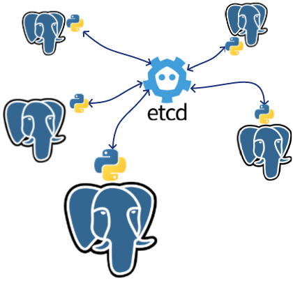

# Introduction

---

## Objectif de l'atelier

* Mettre en œuvre un cluster Patroni
* Gérer des bascules

---

## Déroulé de l'atelier

* Durée : 3 heures

* Concepts
* Travaux pratiques
  * Mise en place
  * Installation et configuration des services
  * Construction d'un agrégat à bascule automatique
  * Création d'incidents

---

## Prérequis de l'atelier

* Un terminal
* Une VM Debian Bookworm ou équivalente
* Compétences Linux et PostgreSQL

\newpage

# Concepts

* Arbitrage par un quorum : _DCS_ etcd
* Service PostgreSQL : désactivé
* Contrôle complet par Patroni

---

## DCS : etcd

* Arbitre en cas de bascules
* Stockage distribué de la configuration
* Jeton _leader_ (etcd)
* Instance primaire PostgreSQL

<div class="notes">

Pour arbitrer les bascules automatiques, confirmer le primaire PostgreSQL ou
distribuer la configuration, Patroni utilise un _DCS_
(_distributed configuration system_).

Pour ce rôle, nous utiliserons etcd.

</div>

---

## Service PostgreSQL et Patroni

* Service PostgreSQL à désactiver

<div class="notes">

Le service PostgreSQL doit être **désactivé** pour ne pas se lancer au démarrage,
le contrôle total de l'instance est délégué à Patroni :

```Bash
dalibo@vm:~$
for node in pg1 pg2 pg3; do
  sudo ssh ${node} "systemctl disable --now postgresql"
  sudo ssh ${node} "systemctl status postgresql"
done
```
\scriptsize
```
Synchronizing state of postgresql.service with SysV service script with /lib/systemd/systemd-sysv-install.
Executing: /lib/systemd/systemd-sysv-install disable postgresql
Removed "/etc/systemd/system/multi-user.target.wants/postgresql.service".
○ postgresql.service - PostgreSQL RDBMS
     Loaded: loaded (/lib/systemd/system/postgresql.service; disabled; preset: enabled)
     Active: inactive (dead)

Jan 30 17:24:42 pg1 systemd[1]: Starting postgresql.service - PostgreSQL RDBMS...
Jan 30 17:24:42 pg1 systemd[1]: Finished postgresql.service - PostgreSQL RDBMS.
Jan 31 11:05:23 pg1 systemd[1]: postgresql.service: Deactivated successfully.
Jan 31 11:05:23 pg1 systemd[1]: Stopped postgresql.service - PostgreSQL RDBMS.

Synchronizing state of postgresql.service with SysV service script with /lib/systemd/systemd-sysv-install.
Executing: /lib/systemd/systemd-sysv-install disable postgresql
Removed "/etc/systemd/system/multi-user.target.wants/postgresql.service".
○ postgresql.service - PostgreSQL RDBMS
     Loaded: loaded (/lib/systemd/system/postgresql.service; disabled; preset: enabled)
     Active: inactive (dead)

Jan 30 17:24:44 pg2 systemd[1]: Starting postgresql.service - PostgreSQL RDBMS...
Jan 30 17:24:44 pg2 systemd[1]: Finished postgresql.service - PostgreSQL RDBMS.
Jan 31 11:05:25 pg2 systemd[1]: postgresql.service: Deactivated successfully.
Jan 31 11:05:25 pg2 systemd[1]: Stopped postgresql.service - PostgreSQL RDBMS.

Synchronizing state of postgresql.service with SysV service script with /lib/systemd/systemd-sysv-install.
Executing: /lib/systemd/systemd-sysv-install disable postgresql
Removed "/etc/systemd/system/multi-user.target.wants/postgresql.service".
○ postgresql.service - PostgreSQL RDBMS
     Loaded: loaded (/lib/systemd/system/postgresql.service; disabled; preset: enabled)
     Active: inactive (dead)

[...]
Jan 31 11:05:26 pg3 systemd[1]: Stopped postgresql.service - PostgreSQL RDBMS.
```
\normalsize

</div>


# Mise en place

---

## Infrastructure

* Connexion à la VM
* 7 Conteneurs

---

Vous disposez d'une machine virtuelle dédiée dans laquelle nous avons construit
7 conteneurs _LXC_ :

  * 3 nœuds etcd
  * 3 nœuds Patroni
  * 1 nœud pgBackRest

---

### Connexion à votre machine virtuelle

* un point d'entrée commun (> tableau)
* un port individuellement attribué : 22XX
* un utilisateur linux : `dalibo`
* un mot de passe (> tableau)

* `ssh -p 22XX dalibo@<IP_COMMUNE>`

---

<div class="notes">

Exemple de configuration `ssh` pour une connexion simplifiée :

```console
# ~/.ssh/config
Host vm
Hostname 5.4.3.2 # <IP_COMMUNE>
User dalibo
port 2201 # <PORT_INDIVIDUEL>
```

Test de connexion ssh :

```Bash
$ ssh vm
```
```console
Last login: Wed Nov 10 13:23:26 2021 from 42.42.42.42
dalibo@vm:~$
```

</div>

### Playbook Ansible

Infrastructure clef en main par _playbooks_ _Ansible_ à cette adresse :

<https://public.dalibo.com/exports/formation/workshops/fr/patroni_2024/playbook/etcd-patroni>

---

3 fichiers YAML principaux :

* `inventory.yml` : inventaire des machines
* `setup.2.yml`     : playbook principal
* `teardown.yml`  : playbook de destruction

<!--
| Fichier          | Description              |
| :--------------- | :----------------------- |
| inventory.yml    | inventaire des machines  |
| setup.2.yml      | playbook principal       |
| teardown.yml     | playbook de destruction  |
-->

---

L'infrastructure complète est déjà créée.

<div class="box tip">

La commande pour recréer l'infrastructure sur votre VM est :

```Bash
ansible-playbook -i inventory.yml  setup.2.yml
```
</div>

<div class="notes">

La création des conteneurs a été faite ainsi :

```Bash
root@vm:~# ansible-playbook -i inventory.yml -f 7 setup.2.yml
```

```Bash
dalibo@vm:~$ sudo lxc-ls -f
```
```console
 NAME   STATE   AUTOSTART GROUPS IPV4       IPV6 UNPRIVILEGED
 backup RUNNING 0         -      10.0.3.204 -    false
 e1     RUNNING 0         -      10.0.3.101 -    false
 e2     RUNNING 0         -      10.0.3.102 -    false
 e3     RUNNING 0         -      10.0.3.103 -    false
 pg1    RUNNING 0         -      10.0.3.201 -    false
 pg2    RUNNING 0         -      10.0.3.202 -    false
 pg3    RUNNING 0         -      10.0.3.203 -    false
```

\newpage

Sur tous les conteneurs, le fichier `/etc/hosts` est automatiquement renseigné
par le _playbook_ et devrait contenir au moins :

```console
10.0.3.101 e1
10.0.3.102 e2
10.0.3.103 e3
10.0.3.201 pg1
10.0.3.202 pg2
10.0.3.203 pg3
10.0.3.204 backup
```

</div>

---

\newpage

## Installation d'etcd

* Installation des paquets
* Configuration
* Démarrage du service
* Vérification

---

### Installation des paquets

* etcd-server
* iputils-ping
* vim

---

<div class="notes">

```Bash
dalibo@vm:~$
for node in e1 e2 e3; do
  echo "${node} :"
  sudo ssh ${node} "apt-get install -y etcd-server iputils-ping"
done
```

Le démarrage du service est automatique sous Debian.

```Bash
dalibo@vm:~$
for node in e1 e2 e3; do
  echo -n "${node} :"
  sudo ssh ${node} "systemctl is-active etcd"
done

```
```console
e1 : active
e2 : active
e3 : active
```

#### Vérification

```Bash
dalibo@vm:~$
for node in e1 e2 e3; do
  echo -n "${node} :"
  sudo ssh ${node} etcdctl member list
done
```
\scriptsize
```
e1 :8e9e05c52164694d, started, e1, http://localhost:2380, http://localhost:2379, false
e2 :8e9e05c52164694d, started, e2, http://localhost:2380, http://localhost:2379, false
e3 :8e9e05c52164694d, started, e3, http://localhost:2380, http://localhost:2379, false
```
\normalsize

Les nœuds sont tous indépendants, ce qui ne nous intéresse pas.
Il faut donc les configurer pour qu'ils fonctionnent en agrégat.

Nous arrêtons donc les services :

```Bash
dalibo@vm:~$
for node in e1 e2 e3; do
  echo -n "${node} :"
  sudo ssh ${node} "systemctl stop etcd"
  sudo ssh ${node} "systemctl is-active etcd"
done
```
```console
e1 : inactive
e2 : inactive
e3 : inactive
```

</div>

### Configuration du service etcd

* Fichier : `/etc/default/etcd`

<div class="notes">

La configuration du service etcd se trouve dans le fichier `/etc/default/etcd`,
elle doit décrire notre agrégat sur chaque nœud :

  * spécifique décrivant le nœud
  * une partie commune à tous les nœuds décrivant l'agrégat

<!-- **Attention aux espaces insécables dans la chaîne ETCD_INITIAL_CLUSTER -->

<div class="box warning">

Attention aux caractères invisibles ou aux sauts de ligne.

</div>

**Sur le nœud e1 :**

\scriptsize
```
# /etc/default/etcd

ETCD_NAME='e1'
ETCD_LISTEN_PEER_URLS='http://127.0.0.1:2380,http://10.0.3.101:2380'
ETCD_LISTEN_CLIENT_URLS='http://127.0.0.1:2379,http://10.0.3.101:2379'
ETCD_INITIAL_ADVERTISE_PEER_URLS='http://10.0.3.101:2380'
ETCD_ADVERTISE_CLIENT_URLS='http://10.0.3.101:2379'

ETCD_INITIAL_CLUSTER_STATE='new'
ETCD_DATA_DIR='/var/lib/etcd/default'
ETCD_INITIAL_CLUSTER_TOKEN='etcd-cluster'
ETCD_INITIAL_CLUSTER='e1=http://10.0.3.101:2380,e2=http://10.0.3.102:2380,e3=http://10.0.3.103:2380'

```
\normalsize

**Sur le nœud e2 :**

\scriptsize
```
# /etc/default/etcd

ETCD_NAME='e2'
ETCD_LISTEN_PEER_URLS='http://127.0.0.1:2380,http://10.0.3.102:2380'
ETCD_LISTEN_CLIENT_URLS='http://127.0.0.1:2379,http://10.0.3.102:2379'
ETCD_INITIAL_ADVERTISE_PEER_URLS='http://10.0.3.102:2380'
ETCD_ADVERTISE_CLIENT_URLS='http://10.0.3.102:2379'

ETCD_INITIAL_CLUSTER_STATE='new'
ETCD_DATA_DIR='/var/lib/etcd/default'
ETCD_INITIAL_CLUSTER_TOKEN='etcd-cluster'
ETCD_INITIAL_CLUSTER='e1=http://10.0.3.101:2380,e2=http://10.0.3.102:2380,e3=http://10.0.3.103:2380'

```
\normalsize

**Sur le nœud e3 :**

\scriptsize
```
# /etc/default/etcd

ETCD_NAME='e3'
ETCD_LISTEN_PEER_URLS='http://127.0.0.1:2380,http://10.0.3.103:2380'
ETCD_LISTEN_CLIENT_URLS='http://127.0.0.1:2379,http://10.0.3.103:2379'
ETCD_INITIAL_ADVERTISE_PEER_URLS='http://10.0.3.103:2380'
ETCD_ADVERTISE_CLIENT_URLS='http://10.0.3.103:2379'

ETCD_INITIAL_CLUSTER_STATE='new'
ETCD_DATA_DIR='/var/lib/etcd/default'
ETCD_INITIAL_CLUSTER_TOKEN='etcd-cluster'
ETCD_INITIAL_CLUSTER='e1=http://10.0.3.101:2380,e2=http://10.0.3.102:2380,e3=http://10.0.3.103:2380'

```
\normalsize

</div>

---

### Démarrage du service

* Réinitialisation des bases etcd
* Démarrage du service `etcd`
* `systemctl start etcd`

<div class="notes">

Avant de démarrer le service sur chaque nœud, il faut réinitialiser les
répertoires de données des nœuds, afin qu'ils repartent sur un répertoire neuf.

Le nœud `e1`, que nous considérons comme premier _leader_ sera démarré
en premier :

```Bash
dalibo@vm:~$
for node in e1 e2 e3; do
  echo "${node} :"
  sudo ssh ${node} "rm -vrf ~etcd/default/member"
done
```

```Bash
dalibo@vm:~$
for node in e1 e2 e3; do
  echo "${node} :"
  sudo ssh ${node} "systemctl start etcd" & sleep 1
done
```

En cas d'échec de démarrage, utilisez la commande _systemd_ pour diagnostiquer
la cause :

```Bash
root@e1:~# journalctl -xfu etcd
```

**Vérification que le nœud `e1` ayant démarré en premier, est bien le _leader_ :**

```Bash
dalibo@vm:~$ sudo ssh e1 "etcdctl endpoint status -w table --cluster"
```

\scriptsize
```
+------------------------+------------------+---------+---------+-----------+------------+
|        ENDPOINT        |        ID        | VERSION | DB SIZE | IS LEADER | IS LEARNER |
+------------------------+------------------+---------+---------+-----------+------------+
| http://10.0.3.101:2379 | 736293150f1cffb7 |  3.4.23 |   41 kB |      true |      false |
| http://10.0.3.103:2379 | 7ef9d5bb55cefbcc |  3.4.23 |   41 kB |     false |      false |
| http://10.0.3.102:2379 | 97463691c7858a7b |  3.4.23 |   41 kB |     false |      false |
+------------------------+------------------+---------+---------+-----------+------------+

 /  -----------+------------+--------------------+--------+
 /   RAFT TERM | RAFT INDEX | RAFT APPLIED INDEX | ERRORS |
 /  -----------+------------+--------------------+--------+
 /           2 |         52 |                 52 |        |
 /           2 |         52 |                 52 |        |
 /           2 |         52 |                 52 |        |
 /  -----------+------------+--------------------+--------+
```
\normalsize

</div>

---

## Installation de PostgreSQL / Patroni

* Installation
  * PostgreSQL
  * Patroni
  * pgBackRest

<div class="notes">

Le dépôt _pgdg_ est déjà pré-configuré dans les conteneurs pg1, pg2 et pg3,
l'installation est donc triviale :

```Bash
dalibo@vm:~$
for node in pg1 pg2 pg3; do
  echo "${node} :"
  sudo ssh ${node} "apt-get update && apt-get install -y postgresql patroni pgbackrest"
done
```

Vérification :

```Bash
dalibo@vm:~$
for node in pg1 pg2 pg3; do
  echo "${node} :"
  sudo ssh ${node} "dpkg -l postgresql patroni pgbackrest | grep ^ii | cut -d ' ' -f 1,3"
done
```
```console
pg1 :
ii patroni
ii pgbackrest
ii postgresql
pg2 :
ii patroni
ii pgbackrest
ii postgresql
pg3 :
ii patroni
ii pgbackrest
ii postgresql
```

Le service PostgreSQL doit être désactivé car la gestion totale de l'instance
sera déléguée à Patroni :

```Bash
dalibo@vm:~$
for node in pg1 pg2 pg3; do
  echo -n "${node} :"
  sudo ssh ${node} "systemctl is-active postgresql@{{pg_version}}-main"
  sudo ssh ${node} "systemctl disable --now postgresql@{{pg_version}}-main"
done
```

</div>

---

### Configuration de Patroni

Sur tous les nœuds

  * Configuration du DCS
    * `/etc/patroni/dcs.yml`
  * Génération de la configuration
    * `pg_createconfig_patroni` {{pg_version}} `main`

<div class="notes">

La configuration sous Debian se fait d'abord en renseignant comment contacter
le DCS, puis en lançant le script de génération automatique de la configuration
de Patroni.

Le fichier est à modifier sur chaque nœud : 

```yaml
# /etc/patroni/dcs.yml
etcd3:
  hosts:
    - 10.0.3.101:2379
    - 10.0.3.102:2379
    - 10.0.3.103:2379
```

Une fois le fichier modifié, la configuration peut être générée pour chacun des nœuds :


```Bash
dalibo@vm:~$
for node in pg1 pg2 pg3; do
  echo -n "${node} :"
  sudo ssh ${node} "pg_createconfig_patroni 16 main"
done
```


La configuration `/etc/patroni/`{{pg_version}}`-main.yml` est générée.

</div>

---

## Création de l'agrégat

* Démarrage du primaire
* Création de l'utilisateur de réplication
* Suppression des instances secondaires
* Démarrage des instances secondaires

<div class="notes">

### Démarrage du primaire

La création de l'agrégat commence par la mise en route du primaire sur le
nœud `pg1`, c'est lui qui sera la référence pour les secondaires.

```Bash
dalibo@vm:~$ sudo ssh pg1 "systemctl enable --now patroni@{{pg_version}}-main"
```


### Liste des nœuds Patroni

Sur chaque nœud Patroni, modifier le fichier `.profile` de l'utilisateur
`postgres` en ajoutant :

```Bash
export PATRONICTL_CONFIG_FILE=/etc/patroni/{{pg_version}}-main.yml
```

Lister les nœuds :

```Bash
postgres@pg1:~$ patronictl list
```
```console
Current cluster topology
+ Cluster: 16-main (7330941500757972192) -+----+-----------+
| Member | Host       | Role    | State   | TL | Lag in MB |
+--------+------------+---------+---------+----+-----------+
| pg1    | 10.0.3.201 | Replica | running |    |         0 |
+--------+------------+---------+---------+----+-----------+
```

### Première bascule

Au premier démarrage de Patroni, nous constatons que le nœud `pg1` est en lecture
seule, il attend une promotion initiale manuelle qui fixera l'état de notre primaire.

```Bash
postgres@pg1:~$ patronictl failover --candidate pg1 --force
```
```console
Current cluster topology
+ Cluster: 16-main (7330941500757972192) -+----+-----------+
| Member | Host       | Role    | State   | TL | Lag in MB |
+--------+------------+---------+---------+----+-----------+
| pg1    | 10.0.3.201 | Replica | running |    |         0 |
+--------+------------+---------+---------+----+-----------+
2024-02-02 15:06:39.21288 Successfully failed over to "pg1"
+ Cluster: 16-main (7330941500757972192) +----+-----------+
| Member | Host       | Role   | State   | TL | Lag in MB |
+--------+------------+--------+---------+----+-----------+
| pg1    | 10.0.3.201 | Leader | running |    |           |
+--------+------------+--------+---------+----+-----------+
```

Après quelques secondes, la promotion est terminée, la _time line_ est renseignée.

```Bash
postgres@pg1:~$ patronictl list
```
```console
+ Cluster: 16-main (7330941500757972192) +----+-----------+
| Member | Host       | Role   | State   | TL | Lag in MB |
+--------+------------+--------+---------+----+-----------+
| pg1    | 10.0.3.201 | Leader | running |  2 |           |
+--------+------------+--------+---------+----+-----------+
```


<div class="box tip">

En partant d'une instance déjà peuplée, les spécificités de la section _bootstrap_
de la configuration de Patroni n'ont pas été appliquées.

</div><!-- box-tip -->


```Bash
postgres@pg1:~$ psql
psql (16.1 (Debian 16.1-1.pgdg120+1))
Type "help" for help.

postgres=# \du
```
```console
                             List of roles
 Role name |                         Attributes
-----------+------------------------------------------------------------
 postgres  | Superuser, Create role, Create DB, Replication, Bypass RLS
```

L'utilisateur permettant la mise en réplication doit être créé sur ce nœud,
avec le mot de passe renseigné dans la configuration de Patroni.


#### Création de l'utilisateur de réplication

```Bash
$ sudo ssh pg1 "sudo -iu postgres psql -c \"CREATE ROLE replicator LOGIN REPLICATION PASSWORD 'rep-pass'\" "
```

### Suppression des instances secondaires

Les instances secondaires ont été initialisées lors de l'installation du
paquet Debian, il faut donc vider leur répertoire de données :

`pg1` étant notre primaire :

```Bash
dalibo@vm:~$
for node in pg2 pg3; do
  echo "${node} :"
  sudo ssh ${node} "rm -rf /var/lib/postgresql/{{pg_version}}/main/*"
done
```

Les secondaires seront recréés automatiquement depuis le primaire par Patroni.

### Démarrage des instances secondaires

Nous pouvons raccrocher nos secondaires en démarrant les deux instances :

```Bash
dalibo@vm:~$
for node in pg2 pg3; do
  echo "${node} :"
  sudo ssh ${node} "systemctl enable --now patroni@{{pg_version}}-main"
done
```
```Bash
postgres@pg1:~$ patronictl list
```
```console
+ Cluster: 16-main (7330941500757972192) ----------+----+-----------+
| Member | Host       | Role    | State            | TL | Lag in MB |
+--------+------------+---------+------------------+----+-----------+
| pg1    | 10.0.3.201 | Leader  | running          |  2 |           |
| pg2    | 10.0.3.202 | Replica | creating replica |    |   unknown |
| pg3    | 10.0.3.203 | Replica | creating replica |    |   unknown |
+--------+------------+---------+------------------+----+-----------+
```

Après quelques secondes les secondaires sont reconstruits :

```Bash
postgres@pg1:~$ patronictl list
```
```console
+ Cluster: 16-main (7330941500757972192) ---+----+-----------+
| Member | Host       | Role    | State     | TL | Lag in MB |
+--------+------------+---------+-----------+----+-----------+
| pg1    | 10.0.3.201 | Leader  | running   |  2 |           |
| pg2    | 10.0.3.202 | Replica | streaming |  2 |         0 |
| pg3    | 10.0.3.203 | Replica | streaming |  2 |         0 |
+--------+------------+---------+-----------+----+-----------+
```
</div>

---

### Vérifications

* Test de bascule manuelle vers chaque nœud


<div class="notes">


#### Test de bascule manuelle vers chaque nœud

```Bash
dalibo@vm:~$ sudo ssh pg1 "sudo -iu postgres patronictl switchover"
```
```console
Master [pg1]:
Candidate ['pg2', 'pg3'] []: pg2
When should the switchover take place (e.g. 2024-01-31T16:31 )  [now]:
Current cluster topology
+ Cluster: 16-main (7330283094014338096) -+----+-----------+
| Member | Host       | Role    | State   | TL | Lag in MB |
+--------+------------+---------+---------+----+-----------+
| pg1    | 10.0.3.201 | Leader  | running |  1 |           |
| pg2    | 10.0.3.202 | Replica | running |  1 |         0 |
| pg3    | 10.0.3.203 | Replica | running |  1 |         0 |
+--------+------------+---------+---------+----+-----------+
Are you sure you want to switchover cluster 16-main, demoting current master
pg1? [y/N]: y
2024-01-31 16:31:25.07084 Successfully switched over to "pg2"
```

\newpage

```console
+ Cluster: 16-main (7330283094014338096) -+----+-----------+
| Member | Host       | Role    | State   | TL | Lag in MB |
+--------+------------+---------+---------+----+-----------+
| pg1    | 10.0.3.201 | Replica | stopped |    |   unknown |
| pg2    | 10.0.3.202 | Leader  | running |  2 |           |
| pg3    | 10.0.3.203 | Replica | running |  2 |         0 |
+--------+------------+---------+---------+----+-----------+
```

## SUPERUSER dédié

Par défaut, le superuser utilisé par Patroni est `postgres`.
Il est possible de remplacer cet utilisateur.

### Après la configuration du premier nœud

**Modifier le pg_hba.conf dans la configuration distribuée**

Dans le fichier `/etc/patroni/`{{pg_version}}`-main.yml` :

```yaml
postgresql:
  parameters: null
  pg_hba:
  - local   all             postgres                                peer
  - local   all             dba                                     md5
  - host    all             all             10.0.3.201/24           md5
```

* On garde les accès de l'utilisateur `postgres` en local, authentifié par le système
* On ajoute un accès local à l'utilisateur `dba`, authentifié par mot de passe

**Ajouter l'utilisateur sur le primaire :**

```Bash
postgres@pg1:~$ psql
postgres=# CREATE ROLE dba SUPERUSER PASSWORD 'bar';
CREATE ROLE
```

**Renseigner le nouveau superuser dans la configuration statique de tous les nœuds :**

Dans le fichier `/etc/patroni/`{{pg_version}}`-main.yml` :

```yaml
[...]
superuser:
  username: "dba"
  password: "bar"
[...]
```

**Redémarrer les nœuds :**

```Bash
postgres@pg1:~$ patronictl restart {{pg_version}}-main --force
```

### Avant la configuration du premier nœud

**Modifier le pg_hba.conf dans le template de la configuration statique :**

Dans le fichier `/etc/patroni/config.yml.in` :

```yaml
postgresql:
pg_hba:
  - local   all             postgres                                peer
  - local   all             dba                                     md5
  - host    all             all             @NETWORK@               md5
```

**Demander la création de l'utilisateur additionnel `dba` :**

Dans le fichier `/etc/patroni/config.yml.in` :

```yaml
#  # Additional users to be created after initializing the cluster
   users:
     dba:
      password: bar
      options:
        - superuser
```

**Générer la configuration :**

```Bash
root@pg-1:~# pg_createconfig_patroni {{pg_version}} main
```

**Redémarrer tous les nœuds :**

```Bash
postgres@pg1:~$ patronictl restart {{pg_version}}-main --force
```

**Ajouter le nouveau superuser dans la configuration statique de chaque nœud :**

Dans le fichier `/etc/patroni/`{{pg_version}}`-main.yml` :

```yaml
[...]
superuser:
  username: "dba"
  password: "bar"
[...]
```

**Redémarrer à nouveau les nœuds :**

```Bash
postgres@pg1:~$ patronictl restart {{pg_version}}-main --force
```

</div>

# Création d'incidents

* Perte totale du DCS
* Freeze du nœud primaire Patroni
* Bascule manuelle

---

## Perte totale du DCS

* Perte de tous les nœuds etcd

<div class="notes">

Nous simulons un incident majeur au niveau du _DCS_ :

```Bash
dalibo@vm:~$
for node in e1 e2 e3; do
  echo "${node} :"
  sudo lxc-freeze ${node}
done
```

La commande classique `patronictl list` échoue faute de _DCS_ pour la renseigner.

Nous interrogeons directement les instances :

```Bash
dalibo@vm:~$
for node in pg1 pg2 pg3; do
  echo "${node} :"
  sudo ssh ${node} "sudo -iu postgres psql -c 'SELECT pg_is_in_recovery()'"
done
```
```console
pg1 :
 pg_is_in_recovery
-------------------
 t
(1 ligne)

pg2 :
 pg_is_in_recovery
-------------------
 t
(1 ligne)

pg3 :
 pg_is_in_recovery
-------------------
 t
(1 ligne)
```

Nous constatons que l'intégralité des nœuds est passée en lecture seule.

Nous débloquons la situation :

```Bash
dalibo@vm:~$
for node in e1 e2 e3; do
  echo "${node} :"
  sudo lxc-unfreeze ${node}
done
```

Nous pouvons observer le retour à la normale :

```Bash
postgres@pg1:~$ patronictl list -ew 1
```

</div>

---

## Perte du nœud primaire Patroni

Perte du primaire courant

<div class="notes">

Dans un autre terminal, nous observons l'état de l'agrégat sur le nœud `pg2` :

```Bash
postgres@pg2:~$ patronictl list -ew 1
```

Nous simulons une perte du primaire `pg1` :

```Bash
dalibo@vm:~$ sudo lxc-freeze pg1
```

Nous observons la disparition de `pg1` de la liste des nœuds et
une bascule automatique se déclenche vers un des nœuds secondaires disponibles :

```console
+ Cluster: 16-main (7330283094014338096) -+----+-----------+
| Member | Host       | Role    | State   | TL | Lag in MB |
+--------+------------+---------+---------+----+-----------+
| pg2    | 10.0.3.202 | Replica | running |  7 |         0 |
| pg3    | 10.0.3.203 | Leader  | running |  7 |           |
+--------+------------+---------+---------+----+-----------+
```

Nous rétablissons la situation :

```Bash
dalibo@vm:~$ sudo lxc-unfreeze pg1
dalibo@vm:~$ sudo ssh pg1 "sudo -iu postgres patronictl list"
```
```console
+ Cluster: 16-main (7330283094014338096) -+----+-----------+
| Member | Host       | Role    | State   | TL | Lag in MB |
+--------+------------+---------+---------+----+-----------+
| pg1    | 10.0.3.201 | Replica | running |  6 |         0 |
| pg2    | 10.0.3.202 | Replica | running |  7 |         0 |
| pg3    | 10.0.3.203 | Leader  | running |  7 |           |
+--------+------------+---------+---------+----+-----------+
```

Pour un retour à l'état nominal, il suffit de procéder à une bascule manuelle
(adapter la commande si votre primaire n'est pas `pg3`) :

```Bash
postgres@pg1:~$ patronictl switchover --master pg3 --candidate pg1 --force
```
```console
Current cluster topology
+ Cluster: 16-main (7330283094014338096) -+----+-----------+
| Member | Host       | Role    | State   | TL | Lag in MB |
+--------+------------+---------+---------+----+-----------+
| pg1    | 10.0.3.201 | Replica | running |  7 |         0 |
| pg2    | 10.0.3.202 | Replica | running |  7 |         0 |
| pg3    | 10.0.3.203 | Leader  | running |  7 |           |
+--------+------------+---------+---------+----+-----------+
2021-11-12 13:18:36.05884 Successfully switched over to "pg1"
```

\newpage

```console
+ Cluster: 16-main (7330283094014338096) -+----+-----------+
| Member | Host       | Role    | State   | TL | Lag in MB |
+--------+------------+---------+---------+----+-----------+
| pg1    | 10.0.3.201 | Leader  | running |  7 |           |
| pg2    | 10.0.3.202 | Replica | running |  7 |         0 |
| pg3    | 10.0.3.203 | Replica | stopped |    |   unknown |
+--------+------------+---------+---------+----+-----------+
```

</div>


# Modification de la configuration

* `patronictl edit-config`


<div class="notes">

L'un des avantages de bénéficier d'une configuration distribuée est
qu'il est possible de modifier cette configuration pour tous les nœuds
en une seule opération.

Si le paramètre nécessite un rechargement de la configuration,
elle sera lancée sur chaque nœud.

Si la modification nécessite un redémarrage, le drapeau _pending restart_ sera
positionné sur toutes les instances, qui attendrons une action de votre part
pour l'effectuer.

L'installation de la commande `less` est un pré-requis :

```Bash
dalibo@vm:~$
for node in pg1 pg2 pg3; do
  sudo ssh ${node} "apt-get install -y less"
done
```

La modification de la configuration Patroni peut se faire sur n'importe quel nœud :

```Bash
postgres@pg2:~$ patronictl edit-config
```

Nous allons ajouter le paramètre `max_connections`, avec une valeur différente
de celle par défaut. Pour ce faire, il faut ajouter une entrée au dictionnaire
`parameters` qui a pour dictionnaire parent `postgresql` :

```yaml
loop_wait: 10
maximum_lag_on_failover: 1048576
postgresql:
  parameters:
    max_connections: 123
[...]
```

Une confirmation est demandée après avoir quitté l'éditeur :

```Bash
postgres@pg2:~$ patronictl edit-config
```
```console
---
+++
@@ -1,7 +1,8 @@
 loop_wait: 10
 maximum_lag_on_failover: 1048576
 postgresql:
-  parameters: null
+  parameters:
+    max_connections: 123
   pg_hba:
   - local   all             all                                     peer
   - host    all             all             127.0.0.1/32            md5

Apply these changes? [y/N]: y
Configuration changed
```

Après modification, il convient de regarder si la modification nécessite ou pas
un redémarrage :

```Bash
postgres@pg2:~$ patronictl list -e
```
\scriptsize
```
+ Cluster: 16-main (7330283094014338096) -+----+-----------+-----------------+------+
| Member | Host       | Role    | State   | TL | Lag in MB | Pending restart | Tags |
+--------+------------+---------+---------+----+-----------+-----------------+------+
| pg1    | 10.0.3.201 | Leader  | running |  8 |           | *               |      |
| pg2    | 10.0.3.202 | Replica | running |  8 |         0 | *               |      |
| pg3    | 10.0.3.203 | Replica | running |  8 |         0 | *               |      |
+--------+------------+---------+---------+----+-----------+-----------------+------+
```
\normalsize

Dans notre cas, un redémarrage de toutes les instances est nécessaire :

```Bash
postgres@pg2:~$ patronictl restart {{pg_version}}-main
```
\scriptsize
```
+ Cluster: 16-main (7330283094014338096) -+----+-----------+-----------------+
| Member | Host       | Role    | State   | TL | Lag in MB | Pending restart |
+--------+------------+---------+---------+----+-----------+-----------------+
| pg1    | 10.0.3.201 | Leader  | running |  8 |           | *               |
| pg2    | 10.0.3.202 | Replica | running |  8 |         0 | *               |
| pg3    | 10.0.3.203 | Replica | running |  8 |         0 | *               |
+--------+------------+---------+---------+----+-----------+-----------------+
When should the restart take place (e.g. 2024-01-31T16:37)  [now]:
Are you sure you want to restart members pg3, pg2, pg1? [y/N]: y
Restart if the PostgreSQL version is less than provided (e.g. 9.5.2)  []:
Success: restart on member pg3
Success: restart on member pg2
Success: restart on member pg1
```
\normalsize

Vérification du statut `Pending restart` des nœuds membres de notre cluster :

```Bash
postgres@pg2:~$ patronictl list -e
```
\scriptsize
```
+ Cluster: 16-main (7330283094014338096) -+----+-----------+-----------------+------+
| Member | Host       | Role    | State   | TL | Lag in MB | Pending restart | Tags |
+--------+------------+---------+---------+----+-----------+-----------------+------+
| pg1    | 10.0.3.201 | Leader  | running |  8 |           |                 |      |
| pg2    | 10.0.3.202 | Replica | running |  8 |         0 |                 |      |
| pg3    | 10.0.3.203 | Replica | running |  8 |         0 |                 |      |
+--------+------------+---------+---------+----+-----------+-----------------+------+
```
\normalsize

Nous pouvons vérifier que la nouvelle valeur du paramètre `max_connections` est
bien prise en compte sur l'ensemble des instances PostgreSQL :

```Bash
dalibo@vm:~$
for node in pg1 pg2 pg3; do
  echo "$node :"
  sudo ssh $node "sudo -iu postgres psql -c 'SHOW max_connections'"
done
```
```console
pg1 :
 max_connections
-----------------
 123
(1 ligne)

pg2 :
 max_connections
-----------------
 123
(1 ligne)

pg3 :
 max_connections
-----------------
 123
(1 ligne)
```

L'application d'un paramètre qui ne nécessite pas de redémarrage est transparente,
le rechargement de la configuration sur tous les nœuds est automatiquement
déclenché par Patroni.

</div>

---

# Sauvegardes

* Configuration
* Détermination du primaire (facultatif)
  * Installation d'`etcd-client`
* Archivage
* Sauvegarde

<div class="notes">

## Configuration Serveur de pgBackRest

La configuration se fait dans le fichier `/etc/pgbackrest.conf` :

```ini
# /etc/pgbackrest.conf
# S E R V E U R

[global]
repo1-path=/var/lib/pgbackrest
repo1-retention-full=2
start-fast=y
log-level-console=detail

[{{pg_version}}-main]
pg1-path=/var/lib/postgresql/{{pg_version}}/main
pg1-host-user=postgres
pg1-user=postgres
pg1-port=5432
```

Rendre possible l'écriture des sauvegardes et des logs :

```Bash
root@backup:~# chown postgres: /var/log/pgbackrest
```

## Configuration Client de pgBackRest

Sur chacun des nœuds Patroni, il faut configurer le _stanza_ et l'initialiser :

```ini
# /etc/pgbackrest.conf
# C L I E N T

[16-main]
pg1-path=/var/lib/postgresql/{{pg_version}}/main
pg1-socket-path=/var/run/postgresql
pg1-port=5432

[global]
log-level-file=detail
log-level-console=detail
repo1-host=backup
repo1-host-user=postgres
```

Tous les nœuds doivent permettre la connexion _ssh_ sans mot de passe,
le _playbook_ _Ansible_ nommé `exchange_ssh_keys` permet de faire ce travail
rapidement :

```Bash
dalibo@vm:~$ sudo ansible-playbook -i inventory.yml exchange_ssh_keys.yml -f 7
```

### Création d'une stanza

Nous pouvons alors tenter de créer la _stanza_ sur le primaire :

```Bash
postgres@pg1:~$ pgbackrest --stanza {{pg_version}}-main stanza-create
```
```console
2024-02-01 08:12:59.812 P00   INFO: stanza-create for stanza '16-main' repo1
2024-02-01 08:13:00.547 P00   INFO: stanza-create command end: completed successfully (1369ms)
```

```Bash
postgres@pg1:~$ pgbackrest --stanza {{pg_version}}-main check
```
```console
ERROR: [087]: archive_mode must be enabled
2024-02-01 08:16:45.800 P00   INFO: check command end: aborted with exception [087]
```

### Configuration de l'archivage

Toutes les instances doivent être en mesure d'archiver leurs journaux
de transactions au moyen de pgBackRest en cas de promotion:

```Bash
postgres@pg1:~$ patronictl edit-config
```
```yaml
postgresql:
  parameters:
    max_connections: 123
    archive_mode: 'on'
    archive_command: pgbackrest --stanza={{pg_version}}-main archive-push %p
```

Notre configuration n'a pas encore été appliquée sur les instances car
un redémarrage est requis :

```Bash
postgres@pg1:~$ patronictl list -e
```
\scriptsize
```
+ Cluster: 16-main (7330283094014338096) -+----+-----------+-----------------+------+
| Member | Host       | Role    | State   | TL | Lag in MB | Pending restart | Tags |
+--------+------------+---------+---------+----+-----------+-----------------+------+
| pg1    | 10.0.3.201 | Leader  | running |  8 |           | *               |      |
| pg2    | 10.0.3.202 | Replica | running |  8 |         0 | *               |      |
| pg3    | 10.0.3.203 | Replica | running |  8 |         0 | *               |      |
+--------+------------+---------+---------+----+-----------+-----------------+------+
```
\normalsize

```Bash
postgres@pg1:~$ patronictl restart {{pg_version}}-main --force
```
\scriptsize
```
+ Cluster: 16-main (7330283094014338096) -+----+-----------+-----------------+
| Member | Host       | Role    | State   | TL | Lag in MB | Pending restart |
+--------+------------+---------+---------+----+-----------+-----------------+
| pg1    | 10.0.3.201 | Leader  | running |  8 |           | *               |
| pg2    | 10.0.3.202 | Replica | running |  8 |         0 | *               |
| pg3    | 10.0.3.203 | Replica | running |  8 |         0 | *               |
+--------+------------+---------+---------+----+-----------+-----------------+
Success: restart on member pg1
Success: restart on member pg3
Success: restart on member pg2
```
\normalsize

Test de la configuration de l'archivage sur le nœud `pg1` :

```Bash
postgres@pg1:~$ pgbackrest --stanza {{pg_version}}-main --log-level-console detail check
```
\scriptsize
```
2024-02-01 08:26:48.829 P00   INFO: check command begin 2.50: --exec-id=6178-2f3e189a
--log-level-console=detail --log-level-file=detail
--pg1-path=/var/lib/postgresql/16/main --pg1-port=5432 --pg1-socket-path=/var/run/postgresql
--repo1-host=backup --repo1-host-user=postgres --stanza=16-main
2024-02-01 08:26:49.443 P00   INFO: check repo1 configuration (primary)
2024-02-01 08:26:50.294 P00   INFO: check repo1 archive for WAL (primary)
2024-02-01 08:26:51.405 P00   INFO: WAL segment 000000010000000000000008  successfully archived to
 '/var/lib/pgbackrest/archive/16-main/16-1/0000000100000000/000000010000000000000008-06f396011ca
 64c75b654ca972d55986df14f4d8b.gz' on repo1
2024-02-01 08:26:51.506 P00   INFO: check command end: completed successfully (2685ms)
```
\normalsize

## Test d'une sauvegarde

Nous proposons de déclencher la sauvegarde sur le primaire, en déterminant
le leader Patroni via l'interrogation de l'API etcd.

### Détermination de l'instance primaire

Installer le paquet client etcd :

```Bash
dalibo@vm:~$ sudo ssh backup "apt-get install -y etcd-client"
```

Modifier le `.profile` de l'utilisateur `postgres` en ajoutant :

```Bash
export ETCDCTL_ENDPOINTS='e1:2379,e2:2379,e3:2379'
```

Sur la machine `backup`, créer un script `leader.sh` pour déterminer qui est le
_leader_ Patroni, avec le contenu suivant :

```Bash
#! /bin/bash
SCOPE='{{pg_version}}-main'
etcdctl get /postgresql-common/${SCOPE}/leader --print-value-only
```

Donner les droits d'exécution :

```Bash
postgres@backup:~$ chmod u+x ~/leader.sh
```


#### Déclenchement de la sauvegarde

Exécution d'une sauvegarde complète de l'instance (_basebackup_) :

```Bash
postgres@backup:~$ pgbackrest --stanza {{pg_version}}-main --pg1-host=$(~/leader.sh) backup --type=full
```
\scriptsize
```
2024-02-01 08:30:20.110 P00   INFO: backup command begin 2.50: --exec-id=1564-d463c2cc
--log-level-console=detail --log-level-file=off
--pg1-host=pg1 --pg1-host-user=postgres --pg1-path=/var/lib/postgresql/16/main
--pg1-port=5432 --pg1-user=postgres
--repo1-path=/var/lib/pgbackrest --repo1-retention-full=2 --stanza=16-main
--start-fast --type=full
2024-02-01 08:30:21.346 P00   INFO: execute non-exclusive backup start: backup begins after the requested
                                    immediate checkpoint completes
2024-02-01 08:30:23.658 P00   INFO: backup start archive = 00000001000000000000000A, lsn = 0/A000060
2024-02-01 08:30:23.658 P00   INFO: check archive for prior segment 000000010000000000000009
2024-02-01 08:30:24.743 P01 DETAIL: backup file pg1:/var/lib/postgresql/16/main/base/5/1255 (784KB, 3.46%)
                                    checksum 83db199f681514238c9584c3d93fd800376ff957
[...]
2024-02-01 08:30:54.921 P01 DETAIL: backup file pg1:/var/lib/postgresql/16/main/base/1/13399 (0B, 100.00%)
2024-02-01 08:30:55.038 P00   INFO: execute non-exclusive backup stop and wait for all WAL segments to archive
2024-02-01 08:30:55.748 P00   INFO: backup stop archive = 00000001000000000000000A, lsn = 0/A000170
2024-02-01 08:30:56.226 P00 DETAIL: wrote 'backup_label' file returned from backup stop function
2024-02-01 08:30:56.234 P00   INFO: check archive for segment(s)
                                    00000001000000000000000A:00000001000000000000000A
2024-02-01 08:30:56.500 P00   INFO: new backup label = 20240201-083021F
2024-02-01 08:30:56.838 P00   INFO: full backup size = 22.1MB, file total = 965
2024-02-01 08:30:56.838 P00   INFO: backup command end: completed successfully (36733ms)
2024-02-01 08:30:56.840 P00   INFO: expire command begin 2.50: --exec-id=1564-d463c2cc
                                    --log-level-console=detail --log-level-file=off
                                    --repo1-path=/var/lib/pgbackrest --repo1-retention-full=2
                                    --stanza=16-main
2024-02-01 08:30:57.012 P00   INFO: expire command end: completed successfully (174ms)
```
\normalsize

Vérification de l'état de la sauvegarde :

```Bash
postgres@backup:~$ pgbackrest --stanza {{pg_version}}-main info
```
\scriptsize
```
stanza: 16-main
    status: ok
    cipher: none

    db (current)
        wal archive min/max (16): 000000010000000000000001/00000001000000000000000A

        full backup: 20240201-083021F
            timestamp start/stop: 2024-02-01 08:30:21-08 / 2024-02-01 08:30:55-08
            wal start/stop: 00000001000000000000000A / 00000001000000000000000A
            database size: 22.1MB, database backup size: 22.1MB
            repo1: backup set size: 2.9MB, backup size: 2.9MB
```
\normalsize

</div>

# Références

* etcd : <https://etcd.io/docs/>
* Patroni : <https://patroni.readthedocs.io/en/latest/>
* Dalibo : <https://dalibo.com>
