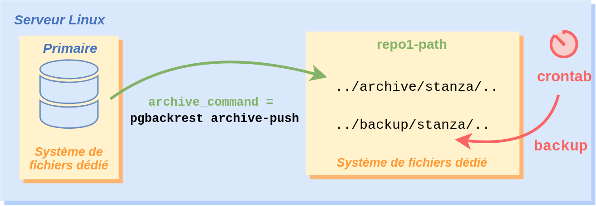
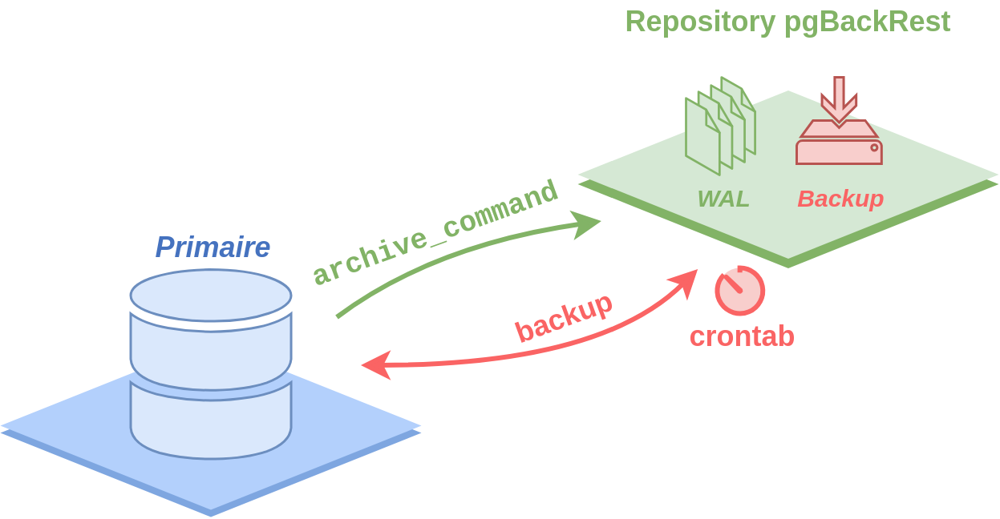
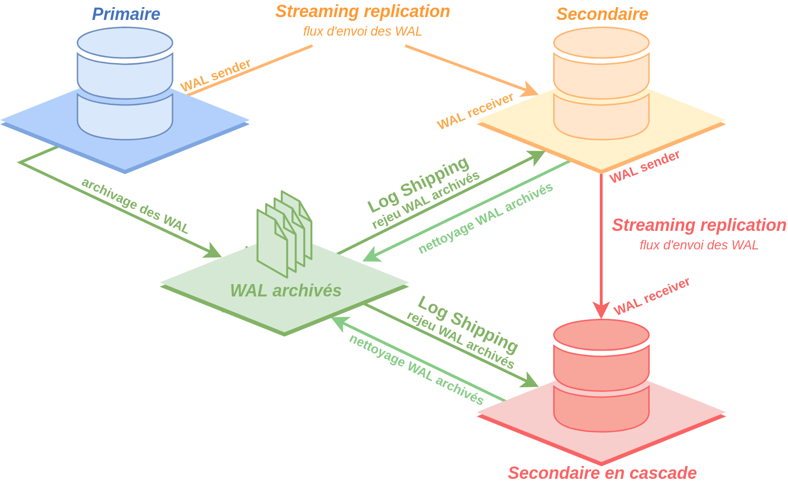
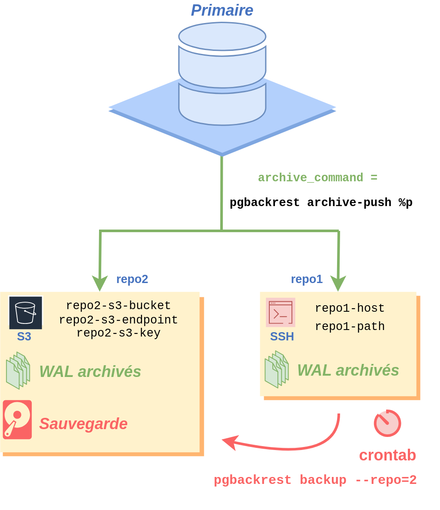

# pgBackrest dans tous ses états

L'objectif de ce TP est de vous familiariser avec pgBackRest, un outil de sauvegarde et de restauration pour les bases de données PostgreSQL. Nous allons couvrir les aspects suivants :

Essentiel :

1. Installation et configuration de pgBackRest ;
2. Utilisation de pgBackRest pour effectuer des sauvegardes sur un primaire ;
3. Effectuer ses sauvegardes depuis un repo distant ;
4. Utilisation de pgBackRest pour créer des instances secondaires (standby) ;

Avancé :

5. Fonctionnalités blocs à blocs ;
6. Le multi-repo dans pgbackrest

## Prérequis

- 1 serveur global pour tous les stagiaires pour le repo pgBackrest ;
- Un serveur PostgreSQL installé et fonctionnel par l'équipe Dalibo dont l'espace disque sera plus grand que les VMs classiques et plus de CPUs ;
- Accès **root** ou **sudo** sur la machine pour chaque stagiaire.

## Notes

Toutes les commandes sont à lancer en tant qu'utilisateur **postgres** sauf si indiquer autrement.

Lorsque les commandes sont précédées de **sudo** les commandes seront à lancer en tant qu'utilisateur **root** sur la machine.

Pour prendre l'identité de l'utilisateur **root** :

```bash
sudo -i
```

Pour prendre l'identité de l'utilisateur **postgres** :

```bash
sudo -iu postgres
```

Je vous invite à ouvrir un terminal pour chacun pour être d'un côté connecté avec l'utilisateur **root** et
de l'autre avec l'utilisateur **postgres**.

## Rappels

Petit tour de table pour savoir si tout le monde connaît les termes suivants:

1. Qu'est ce qu'une sauvegarde PITR ?

2. Qu'est-ce qu'un WAL ?

3. Réplication par log shipping ?

4. Streaming replication ?

5. Qu'est-ce que pgbackrest ?

## Workshop

### Installation et configuration de pgBackRest

Sur votre VM:

1. Installez les paquets nécessaires :

```bash
sudo yum install pgbackrest -y
```

### Configuration des paramètres globaux

2. Puis mettre le contenu suivant dans le fichier `/etc/pgbackrest.conf` :

```bash
sudo cat<<EOF | sudo tee "/etc/pgbackrest.conf"
[global]
repo1-path=/var/lib/pgbackrest
process-max=2
log-level-console=info
log-level-file=debug
# compression extrême et lente
compress-type=gz   
compress-level=9   

[global:archive-push]
# archivage uniquement : compression la plus rapide possible
compress-type=gz
compress-level=9
EOF
```

3. Changez les permissions du répertoire de sauvegarde :

```bash
sudo chown postgres:postgres /var/lib/pgbackrest
```

#### Bonnes pratiques

4. Création des dossiers `/etc/pgbackrest` et `/etc/pgbackrest/conf.d` :

```bash
sudo mkdir /etc/pgbackrest
sudo mkdir /etc/pgbackrest/conf.d
```

5. Déplacer le fichier `/etc/pgbackrest.conf` dans `/etc/pgbackrest/` :

```bash
sudo mv /etc/pgbackrest.conf /etc/pgbackrest/
```

6. Changez les permissions du dossier `/etc/pgbackrest` :

```bash
sudo chown -R postgres:postgres /etc/pgbackrest
```

#### Configuration des paramètres de la stanza

Une stanza est un ensemble d'instances, une primaire et les autres secondaire de ce même primaire.

Nous allons ajouter l'information de notre stanza pour pgbackrest afin qu'il puisse savoir comment la sauvegarder.
Veuillez changer le nom de la stanza `main` par le hostname de votre VM. Pour récupérer le nom de votre VM vous pouvez lancer la commande `hostname`.
Ces informations sont à ajouter dans le fichier `/etc/pgbackrest/conf.d/main.conf` où `main` sera le nom de votre VM.

```ini
sudo cat<<EOF | sudo tee "/etc/pgbackrest/conf.d/main.conf"
[main]
pg1-path=/var/lib/pgsql/16/data/
EOF
sudo chown postgres:postgres /etc/pgbackrest/conf.d/main.conf
```

#### Modification des paramètres de l'instance

8. Modifier la configuration de l'instance sur votre serveur :

Afin que **pgbackrest** fonctionne, il faudra modifier les paramètres suivants :

Attention à bien changer le nom de la stanza `main` par le `hostname` de votre VMs.

- `archive_mode`: le passer à `on` ;
- `archive_command`: le passer à `/usr/bin/pgbackrest --stanza=main archive-push %p`.
- `checkpoint_timeout` : nous allons le passer à `30s` afin d'utiliser `pgbackrest` confortablement.
  Cela nous évitera d'attendre trop longtemps avant le début de nos sauvegardes.

Il est possible de modifier la valeur de ces paramètres directement dans le fichier de configuration `/var/lib/pgsql/16/data/postgresql.conf`.
Ou en utilisant l'ordre `ALTER SYSTEM`.

En suite il faudra redémarrer l'instance avec :

```bash
sudo systemctl restart postgresql-16
```

### Utilisation de pgBackRest pour effectuer des sauvegardes sur un primaire



Attention à bien changer le nom de la stanza `main` par le `hostname` de votre VMs.

1. Initialisez le repo :

```bash
pgbackrest --stanza=main stanza-create
```

La sous-commande `stanza-create` permet de créer les dossiers d'archivage des WALs et de backups de notre instance.
Elle créera aussi des fichiers d'informations de l'instance permettant le bon fonctionnement de pgbackrest.

2. Vérification de la configuration :

```bash
pgbackrest --stanza=main check
```

La sous-commande `check` permet de vérifier l'archivage des WALs.
Si cette sous-commande est en succès, cela veut dire que l'archivage des WALs se fait correctement.

3. Effectuez une sauvegarde complète :

```bash
pgbackrest --stanza=main backup --type=full
```

La sous-commande `backup`; associée avec l'argument `--type`; dont les valeurs peuvent être `full`, `diff`, `incr`; permet de lancer une sauvegarde de votre instance.

- `full` : sauvegarde complète de l'instance depuis le dernier backup `full`;
- `diff` : sauvegarde différentielle de l'instance, toutes les modifications faites depuis la dernière sauvegarde complète sont sauvegardées ;
- `incr` : sauvegarde incrémentale de l'instance, permet de sauvegarder uniquement les modifications depuis la dernière sauvegarde.
   Nous ne préconisons pas cette méthode car le risque de perdre un fichier est trop grand et pourrait compromettre la dernière sauvegarde.

4. Programmation d'une sauvegarde hebdomadaire avec `crontab` :

```bash
crontab -e
```

Puis y mettre les lignes suivantes :

N'oubliez pas de mettre à jour le nom de votre stanza.

```text
# Sauvegarde complete tous les dimanches a 03:30
30 3 * * 0 /usr/bin/pgbackrest --stanza=main backup --type=full

# Sauvegarde differentielle tous les jours sauf le dimanche a 03:30
30 3 * * 1-6 /usr/bin/pgbackrest  --stanza=main backup --type=diff
```

La première ligne indique que la commande `/usr/bin/pgbackrest  --stanza=main backup --type=full`
sera lancée tous les dimanches (`0`) à 3h30 (`30 3`).

La seconde ligne indique que la commande `/usr/bin/pgbackrest  --stanza=main backup --type=diff`
sera lancée du lundi au samedi (`1-6`) à 3h30 (`30 3`).

### Rétention des backups

Dans pgBackrest la rétention est gérée par les paramètres `repo1-retention-*`.

Les plus communs sont `repo1-retention-full` et `repo1-retention-diff`. Ils permettent de garder `N`
backups d'une sauvegarde de type `full` ou `diff`.

Si ce n'est pas déjà fait, lancer la commande `/usr/bin/pgbackrest  --stanza=main backup --type=full`
et `/usr/bin/pgbackrest  --stanza=main backup --type=diff` 3 fois chacune où `main` sera à remplacer par le nom de votre stanza.

Afin d'avoir des informations sur les backups, vous pouvez utiliser la sous-commande `info` de la commande `pgbackrest`.

Dans l'exemple de ce TP nous pouvons voir 3 backups présents dans le dossier de backups (`repo1-path`) :

```bash
pgbackrest info
```

\newpage

```text
stanza: main
    status: ok
    cipher: none

    db (current)
        wal archive min/max (16): 000000010000000000000001/000000010000000000000007

        full backup: 20240104-152133F
            timestamp start/stop: 2024-01-04 15:21:33+00 / 2024-01-04 15:21:45+00
            wal start/stop: 000000010000000000000003 / 000000010000000000000003
            database size: 22.2MB, database backup size: 22.2MB
            repo1: backup set size: 2.9MB, backup size: 2.9MB

        full backup: 20240104-154105F
            timestamp start/stop: 2024-01-04 15:41:05+00 / 2024-01-04 15:41:27+00
            wal start/stop: 000000010000000000000005 / 000000010000000000000005
            database size: 29.4MB, database backup size: 29.4MB
            repo1: backup set size: 3.8MB, backup size: 3.8MB

        full backup: 20240104-154206F
            timestamp start/stop: 2024-01-04 15:42:06+00 / 2024-01-04 15:42:22+00
            wal start/stop: 000000010000000000000007 / 000000010000000000000007
            database size: 29.4MB, database backup size: 29.4MB
            repo1: backup set size: 3.8MB, backup size: 3.8MB
```

La rétention avec pgBackrest n'est pas paramétrée, les backups sont donc gardés indéfiniment sur la machine.

Afin de paramétrer la rétention vous pouvez alors modifier le fichier de configuration de pgBackrest pour y faire apparaître
les deux paramètres suivants dans la partie __globale__ du fichier :

```ini
repo1-retention-full=2
repo1-retention-diff=7
```

Lancer de nouveau un backup et regarder la sortie. Une purge aura été faite après que la sauvegarde se soit passée correctement.

```bash
$ /usr/bin/pgbackrest  --stanza=main backup --type=full
[...]
2024-01-04 15:48:21.246 P00   INFO: repo1: expire full backup 20240104-152133F
2024-01-04 15:48:21.246 P00   INFO: repo1: expire full backup 20240104-154105F
2024-01-04 15:48:21.271 P00   INFO: repo1: remove expired backup 20240104-154105F
2024-01-04 15:48:21.308 P00   INFO: repo1: remove expired backup 20240104-152133F
2024-01-04 15:48:21.346 P00   INFO: repo1: 16-1 remove archive, start = 000000010000000000000001, stop = 000000010000000000000006
2024-01-04 15:48:21.346 P00   INFO: expire command end: completed successfully (101ms)
```

Lancer la commande `pgbackrest info` qui nous confirmera la prise en compte de cette rétention.

Vous pouvez également utiliser la sous-commande `expire` de `pgbackrest` pour forcer une expiration de backups pour gagner de la place en cas d'incidents :

```bash
pgbackrest --stanza=main expire --repo1-retention-full=1
```

### Effectuer ses sauvegardes depuis un repo distant



Avec pgBackrest il est possible d'effectuer des sauvegardes depuis un serveur centralisé appelé __repo__ comme repository.

Le but de ce serveur est de réceptionner les différents WAL envoyés par chaque primaire de chaque stanza. Mais aussi de lancer les backups.

Dans ce TP nous nous connecterons tous à la même machine qui sera donné par le formateur.

Comme précédemment les paramètres spécifiques à votre stanza devront se retrouver dans un fichier spécifique `/etc/pgbackrest/conf.d/main.conf`
où `main` sera le nom de votre stanza.

\newpage

Par exemple pour la configuration de l'instance `main` j'aurai dans le fichier uniquement les paramètres associés
à la stanza `main` ainsi que les paramètres de connexion en SSH à la machine sur laquelle est présente votre instance :

Sur le repo :

```ini
cat<<EOF | tee "/etc/pgbackrest/conf.d/main.conf"
[main]
pg1-path=/var/lib/pgsql/16/data
pg1-host=pg1
pg1-host-user=postgres
EOF
```

 - `pg1-path` : le chemin de votre instance sur votre primaire ;
 - `pg1-host` : l'adresse IP ou le hostname de votre primaire ;
 - `pg1-host-user` : l'utilisateur qui se connectera à votre primaire en SSH pour effectuer les commandes `pg_start_backup`, `pg_stop_backup`
   et la copie du dossier `PGDATA`.

A ce stade, si vous essayez de lancer la commande de backup vous vous apercevrez que vous ne pourrez pas vous connecter à votre serveur primaire.

Il faudra alors :

 - Effectuer un échange de clefs pour permettre une connexion SSH entre les deux machines avec l'utilisateur `postgres`.
 - Modifier la configuration de la stanza sur le primaire ;
 - Créer la stanza sur le repo distant avec `pgbackrest --stanza=main stanza-create` yes; 

### Echange de clef

Le point 1 et 2 ont déjà été fait pour les besoins de ce TP,

1. Copier le contenu du fichier `~postgres/.ssh/id_rsa.pub` se trouvant sur votre repo dans le fichier `~postgres/.ssh/authorized_keys` de votre primaire.

2. Copier le contenu du fichier `~postgres/.ssh/id_rsa.pub` se trouvant sur votre primaire dans le fichier `~postgres/.ssh/authorized_keys` de votre repo.

Exemple de commande:

```bash
echo '<ma_clef>' > ~postgres/.ssh/authorized_keys
```

3. Changer les droits en `600` sur les deux fichiers `~postgres/.ssh/authorized_keys`.

```bash
chmod 600 ~postgres/.ssh/authorized_keys
```

**Note**: La génération des clefs a été effectué avec la commande suivante :

```bash
sudo -u postgres ssh-keygen -t rsa -N '' -f /var/lib/pgsql/.ssh/id_rsa
```

3. Tester votre connexion depuis le repo :

```bash
$ ssh pg1

The authenticity of host 'pg1 (192.168.121.197)' can't be established.
RSA key fingerprint is SHA256:aBgf3A6knNHnfpuPiTnW0DpwaJkL67yFSLwZN2TaFYI.
Are you sure you want to continue connecting (yes/no/[fingerprint])? yes
Warning: Permanently added 'pg1,192.168.121.197' (RSA) to the list of known hosts.
```

**Note**: `pg1` sera à remplacer par votre adresse IP ou le hostname de votre instance primaire.

4. Tester votre connexion depuis le primaire :

```bash
$ ssh pgbackrest1

The authenticity of host '192.168.90.32 (192.168.90.32)' can't be established.
RSA key fingerprint is SHA256:PGasbRlNexWKzVYST33yAYDYoMQVHJPz2cuO/2PwtO8.
Are you sure you want to continue connecting (yes/no/[fingerprint])? yes
Warning: Permanently added '192.168.90.32' (RSA) to the list of known hosts.
```

**Note**: `pgbackrest1` sera à remplacer par votre adresse IP ou le hostname de votre repo.


### Modification de la configuration de la stanza sur le primaire

Sur le primaire nous avions définis la configuration globale suivante :

```ini
# /etc/pgbackrest/pgbackrest.conf
[global]
repo1-path=/var/lib/pgbackrest
process-max=2
log-level-console=info
log-level-file=debug
# compression extrême et lente
compress-type=gz   
compress-level=9   

[global:archive-push]
# archivage uniquement : compression la plus rapide possible
compress-type=gz
compress-level=9

# /etc/pgbackrest/conf.d/main
[main]
pg1-path=/var/lib/pgsql/16/data/
```

Maintenant nous voulons sauvegarder sur un repository distant.

Comme nous pouvons le constater aucune information n'est présente dans la configuration du primaire pour répondre à la question : 
Comment archiver les WALs sur notre repository distant ?

Dans le fichier `/etc/pgbackrest/pgbackrest.conf` il faudra alors spécifier ces informations :

```ini
cat<<EOF | tee "/etc/pgbackrest/pgbackrest.conf"
[global]
repo1-host=pgbackrest1
repo1-host-user=postgres
process-max=2
log-level-console=info
log-level-file=debug
# compression extrême et lente
compress-type=gz   
compress-level=9
repo1-retention-full=2
repo1-retention-diff=7

[global:archive-push]
# archivage uniquement : compression la plus rapide possible
compress-type=gz
compress-level=9
EOF
```

- `repo1-host` : le serveur de repo, son adresse IP ou son hostname ;
- `repo1-host-user` : l'utilisateur avec lequel pgbackrest va archiver nos WAL sur le serveur renseigné dans `repo1-host`.

Maintenant nous pouvons créer la stanza sur notre repo ou sur le primaire avec la commande :

```bash
pgbackrest --stanza=main stanza-create
```

Nous pouvons vérifier avec la sous-commande `check` à la fois sur le primaire et sur le repo.

```bash
pgbackrest --stanza=main check
```

La sauvegarde peut être maintenant lancée sur votre repo :

```bash
pgbackrest --stanza=main backup --type=full
```

### Utilisation de pgBackRest pour créer des instances secondaires (standby) ;



Pour ce TP nous allons créer un secondaire sur le même serveur que le primaire, nous vous déconseillons de le faire en production.

1. Création du dossier data de destination sur le primaire :

```bash
mkdir /var/lib/pgsql/16/secondaire
```

\newpage

2. Restauration dans le dossier data de l'instance secondaire :

Attention à bien changer le nom de la stanza `main` par le `hostname` de votre VMs.

```bash
pgbackrest --stanza=main \
  --type=standby \
  --recovery-option=primary_conninfo='host=localhost port=5432 user=replication_user' \
  --recovery-option=primary_slot_name='secondaire' \
  --target-timeline=latest \
  --pg1-path='/var/lib/pgsql/16/secondaire' \
  --delta \
  restore
```

Cette commande créera un fichier `standby.signal` et mettra à jour le fichier `postgresql.auto.conf` avec les nouveaux paramètres de l'instance.

- `type` : permet de spécifier que l'instance fraîchement créée sera une `standby`. Attention
  par défaut, l'instance créée sera un primaire.
- `pg1-path` : identique lorsque le secondaire est sur un autre serveur que le primaire,
  différent lorsque le secondaire est sur le même serveur que le primaire comme c'est le cas
  pour notre exemple dans ce document ;
- `recovery-option` : permet de spécifier des paramètres ainsi que leur valeur pour la
  _streaming replication_ :
- `primary_conninfo` : Cette option est utilisée pour configurer la chaîne de connexion à l'instance
  primaire de PostgreSQL pour la réplication en streaming. Elle inclut généralement l'adresse de l'hôte,
  le port, le nom d'utilisateur et le mot de passe.
- `primary_slot_name` : Ce paramètre spécifie le nom du slot de réplication sur le serveur primaire qui
  est utilisé par l'instance secondaire. Cela permet une réplication en streaming plus efficace et fiable.
- `target-timeline` : Ce paramètre est utilisé pour spécifier la timeline cible pour la réplication. En
  général, il est utilisé dans des scénarios avancés de basculement ou de récupération. Si vous n'avez
  pas de besoins spécifiques, vous pouvez souvent laisser ce paramètre avec sa valeur par défaut, qui
  est la timeline actuelle de l'instance primaire. La valeur par défaut est généralement appropriée
  pour la plupart des configurations.
- `delta` : bien que cet argument est optionnel, il devient quasi obligatoire en pratique.
  Il vous permet de ne pas partir de 0 pour créer votre secondaire. Si, pour une raison,
  le processus de restauration s'arrête, vous pourrez reprendre là où vous vous êtes arrêté
  grâce à ce paramètre. Sinon il effacera le contenu de votre dossier `pg1-path` puis effectura
  la restauration. Ce paramètre devient très utile pour les grosses instances.

\newpage

Des modifications sont à effectuer avant de lancer l'instance secondaire :

1. Modifier la valeur du paramètre `port` de l'instance du secondaire pour
   qu'elle écoute sur le port `5433`. Vous pouvez changer cette valeur en modifiant le fichier :
  
* `/var/lib/pgsql/16/secondaire/postgresql.conf`.

2. Créer un slot de réplication appelé `secondaire` sur le primaire avec la fonction :

 * `pg_create_physical_replication_slot` ;

```bash
psql -c "SELECT pg_create_physical_replication_slot('secondaire');"
```

3. Création de l'utilisateur `replication_user` avec son mot de passe :

Pour le TP nous prendrons le mot de passe `replication_user`. Ceci n'est pas à faire en production.

```sql
CREATE USER replication_user WITH REPLICATION;
\password replication_user
```

4. Ajouter d'un fichier `~postgres/.pgass` :

```bash
touch ~postgres/.pgpass
chmod 600 ~postgres/.pgpass
```

Avec le contenu suivant :

```bash
echo 'localhost:5432:*:replication_user:replication_user' >> ~postgres/.pgpass
```

La réplication physique via le slot de réplication est maintenant opérationnelle.

4. Créez un fichier de service systemd, par exemple `/usr/lib/systemd/system/postgresql-16-secondaire.service`,
   et configurez-le pour utiliser le second répertoire de données :

```bash
sudo cp /usr/lib/systemd/system/postgresql-16.service /usr/lib/systemd/system/postgresql-16-secondaire.service
```

5. Modifier la ligne `Environment=PGDATA=/var/lib/pgsql/16/data/` en `Environment=PGDATA=/var/lib/pgsql/16/secondaire/` dans le
   fichier `/usr/lib/systemd/system/postgresql-16-secondaire.service`.
6. Lancer le service `postgresql-16-secondaire` :

```bash
sudo systemctl start postgresql-16-secondaire
sudo systemctl enable postgresql-16-secondaire
```

#### Vérification

Vous pouvez vous connecter à l'instance nouvellement démarrée en précisant le port de connexion `5433`. Par exemple:

```bash
psql -p 5433 -c "SELECT pg_is_in_recovery();"
```

Vous pouvez également ajouter une base de données `workshop16` sur le primaire et voir si elle apparaît sur le secondaire.

Sur le primaire :

```bash
psql -p 5432 -c 'CREATE DATABASE workshop16;'
```

Sur le secondaire :

```bash
psql -p 5433 -l
```

```text
|    Name    |
+------------+
| postgres   |
| template0  |
| template1  |
| workshop16 |
(4 rows)
```

La base de donnée `workshop16` est bien présente.

Nous pouvons aussi voir un état de la réplication en lançant :


```bash
psql -c "SELECT slot_name, active FROM pg_replication_slots;"
```

### Utilisation de pgBackRest pour reconstruire un primaire

La base de données `workshop16` est vide, nous allons créer une table contenant un champs date.

```bash
psql -d workshop16 -c "CREATE TABLE t1(ma_date timestamp);"
```

Puis nous allons insérer une date :

```bash
psql -d workshop16 -c "INSERT INTO t1(ma_date) VALUES (NOW());"
```

Lancer une sauvegarde sur votre repository :

```bash
pgbackrest --stanza=main backup --type=full
```

#### Récupération et analyse des WALs

Dans cette partie nous allons simuler une suppressions de données et revenir à la transaction juste avant la transaction coupable.

##### Suppression des données

Avant de commencer la suite du TP nous allons récupérer quelques informations intéressantes à propos de nos WALs.

Puis avec `pg_walfile_name(pg_current_wal_lsn())` nous pouvons connaitre le nom du WAL associé :

```bash
psql -c "SELECT pg_walfile_name(pg_current_wal_lsn());"
```

Le WAL actuel est `000000010000000000000008`, le votre pourrait être différent.

Nous supprimons maintenant les données présentes dans la table `t1` :

```bash
psql -d workshop16 -c "DELETE FROM t1;"
```

Nous allons forcer un `CHECKPOINT` et forcer l'archivage d'un WAL :

```bash
psql -c "CHECKPOINT;"
psql -c "SELECT pg_switch_wal();"
```

#### Récupération des WALs

Nous allons maintenant récupérer les WALs afin de pouvoir les analyser

Afin de pouvoir lister les WAL disponibles dans pgbackrest nous pouvons utiliser la sous-commande `repo-ls` :

```bash
pgbackrest --stanza=main repo-ls archive/main/16-1/0000000100000000/
```

Dont la sortie est :

```bash
000000010000000000000006-676b1493e3c9d09e5c3b4f9a49207344f96575ab.gz
000000010000000000000007-4066ff0c07f1814fd2019b4de6bb495b4465eae5.gz
000000010000000000000007.00000028.backup
000000010000000000000008-f2670b1e691dcadd53f1c93ba7292180153c2cfe.gz
```

Dans la sortie de la sous-commande `repo-ls` nous pouvons voir les différents WAL archivés que nous pouvons
récupérer avec la sous-commande `repo-get`.

Les WALs que je souhaite récupérer ici sont les suivants :
 
 * `000000010000000000000007` ;
 * `000000010000000000000008`.

```bash
pgbackrest --stanza=main repo-get archive/main/16-1/0000000100000000/000000010000000000000007-4066ff0c07f1814fd2019b4de6bb495b4465eae5.gz > 000000010000000000000007.gz
pgbackrest --stanza=main repo-get archive/main/16-1/0000000100000000/000000010000000000000008-f2670b1e691dcadd53f1c93ba7292180153c2cfe.gz > 000000010000000000000008.gz
```

Nous les décompressons avec `gunzip` :

```bash
gunzip *.gz
```

Puis nous pouvons analyser les WALs avec `pg_waldump` :

```bash
/usr/pgsql-16/bin/pg_waldump 000000010000000000000007 000000010000000000000008 | grep DELETE
```

Dans le résultat nous pouvons voir le dernier `COMMIT` avant notre `RESTORE POINT` est fait à `2024-01-17 14:20:54.081233` :

```bash
rmgr: Heap        len (rec/tot):     59/   119, tx:        746, lsn: 0/08440830, prev 0/084407F8, desc: DELETE xmax: 746, off: 1, infobits: [KEYS_UPDATED], flags: 0x00, blkref #0: rel 1663/16389/16390 blk 0 FPW
```

On peut alors noter le numéro de la transaction de notre `DELETE`, ici `746`.

\newpage

#### Restauration

Dans mon exemple je prendrai la transaction de `746` récupérée dans la partie précédente.

##### Reconstruire un primaire à l'identique en partant d'un backup pgbackrest

Dans cette partie nous allons arrêter notre primaire et le restaurer à une transaction particulière.

La première chose à faire est d'arrêter le service du primaire :

```bash
sudo systemctl stop postgresql-16
```

Puis nous pouvons restaurer le dossier avec `pgbackrest` :

```bash
pgbackrest --stanza=main \
  --type=xid \
  --target=746 \
  --delta \
  --target-action=promote \
  --target-exclusive \
  restore
```

 - `type` : Le type de restauration, ici `xid` pour une restauration via un numéro de transaction.
 - `target` : le numéro de transaction cible.

Une fois la restauration terminée nous pouvons démarrer le service :

```bash
sudo systemctl start postgresql-16
```

Puis nous pouvons nous connecter et lister le contenu de la table `t1` de la base `workshop16` :

```bash
psql -d workshop16 -c "SELECT * FROM t1;"
          ma_date           
----------------------------
 2024-01-17 15:17:43.828444
(1 row)
```

Et notre secondaire dans tout ça ?

Egalement sur notre secondaire :

```bash
psql -p 5433 -d workshop16 -c "SELECT * FROM t1;"
```

Le secondaire n'a pas suivi car pgbackrest ne restaure pas les slots de réplication.
Après chaque restauration, il faudra penser à créer de nouveau chacun des slots de réplication.

```bash
psql -c "SELECT pg_create_physical_replication_slot('secondaire');"
```

Mais malheureusement cela ne suffira pas...

Notre secondaire est positionné à la transaction numéro `746` et notre primaire est revenu
à la transaction `745`.
Les deux instances sont chacune sur une timeline différente.

On sauvegarde le primaire:

```bash
pgbackrest --stanza=main backup --type=diff
```

Il faut donc maintenant stopper le secondaire puis le reconstruire :

```bash
sudo systemctl stop postgresql-16-secondaire
```

On le reconstruit :

```bash
pgbackrest --stanza=main \
  --type=standby \
  --delta \
  --pg1-path='/var/lib/pgsql/16/secondaire' \
  --recovery-option=port='5433' \
  restore
```

Le service du secondaire doit être redémarrer :

```bash
sudo systemctl start postgresql-16-secondaire
```

Comme précédemment, nous pouvons nous assurer que 

```bash
psql -p 5433 -d workshop16 -c "SELECT * FROM t1;"
```


### Fonctionnalités blocs à blocs dans pgBackrest

La sauvegarde incrémentale par bloc permet plus de granularité en divisant les fichiers en blocs qui
peuvent être sauvegardés indépendamment. C'est particulièrement intéressant pour des fichiers avec peu
de modifications, car pgBackRest pourra ne sauvegarder que quelques blocs plutôt que le fichier complet
dont la taille peut atteindre jusqu'à 1 Go. Cela permet donc d'économiser de l'espace dans le dépot de
sauvegarde et accélère les restaurations par delta.

La sauvegarde incrémentale par bloc doit être activée sur tous les types de sauvegardes :
`full`, `incr` ou `diff`.
Cela aura pour impact de rendre la sauvegarde full un peu plus grosse du fait de la création de fichier
de cartographie des blocs. En revanche les sauvegardes différentielles et incrémentielles suivantes pourront
utiliser cette cartographie pour économiser de l'espace.

La taille du bloc pour un fichier donné est définie en fonction de l'age et de la taille du fichier.
Généralement, les fichiers les plus gros et/ou les plus anciens auront des tailles de bloc supérieures.
Si un fichier est assez vieux, aucune cartographie ne sera crée.

Cette fonctionnalité s'active avec l'option : `repo-block` et nécessite l'activation du « Bundling » avec l'option `repo-bundle`.

```ini
repo1-block=y
repo1-bundle=y
```

Bien que cette fonctionnalité soit intéressante pour le gain de place des sauvegardes `diff` et `incr` nous
conseillons d'attendre la prochaine mise à jour de pgbackrest.

### Comparaison avec et sans

Afin de pouvoir un bon cas de figure nous allons générer plus de données dans notre base de données avec `pgbench` :


Générer des données à l'aide de `pgbench` :

```bash
/usr/pgsql-16/bin/pgbench -i -s 100 workshop16
```

Faites une sauvegardes `full` avec pgbackrest :

```bash
pgbackrest --stanza=main backup --type=full
```

Simuler une activité avec  `pgbench` :

```bash
/usr/pgsql-16/bin/pgbench -T 120 workshop16
```

Faites une sauvegarde `diff` :

```bash
pgbackrest --stanza=main backup --type=diff
```

\newpage 

Puis récupérer les informations des backups dans un fichier texte, avec la sous-commande `info`.
Vous devrez garder ces informations, dans un fichier texte, pour les comparer plus tard.


```bash
stanza: main
    status: ok
    cipher: none

    db (current)
        wal archive min/max (16): 0000000100000000000000EC/00000001000000010000000A

        full backup: 20240109-150140F
            timestamp start/stop: 2024-01-09 15:01:40+00 / 2024-01-09 15:04:28+00
            wal start/stop: 0000000100000000000000F8 / 0000000100000000000000F8
            database size: 1.5GB, database backup size: 1.5GB
            repo1: backup set size: 85.8MB, backup size: 85.8MB

        diff backup: 20240109-150140F_20240109-150906D
            timestamp start/stop: 2024-01-09 15:09:06+00 / 2024-01-09 15:11:37+00
            wal start/stop: 00000001000000010000000A / 00000001000000010000000A
            database size: 1.5GB, database backup size: 1.5GB
            repo1: backup set size: 87.6MB, backup size: 81.9MB
            backup reference list: 20240109-150140F
```

Maintenant que nous avons récupérer les informations du backups nous allons procéder à l'activation de
l'option bloc à blocs.

L'activation de ces paramètres doit être fait à la création de la stanza.

Nous allons donc repartir de 0.

Supprimer la stanza avec `stanza-delete` sur le repo :

```bash
pgbackrest --stanza=main stop
pgbackrest --stanza=main stanza-delete --force
```

Supprimer la base de données `workshop16` :

```sql
psql -c "DROP DATABASE workshop16;"
```

\newpage

Ajouter les deux nouveaux paramètres dans `/etc/pgbackrest/pgbackrest.conf` des deux serveurs :

```ini
repo1-block=y
repo1-bundle=y
```

Créer la stanza :

```bash
pgbackrest --stanza=main stanza-create
pgbackrest --stanza=main start
```

Créer la base de données :

```bash
psql -c "CREATE DATABASE workshop16;"
```

Puis reprenez tous les points depuis le début du TP jusqu'à la récolte d'informations.
Et comparer les deux résultats.

```shell
stanza: main
    status: ok
    cipher: none

    db (current)
        wal archive min/max (16): 000000010000000000000048/0000000100000000000000A8

        full backup: 20240109-144652F
            timestamp start/stop: 2024-01-09 14:46:52+00 / 2024-01-09 14:49:03+00
            wal start/stop: 000000010000000000000098 / 000000010000000000000098
            database size: 1.5GB, database backup size: 1.5GB
            repo1: backup size: 86.7MB

        diff backup: 20240109-144652F_20240109-145214D
            timestamp start/stop: 2024-01-09 14:52:14+00 / 2024-01-09 14:54:25+00
            wal start/stop: 0000000100000000000000A8 / 0000000100000000000000A8
            database size: 1.5GB, database backup size: 1.5GB
            repo1: backup size: 66.9MB
            backup reference list: 20240109-144652F
```

|      | **Volume de la sauvegarde FULL** | **Volume de la sauvegarde DIFF** |
|:-----|:--------------------------------:|:--------------------------------:|
| Sans | 85.8MB                           | 81.9MB                           |
| Avec | 86.7MB                           | 66.9MB                           |

\newpage

Nous constatons donc qu'avec ces paramètres :

 - le backup complet de l'instance est plus gros ;
 - le backup différentiel de l'instance est plus petit.

Ceci s'explique par la création de fichiers représentant la cartographie des blocs lors de la sauvegarde complète.

Lors de la sauvegarde différentielle pgbackrest prendra connaissance de cette cartographie et ne sauvegardera que les blocs modifiés.

### Le multi-repo dans pgBackrest



#### Création de la stanza

La création de la stanza avec la commande `stanza-create` s'assure de créer les stanzas sur tous les repos.

Lorsqu'un repo est ajouté, il faudra de nouveau lancer la commande `stanza-create` :

```
pgbackrest --stanza=main stanza-create
```

#### Archivage

L'archivage des journaux est assurée par la commande renseignée dans le paramètre `archive_command` :

```bash
/usr/bin/pgbackrest --stanza=main archive-push %p
```

Elle assurera un archivage sur tous les repos renseignés dans la configuration de pgbackrest.

#### Sauvegardes

Malheureusement la sauvegarde ne fonctionne pas comme la commande d'archivage.


Même si postgreSQL autorise le lancement simultané de plusieurs backups PITR, pgbackrest ne le permet pas.
La sauvegarde doit être lancée 1 fois pour chacun des repos. Ce processus est assez coûteux, surtout quand votre instance fait quelques TO.

A l'heure d'écrire ce document, il n'y a pas de solutions viables dans pgBackrest pour copier facilement les fichiers de WALs et de backups.

Les développeurs sont au courant de cette limitation et prévoient un développement: https://github.com/pgbackrest/pgbackrest/issues/1406#issuecomment-1875756724

\newpage

#### Dépôt S3

Dans ce workshop nous allons utiliser un S3 public avec `minio`.

min.io propose un S3 publique sur lequel nous pouvons tester pgbackrest pour qu'il puisse pousser les archives et les backups sur un S3.

Sur les deux serveurs nous aurons en plus la configuration suivante dans le fichier `/etc/pgbackrest/pgbackrest.conf` :

```ini
[global]
[...]
# S3
repo2-type=s3
repo2-s3-uri-style=path
repo2-s3-endpoint=play.min.io:9000
repo2-s3-region=us-east-1
repo2-s3-bucket=q9maqbezkxk6
repo2-path=/pgbackrest
repo2-s3-key=86VyH1gKqplIgGUJ7k1X
repo2-s3-key-secret=NICs36F3wFs4MQ5BhmZ53UnuSSKsDmCOVxrwLcKj
repo2-retention-full=2
repo2-retention-diff=7
```

En plus de la configuration vers le `repo1` qui est notre VM nous avons en plus le `repo2` pointant vers un S3.

 * `repo2-type` : Indique le type de dépôt de sauvegarde. Pour utiliser S3, vous devriez définir ceci à `s3`.

 * `repo2-s3-uri-style` : Détermine le style d'URI utilisé pour accéder à S3. Les valeurs possibles sont `path` ou `host`.

 * `repo2-s3-endpoint` : L'endpoint pour le service S3. Si vous utilisez Amazon S3, il s'agira de quelque chose comme `s3.amazonaws.com`. Pour d'autres
    services S3, spécifiez leur endpoint.

 * `repo2-s3-region` : La région où votre seau (bucket) S3 est hébergé.

 * `repo2-s3-bucket` : Le nom de votre seau S3 où les sauvegardes seront stockées.

 * `repo2-path` : Le chemin dans le seau S3 où les sauvegardes seront stockées. C'est souvent un chemin de sous-dossier dans le seau.

 * `repo2-s3-key` : La clé d'accès AWS (ou d'un autre fournisseur S3) pour l'authentification.

 * `repo2-s3-key-secret` : Le secret d'accès AWS (ou d'un autre fournisseur S3) correspondant à la clé d'accès.

Ensuite il faudra créer la stanza sur le S3 en lançant `stanza-create` sur le primaire ou le `repo1` :

```bash
pgbackrest --stanza=main stanza-create
```

Puis nous pouvons vérifier que la commande `check` n'est pas en erreur :

```bash
pgbackrest --stanza=main check
```

Une fois que la commande `check` est en succès nous pouvons lancer un backup en précisant le repo2 comme destination :

```bash
pgbackrest --repo=2 --stanza=main backup --type=diff
```

Nous venons de lancer un backup différentiel, sauf que sur le repo2 nous n'avions **jamais** lancé de backup intégral.
Dans ce cas, pgbackrest à la place de lancer un backup différentiel, lancera un backup intégral.

Si nous n'avions pas spécifier le paramètre `--repo`, pgbackrest aurait utilisé le repo1 par défaut.

Puis en précisant le repo vous pourrez voir les backups qui y ont été déposés :

```bash
pgbackrest --stanza=main --repo=2 info
```

#### Dépôt S3 - Aller plus loin

Lorsque l'on compare l'arborecensce des dossiers `/etc/pgbackrest` sur le primaire et le repo1 ainsi que leur contenu,
nous voyons beaucoup de duplication de configuration.

Grâce à l'option `repo1-host-config-path` nous pouvons ommettre les informations du S3 dans le fichier de configuration de notre primaire.
Cela aura pour conséquence de dire à pgbackrest  de récupèrer les informations du `repo2` en SSH depuis le `repo1`.

\newpage

Sur notre repo nous aurons la configuration suivante :

```ini
# /etc/pgbackrest/pgbackrest.conf
[global]
repo1-path=/var/lib/pgbackrest   
repo1-retention-full=2
repo1-retention-diff=7
process-max=2
log-level-console=info
log-level-file=debug
# compression extrême et lente
compress-type=gz   
compress-level=9
# S3
repo2-type=s3
repo2-s3-uri-style=path
repo2-s3-endpoint=play.min.io:9000
repo2-s3-region=us-east-1
repo2-s3-bucket=q9maqbezkxk6
repo2-path=/pgbackrest
repo2-s3-key=86VyH1gKqplIgGUJ7k1X
repo2-s3-key-secret=NICs36F3wFs4MQ5BhmZ53UnuSSKsDmCOVxrwLcKj


[global:archive-push]
# archivage uniquement : compression la plus rapide possible
compress-type=gz
compress-level=9
```

```ini
# /etc/pgbackrest/conf.d/main.conf
[main]
pg1-path=/var/lib/pgsql/16/data
pg1-host=pg1
pg1-host-user=postgres
```

\newpage

Sur le primaire nous avons la configuration suivante :

```ini
# /etc/pgbackrest/pgbackrest.conf
[global]
repo1-host-config-path=/etc/pgbackrest
repo1-host=pgbackrest1
repo1-host-user=postgres
process-max=2
log-level-console=info
log-level-file=debug
# compression extrême et lente
compress-type=gz   
compress-level=9   

[global:archive-push]
# archivage uniquement : compression la plus rapide possible
compress-type=gz
compress-level=9
```

```ini
# /etc/pgbackrest/conf.d/main.conf
[main]
pg1-path=/var/lib/pgsql/16/data/
```

#### Dépot S3 - Aller "encore" plus loin ?

Des solutions comme `s3fs-fuse` existe pour créer un point de montage vers un S3.

La sauvegarde des données est un élément critique. L'ajout de composants logiciels supplémentaires
peut compliquer votre solution et ainsi la rendre moins fiable. Bien que s3fs-fuse semble être un projet stable,
dans des contextes spécifiques, des utilisateurs signalent des erreurs (issue sur le Github du projet),
telles que des erreurs lors des opérations "RM" avec minio (un exemple parmis plusieurs issue ouvert).
Par conséquent, nous vous recommandons d'opter pour une solution native.

Cette solution bien qu'ayant une forte compatibilité avec POSIX n'est pas à 100% compatible, l'interface storage de
Pgbackrest étant testé avec des solutions complètement compatible POSIX, ceci pourrait provoqué des problèmes :
il n'y a aucune garantie de compatibilité.

Par conséquent, nous vous recommandons d'opter pour une solution native à pgBackrest.

### Archivage asynchrone

Par défaut pgBackrest archive (ou restaure) les WAL de manière synchrone.

Avec l'activation des paramètre `spool-path` et `archive-async` pgBackrest archive (ou restaure) les WAL de manière asynchrone, 
sans suivre l'enchaînement des archive/`restore_command` rythmé par PostgreSQL.

Quand PostgreSQL veut archiver un WAL, pgBackrest place les WALs dans le `spool-path` et notifie l'instance
que le WAL est archivé.

L'activation de l'archivage asynchrone est utile lorsque vous avez une instance très utilisée.

Cependant le fait que PostgreSQL soit notifier que le WAL est archivé sans vraiment l'être peut être problématique
en cas de sinistre.

L'activation du `spool-path` lors de l'archivage n'est pas à activer automatiquement et pour tout le monde.

Par contre l'activation du `spool-path` lors de la restauration est bénéfique et permet de récupérer plus rapidement
des WALs car la récupération est paralélisée. Assez utile lorsque le repo est situé dans un endroit géographique
différent du serveur sur lequel nous voulons restaurer.

### Sauvegarde depuis un secondaire

L'activation d'une sauvegarde à partir d'un secondaire est possible dans pgBackrest 

Ajout du paramètre `backup-standby` sur la configuration de la stanza sur votre repo:

```ini
# /etc/pgbackrest/conf.d/main.conf
[main]
pg1-path=/var/lib/pgsql/16/secondaire
pg1-host=192.168.90.11
pg1-port=5433
pg1-host-user=postgres
pg2-path=/var/lib/pgsql/16/data
pg2-host=192.168.90.11
pg2-port=5432
pg2-host-user=postgres
backup-standby=y
```

 - `pg1-*` : en premier nous mettons les informations du secondaire qui se chargera de la sauvegarde ;
 - `pg2-*` : ensuite en dernier les informations de connexions au secondaire ;


# Remerciements

- Benoit Lobréau
- Bertrand Painchaud
- Florent Jardin
- Laura	Ricci
- Luc Amarle
- Mathieu Ribes
- Nicolas Gollet
- Pauline Montpied
- PgStef : https://pgstef.github.io/
- Pierrick Chovelon
- Stéphane Carton
- Thibaud Walkowiak
