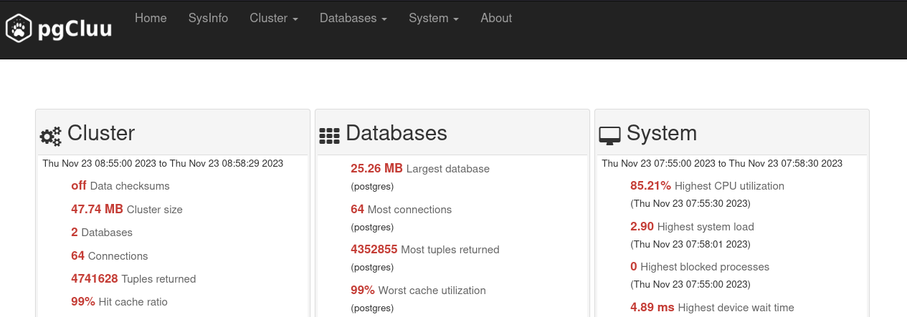
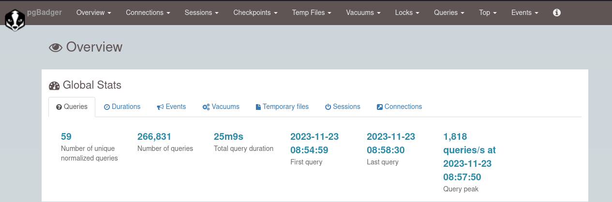

# Introduction

## Présentation de pgCluu

_pgCluu_ est un outil d'audit et de surveillance des performances de PostgreSQL. C'est un programme _Perl_ 
utilisé pour effectuer un audit complet des performances d'une instance PostgreSQL et du système. Il est 
divisé en deux parties :

* Un collecteur utilisé pour obtenir des statistiques sur l'instance PostgreSQL en utilisant la commande `psql`. 
Il utilise également la commande `sar` du paquet `sysstat` pour obtenir des statistiques système.

* Un grapheur _Perl_ pur qui génère toutes les sorties _HTML_ et graphiques.

Pour avoir une liste complète des fonctionnalités, référez-vous à : <https://github.com/darold/pgcluu>.

## Présentation de pgBadger

_pgBadger_ est un analyseur de logs PostgreSQL écrit en _Perl_. il permet de fournir rapidement des rapports détaillés basés 
sur les fichiers de logs de vos instances PostgreSQL.  

Il est capable d'auto-détecter le format de vos logs et est conçu pour analyser d'énormes fichiers compressés ou non.
Le traitement parallélisé des logs est également possible, ce qui réduit drastiquement la durée de génération de rapport 
sur des logs volumineuses.

Pour avoir une liste complète des fonctionnalités, référez-vous à : <https://github.com/darold/pgbadger>.

# Installation

## Pré-requis

* Une version récente de _Perl_
* Installer le _repository_ du _PGDG_ (consulter le _workshop Compréhension et utilisation de pglift_)
* Les instances PostgreSQL doivent déjà avoir été créées sur `srv-pg1` et `srv-pg2` (consulter 
  le _workshop Compréhension et utilisation de pglift_)

Ces deux outils peuvent être installés sur le même serveur que l'instance PostgreSQL à auditer. Cependant,
il est recommandé de les utiliser depuis une autre machine. Cependant, il est recommandé de les utiliser 
depuis une autre machine afin d'éviter toute surcharge notamment lors de la génération des rapports qui 
peuvent être gourmands en _CPU_.

## Installation de pgCluu

Sur `srv-pg1`, installer le paquet `sysstat` : 

```shell
[root@srv-pg1 ~]# dnf install -y sysstat
```

:::tip
Si vous ne souhaitez pas obtenir de rapports sur l'utilisation système, le paquet `sysstat` peut ne pas être installé.
:::

Sur `srv-supervision`, installer les paquets suivants :

```shell
[root@srv-supervision ~]# dnf install -y pgcluu postgresql15
```

:::warning
La récupération des données système par _pgCluu_ est réalisée par une connexion _SSH_ 
sur `srv_pg1`. Il faut donc que l'échange de clés soit fait et qu'une première connexion ait été réalisée.
:::

Les données collectées par _pgCluu_ sont stockées dans `/var/lib/pgcluu`.

Modifier le propriétaire du répertoire `/var/lib/pgcluu` :

```shell
[root@srv-supervision ~]# chown -R postgres: /var/lib/pgcluu
```

## Installation de pgBadger

Sur `srv_supervision`, installer le paquet `pgbadger` :

```shell
[root@srv-supervision ~]# dnf install -y pgbadger
```

# Utilisation de pgCluu

_pgCluu_ peut être utilisé de deux façons. Soit occasionnellement (en cas d'incident), soit de façon continue en 
agrégant les données collectées (mode incrémentale). Dans ce mode, _pgCluu_ va automatiquement générer un rapport par jour 
ou par heure en fonction de la configuration mise en place.

En cas d'utilisation du mode incrémentale, il est recommandé d'utiliser le collecteur de _pgCluu_ via un service _systemd_ 
afin de fiabiliser le processus. Vous trouverez des exemples sur le dépôt _github_ de _pgCluu_ :

* Service pour le collecteur : <https://github.com/darold/pgcluu/blob/master/pgcluu_collectd.service>
* Service pour _pgCluu_ (générer les rapports) : <https://github.com/darold/pgcluu/blob/master/pgcluu.service>
* _Timer_ pour le service _pgCluu_ : <https://github.com/darold/pgcluu/blob/master/pgcluu.timer>

## Démarrage de la collecte avec pgCluu

La collecte des données est réalisée par un processus spécifique `pgcluu_collectd`. C'est lui qui va à intervalle régulier
se connecter à l'instance PostgreSQL et récupérer les métriques. Il est également en charge de la collecte des métriques système.

L'ensemble des opérations ci-dessous sont à réaliser sur `srv_supervision` avec l'utilisateur `postgres`.

Créer le répertoire de stockage des données :

```shell
[postgres@srv-supervision ~] mkdir /home/postgres/pgcluu_stats
```

Pour démarrer le processus `pgcluu_collectd`, lancer la commande suivante :

```shell
[postgres@srv-supervision ~] pgcluu_collectd -D -i 60 -h srv-pg1 -U postgres \ 
      /home/postgres/pgcluu_stats --enable-ssh \
      --ssh-user postgres --ssh-identity /home/postgres/.ssh/id_rsa.pub 
```

L'option `-D` permet de lancer le processus en arrière plan. `-i` permet de définir l'intervalle de collecte des statistiques 
(ici 60 secondes).

Les options `--enable-ssh`, `--ssh-user` et `--ssh-identity` permettent à _pgCluu_ de se connecter à `srv_pg1` pour 
collecter les statistiques système. Sans ces options, aucune statistique système ne sera récupérée.

:::tip
Des adaptations pour permettre la connexion du collecteur peuvent être nécessaires en fonction de 
la configuration présente dans le fichier `pg_hba.conf`. L'utilisation d'un fichier `.pgpass` peut également
faciliter la connexion.
:::

Vérifier la présence du processus `pgcluu_collectd` : 

```shell
[postgres@srv-supervision ~] ps -ef | grep pgcluu_collectd
postgres    5270       1  0 10:08 ?        00:00:00 pgcluu_collectd
```

Lister le contenu du répertoire `/home/postgres/pgcluu_stats` :

\tiny

```
[postgres@srv-supervision ~] ls -la /home/postgres/pgcluu_stats 
-rw-r--r--. 1 postgres postgres    338 Nov 21 10:20 commit_memory.csv
-rw-r--r--. 1 postgres postgres      0 Nov 21 10:20 end-pg_statio_user_indexes.csv
-rw-r--r--. 1 postgres postgres      0 Nov 21 10:20 end-pg_statio_user_sequences.csv
-rw-r--r--. 1 postgres postgres      0 Nov 21 10:20 end-pg_statio_user_tables.csv
-rw-r--r--. 1 postgres postgres      0 Nov 21 10:20 end-pg_stat_user_functions.csv
-rw-r--r--. 1 postgres postgres      0 Nov 21 10:20 end-pg_stat_user_indexes.csv
-rw-r--r--. 1 postgres postgres      0 Nov 21 10:20 end-pg_stat_user_tables.csv
-rw-r--r--. 1 postgres postgres      0 Nov 21 10:20 end-pg_stat_xact_user_functions.csv
-rw-r--r--. 1 postgres postgres      0 Nov 21 10:20 end-pg_stat_xact_user_tables.csv
-rw-r--r--. 1 postgres postgres   5130 Nov 21 10:20 pg_class_size.csv
-rw-r--r--. 1 postgres postgres   1664 Nov 21 10:20 pg_database_size.csv
-rw-r--r--. 1 postgres postgres      0 Nov 21 10:20 pg_db_role_setting.csv
-rw-r--r--. 1 postgres postgres    280 Nov 21 10:20 pg_hba.conf
-rw-r--r--. 1 postgres postgres     52 Nov 21 10:20 pg_ident.conf
-rw-r--r--. 1 postgres postgres   1554 Nov 21 10:20 pg_nondefault_settings.csv
-rw-r--r--. 1 postgres postgres      0 Nov 21 10:08 pg_prepared_xact.csv
-rw-r--r--. 1 postgres postgres  39440 Nov 21 10:20 pg_settings.csv
-rw-r--r--. 1 postgres postgres    780 Nov 21 10:20 pg_stat_archiver.csv
-rw-r--r--. 1 postgres postgres   1001 Nov 21 10:20 pg_stat_bgwriter.csv
-rw-r--r--. 1 postgres postgres      0 Nov 21 10:08 pg_stat_connections.csv
-rw-r--r--. 1 postgres postgres      0 Nov 21 10:20 pg_stat_count_indexes.csv
-rw-r--r--. 1 postgres postgres   1742 Nov 21 10:20 pg_stat_database_conflicts.csv
-rw-r--r--. 1 postgres postgres   4316 Nov 21 10:20 pg_stat_database.csv
-rw-r--r--. 1 postgres postgres      0 Nov 21 10:20 pg_stat_ext.csv
-rw-r--r--. 1 postgres postgres      0 Nov 21 10:20 pg_stat_hash_indexes.csv
-rw-r--r--. 1 postgres postgres      0 Nov 21 10:20 pg_stat_invalid_indexes.csv
-rw-r--r--. 1 postgres postgres      0 Nov 21 10:08 pg_statio_user_indexes.csv
-rw-r--r--. 1 postgres postgres      0 Nov 21 10:08 pg_statio_user_sequences.csv
-rw-r--r--. 1 postgres postgres      0 Nov 21 10:08 pg_statio_user_tables.csv
-rw-r--r--. 1 postgres postgres   3575 Nov 21 10:20 pg_stat_locks.csv
-rw-r--r--. 1 postgres postgres      0 Nov 21 10:20 pg_stat_missing_fkindexes.csv
-rw-r--r--. 1 postgres postgres      0 Nov 21 10:20 pg_stat_redundant_indexes.csv
-rw-r--r--. 1 postgres postgres      0 Nov 21 10:08 pg_stat_replication.csv
-rw-r--r--. 1 postgres postgres      0 Nov 21 10:20 pg_stat_unlogged.csv
-rw-r--r--. 1 postgres postgres      0 Nov 21 10:20 pg_stat_unused_indexes.csv
-rw-r--r--. 1 postgres postgres      0 Nov 21 10:20 pg_stat_unused_trigfunc.csv
-rw-r--r--. 1 postgres postgres      0 Nov 21 10:08 pg_stat_user_functions.csv
-rw-r--r--. 1 postgres postgres      0 Nov 21 10:08 pg_stat_user_indexes.csv
-rw-r--r--. 1 postgres postgres      0 Nov 21 10:08 pg_stat_user_tables.csv
-rw-r--r--. 1 postgres postgres      0 Nov 21 10:08 pg_stat_xact_user_functions.csv
-rw-r--r--. 1 postgres postgres      0 Nov 21 10:08 pg_stat_xact_user_tables.csv
-rw-r--r--. 1 postgres postgres   2743 Nov 21 10:20 pg_tablespace_size.csv
-rw-r--r--. 1 postgres postgres    767 Nov 21 10:20 pg_xlog_stat.csv
-rw-r--r--. 1 postgres postgres  28007 Nov 21 10:20 pidstat_stats.dat
-rw-r--r--. 1 postgres postgres     88 Nov 21 10:20 postgresql.auto.conf
-rw-r--r--. 1 postgres postgres  29479 Nov 21 10:20 postgresql.conf
-rw-r--r--. 1 postgres postgres 190567 Nov 21 10:20 sar_stats.dat
-rw-r--r--. 1 postgres postgres  18444 Nov 21 10:20 sysinfo.txt
```

\normalsize

Les différentes métriques collectées sont stockées dans des fichiers _CSV_ pour celles issues de PostgreSQL et dans
des fichiers `.dat` pour les métriques système. Les fichiers de configuration de PostgreSQL sont également présents 
ainsi qu'un fichier `sysinfo.txt` qui contient des données systèmes telle que la distribution, l'organisation des disques, etc.

Le collecteur dispose d'un grand nombre d'options. Vous pouvez les retrouver ici : <https://github.com/darold/pgcluu>.

## Arrêter le collecteur

Pour arrêter le collecteur de _pgCluu_, exécuter la commande suivante :

```shell
[postgres@srv-supervision ~] pgcluu_collectd -k
```

## Génération du rapport

La génération du rapport est réalisée avec le binaire `pgcluu`.

Créer le réperpertoire qui va contenir le rapport :

```shell
[postgres@srv-supervision ~] mkdir /home/postgres/pgcluu_rapport
```

Générer le rapport avec la commande suivante :

```shell
[postgres@srv-supervision ~] pgcluu -o /home/postgres/pgcluu_rapport /home/postgres/pgcluu_stats
```

Lister le contenu du répertoire `/home/postgres/pgcluu_rapport` :

\tiny

```
[postgres@srv-supervision ~] ls -la /home/postgres/pgcluu_rapport
total 2428
-rw-r-----. 1 postgres postgres  10473 Nov 22 09:05 bean.min.js
-rw-r-----. 1 postgres postgres  11278 Nov 22 09:05 bootstrap-datetimepicker.min.css
-rw-r-----. 1 postgres postgres  39215 Nov 22 09:05 bootstrap-datetimepicker.min.js
-rw-r-----. 1 postgres postgres 121387 Nov 22 09:05 bootstrap.min.css
-rw-r-----. 1 postgres postgres  38287 Nov 22 09:05 bootstrap.min.js
-rw-r-----. 1 postgres postgres  37167 Nov 22 09:05 cluster-archive.html
-rw-r-----. 1 postgres postgres  37489 Nov 22 09:05 cluster-bgwriter_count.html
-rw-r-----. 1 postgres postgres  30900 Nov 22 09:05 cluster-bgwriter_read.html
-rw-r-----. 1 postgres postgres  43827 Nov 22 09:05 cluster-bgwriter_write.html
-rw-r-----. 1 postgres postgres  37411 Nov 22 09:05 cluster-checkpoints.html
-rw-r-----. 1 postgres postgres  37479 Nov 22 09:05 cluster-checkpoints_time.html
-rw-r-----. 1 postgres postgres  37129 Nov 22 09:05 cluster-database-backends.html
-rw-r-----. 1 postgres postgres  48115 Nov 22 09:05 cluster-database-cache_ratio.html
-rw-r-----. 1 postgres postgres  37289 Nov 22 09:05 cluster-database-canceled_queries.html
-rw-r-----. 1 postgres postgres  45740 Nov 22 09:05 cluster-database-commits_rollbacks.html
-rw-r-----. 1 postgres postgres  56420 Nov 22 09:05 cluster-database-conflicts.html
-rw-r-----. 1 postgres postgres  37162 Nov 22 09:05 cluster-database-deadlocks.html
-rw-r-----. 1 postgres postgres  40781 Nov 22 09:05 cluster-database-read_ratio.html
-rw-r-----. 1 postgres postgres  24511 Nov 22 09:05 cluster-database-read_write_query.html
-rw-r-----. 1 postgres postgres  41310 Nov 22 09:05 cluster-database-size.html
-rw-r-----. 1 postgres postgres  39341 Nov 22 09:05 cluster-database-temporary_bytes.html
-rw-r-----. 1 postgres postgres  37212 Nov 22 09:05 cluster-database-temporary_files.html
-rw-r-----. 1 postgres postgres  31860 Nov 22 09:05 cluster-database-transactions.html
-rw-r-----. 1 postgres postgres  46692 Nov 22 09:05 cluster-database-write_ratio.html
-rw-r-----. 1 postgres postgres  26577 Nov 22 09:05 cluster-nondefault-settings.html
-rw-r-----. 1 postgres postgres  24422 Nov 22 09:05 cluster-pgconf.html
-rw-r-----. 1 postgres postgres  24339 Nov 22 09:05 cluster-pghba.html
-rw-r-----. 1 postgres postgres  65552 Nov 22 09:05 cluster-settings.html
-rw-r-----. 1 postgres postgres  50420 Nov 22 09:05 cluster-tablespace-size.html
-rw-r-----. 1 postgres postgres  50990 Nov 22 09:05 cluster-xlog_files.html
-rw-r-----. 1 postgres postgres  23486 Nov 22 09:05 database-all.html
-rw-r-----. 1 postgres postgres  23486 Nov 22 09:05 database-conflict-all.html
-rw-r-----. 1 postgres postgres  63898 Nov 22 09:05 database-conflict-postgres.html
-rw-r-----. 1 postgres postgres  23486 Nov 22 09:05 database-conn-all.html
-rw-r-----. 1 postgres postgres  30775 Nov 22 09:05 database-conn-postgres.html
-rw-r-----. 1 postgres postgres  23486 Nov 22 09:05 database-io-all.html
-rw-r-----. 1 postgres postgres  65097 Nov 22 09:05 database-io-postgres.html
-rw-r-----. 1 postgres postgres  23486 Nov 22 09:05 database-lock-all.html
-rw-r-----. 1 postgres postgres  30809 Nov 22 09:05 database-lock-postgres.html
-rw-r-----. 1 postgres postgres  59939 Nov 22 09:05 database-postgres.html
-rw-r-----. 1 postgres postgres  23486 Nov 22 09:05 database-tmpf-all.html
-rw-r-----. 1 postgres postgres  39319 Nov 22 09:05 database-tmpf-postgres.html
-rw-r-----. 1 postgres postgres  23486 Nov 22 09:05 database-tx-all.html
-rw-r-----. 1 postgres postgres  54180 Nov 22 09:05 database-tx-postgres.html
-rw-r-----. 1 postgres postgres 104620 Nov 22 09:05 fontawesome.min.css
-rw-r-----. 1 postgres postgres  56331 Nov 22 09:05 index.html
-rw-r-----. 1 postgres postgres  13316 Nov 22 09:05 jqplot.barRenderer.min.js
-rw-r-----. 1 postgres postgres   2591 Nov 22 09:05 jqplot.canvasAxisLabelRenderer.min.js
-rw-r-----. 1 postgres postgres   3115 Nov 22 09:05 jqplot.canvasAxisTickRenderer.min.js
-rw-r-----. 1 postgres postgres  15774 Nov 22 09:05 jqplot.canvasTextRenderer.min.js
-rw-r-----. 1 postgres postgres   9671 Nov 22 09:05 jqplot.categoryAxisRenderer.min.js
-rw-r-----. 1 postgres postgres  18661 Nov 22 09:05 jqplot.cursor.min.js
-rw-r-----. 1 postgres postgres   9959 Nov 22 09:05 jqplot.dateAxisRenderer.min.js
-rw-r-----. 1 postgres postgres   7448 Nov 22 09:05 jqplot.highlighter.min.js
-rw-r-----. 1 postgres postgres  13539 Nov 22 09:05 jqplot.pieRenderer.min.js
-rw-r-----. 1 postgres postgres   4550 Nov 22 09:05 jqplot.pointLabels.min.js
-rw-r-----. 1 postgres postgres   3524 Nov 22 09:05 jquery.jqplot.min.css
-rw-r-----. 1 postgres postgres 172399 Nov 22 09:05 jquery.jqplot.min.js
-rw-r-----. 1 postgres postgres 104763 Nov 22 09:05 jquery.min.js
-rw-r-----. 1 postgres postgres   3085 Nov 22 09:05 pgcluu.min.css
-rw-r-----. 1 postgres postgres   6164 Nov 22 09:05 pgcluu.min.js
-rw-r-----. 1 postgres postgres   1529 Nov 22 09:05 pgcluu_slide.min.js
-rw-r-----. 1 postgres postgres  27508 Nov 22 09:05 postgres-index-size.html
-rw-r-----. 1 postgres postgres  24439 Nov 22 09:05 postgres-table-size.html
-rw-r-----. 1 postgres postgres   8905 Nov 22 09:05 sorttable.min.js
-rw-r-----. 1 postgres postgres  17241 Nov 22 09:05 underscore.min.js
-rw-r-----. 1 postgres postgres   6953 Nov 22 09:05 w3.min.js
```

\normalsize

L'ensenble du rapport _pgCluu_ au format _HTML_ est disponible.

## Visualisation du rapport

Pour visualiser le rapport _pgCluu_ il suffit d'ouvrir avec le navigateur de votre choix le fichier `index.html` présent dans `/home/postgres/pgcluu_rapport`.

:::tip
Pour visualiser le rapport durant ce _workshop_, il est nécessaire de le rapatrier sur votre poste avec `scp`.
:::



# Utilisation de pgBadger

Généralement, _pgBadger_ est utilisé ponctuellement pour analyser les causes d'un incident. Cependant, 
comme pour _pgCluu_, il est possible de générer des rapports incrémentaux. Dans cette situation, il va 
générer un rapport par jour et un rapport cumulatif par semaine.

Comme _pgBadger_ est un analyseur de logs, il est nécessaire de correctement paramétrer la verbosité des 
traces de PostgreSQL pour que les données traitées par _pgBadger_ soient les plus pertinentes possible.

Sur `srv-pg1` lancer la commande suivante :

```shell
[postgres@srv-pg1 ~]$ pglift pgconf -i main set log_checkpoints=on log_connections=on \ 
        log_disconnections=on log_lock_waits=on log_temp_files=0 \ 
        log_autovacuum_min_duration=0 log_error_verbosity=default \ 
        log_line_prefix='%t [%p]: user=%u,db=%d,app=%a,client=%h '

INFO     configuring PostgreSQL                                                                                                INFO     instance 15/main needs reload due to parameter changes: log_autovacuum_min_duration,  
         log_checkpoints, log_connections, log_disconnections, log_error_verbosity,  
         log_lock_waits, log_temp_files, log_line_prefix
INFO     reloading PostgreSQL configuration for 15-main                                                                                                                                                                                                
log_temp_files: None -> 0
log_autovacuum_min_duration: None -> 0
log_lock_waits: None -> True
log_error_verbosity: None -> default
log_connections: None -> True
log_disconnections: None -> True
log_checkpoints: None -> True
log_line_prefix: None -> %t [%p]: user=%u,db=%d,app=%a,client=%h
```

Il faut ensuite activer le traçage des requêtes. Pour cela, il faut modifier le paramètre PostgreSQL 
`log_min_duration_statement`. Ce paramètre prend comme valeur une durée en milliseconde. Toutes les 
requêtes supérieures à cette valeur seront tracées. En le valorisant à `0` **toutes** les requêtes 
seront écrites dans les logs. Attention avec la valeur de ce paramètre car à une valeur très basse, 
la volumétrie peut devenir très importante et saturer rapidement votre système.

Modifier le paramètre `log_min_duration_statement` :

```shell
[postgres@srv-pg1 ~]$ pglift pgconf -i main set log_min_duration_statement=0
INFO     configuring PostgreSQL                                                                                                                                                                                                                        
INFO     instance 15/main needs reload due to parameter changes: log_min_duration_statement                                                                                                                                                            
INFO     reloading PostgreSQL configuration for 15-main                                                                                                                                                                                                
log_min_duration_statement: None -> 0
```

:::warning
_pgBadger_ n'est capable de traiter que des logs en **anglais**, il est donc obligatoire d'avoir le paramètre PostgreSQL 
`lc_messages` valorisé à `C` ou `en_US.UTF-8` pour l'utiliser (ce qui est le cas par défaut avec `pglift`).
:::

:::tip
Pour des instances en production, il est recommandé de toujours avoir ces paramètres de mis en place à l'exception de
`log_min_duration_statement` qui doit être adapté au cas par cas.
:::

Générer de l'activité sur `srv-pg1` :

```shell
[postgres@srv-pg1 ~]$ pglift database -i main create pgbench
INFO     creating 'pgbench' database in 15/main

[postgres@srv-pg1 ~]$ pglift instance exec main -- pgbench -i -d pgbench
dropping old tables...
NOTICE:  table "pgbench_accounts" does not exist, skipping
NOTICE:  table "pgbench_branches" does not exist, skipping
NOTICE:  table "pgbench_history" does not exist, skipping
NOTICE:  table "pgbench_tellers" does not exist, skipping
creating tables...
generating data (client-side)...
100000 of 100000 tuples (100%) done (elapsed 0.06 s, remaining 0.00 s)
vacuuming...
creating primary keys...
done in 0.23 s (drop tables 0.00 s, create tables 0.01 s, client-side generate 0.10 s,  
               vacuum 0.03 s, primary keys 0.09 s).

[postgres@srv-pg1 ~]$ pglift instance exec main -- pgbench -C -c 10 -T 180
pgbench (15.5)
starting vacuum...end.
scaling factor: 1
query mode: simple
number of clients: 10
number of threads: 1
maximum number of tries: 1
duration: 180 s
number of transactions actually processed: 40570
number of failed transactions: 0 (0.000%)
latency average = 41.586 ms
latency stddev = 28.024 ms
average connection time = 2.779 ms
tps = 225.342122 (including reconnection times)
```

## Génération du rapport

Pour générer un rapport _pgBadger_, lancer la commande suivante :

```shell
[postgres@srv-supervision ~]$ pgbadger -o /home/postgres/rapport_pgbadger.html \ 
                ssh://postgres@srv-pg1//pgdata/15/main/data/log/postgresql-*.log

[========================>] Parsed 10002 bytes of 10002 (100.00%), queries: 0, events: 9
LOG: Ok, generating html report...
```

Le rapport est maintenant disponible dans le fichier `rapport_pgbadger.html` au format _HTML_.

_pgBadger_ dispose d'un grand nombre d'options pour la génération du rapport. Vous pouvez les retrouver ici : <https://github.com/darold/pgbadger#SYNOPSIS>.

## Visualisation du rapport

Pour visualiser le rapport, ouvrer le fichier `rapport_pgbadger.html` avec le navigateur de votre choix.

:::tip
Pour visualiser le rapport durant ce _workshop_, il est nécessaire de le rapatrier sur votre
poste avec `scp`.
:::


