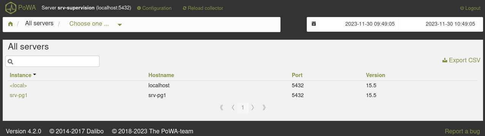
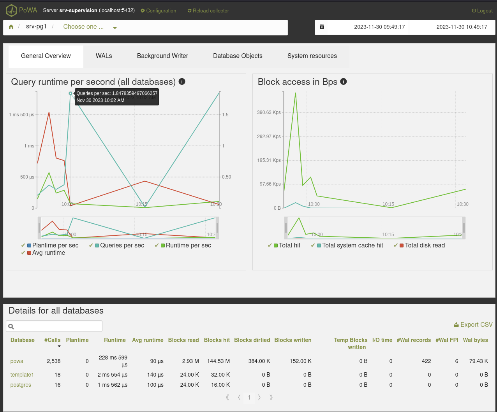

# Introduction

## Présentation de PoWA

_PoWA (PostgreSQL Workload Analyzer)_  est un outil de performance pour PostgreSQL, qui permet de collecter, 
d'agréger et de purger les statistiques de plusieurs instances PostgreSQL à partir de diverses extensions de 
statistiques.

Il est possible d'utiliser _PoWA_ soit localement avec un processus fonctionnant en arrière plan (principalement 
pour la gestion d'une seule instance), soit de façon centralisée pour superviser un ensemble d'instances. Dans cette 
seconde configuration, _PoWA_ va utiliser un processus nommé _PoWA-collector_ qui va collecter les métriques des 
différentes instances.

_PoWA_ dispose également d'une interface utilisateur qui permet de tirer le meilleur parti de ces informations.

Vous pouvez obtenir davantage d'informations sur la documentation officielle : <https://powa.readthedocs.io/en/latest/index.html>.

## Présentation des extensions

Voici la liste des extensions utilisées ou utilisables par _PoWA_ :

* `powa` : cette extension est le composant principal et contient tout un ensemble de 
  fonctions nécessaires au fonctionnement de _PoWA_. Son installation est obligatoire.
* `pg_stat_statements` : cette extension enregistre les statistiques de toutes les 
  requêtes _SQL_ exécutées sur un serveur PostgreSQL. Elle est un composant clé 
  de _PoWA_, son installation est obligatoire.
* `pg_qualstats` : c'est une extension qui tient des statistiques sur les prédicats 
  trouvés dans les déclarations `WHERE` et les clauses `JOIN`.
* `pg_stat_kcache` : cette extension collecte des statistiques sur les métriques système.
  Il est ainsi possible d'avoir la consommation en ressources (_CPU_ et accès disques) de 
  chaque requête, utilisateur et/ou base de données.
* `pg_wait_sampling` : Elle échantillonne les `wait_events` de toutes les requêtes _SQL_ 
  exécutées sur un serveur PostgreSQL, fournissant un profil d'attente et une vue des 
  événements d'attente.
* `pg_track_setting` : Son but est de garder une trace des changements de configuration 
  qui se produisent sur vos instances.
* `HypoPG` : Avec cette extension, vous pouvez créer des index hypothétiques, et ensuite 
  avec `EXPLAIN` vérifier si PostgreSQL les utiliserait ou non. Si elle est installée avec 
  `pg_qualstats`, _PoWA_ devient capable de détecter des index manquants et de faire de la 
  suggestion d'index.
* `btree_gist` : Elle fournit des classes d'opérateur _GiST_ qui codent un comportement 
  équivalent à celui du B-tree. Cette extension est obligatoire pour le fonctionnement de _PoWA_.

Par défaut pglift va configurer les extensions `powa`, `pg_stat_statements`, `btree_gist`, 
`pg_qualstats` et `pg_stat_kcache`. Les autres extensions doivent être gérées manuellement.

# Installation

## Pré-requis

* Installer PostgreSQL et _pglift_ sur les machines `srv-pg1`, `srv-pg2` et `srv-supervision`
(consulter le _workshop Compréhension et utilisation de pglift_)

## Installation de PoWA

Installer les paquets suivants sur `srv-pg1` et `srv-pg2` :

```shell
[root@srv-pg1 ~]# dnf install -y powa_15 pg_qualstats_15 pg_stat_kcache_15
```

## Installation du serveur PoWA

Installer les paquets suivants sur `srv-supervision` :

```shell
[root@srv-supervision ~]# dnf install -y powa_15 powa-web powa-collector
```

## Configuration de pglift

:::warning
Avec _pglift_, _PoWA_ est destiné à être utilisé en mode centralisé.
:::

Pour que _pglift_ puisse utiliser _PoWA_, il est nécessaire de rajouter la clé `powa` dans le fichier de configuration `settings.yaml` :

```yaml
powa: {}
```

Deux champs peuvent être ajoutés à cette clé :

* `dbnmame` qui définit le nom de la base de données où seront installées les extensions utilisées par _PoWA_. Les métriques 
  collectées y sont également stockées. Dans le cas d'une utilisation centralisée, seule la base de données du serveur _PoWA_ 
  contiendra des données.
* `role` qui correspond à l'utilisateur qui est utilisé pour se connecter aux instances. Sa valeur par défaut est `powa`.

```yaml
powa:
  role: powa
  dbname: powa
```

Exécuter ensuite la commande suivante :

```shell
[postgres@srv-pg1 ~]$ pglift site-configure install
INFO     installed pglift-postgres_exporter@.service systemd unit at                                                           
         /home/postgres/.local/share/systemd/user/pglift-postgres_exporter@.service                                            
INFO     installed pglift-backup@.service systemd unit at 
         /home/postgres/.local/share/systemd/user/pglift-backup@.service      
INFO     installed pglift-backup@.timer systemd unit at 
         /home/postgres/.local/share/systemd/user/pglift-backup@.timer          
INFO     installed pglift-postgresql@.service systemd unit at                                                                  
         /home/postgres/.local/share/systemd/user/pglift-postgresql@.service                                                   
INFO     installing base pgbackrest configuration                                                                              
INFO     creating pgbackrest include directory                                                                                 
INFO     creating pgbackrest repository path                                                                                   
INFO     creating common pgbackrest directories                                                                                
INFO     creating postgresql log directory
```

# Déploiement d'une instance avec les extensions PoWA

## Création d'instance

La configuration de _PoWA_ est réalisée automatiquement par _pglift_ lors de la création d'une instance. 
Exécuter la commande suivante sur `srv-pg1`, `srv-pg1` et `srv-supervision` :

```shell
[postgres@srv-pg1 ~]$ pglift instance create main --pgbackrest-stanza=main
INFO     initializing PostgreSQL                                                                                               
INFO     configuring PostgreSQL authentication                                                                                 
INFO     configuring PostgreSQL                                                                                                
INFO     starting PostgreSQL 15-main                                                                                           
INFO     creating role 'powa'                                                                                                  
INFO     creating role 'prometheus'                                                                                            
INFO     creating role 'backup'                                                                                                
INFO     altering role 'backup'                                                                                                
INFO     creating 'powa' database in 15/main                                                                                   
INFO     creating extension 'btree_gist' in database powa                                                                      
INFO     creating extension 'pg_qualstats' in database powa                                                                    
INFO     creating extension 'pg_stat_statements' in database powa                                                              
INFO     creating extension 'pg_stat_kcache' in database powa                                                                  
INFO     creating extension 'powa' in database powa                                                                            
INFO     configuring Prometheus postgresql 15-main                                                                             
INFO     configuring pgBackRest stanza 'main' for pg1-path=/pgdata/15/main/data                                                
INFO     creating pgBackRest stanza main                                                                                       
INFO     starting Prometheus postgres_exporter 15-main                  
```

On peut voir dans la log ci-dessus que _pglift_ crée un rôle et une base de données nommés `powa` sur 
l'instance `15-main`. On remarque également qu'il va automatiquement créer les extensions nécessaires 
au fonctionnement de _PoWA_ dans la base de données qu'il vient de créer.

:::warning
Le rôle `powa` est créé par défaut **sans** mot de passe. Il est donc nécessaire d'en définir un et de 
modifier le fichier `pg_hba.conf` pour permettre la connexion du collecteur.
:::

Il va également modifier le paramètre PostgreSQL `shared_preload_libraries` pour permettre le 
chargement de certaines de ces extensions :

```shell
[postgres@srv-pg1 ~]$ pglift pgconf -i main show shared_preload_libraries
shared_preload_libraries = 'pg_qualstats, pg_stat_statements, pg_stat_kcache'
```

## Enregistrement de l'instance dans PoWA

Pour ajouter une instance dans l'interface utilisateur de _PoWA_, exécuter la commande suivante sur 
`srv-supervision` :

```shell
[postgres@srv-supervision ~]$ pglift instance exec 15/main -- psql -d powa <<EOF
SELECT powa_register_server(hostname => 'srv-pg1',
     alias => 'srv-pg1',
     password => 'XXXXXXXX',
     username => 'powa',
     dbname => 'powa',
     extensions => '{pg_stat_kcache,pg_qualstats}');
EOF
 powa_register_server 
----------------------
 t
(1 row)
```

:::tip
Par défaut la fonction `powa_register_server` tente de se connecter sur une base de données `powa` avec 
un utilisateur du même nom. Ces paramètres peuvent donc être omis si vous utilisez la configuration par défaut 
de _pglift_. Il est également préférable de passer par un fichier `.pgpass` plutôt que de définir le 
mot de passe directement dans la fonction.
:::

Le paramètre `extensions` regroupe les extensions installées sur les instances à superviser. Il permet de donner 
au collecteur des informations sur où aller récupérer des informations. Les extensions `powa`, `btree_gist`, et 
`pg_stat_statements` n'ont pas besoin d'y figurer.

:::warning
Même si la fonction `powa_register_server` retourne `true`, cela ne garantie pas l'accès à l'instance, ni la 
collecte des données. Il faut obligatoirement effectuer cette vérification depuis l'interface utilisateur.
:::

## Configuration du collecteur

Créer le fichier de configuration du collecteur :

```shell
[root@srv-supervision ~]# touch /etc/powa-collector.conf
```

Insérer la configuration ci-dessous dans le fichier `powa-collector.conf` :

```json
{
    "repository": {
        "dsn": "postgresql://powa@localhost:5432/powa"
    },
    "debug": false
}
```

Ajouter un mot de passe à l'utilisateur `powa` et insérer une entrée pour cet utilisateur dans le 
fichier `.pgpass` :

```shell
[postgres@srv-supervision ~]$ pglift role -i main alter powa --password XXXXX --pgpass
INFO     altering role 'powa'                                                                                                  
INFO     adding an entry for 'powa' in /home/postgres/.pgpass (port=5432)        
```

Ajouter les deux lignes suivantes dans le service `/usr/lib/systemd/system/powa-collector.service` 
afin que celui-ci appartienne à l'utilisateur `postgres` :

```ini
[...]
[Service]
Type=idle
User=postgres
Group=postgres
[...]
```

Recharger la configuration de _systemd_ et démarrer le service `powa-collector.service` :

```shell
[root@srv-supervision ~]# systemctl daemon-reload && \ 
      systemctl enable --now powa-collector.service
```

Vérifier le status du service :

\scriptsize

```
[root@srv-supervision ~]# systemctl status powa-collector.service
powa-collector.service - POWA Collector Daemon
   Loaded: loaded (/usr/lib/systemd/system/powa-collector.service; enabled; vendor preset: disabled)
   Active: active (running) since Wed 2023-11-29 10:50:33 UTC; 4s ago
     Docs: https://powa.readthedocs.io/en/latest/powa-collector/
 Main PID: 31517 (python3)
    Tasks: 2 (limit: 11364)
   Memory: 8.5M
   CGroup: /system.slice/powa-collector.service
           31517 /usr/bin/python3 /usr/bin/powa-collector.py

Nov 29 10:50:33 srv-supervision systemd[1]: Started POWA Collector Daemon.
Nov 29 10:50:33 srv-supervision python3[31517]: 2023-11-29 10:50:33,159 - INFO  : Starting powa-collector...
Nov 29 10:50:33 srv-supervision python3[31517]: 2023-11-29 10:50:33,184 srv-pg1:5432 INFO  : Starting worker
Nov 29 10:50:33 srv-supervision python3[31517]: 2023-11-29 10:50:33,184 - INFO  : List of workers:
Nov 29 10:50:33 srv-supervision python3[31517]: 2023-11-29 10:50:33,184 - INFO  : srv-pg1:5432: {'host': 'srv-pg1', 'port': 54
```

\normalsize

# Interface Utilisateur

## Configuration de PoWA-web

Créer le fichier de configuration de l'interface utilisateur :

```shell
[root@srv-supervision ~]# touch /etc/powa-web.conf
```

Ajouter la configuration suivante dans le fichier `powa-web.conf` :

```python
servers={
  'srv-supervision': {
    'host': 'localhost',
    'port': '5432',
    'database': 'powa'
  }
}
cookie_secret="XXXXXXXXXXXXXXXXXXXXXXXX"
```

La variable `cookie_secret` est la clé secrète utilisée pour sécuriser les _cookies_ 
qui transitent entre le navigateur et le serveur _PoWA_. Elle doit ếtre générée 
aléatoirement lors de l'installation. Pour cela vous pouvez utiliser des outils comme 
`pwmake`, `pwgen` ou tout autre générateur aléatoire.

Démarrer le service `powa-web.service` :

```shell
[root@srv-supervision ~]# systemctl enable --now powa-web.service
```

Vérifier le status du service :

\scriptsize

```
[root@srv-supervision ~]# systemctl status powa-web.service
powa-web.service - PoWA Web Interface Daemon
   Loaded: loaded (/usr/lib/systemd/system/powa-web.service; enabled; vendor preset: disabled)
   Active: active (running) since Wed 2023-11-29 11:16:06 UTC; 4s ago
 Main PID: 32114 (powa-web)
    Tasks: 1 (limit: 11364)
   Memory: 27.1M
   CGroup: /system.slice/powa-web.service
           32114 /usr/bin/python3 /usr/bin/powa-web > /var/log/powa-web.log 2>&1

Nov 29 11:16:06 srv-supervision systemd[1]: Started PoWA Web Interface Daemon.
Nov 29 11:16:06 srv-supervision powa-web[32114]: [I 231129 11:16:06 powa-web:13] Starting powa-web on http://0.0.0.0:8888/
```

\normalsize

Par défaut `powa-web` écoute sur toutes les interfaces réseau et sur le port `8888`.

## Visualisation dans PoWA-web

Avec le navigateur de votre choix, consulter l'adresse `http://srv-pg1:8888` :


* `Username` : `powa`
* `Password` : mot de passe de l'utilisateur `powa` sur l'instance du serveur _PoWA_
* `Server` : l'alias utilisé dans la configuration de _PoWA-web_ (`srv-supervision`)

Une fois identifié, la liste des serveurs disponible apparaît :



:::tip
l'instance `<local>` correspond à l'instance PostgreSQL du serveur _PoWA_. Auncune donnée 
n'y est actuellement collectée. Mais il est possible de le faire en modifiant la configuratilon 
du collecteur.
:::

Cliquer sur `srv-pg1` pour obtenir les différentes statistiques collectées sur ce serveur :



# Nettoyage

Afin de poursuivre sur les _workshops_ suivants sans conflit de port ou de configuration, 
il est nécessaire de supprimer toute instance existante et désinstaller la configuration de site de _pglift_.

Supprimer l'instance `main` sur `srv-pg1`, `srv-pg2` et `srv-supervision` :

```shell
[postgres@srv-pg1 ~]$ pglift instance drop
INFO     dropping instance 15/main                                                                                             
> Confirm complete deletion of instance 15/main? [y/n] (y): y
INFO     stopping PostgreSQL 15-main                                                                                           
INFO     stopping Prometheus postgres_exporter 15-main                                                                         
INFO     deconfiguring Prometheus postgres_exporter 15-main                                                                    
INFO     deconfiguring pgBackRest                                                                                              
INFO     deleting PostgreSQL cluster
```

Désinstaller la configuration de site de _pglift_ :

\scriptsize

```
[postgres@srv-pg1 ~]$ pglift site-configure uninstall
INFO     removing pglift-postgres_exporter@.service systemd unit                                                               
         (/home/postgres/.local/share/systemd/user/pglift-postgres_exporter@.service)                                          
INFO     removing pglift-backup@.service systemd unit (/home/postgres/.local/share/systemd/user/pglift-backup@.service)        
INFO     removing pglift-backup@.timer systemd unit (/home/postgres/.local/share/systemd/user/pglift-backup@.timer)            
INFO     removing pglift-postgresql@.service systemd unit (/home/postgres/.local/share/systemd/user/pglift-postgresql@.service)
INFO     deleting pgbackrest include directory                                                                                 
INFO     uninstalling base pgbackrest configuration                                                                            
> Delete pgbackrest repository path /pgdata/backup/pgbackrest? [y/n] (n): y
INFO     deleting pgbackrest repository path                                                                                   
INFO     deleting common pgbackrest directories                                                                                
INFO     deleting postgresql log directory
```

\normalsize
