# Introduction

Dans ce module, nous allons aborder la supervision des instances PostgreSQL avec _Prometheus_ et 
l'exporteur `postgres_exporter`. Les métriques collectées seront ensuite historisées avec _Grafana_.

# postgres_exporter

## Présentation

`postgres_exporter` est un module pour _Prometheus_ spécifique à PostgreSQL. Il est chargé de 
collecter un grand nombre de métriques afin d'assurer la supervision de vos instances.

## Pré-requis

* Installer PostgreSQL, _pglift_ et `postgres_exporter` sur les machines `srv-pg1`, `srv-pg2` et `srv-supervision`
  (consulter le _workshop Compréhension et utilisation de pglift_)
* Installer un serveur _Prometheus_ (voir annexe _Prometheus_)
* Installer un serveur _Grafana_ (voir annexe _Grafana_)

## Configuration de pglift

Pour que _pglift_ puisse utiliser `postgres_exporter`, il est nécessaire de rajouter la clé `prometheus` dans le fichier de configuration 
`settings.yaml`. A cette clé, il faut obligatoirement associer le champ `execpath` qui fait référence à l'emplacement du binaire de 
`postgres_exporter` :

```yaml
prometheus:
  execpath: /usr/bin/postgres_exporter
```

D'autres champs sont également disponibles et optionnels :

* `configpath` pour modifier l'emplacement du fichier de configuration de l'exporteur
* `pid_file` pour spécifier l'emplacement du fichier _PID_
* `role` pour préciser le rôle qui sera utiliser par l'exporteur pour se connecter aux instances PostgreSQL

Exécuter ensuite la commande suivante :

```shell
[postgres@srv-pg1 ~]$ pglift site-configure install
INFO     installed pglift-postgres_exporter@.service systemd unit at                                                           
         /home/postgres/.local/share/systemd/user/pglift-postgres_exporter@.service                                            
INFO     installed pglift-backup@.service systemd unit at 
         /home/postgres/.local/share/systemd/user/pglift-backup@.service      
INFO     installed pglift-backup@.timer systemd unit at 
         /home/postgres/.local/share/systemd/user/pglift-backup@.timer          
INFO     installed pglift-postgresql@.service systemd unit at                                                                  
         /home/postgres/.local/share/systemd/user/pglift-postgresql@.service                                                   
INFO     installing base pgbackrest configuration                                                                              
INFO     creating pgbackrest include directory                                                                                 
INFO     creating pgbackrest repository path                                                                                   
INFO     creating common pgbackrest directories                                                                                
INFO     creating postgresql log directory
```

# Superviser une instance

## Déploiement d'une instance supervisée
 
Le déploiement d'une instance supervisée par `postgres_exporter` est réalisé automatiquement par _pglift_ 
à la création de celle-ci :

```shell
[postgres@srv-pg1 ~]$ pglift instance create --pgbackrest-stanza=main main
INFO     initializing PostgreSQL                                                                                               
INFO     configuring PostgreSQL authentication                                                                                 
INFO     configuring PostgreSQL                                                                                                
INFO     starting PostgreSQL 15-main                                                                                           
INFO     creating role 'prometheus'                                                                                            
INFO     creating role 'backup'                                                                                                
INFO     altering role 'backup'                                                                                                
INFO     configuring Prometheus postgresql 15-main                                                                             
INFO     configuring pgBackRest stanza 'main' for pg1-path=/pgdata/15/main/data                                                
INFO     creating pgBackRest stanza main                                                                                       
INFO     starting Prometheus postgres_exporter 15-main
```

On peut voir dans la log ci-dessus que _pglift_ crée un rôle `prometheus` sur l'instance PostregSQL à superviser,
puis qu'il configure `postgres_exporter` et enfin, il le démarre.

:::tip
Par défaut le rôle `prometheus` est créé sans mot de passe. Il peut donc potentiellement y avoir une erreur 
à cette étape suivant le contenu du fichier `pg_hba.conf` qui est définit dans la configuration de _pglift_.
:::

La configuration de `postgres_exporter` se trouve par défaut dans  
`home/postgres/.local/share/pglift/etc/prometheus/postgres_exporter-15-main.conf`.
Cet emplacement peut être modifié dans la configuration de _pglift_ (champ `configpath` vu précédemment). 
Voici le contenu par défaut de ce fichier :

\scriptsize

```
DATA_SOURCE_NAME=postgresql://prometheus@:5432/postgres?host=%2Ftmp%2Fpglift%2Fpostgresql&sslmode=disable
PG_EXPORTER_WEB_LISTEN_ADDRESS=:9187
POSTGRES_EXPORTER_OPTS='--log.level=info'
```

\normalsize

La variable `DATA_SOURCE_NAME` correspond à la chaîne de connexion pour accéder à l'instance à superviser. On y retrouve le rôle 
`prometheus`, le port d'écoute de l'instance (`5432`) et la base de données sur laquelle se connecter (`postgres`). La partie 
`host=%2Ftmp%2Fpglift%2Fpostgresql` correspond au chemin de la socket Unix (`/tmp/pglift/postgresql`).

`PG_EXPORTER_WEB_LISTEN_ADDRESS` définit le port d'écoute de l'exporteur. C'est ce port qu'il faudra renseigner dans _Prometheus_ 
pour accéder à l'exporteur.

_pglift_ peut également gérer de façon indépendante l'arrêt et le démarrage de `postgres_exporter`.

Pour l'arrêter :

```shell
[postgres@srv-pg1 ~]$ pglift postgres_exporter stop 15-main
INFO     stopping Prometheus postgres_exporter 15-main
```

Pour le démarrer :

```shell
[postgres@srv-pg1 ~]$ pglift postgres_exporter start 15-main
INFO     starting Prometheus postgres_exporter 15-main
```

:::tip
Dans le cas d'une connexion à une instance locale, le nom du service `postgres_exporter` correspond à `<version>-<nom>`.
:::

Vérifier avec la commande suivante si les métriques sont bien exportées :

```shell
[postgres@srv-pg1 ~]$ curl http://localhost:9187/metrics | grep -v ^#
```

## Superviser une instance distante

_pglift_ permet également de déployer `postgres_exporter` seul et de le connecter à un hôte distant en 
utilisant la commande `pglift postgres_exporter install`. Dans ce type d'installation, la configuration 
de _pglift_ pour `postgres_exporter` doit être mise en place sur le serveur qui lance la commande 
`pglift postgres_exporter install`.

Sur `srv-supervision`, exécuter la commande suivante :

```shell
[postgres@srv-supervision ~]$ pglift postgres_exporter install srv-supervision \ 
         "host=srv-pg1 user=prometheus" 9187 --state=started --password
Connection password: 
Repeat for confirmation: 
INFO     configuring Prometheus postgresql srv-supervision
INFO     starting Prometheus postgres_exporter srv-supervision
```

Il faut au minimum spécifier le nom (`srv-supervision`), le _DSN_ (`"host=srv-pg1 user=prometheus"`) et 
le numéro de port (`9187`). Les paramètres `--state` et `--password` permettent respectivement de préciser l'état 
du service à la fin de l'installation et de demander de saisir le mot de passe lors de la connexion.

Comme avec le mode local, il est possible d'arrêter et de démarrer le service `postgres_exporter` avec les commandes 
`pglift postgres_exporter stop` et `pglift postgres_exporter start`.

## Désinstaller postgres_exporter

Pour ne plus superviser une instance avec `postgres_exporter`, il suffit de lancer la commande suivante :

```shell
[postgres@srv-pg1 ~]$ pglift postgres_exporter uninstall 15-main
INFO     dropping postgres_exporter service '15-main'
INFO     stopping Prometheus postgres_exporter 15-main
```

# Visualisation dans Prometheus

Modifier la section `scrape_configs` du fichier de configuration de _Prometheus_ (`/etc/prometheus/prometheus.yml`) 
en y ajoutant les élements suivants :

```yaml
- job_name: "postgres_exporter"
    static_configs:
      - targets: ["srv-pg1:9187"]
```

:::tip
Il est possible d'ajouter plusieurs cibles pour un même _job_. Dans ce cas la syntaxe sera :

```yaml
- job_name: "postgres_exporter"
    static_configs:
      - targets:
        - <serveur1>:<port>
        - <serveur2>:<port>
        - <serveur3>:<port>
```
:::

Redémarrer le service `prometheus.service` :

```shell
[root@srv-supervision ~]# systemctl restart prometheus.service
```

Depuis l'interface de _Prometheus_, cliquer sur `Status` puis `Targets`. Vous devez y trouver l'exporteur. 
La colonne `State` doit être `UP` et verte :

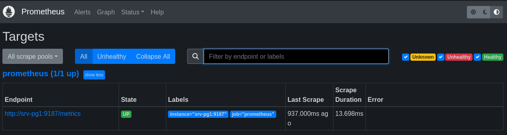

Il est ensuite possible de recherher depuis l'accueil de _Prometheus_ des informations sur les différentes métriques 
relevées par l'exporteur :

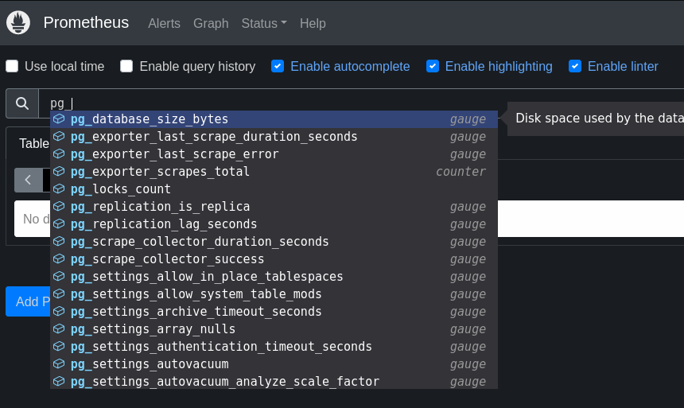{ width=75% height=75% }

# Visualisation dans Grafana  

Pour visualiser les métriques stockées dans _Prometheus_, il faut en premier lieu se référer au 
chapitre _Configuration d'une source de données_ de l'annexe sur l'installation de _Grafana_.

Pour ce _workshop_, nous allons utiliser un _template_ spécifique à `postgres_exporter` et _Prometheus_ disponible 
sur : <https://grafana.com/grafana/dashboards/9628-postgresql-database/>.

Dans le menu, cliquer sur _Dashboards_ puis sur _Create Dashboard_ :

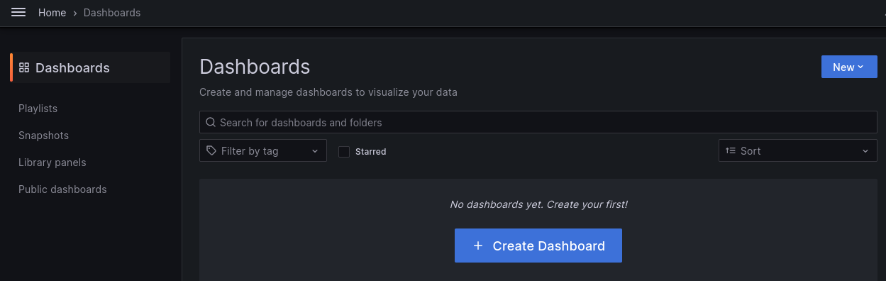

Cliquer sur _Import a dashboard_ :

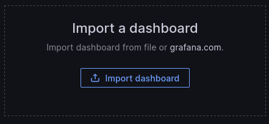{ width=50% height=50% }

Renseigner le numéro 9628 qui correspond au _template_ souhaité sur le dépôt de _Grafana_ et cliquer sur _Load_ :

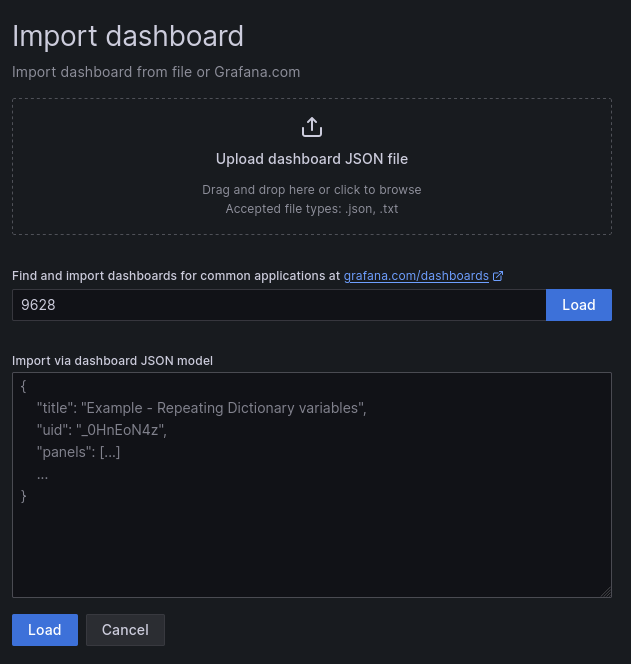{ width=50% height=50% }

Selectionner la source de données _Prometheus_ et cliquer sur _import_ :

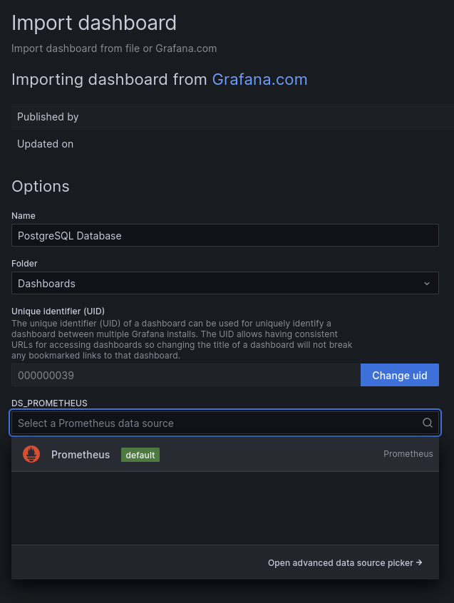{ width=50% height=50% }

Suite à l'import, vous êtes redirigé sur le _dashboard_ de votre instance PostgreSQL :

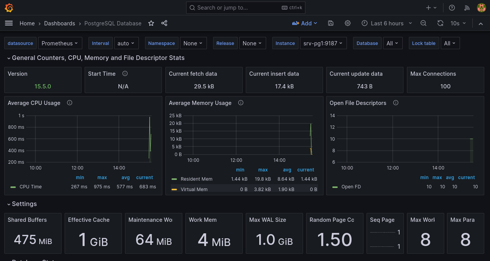

# Nettoyage

Afin de poursuivre sur les _workshops_ suivants sans conflit de port ou de configuration,
il est nécessaire de supprimer toute instance existante et désinstaller la configuration de site de _pglift_.

Supprimer l'instance `main` sur `srv-pg1`, `srv-pg2` et `srv-supervision` :

```shell
[postgres@srv-pg1 ~]$ pglift instance drop
INFO     dropping instance 15/main
> Confirm complete deletion of instance 15/main? [y/n] (y): y
INFO     stopping PostgreSQL 15-main
INFO     stopping Prometheus postgres_exporter 15-main
INFO     deconfiguring Prometheus postgres_exporter 15-main
INFO     deconfiguring pgBackRest
INFO     deleting PostgreSQL cluster
```

Désinstaller la configuration de site de _pglift_ :

\scriptsize

```
[postgres@srv-pg1 ~]$ pglift site-configure uninstall
INFO     removing pglift-postgres_exporter@.service systemd unit
         (/home/postgres/.local/share/systemd/user/pglift-postgres_exporter@.service)
INFO     removing pglift-backup@.service systemd unit (/home/postgres/.local/share/systemd/user/pglift-backup@.service)
INFO     removing pglift-backup@.timer systemd unit (/home/postgres/.local/share/systemd/user/pglift-backup@.timer)
INFO     removing pglift-postgresql@.service systemd unit (/home/postgres/.local/share/systemd/user/pglift-postgresql@.service)
INFO     deleting pgbackrest include directory
INFO     uninstalling base pgbackrest configuration
> Delete pgbackrest repository path /pgdata/backup/pgbackrest? [y/n] (n): y
INFO     deleting pgbackrest repository path
INFO     deleting common pgbackrest directories
INFO     deleting postgresql log directory
```

# Annexe : Prometheus

L'ensemble des opérations sont à réaliser sur `srv-supervision`.

## Installation

Créer l'utilisateur système `prometheus` :

```shell
[root@srv-supervision ~]# useradd -s /sbin/nologin --system prometheus
```

Créer les répertoires nécessaires à _Prometheus_ :

```shell
[root@srv-supervision ~]# mkdir /var/lib/prometheus /etc/prometheus /usr/share/prometheus
```

Télécharger le binaire :

```shell
[root@srv-supervision ~]# wget https://github.com/prometheus/prometheus/releases/\
download/v2.45.1/prometheus-2.45.1.linux-amd64.tar.gz
```

Extraire l'archive et déplacer son contenu aux endroits souhaités :

```shell
[root@srv-supervision ~]# tar xf prometheus-2.45.1.linux-amd64.tar.gz
[root@srv-supervision ~]# cd prometheus-2.45.1.linux-amd64
[root@srv-supervision ~]# cp prometheus.yml /etc/prometheus
[root@srv-supervision ~]# cp -r console* /usr/share/prometheus
[root@srv-supervision ~]# cp prometheus promtool /usr/bin
```

Modifier le propriétaire des répertoires de _Prometheus_ :

```shell
[root@srv-supervision ~]# chown -R prometheus: /var/lib/prometheus /etc/prometheus \ 
               /usr/share/prometheus
```

Tester le fonctionnement de l'installation :

```shell
[root@srv-supervision ~]# prometheus --version
prometheus, version 2.45.1 (branch: HEAD, revision: c62de5d1075d9c24a281b4b719f124f14e730fa5)
  build user:       root@827ead67e852
  build date:       20230929-21:10:51
  go version:       go1.20.8
  platform:         linux/amd64
  tags:             netgo,builtinassets,stringlabels
```

## Configuration

Le fichier `/etc/prometheus/prometheus.yml` est le _template_ de configuration par défaut fournit avec le binaire 
téléchargé précédemment :

\scriptsize

```
# my global config
global:
  scrape_interval: 15s # Set the scrape interval to every 15 seconds. Default is every 1 minute.
  evaluation_interval: 15s # Evaluate rules every 15 seconds. The default is every 1 minute.
  # scrape_timeout is set to the global default (10s).

# Alertmanager configuration
alerting:
  alertmanagers:
    - static_configs:
        - targets:
          # - alertmanager:9093

# Load rules once and periodically evaluate them according to the global 'evaluation_interval'.
rule_files:
  # - "first_rules.yml"
  # - "second_rules.yml"

# A scrape configuration containing exactly one endpoint to scrape:
# Here it's Prometheus itself.
scrape_configs:
  # The job name is added as a label `job=<job_name>` to any timeseries scraped from this config.
  - job_name: "prometheus"

    # metrics_path defaults to '/metrics'
    # scheme defaults to 'http'.

    static_configs:
      - targets: ["localhost:9090"]
```

\normalsize

Par defaut cette configuration va écouter sur le port `9090` de toutes les interfaces du serveur.

Démarrer _Prometheus_ :

```shell
[root@srv-supervision ~]# prometheus --config.file=/etc/prometheus/prometheus.yml
```

Vous devez obtenir le message `Server is ready to receive web requests`.

Davantage d'informations sur les paramètres de configuration sont disponibles sur la [documentation officielle](https://prometheus.io/docs/prometheus/latest/configuration/configuration/)

## Création d'un service pour _Prometheus_

Afin de faciliter la gestion de _Prometheus_, il est conseillé de créer un service _systemd_.

Créer un fichier nommé `prometheus.service` dans `/etc/systemd/system` et ajouter le contenu suivant :

```ini
[Unit]
Description=Prometheus
Documentation=https://prometheus.io/docs/introduction/overview/
Wants=network-online.target
After=network-online.target

[Service]
Type=simple
User=prometheus
Group=prometheus
ExecReload=/bin/kill -HUP $MAINPID
ExecStart=/usr/bin/prometheus \
  --config.file=/etc/prometheus/prometheus.yml \
  --storage.tsdb.path=/var/lib/prometheus \
  --web.console.templates=/usr/share/prometheus/consoles \
  --web.console.libraries=/usr/share/prometheus/console_libraries \
  --web.listen-address=0.0.0.0:9090

SyslogIdentifier=prometheus
Restart=always

[Install]
WantedBy=multi-user.target
```

Recharger la configration de _systemd_ et activer et démarrer le service :

```shell
[root@srv-supervision ~]# systemctl daemon-reload
[root@srv-supervision ~]# systemctl enable --now prometheus.service
```

Vérifier le status du service :

```shell
[root@srv-supervision ~]# systemctl status prometheus
 prometheus.service - Prometheus
     Loaded: loaded (/etc/systemd/system/prometheus.service; enabled; vendor preset: disabled)
     Active: active (running) since Wed 2023-11-15 09:34:20 UTC; 2min 38s ago
       Docs: https://prometheus.io/docs/introduction/overview/
   Main PID: 23728 (prometheus)
      Tasks: 6 (limit: 2646)
     Memory: 18.6M
        CPU: 139ms
     CGroup: /system.slice/prometheus.service
```

Pour obtenir la log de _Prometheus_ vous pouvez utiliser la commande `journalctl -xfu prometheus.service` 
ou aller consulter la sortie `syslog` qui est par défaut présente dans `/var/log/messages`.

:::tip
En cas d'utilisation d'un pare-feu et/ou de _SELinux_, il peut être nécessaire d'ajouter certaines règles
pour permettre le fonctionnement et l'accès à _Prometheus_.
:::

Après avoir démarré le service, vous devez avoir accès depuis un navigateur à _Prometheus_ (par défaut `http://srv-supervision:9090`) :

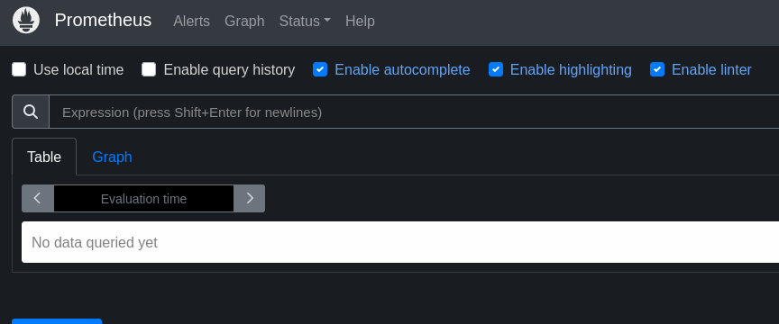

# Annexe : Grafana

L'ensemble des opérations sont à réaliser sur `srv-supervision`.

## Installation

Télécharger la clé _GPG_ du dépôt de _Grafana_ :

```shell
[root@srv-supervision ~]# wget -q -O gpg.key https://rpm.grafana.com/gpg.key
[root@srv-supervision ~]# rpm --import gpg.key
```

Créer le fichier `/etc/yum.repos.d/grafana.repo` avec le contenu suivant :

```ini
[grafana]
name=grafana
baseurl=https://rpm.grafana.com
repo_gpgcheck=1
enabled=1
gpgcheck=1
gpgkey=https://rpm.grafana.com/gpg.key
sslverify=1
sslcacert=/etc/pki/tls/certs/ca-bundle.crt
exclude=*beta*
```

Installer le paquet `grafana` :

```shell
[root@srv-supervision ~]# dnf install -y grafana
```

Tester le fonctionnement de l'installation :

```shell
[root@srv-supervision ~]# grafana-server --version
Version 10.2.1 (commit: 533a733e4eda44041e43358c5a51203e9b42c9ea, branch: HEAD)
```

Démarrer le serveur _Grafana_ :

```shell
[root@srv-supervision ~]# systemctl enable --now grafana-server.service
```

Par défaut, le serveur _Grafana_ écoute sur toutes les interfaces réseau et sur le port 3000.

Accéder à l'interface de _Grafana_ depuis un navigateur :

{ width=50% height=50% }

Les identifiants de connexions sont : 

```
username : admin
password : admin
```

Il vous sera demandé de définir un nouveau mot de passe lors de la première connexion. Cette étape 
est optionnelle dans les dernières versions de _Grafana_.

Après l'authentification, vous êtes redirigés vers le _dashboard_ par défaut :

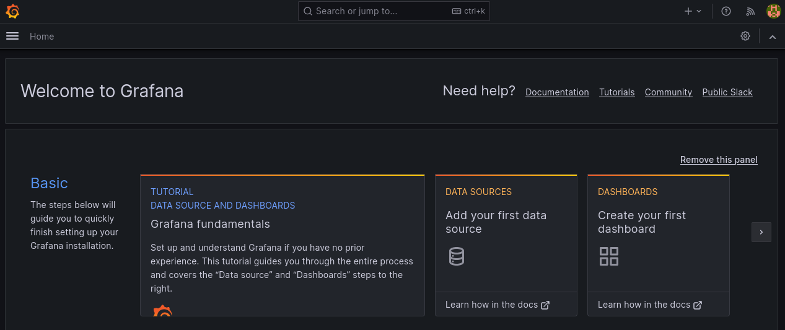

:::tip
En cas d'utilisation d'un pare-feu et/ou de _SELinux_, il peut être nécessaire d'ajouter certaines règles
pour permettre le fonctionnement et l'accès à _Grafana_.
:::

## Configuration

Le fichier de configuration de _Grafana_ se trouve dans `/etc/grafana/grafana.ini`. Nous ne rentrerons
pas plus dans le détail de la configuration dans ce _workshop_. Vous pouvez pour cela consulter la documentation 
officielle disponible ici : <https://grafana.com/docs/grafana/latest/setup-grafana/configure-grafana/>

Deux autres répertoires sont importants pour le fonctionnement de _Grafana_ :

- `/var/lib/grafana` qui contient notamment la base de données ;
- `/var/log/grafana` qui contient les logs.

## Configuration d'une source de données

Pour ajouter une source de données, il faut se connecter à l'interface de _Grafana_, puis sélectionner 
dans le menu _Connections_ puis _Data sources_.

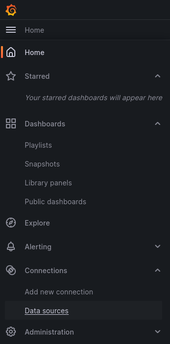{ width=50% height=50% }

Cliquer sur _Add data source_ :

{ width=50% height=50% }

Sélectionner _Prometheus_ : 

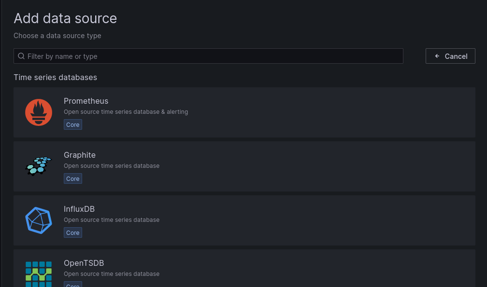{ width=75% height=75% }

Renseigner l'_URL_ de connection à _Prometheus_ (par défaut `http://srv-supervision:9090`) :

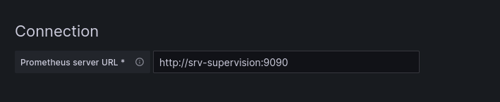{ width=75% height=75% }

Cliquer sur _Save & test_. Un message confirmant que la connexion à l'_API_ de _Prometheus_ 
a foncitonné doit apparaître :


Vous pouvez dès maintenant utiliser cette source dans vos _dashboards_.
