# Introduction

Les instances déployées par _pglift_ peuvent être supervisées avec _temBoard_. C'est
le sujet abordé dans ce module.

# Présentation de temBoard

_temBoard_ est un outil d’administration et de supervision de parc d’instances
PostgreSQL. Il est constitué d'un composant serveur et d'un agent conçu pour
fonctionner sur les serveurs PostgreSQL.

Dans cet atelier, un serveur _temBoard_ fonctionnera sur le serveur `srv-helper`.
Une instance supervisée et un agent _temBoard_ associé seront déployés sur
`srv-pg1` à l'aide de _pglift_.

# Installation

## Pré-requis

## Nettoyage

La section `Nettoyage` du précédent workshop doit avoir été exécutée pour
laisser place aux nouvelles instances de ce workshop.

## Instance temBoard

Créer une instance locale sur `srv-helper`. Elle servira pour pour les données
de _temBoard_.

```shell
[postgres@srv-helper ~]$ pglift instance create temboard --pgbackrest-stanza=temboard
INFO     initializing PostgreSQL
INFO     configuring PostgreSQL authentication
INFO     configuring PostgreSQL
INFO     starting PostgreSQL 15-temboard
INFO     creating role 'prometheus'
INFO     creating role 'backup'
INFO     altering role 'backup'
INFO     configuring Prometheus postgresql 15-temboard
INFO     configuring pgBackRest stanza 'temboard' for pg1-path=/pgdata/15/temboard/data
INFO     creating pgBackRest stanza temboard
INFO     starting Prometheus postgres_exporter 15-temboard
```

## Installation du serveur temBoard

Sur le serveur `srv-helper` en tant que `root`, installer le paquet du serveur
_temBoard_ :

```shell
[root@srv-pg1 tls]# dnf -y install temboard
```

Exécuter le script de configuration automatique :

```shell
[root@srv-helper ~]# /usr/share/temboard/auto_configure.sh
Configuring temboard in /etc/temboard.
Creating Postgres user, database and schema.

Success. You can now start temboard using:

    systemctl enable --now temboard

Remember to replace default admin user!!!
```

Dans le fichier de configuration qui a été déployé par le script, il convient
de remplacer les certificats utilisés pour ceux qui ont été prévus pour la
plateforme. Editer le fichier `/etc/temboard/temboard.conf` :

Remplacer :

```shell
ssl_cert_file = /etc/pki/tls/certs/temboard-auto.pem
ssl_key_file = /etc/pki/tls/private/temboard-auto.key
```

Par :

```shell
ssl_cert_file = /etc/pki/tls/certs/temboard-cert.pem
ssl_key_file = /etc/pki/tls/private/temboard.key
ssl_ca_cert_file = /etc/pki/tls/certs/temboard-ca_cert.pem
```

Enfin, activer et démarrer le service associé :

```shell
systemctl enable --now temboard
```

L'interface web de _temBoard_ est alors accessible. Accéder à l'_IP_ ou au nom du
serveur `srv_helper` sur le port `8888` depuis un navigateur.

```
https://srv_helper:8888/
```
:::tip
Le certificat utilisé pour l'interface utilisateur de temboard étant auto-signé,
il faut ajouter une exception de sécurité dans le navigateur pour y accéder.
:::

Se connecter en tant que `admin` avec le mot de passe `admin` pour accéder à
la page d'accueil :

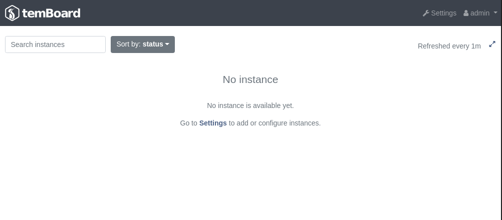

Le mot de passe de l'administrateur peut être modifié dans les paramètres,
section `Users`.

## Installation de l'Agent temBoard

Sur le serveur `srv_pg1`, installer le paquet de l'agent _temBoard_ :

```shell
[root@srv-pg1 tls]# dnf -y install temboard-agent
```

## Récupérer la clé publique de signature

L'agent _temBoard_ accepte la communication avec le serveur _temBoard_ uniquement si
sa clé publique de signature est importée sur le serveur PostgreSQL.

Sur le serveur `srv-pg1`, en tant que `root`, récupérer la clé publique de
signature depuis le serveur `srv-helper` :

```shell
[root@srv-pg1 ~]# scp srv-helper:/etc/temboard/signing-public.pem \
> /etc/pki/tls/certs/temboard_signing-public.pem
The authenticity of host 'srv-helper (192.168.55.21)' can't be established.
RSA key fingerprint is SHA256:RH8vPfe9zwO6s27heibR9R+1nC4vTh0rCi8vshts9Zc.
Are you sure you want to continue connecting (yes/no/[fingerprint])? yes
Warning: Permanently added 'srv-helper,192.168.55.21' (RSA) to the list of known hosts.
signing-public.pem                                 100%  800     1.7MB/s   00:00
```

## Configuration de pglift

Adapter la configuration de site de _pglift_ sur les serveurs PostgreSQL afin d'y
inclure le paramétrage de l'agent _temBoard_.

Modifier le fichier de configuration de site de _pglift_ comme suit :

```yaml
!include include/temboard/settings.yaml.j2
```

# Déploiement d'une instance avec temboard-agent

## Configuration de site

Installer la nouvelle configuration de site :

\scriptsize

```shell
[postgres@srv-pg1 ~]$ pglift site-configure install
INFO     installed pglift-temboard_agent@.service systemd unit at /home/postgres/.local/share/systemd/user/pglift-temboard_agent@.service
INFO     installed pglift-postgres_exporter@.service systemd unit at
         /home/postgres/.local/share/systemd/user/pglift-postgres_exporter@.service
INFO     installed pglift-backup@.service systemd unit at /home/postgres/.local/share/systemd/user/pglift-backup@.service
INFO     installed pglift-backup@.timer systemd unit at /home/postgres/.local/share/systemd/user/pglift-backup@.timer
INFO     installed pglift-postgresql@.service systemd unit at /home/postgres/.local/share/systemd/user/pglift-postgresql@.service
INFO     creating temboard log directory
INFO     installing base pgbackrest configuration
INFO     creating pgbackrest include directory
INFO     creating pgbackrest repository path
INFO     creating common pgbackrest directories
INFO     creating postgresql log directory
```

\normalsize

_temBoard_ étant activé dans la configuration de site, chaque nouvelle instance
créée sur ce nœud via _pglift_ sera accompagnée d'un agent _temBoard_.

## Création d'instance

Créer une instance `main ` sur `srv-pg1` :

```shell
[postgres@srv-pg1 ~]$ pglift instance create main --pgbackrest-stanza=main
INFO     initializing PostgreSQL
INFO     configuring PostgreSQL authentication
INFO     configuring PostgreSQL
INFO     starting PostgreSQL 15-main
INFO     creating role 'temboardagent'
INFO     creating role 'prometheus'
INFO     creating role 'backup'
INFO     altering role 'backup'
INFO     configuring temboard agent 15-main
INFO     configuring Prometheus postgresql 15-main
INFO     configuring pgBackRest stanza 'main' for pg1-path=/pgdata/15/main/data
INFO     creating pgBackRest stanza main
INFO     starting temboard-agent 15-main
INFO     starting Prometheus postgres_exporter 15-main
```

## Enregistrement de l'instance dans temBoard

L'instance créée sur `srv-pg1` peut être enregistrée sur la console _temBoard_
fonctionnant sur `srv-helper`. Cela peut se faire de manière graphique via
l'interface web, ou bien en ligne de commande.

### Depuis la Web UI (serveur temBoard)

De retour sur la console _temBoard_, connecté en tant qu'`admin`, accéder à la
section `settings` (1), puis cliquer sur `New instance` :

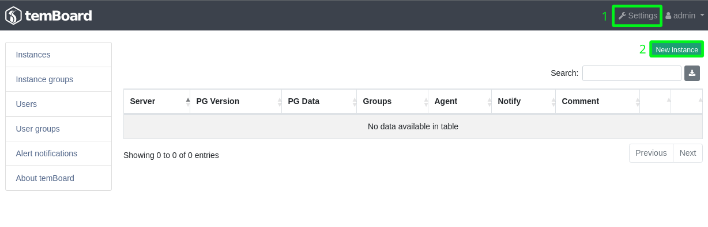

Saisir le nom d'hôte du serveur `srv-pg1` et le port par défaut de l'agent
_temBoard_  `2345` :

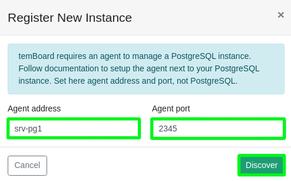

Enregistrer l'instance dans le groupe `default` et valider en cliquant sur
`Register` :

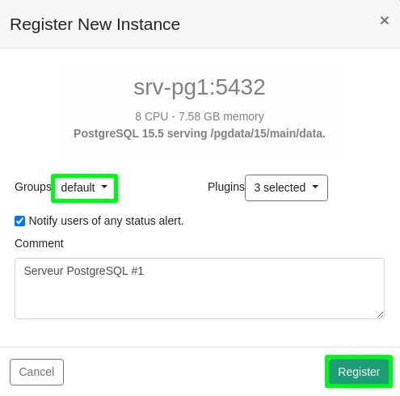

### En CLI avec _temBoard_ (serveur _temBoard_)

Exécuter la commande suivante en tant que `temboard` sur `srv-helper` :

\scriptsize

```
[temboard@srv-helper ~]$ temboard register-instance --groups=default srv-pg1 2345
INFO:  app: Using config file /etc/temboard/temboard.conf.
INFO:  register_instance: Discovering temBoard agent at srv-pg1:2345.
INFO:  register_instance: Registering PostgreSQL 15.5 serving /pgdata/15/main/data at srv-pg1:5432.
INFO:  register_instance: Instance successfully registered.
INFO:  register_instance: Schedule monitoring collect for agent now.
{
  "hostname": "srv-pg1",
  "pg_port": 5432,
  "agent_address": "srv-pg1",
  "agent_port": 2345,
  "groups": [
    "default"
  ],
  "plugins": [
    "activity",
    "dashboard",
    "monitoring"
  ],
  "comment": "Registered from CLI.",
  "notify": false,
  "discover": {
    "postgres": {
      "version": "PostgreSQL 15.5 on x86_64-pc-linux-gnu, compiled by gcc (GCC) 8.5.0 20210514 (Red Hat 8.5.0-20), 64-bit",
      "version_summary": "PostgreSQL 15.5",
      "version_num": 150005,
      "start_time": "2024-01-09T17:04:29UTC+01:00",
      "block_size": 8192,
      "cluster_name": "main",
      "config_file": "/pgdata/15/main/data/postgresql.conf",
      "data_checksums": false,
      "data_directory": "/pgdata/15/main/data",
      "external_pid_file": "",
      "hba_file": "/pgdata/15/main/data/pg_hba.conf",
      "ident_file": "/pgdata/15/main/data/pg_ident.conf",
      "lc_collate": "C",
      "lc_ctype": "C",
      "listen_addresses": "*",
      "max_connections": 100,
      "port": 5432,
      "segment_size": 1073741824,
      "server_encoding": "UTF8",
      "syslog_ident": "postgres",
      "unix_socket_directories": "/var/run/postgresql",
      "wal_block_size": 8192,
      "wal_segment_size": 16777216,
      "pid": 18088
    },
    "system": {
      "fqdn": "srv-pg1",
      "distribution": "Rocky Linux 8.7 (Green Obsidian)",
      "cpu_count": 8,
      "cpu_model": "AMD EPYC-Rome Processor",
      "memory": 8139456512,
      "swap": 2206199808,
      "hugepage": 2097152,
      "os": "Linux",
      "os_version": "4.18.0-425.13.1.el8_7.x86_64",
      "arch": "x86_64",
      "hostname": "srv-pg1",
      "start_time": "2024-01-09T15:56:46"
    },
    "temboard": {
      "bin": "/usr/bin/temboard-agent",
      "configfile": "/home/postgres/.local/share/pglift/etc/temboard-agent/temboard-agent-15-main.conf",
      "plugins": [
        "monitoring",
        "dashboard",
        "activity"
      ],
      "agent_version": "8.2.1",
      "bottle_version": "0.12.21",
      "cryptography_version": "3.2.1",
      "libpq_version": "15.5",
      "psycopg2_version": "2.9.5 (dt dec pq3 ext lo64)",
      "python_version": "3.6.8",
      "pythonbin": "/usr/libexec/platform-python"
    },
    "signature_status": "valid"
  },
  "discover_etag": "a28b5e6ddda8d33068a8dc628595bcd92b2ab06dc76de367a3a777dee1f3e50c",
  "discover_date": null
}
INFO:  register_instance: Browse instance at https://0.0.0.0:8888/server/srv-pg1/2345/dashboard.
```

\normalsize

### En CLI avec temboard-agent

Il est également possible de faire un enregistrement en ligne de commande depuis
le serveur PostgreSQL. Pour cela, exécuter la commande `temboard-agent register`
en tant que en spécifiant le groupe d'appartenance de l'instance (`defaults`) :

\scriptsize

```
[postgres@srv-pg1 ~]$ temboard-agent -c /home/postgres/.local/share/pglift/etc/temboard-agent/temboard-agent-15-main.conf register --groups default
INFO:  app: Using config file /home/postgres/.local/share/pglift/etc/temboard-agent/temboard-agent-15-main.conf.
WARNING:  agent: Hostname srv-pg1 is not a FQDN.
INFO:  register: Working for agent listening at https://srv-pg1:2345.
INFO:  register: Discovering system and PostgreSQL ...
INFO:  register: temBoard agent for PostgreSQL 15.5 instance serving /pgdata/15/main/data on port 5432.
INFO:  register: Verifying signing key.
INFO:  register: Login at https://srv-helper:8888 ...
 Username: admin
 Password:
INFO:  register: Registering instance/agent in https://srv-helper:8888 ...
INFO:  register: Instance registered. Manage it at https://srv-helper:8888/server/srv-pg1/2345/dashboard.
```

\normalsize

# Visualisation des métriques

L'interface web de _temBoard_ présente un certain nombre d'indicateurs sur l'instance
enregistrée.

## Simuler de l'activité avec pgbench

Pour que les métriques et graphes soient plus représentatifs d'une instance
réellement utilisée, il est possible de générer de l'activité avec _pgbench_ sur
`srv-pg1`. Pour ce faire, exécuter le script suivant dans une nouvelle session
en tant que `postgres` :

```shell
export $(pglift instance env main)
pgbench -i
while true; do

    c=$((2 + $RANDOM % 20))   # Nombre de sessions
    j=$((5 + $RANDOM % 10))   # Nombre de jobs par session
    t=$((10 + $RANDOM % 120)) # Durée du test en secondes

    echo "### ${c} sessions exécutant ${j} jobs pendant ${t} secondes"
    pgbench -c ${c} -j ${j} -T ${t}

done
```

## Tableau de bord

La vue _Dashboard_ offre une vue d'ensemble des métriques de supervision de
l'instance. On y retrouve les informations provenant de sondes qui surveillent
les éléments suivants :

* utilisation du CPU, de la mémoire, du disque
* utilisation du cache disque (_cache hit ratio_)
* nombre de connexions établies, session en attente
* nombre de transactions par secondes (_tps_)
* génération de fichiers WAL
* génération de fichiers temporaires
* fragmentation (_bloat_) dans les tables et index.

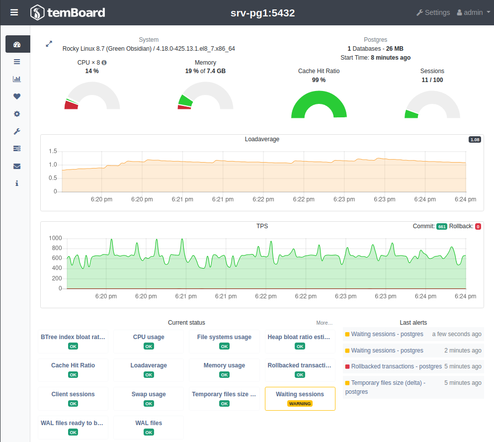

## Activité en temps réel

La vue _Activity_ permet de visualiser l'activité de l'instance en temps réel,
notamment obtenir des informations sur les processus en cours, leur état,
et les ordres SQL qu'ils exécutent.

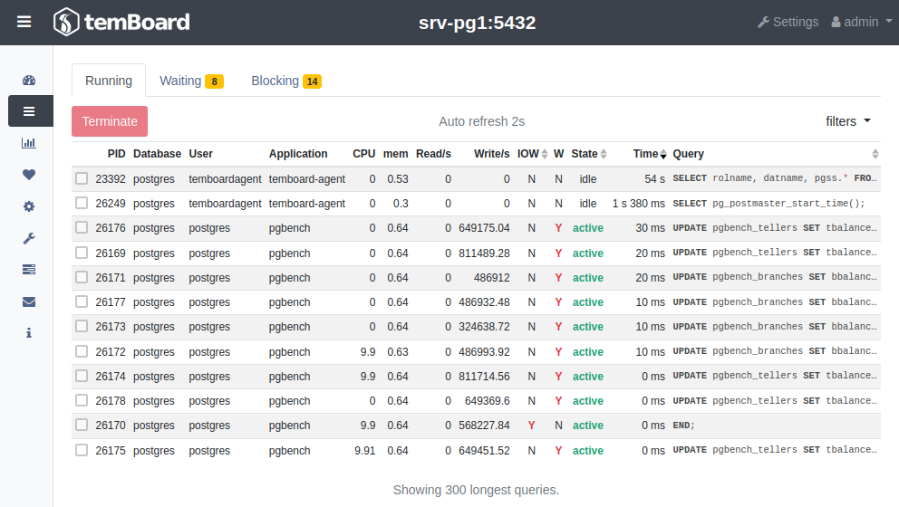

Il est possible de filtrer les sessions bloquantes (_blocking_) ou en attente
(_waiting_) via les onglets respectifs.

## Graphes

La vue _Monitoring_ permet de choisir des métriques à afficher sous forme de
graphe, sur une plage de temps personnalisable.

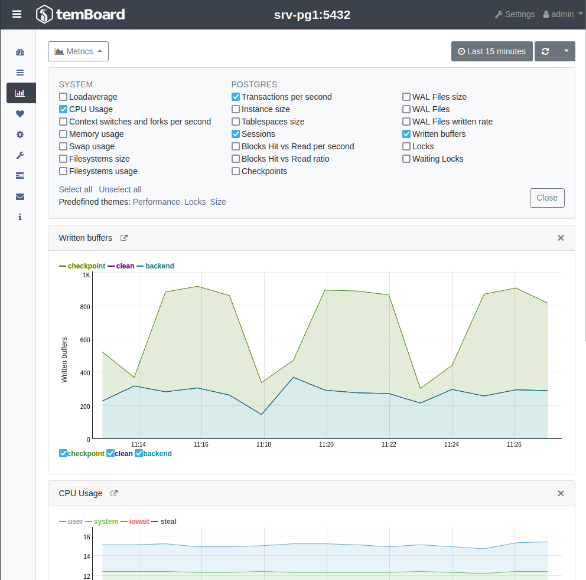

## Etat des sondes

La vue _status_ liste l'ensemble des sondes avec leur état actuel. Cliquer
sur une sonde permet d'afficher le graphe correspondant.

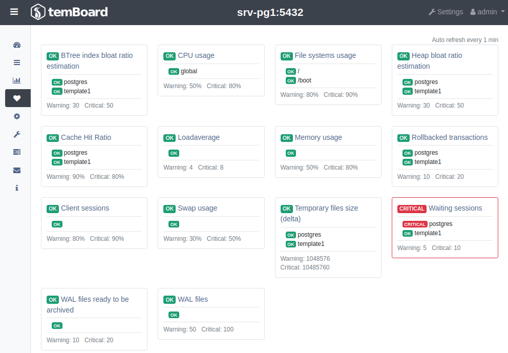

# Opérations de maintenance

La vue _Maintenance_ établie une liste des bases de données de l'instance,
avec des informations sur l'occupation d'espace disque et les taux de
fragmentation associés.

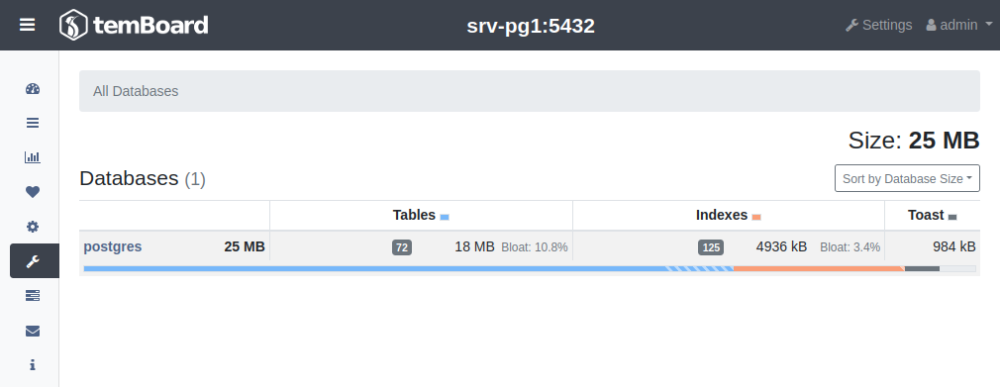

Cliquer sur une base de données pour obtenir plus de détails et d'options.

Les informations sur l'utilisation du disque sont alors détaillées par schéma,
et des boutons apparaissent en haut de la page pour déclencher des opérations
courantes de maintenance  :

* `VACUUM`
* `VACUUM FULL`
* `ANALYZE`
* `REINDEX`

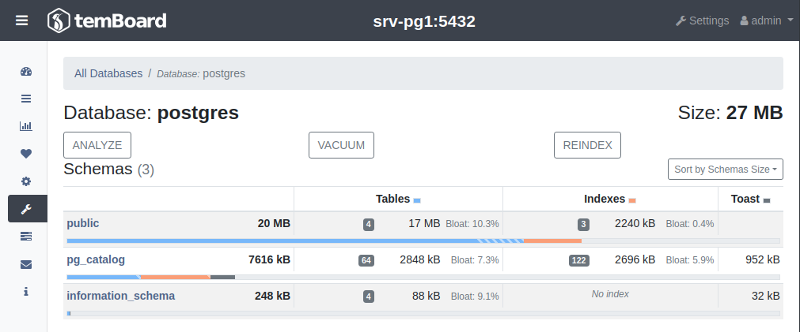

# Configuration de PostgreSQL via temBoard

La vue _Configuration_ permet la configuration de l'instance depuis _temBoard_.
Pour trouver un paramètre, il est possible de le rechercher ou bien
de le retrouver dans les différentes catégories.

Voici un exemple illustrant l'augmentation du paramètre `work_mem` à 25 Mo :

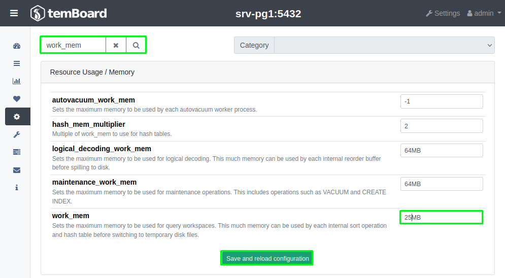

Bien sur, la même opération est réalisable avec _pglift_ :
```
[postgres@srv-pg1 data]$ pglift pgconf set work_mem=25MB
INFO     configuring PostgreSQL
INFO     instance 15/main needs reload due to parameter changes: work_mem
INFO     reloading PostgreSQL configuration for 15-main
work_mem: None -> 25MB
```