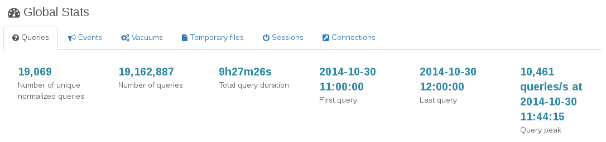
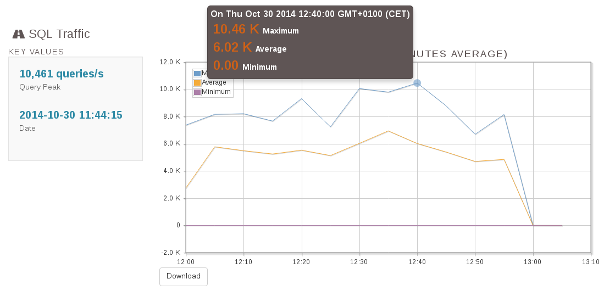
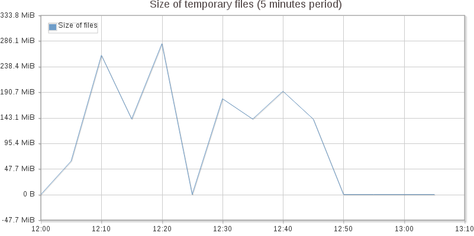

# Supervision en PostgreSQL


<div class="notes">
Photographie de Rad Dougall, licence [CC BY 3.0](https://creativecommons.org/licenses/by/3.0/deed.en),
obtenue sur [wikimedia.org](https://commons.wikimedia.org/wiki/File:The_Big_Boss_Elephant_(190898861).jpeg).

</div>

\newpage

-----
## Au programme

<div class="slide-content">

  * Supervision : quoi et pourquoi ?
  * Trois outils de supervision graphique :
    * PoWA
	* pgbadger
	* temboard
</div>

<div class="notes">

</div>

-----
## Introduction

<div class="slide-content">

  * Deux types de supervision
    * occasionnelle
    * automatique
  * Superviser PostgreSQL et le système
  * Pour PostgreSQL, statistiques et traces
</div>


<div class="notes">

Superviser un serveur de bases de données consiste à superviser le SGBD
lui-même mais aussi le système d'exploitation et le matériel. Ces deux
derniers sont importants pour connaître la charge système, l'utilisation des
disques ou du réseau, qui pourraient expliquer des lenteurs au niveau du SGBD.
PostgreSQL propose lui-aussi des informations qu'il est important de surveiller
pour détecter des problèmes au niveau de l'utilisation du SGBD ou de sa
configuration.

Cette partie a pour but de montrer comment effectuer une supervision
occasionnelle (au cas où un problème survient, savoir comment interpréter les
informations fournies par le système et par PostgreSQL) et comment mettre en
place une supervision automatique (permettant l'envoi de messages à une
personne en astreinte).
</div>

-----
## Politique de supervision

<div class="slide-content">

  * Pour quoi ?
  * Pour qui ?
  * Quels critères ?
  * Quels outils
</div>


<div class="notes">

Il n'existe pas qu'une seule supervision. Suivant la personne concernée par la
supervision, son objectif et du coup les critères de la supervision seront
différents.

Lors de la mise en place de la supervision, il est important de se demander
l'objectif de cette supervision, à qui elle va servir, les critères qui
importent à cette personne.

Répondre à ces questions permettra de mieux choisir l'outil de supervision à
mettre en place, ainsi que sa configuration.
</div>

-----
### Objectifs de la supervision

<div class="slide-content">

  * Améliorer / mesurer les performances
  * Améliorer l'applicatif
  * Anticiper / prévenir les incidents
  * Réagir vite en cas de crash
</div>


<div class="notes">

Généralement, les administrateurs mettant en place la supervision veulent
pouvoir anticiper les problèmes qu'ils soient matériels, de performance, de
qualité de service, etc.

Améliorer les performances du SGBD sans connaître les performances globales du
système est très difficile. Si un utilisateur se plaint d'une perte de
performance, pouvoir corroborer ses dires avec des informations provenant du
système de supervision aide à s'assurer qu'il y a bien un problème de
performances et peut fréquemment aider à résoudre le problème de
performances. De plus, il est important de pouvoir mesurer les gains de
performances.

Une supervision des traces de PostgreSQL permet aussi d'améliorer les
applications qui utilisent une base de données. Toute requête en erreur est
tracée dans les journaux applicatifs, ce qui permet de trouver rapidement les
problèmes que les utilisateurs rencontrent.

Un suivi régulier de la volumétrie ou du nombre de connexions permet de
prévoir les évolutions nécessaires du matériel ou de la configuration :
achat de matériel, création d'index, amélioration de la configuration.

Prévenir les incidents peut se faire en ayant une sonde de supervision des
erreurs disques par exemple. La supervision permet aussi d'anticiper les
problèmes de configuration. Par exemple, surveiller le nombre de sessions
ouvertes sur PostgreSQL permet de s'assurer que ce nombre n'approche pas trop du
nombre maximum de sessions configuré avec le paramètre `max_connections` dans le
fichier `postgresql.conf`.

Enfin, une bonne configuration de la supervision implique d'avoir configuré
finement la gestion des traces de PostgreSQL. Avoir un bon niveau de trace
(autrement dit ni trop ni pas assez) permet de réagir rapidement après un
crash.
</div>

-----
### Acteurs concernés

<div class="slide-content">

  * Développeur
    * correction et optimisation de requêtes
  * Administrateur de bases de données
    * surveillance, performance
    * mise à jour
  * Administrateur système
    * surveillance, qualité de service
</div>


<div class="notes">

Il y a trois types d'acteurs concernés par la supervision.

Le développeur doit pouvoir visualiser l'activité de la base de données. Il
peut ainsi comprendre l'impact du code applicatif sur la base. De plus, le
développeur est intéressé par la qualité des requêtes que son code
exécute. Donc des traces qui ramènent les requêtes en erreur et celles qui ne
sont pas performantes sont essentielles pour ce profil.

L'administrateur de bases de données a besoin de surveiller les bases pour
s'assurer de la qualité de service, pour garantir les performances et pour
réagir rapidement en cas de problème. Il doit aussi faire les mises à jours
mineures dès qu'elles sont disponibles.

Enfin, l'administrateur système doit s'assurer de la présence du service. Il
doit aussi s'assurer que le service dispose des ressources nécessaires, en
terme de processeur (donc de puissance de calcul), de mémoire et de disque
(notamment pour la place disponible).
</div>

-----
### Indicateurs côté système d'exploitation

<div class="slide-content">

  * Charge CPU
  * Entrées/sorties disque
  * Espace disque
  * Sur-activité et non-activité du serveur
  * Temps de réponse
</div>


<div class="notes">


Voici quelques exemples d'indicateurs intéressants à superviser pour la partie
du système d'exploitation.

La charge CPU (processeur) est importante. Elle peut expliquer pourquoi des
requêtes, auparavant rapides, deviennent lentes. Cependant, la suractivité
comme la non-activité sont un problème. En fait, si le service est tombé, le
serveur sera en sous-activité, ce qui est un excellent indice.

Les entrées/sorties disque permettent de montrer un soucis au niveau du
système disque : soit PostgreSQL écrit trop à cause d'une mauvaise
configuration des journaux de transactions, soit les requêtes exécutées
utilisent des fichiers temporaires pour trier les données, ou pour une toute
autre raison.

L'espace disque est essentiel à surveiller. PostgreSQL ne propose rien pour
cela, il faut donc le faire au niveau système. L'espace disque peut poser
problème s'il manque, surtout si cela concerne la partition des journaux de
transactions.

Il est possible aussi d'utiliser une requête étalon dont la durée
d'exécution sera testée de temps à autre pour détecter les moments
problématiques sur le serveur.
</div>

-----
### Indicateurs côté base de données

<div class="slide-content">

  * Nombre de connexions
  * Requêtes lentes et/ou fréquentes
  * Nombre de transactions par seconde
  * Ratio d'utilisation du cache
  * Retard de réplication
</div>


<div class="notes">

Il existe de nombreux indicateurs intéressant sur les bases :

  * nombre de connexions : en faisant par exemple la différence entre
    connexions inactives, actives, en attente de verrous,
  * nombre de requêtes lentes et / ou fréquentes,
  * nombre de transactions par seconde
  * volumétrie : en taille, en nombre de lignes,
  * ratio de lecture du cache (souvent appelé _hit ratio_)
  * retard de réplication
  * nombre de parcours séquentiels et de parcours d'index
  * etc.
</div>

-----
## La supervision avec PostgreSQL

<div class="slide-content">

  * Supervision occasionnelle : pour les cas où il est possible d'intervenir
    immédiatement
  * Supervision automatique
    * permet de remonter des informations rapidement
    * permet de conserver les informations
</div>


<div class="notes">

La supervision occasionnelle est intéressante lorsqu'un utilisateur se plaint 
d'un problème survenant maintenant. Cependant, cela reste assez limité.

Il est important de mettre en place une solution de supervision automatique. Le
but est de récupérer périodiquement des données statistiques sur les objets
et sur l'utilisation du serveur pour avoir des graphes de tendance et envoyer
des alertes quand des seuils sont dépassés.
</div>

-----
### Informations internes

<div class="slide-content">

  * PostgreSQL propose deux canaux d'informations :
    * les statistiques d'activité
    * les traces
  * Mais rien pour les conserver, les historiser
</div>


<div class="notes">

PostgreSQL propose deux canaux d'informations : les statistiques d'activité (à
ne pas confondre avec les statistiques sur les données, à destination de
l'optimiseur de requêtes) et les traces applicatives (ou « logs »), souvent
dans un fichier dont le nom varie avec la distribution et l'installation.

PostgreSQL stocke un ensemble d'informations (métadonnées des schémas,
informations sur les tables et les colonnes, données de suivi interne, etc.)
dans des tables systèmes qui peuvent être consultées par les administrateurs.
PostgreSQL fournit également des vues combinant des informations puisées dans
différentes tables systèmes. Ces vues simplifient le suivi de l'activité de la
base.

PostgreSQL est aussi capable de tracer un grand nombre d'informations qui
peuvent être exploitées pour surveiller l'activité de la base de données.

Pour pouvoir mettre en place un système de supervision automatique, il est
essentiel de s'assurer que les statistiques d'activité et les traces
applicatives sont bien configurées et il faut aussi leur associer un outil
permettant de sauvegarder les données, les alertes et de les historiser.
</div>

-----
### Outils externes

<div class="slide-content">

  * Nécessaire pour conserver les informations
  * ... et exécuter automatiquement des actions dessus :
    * Génération de graphiques
    * Envoi d'alertes
</div>


<div class="notes">

Pour récupérer et enregistrer les informations statistiques, les historiser,
envoyer des alertes ou dessiner des graphiques, il faut faire appel à un outil
externe. 

Cela peut être des fait grâce à des outils de supervision générique comme
Icinga, munin ou Zabbix. On utilisera des agents ou plugins spécifiques pour
ces outils comme pg-monz, check_pgactivity ou check_postgres.

Nous nous intéresserons durant ce workshop à des outils graphiques spécifiques
pour PostgreSQL.
</div>

-----
### Outils graphiques

<div class="slide-content">

  * Beaucoup d'outils existent
  * Deux types :
    * en temps réel : PoWA et temboard
    * rétro-analyse : pgBadger
</div>


<div class="notes">

Il existe de nombreux programmes qui analysent les traces. On peut distinguer
deux catégories :

  * ceux qui le font en temps réel ;
  * ceux qui le font après coup (de la rétro-analyse en fait).

L'analyse en temps réel des traces permet de réagir rapidement à certains
messages. Par exemple, il est important d'avoir une réaction rapide à
l'archivage échoué d'un journal de transactions, ainsi qu'en cas de manque
d'espace disque. Dans cette catégorie, nous discuterons de deux outils : PoWA
et temboard.

L'analyse après coup permet une analyse plus fine, se terminant généralement
par un rapport, fréquemment en HTML, parfois avec des graphes. Cette analyse
plus fine nécessite des outils spécialisés. Nous étudierons le logiciel
pgBagder.

</div>

-----
### PoWA

<div class="slide-content">

  * _PostgreSQL Workload Analyzer_
  * Effectue des captures des statistiques collectées par `pg_stat_statements`
  * Fournit une interface graphique pour observer en temps réel l'activité des requêtes
  * Licence PostgreSQL
  * <https://github.com/powa-team/powa-archivist>
  * <https://github.com/powa-team/powa-web>
</div>

<div class="notes">

PoWA (_PostgreSQL Workload Analyzer_) est un outil communautaire, sous
licence PostgreSQL.
Tout comme pour `pg_stat_statements`, sa mise en place nécessite la modification
du paramètre `shared_preload_libraries`, et donc le redémarrage de l'instance.
Il faut également créer une nouvelle base de données dans l'instance.
Par ailleurs, PoWA repose sur les statistiques collectées par
`pg_stat_statements`, celui-ci doit donc être également installé.

Une fois installé et configuré, l'outil va récupérer à intervalle régulier
les statistiques collectées par `pg_stat_statements`, les stocker et les
historiser.
L'outil fournit également une interface graphique permettant d'exploiter ces
données, et donc d'observer en temps réel l'activité de l'instance.
Cette activité est présentée sous forme de graphiques interactifs et de
tableaux permettant de trier selon divers critères (nombre d'exécution, blocs
lus hors cache, ...) les différentes requêtes normalisées sur l'intervalle de
temps sélectionné.

PoWA 1 et 2 sont compatibles avec les versions 9.3 et supérieures de PostgreSQL.

PoWA 3 est compatible avec les versions 9.4 et supérieures de PostgreSQL.
</div>

-----
### pg_stat_statements

<div class="slide-content">

  * Module contrib de PostgreSQL
  * Récupère et stocke des statistiques d'exécution des requêtes
  * Les requêtes sont normalisées
  * Pas d'historisation
</div>

<div class="notes">

`pg_stat_statements` est un module contrib de PostgreSQL, il s'agit donc d'une
fonctionnalité qui n'est pas installée par défaut.
Sa mise en place nécessite le préchargement de bibliothèques dans la mémoire
partagée (paramètre `shared_preload_libraries`), et donc le redémarrage de
l'instance.

Une fois installé et configuré, des mesures (nombre de blocs lus dans le
cache, hors cache, …) sont collectées sur toutes les requêtes exécutées,
et elles sont stockées avec les requêtes normalisées. Ces données sont
ensuite exploitables en interrogeant la vue `pg_stat_statements`.
À noter que ces statistiques sont cumulées sans être historisées, il est
donc souvent difficile d'identifier quelle requête est la plus consommatrice à
un instant donné, à moins de réinitialiser les statistiques.

Voir aussi la documentation officielle :
<https://www.postgresql.org/docs/current/static/pgstatstatements.html>
</div>

-----
### Fonctionnement de PoWA

<div class="slide-content">

  * Capture régulière des métriques diverses
    * pg_stat_statements
    * pg_qualstats
    * pg_stat_kcache
    * pg_proctab
  * Stockage efficace des données
  * Interface permettant d'exploiter ces informations
</note>

<div class="notes">

PostgreSQL Workload Analyzer est un logiciel prévu pour
échantillonner et visualiser dans le temps les métriques fournies par divers
modules pour PostgreSQL. L'échantillonnage est géré par un background worker,
un processus dédié géré directement par PostgreSQL. Celui-ci appelle à
intervalle régulier les différentes fonctions de gestion de données de
PoWA. Chaque source de données dispose de ses fonctions d'échantillonnage
spécifiques.

Les sources de données supportées sont :

  * pg_stat_statements : extension officielle de PostgreSQL permettant de
    récupérer de nombreuses métriques par requête normalisée, utilisateur et
    base de données. Ces données sont par exemple le nombre de blocs accédés
    dans ou en dehors du segment de mémoire partagée dédié à PostgreSQL, le
    nombre d'appels... Pour plus de détail, voir
    http://docs.postgresql.fr/9.2/pgstatstatements.html
  * pg_qualstats : extension développée par Dalibo. Elle permet de fournir de
    nombreuses informations très pertinentes concernant les prédicats des
    requêtes exécutées sur une instance, comme la sélectivité d'un prédicat,
    les valeurs utilisées etc.
  * pg_stat_kcache : extension développée par Dalibo. Elle permet de fournir
    des indicateurs complémentaires à ceux de pg_stat_statements, mais côté
    système. On a donc a disposition par requête, utilisateur et base de
    données l'utilisation du processeur, ainsi que les accès physiques aux
    disques.

Le support d'autres sources de données est prévu, notamment :

  * pg_proctab : Extensions développée par Mark Wong. Elle fournit des
    indicateurs systèmes généralistes, non liés à l'utilisation de requêtes en
    particulier.

Une interface dédiée est disponible afin d'exploiter au mieux les différentes
spécificités de ces différentes sources de données.
</div>

-----
### Points forts de PoWA

<div class="slide-content">

  * Granularité des informations jusqu'à la requête
    * voire jusqu'au prédicat
  * Hit ratio du cache système
  * Utilisation CPU
  * Index manquants
  * ...
</div>

<div class="notes">

Les modules pg_stat_statements, pg_qualstats et pg_stat_kcache regroupent leurs
métriques par requête normalisée, utilisateur et base de données. Toutes les
informations récoltées par PoWA sont donc disponibles avec cette
granularité. Les différentes informations que ces modules offrent permettre de
trouver de nombreuses informations qui manquaient cruellement à l'écosystème
PostgreSQL jusqu'à présent, par exemple :

  * connaître le taux de lecture dans le cache du système d'exploitation et les
    accès disques physiques
  * connaître l'utilisation processeur de chacune des requêtes
  * suggérer la création d'index pertinents
</div>

-----

### Points faibles de PoWA

<div class="slide-content">

  * Nécessite l'installation de plusieurs extensions sur chaque instance
  * Pas d'informations sur les serveurs secondaires
</div>

<div class="notes">

PoWA est efficace car il est au plus près de l'instance. Il s'installe comme
une extension de PostgreSQL et stocke ses informations dans une base de données
de l'instance. Une défaillance sur un outil externe ne posera pas de problème
sur l'instance. Un problème sur n'importe quelle extension de PoWA peut
conduire à un crash de votre instance de production. Il est important de bien
tester l'outil avant de l'installer en production.

Les informations étant fournies par des extensions requérant un accès direct au
moteur de chaque instance, l'utilisation de PoWA nécessite le stockage
d'information sur chacune des instances que l'on souhaite gérer. Un serveur
secondaire est en lecture seule. On ne peut donc pas y utiliser PoWA.

</div>

-----
### extension HypoPG

<div class="slide-content">
  * proposition de nouveaux index
</div>

<div class="notes">

La troisième version apporte le support d'un nouvelle extension créée par
Dalibo, HypoPG, et permet d'aller beaucoup plus loin dans la suggestion
d'index. En effet, cette nouvelle version a une nouvelle fonctionnalité
d'optimisation globale d'une production. Cette optimisation se fait en
récupérant toutes les informations échantillonnées nécessaires d'une base de
données sur un intervalle de temps, l'analyse et propose des
optimisations. Pour le moment cela concerne uniquement une suggestion d'index
optimale, mais d'autres optimisations sont possibles et seront proposées dans
les futures versions.
</div>

-----
## pgBadger

<div class="slide-content">

  * Script Perl
  * Traite les journaux applicatifs
  * Recherche des informations
    * sur les requêtes et leur durée d'exécution
    * sur les connexions et sessions
    * sur les checkpoints
    * sur l'autovacuum
    * sur les verrous
    * etc.
  * Génération d'un rapport HTML très détaillé
</div>

<div class="notes">


pgBadger est un script Perl écrit par Gilles Darold. Il s'utilise en ligne de
commande : il suffit de lui fournir le ou les fichiers de trace à analyser et
il rend un rapport HTML sur les requêtes exécutées, sur les connexions, sur
les bases, etc. Le rapport est très complet, il peut contenir des graphes
zoomables.

C'est certainement le meilleur outil actuel de rétro-analyse d'un fichier de
traces PostgreSQL.

Le site web de pgBadger se trouve sur <https://pgbadger.darold.net/>
</div>


-----


### Configurer PostgreSQL pour pgBadger

<div class="slide-content">

  * Configuration minimale
    * `log_destination`, `log_line_prefix` et `lc_messages`
  * Configuration de base
    * `log_connections`, `log_disconnections`
    * `log_checkpoints`, `log_lock_waits`, `log_temp_files`
    * `log_autovacuum_min_duration`
  * Configuration temporaire
    * `log_min_duration_statement`
</div>


<div class="notes">


pgBadger a besoin d'un minimum d'informations dans les traces : timestamp
(`%t`), pid (`%p`) et numéro de ligne dans la session (`%l`). Il n'y a pas de
conseil particulier sur la destination des traces (en dehors de `eventlog` que
pgBadger ne sait pas traiter). De même, le préfixe des traces est laissé au
choix de l'utilisateur. Par contre, il faudra le préciser à pgBadger si la
configuration est différente de celle qui suit :

```
log_line_prefix = '%t [%p]: [%l-1] user=%u,db=%d '
```

La langue des traces doit être
l'anglais. De toute façon, il s'agit de la meilleure configuration des traces.
En effet, il est difficile de trouver de l'information sur des traces en
français, alors que ce n'est pas le cas avec des traces en anglais. Pour cela,
il suffit de configurer `lc_messages` à la valeur `C`.

Enfin, il faut demander à PostgreSQL de tracer les requêtes. Il est
préférable de passer par `log_min_duration_statement` plutôt que 
`log_statement` et `log_duration` pour que pgBadger puisse faire l'association
entre les requêtes et leur durée :

```
log_min_duration_statement = 0
log_statement = none
log_duration = off
```

Il est aussi possible de tirer parti 
d'autres informations dans les traces :


  * `log_checkpoints` pour des statistiques sur les checkpoints ;
  * `log_connections` et `log_disconnections` pour des informations sur les
connexions et déconnexions ;
  * `log_lock_waits` pour des statistiques sur les verrous en attente ;
  * `log_temp_files` pour des statistiques sur les fichiers temporaires ;
  * `log_autovacuum_min_duration` pour des statistiques sur l'activité de
    l'autovacuum.

Il est à noter que la version 9.0 essaie de récupérer les informations sur
les adresses IP, utilisateurs connectés, bases de données à partir des traces
sur les connexions (voir le paramètre `log_connections`) si jamais ces
informations ne sont pas indiquées dans le préfixe (paramètre 
`log_line_prefix`).

La version 9.1 ajoute aussi un tableau sur les erreurs en utilisant le code
SQLState si ce dernier est tracé (joker ''%e'' avec le paramètre
`log_line_prefix`).
</div>


-----
## Traces

<div class="slide-content">

  * Configuration
  * Récupération
    * des problèmes importants
    * des requêtes lentes / fréquentes
  * Outils externes de classement
</div>


<div class="notes">

La première information que fournit PostgreSQL quant à l'activité sur le
serveur est les traces. Chaque requête en erreur génère une trace indiquant
la requête erronée et l'erreur. Chaque problème de lecture ou d'écriture de
fichier génère une trace. En fait, tout problème détecté par PostgreSQL
fait l'objet d'un message dans les traces. PostgreSQL peut aussi envoyer
d'autres messages suivant certains événements, comme les connexions, l'activité
de processus système en tâche de fond, etc.

Nous allons donc aborder la configuration des traces (où tracer, quoi tracer,
quel niveau d'informations). Nous verrons quelques informations intéressantes
à récupérer. Enfin, nous verrons quelques outils permettant de traiter
automatiquement les fichiers de trace.
</div>

-----
### Configuration

<div class="slide-content">

  * Où tracer ?
  * Quel niveau de traces ?
  * Tracer les requêtes
  * Tracer certains comportements
</div>


<div class="notes">

Il est essentiel de bien configurer PostgreSQL pour que les traces ne soient pas
en même temps trop nombreuses pour ne pas être submergé par les informations
et trop peu pour ne pas savoir ce qu'il se passe. Un bon dosage du niveau des
traces est important. Savoir où envoyer les traces est tout aussi important.
</div>

-----
### Langue des traces applicatives

<div class="slide-content">

  * En anglais
  * paramètre : `lc_messages='C'`
</div>


<div class="notes">

Les traces sont enregistrées dans la locale par défaut du serveur. Avoir des
traces en français peut présenter certains intérêts pour les débutants mais
cela présente plusieurs gros inconvénients. Chercher sur un moteur de recherche
avec des traces en français donnera beaucoup moins de résultats qu'avec des
traces en anglais.

De plus, les outils d'analyse automatique des traces se basent principalement
sur des traces en anglais. Donc, il est vraiment préférable d'avoir les traces
en anglais. Cela peut se faire ainsi :

```
lc_messages = 'C'
```

</div>

-----
### Préfixe de lignes de trace

<div class="slide-content">

  * ajouter le plus d'information possible
  * `log_line_prefix = '%t [%p]: user=%u,db=%d,app=%a,client=%h '`
</div>


<div class="notes">

Lorsque la destination des traces est `syslog` ou `eventlog`, elles se voient
automatiquement ajouter quelques informations dont un horodatage essentiel.
Lorsque la destination est `stderr`, ce n'est pas le cas. Par défaut, 
l'utilisateur se retrouve avec des traces sans horodatage, autrement dit des
traces inutilisables. PostgreSQL propose donc le paramètre `log_line_prefix`
qui permet d'ajouter un préfixe à une trace. 

Ce préfixe peut contenir un grand nombre d'informations, comme un horodatage,
le PID du processus serveur, le nom de l'application cliente, le nom de
l'utilisateur, le nom de la base. Un paramétrage possible est le suivant :

```
log_line_prefix = '%t [%p]: user=%u,db=%d,app=%a,client=%h '
```

</div>


-----
### Tracer les requêtes

<div class="slide-content">

  * `log_min_duration_statement`
  * en production, trace les requêtes longues
    * 10000 pour les requêtes de plus de 10 secondes
  * pour un audit, à 0 : trace toutes les requêtes
</div>

<div class="notes">

Le paramètre `log_min_duration_statement`, trace toute requête dont la durée
d'exécution dépasse la valeur du paramètre (l'unité est la milliseconde). Il
trace aussi la durée d'exécution des requêtes tracées. Par exemple, avec une
valeur de 500, toute requête dont la durée d'exécution dépasse 500 ms sera
tracée. À 0, toutes les requêtes se voient tracées. Pour désactiver la trace,
il suffit de mettre la valeur -1 (qui est la valeur par défaut).

Suivant la charge que le système va subir à cause des traces, il est possible
de configurer finement la durée à partir de laquelle une requête est tracée.
Cependant, il faut bien comprendre que plus la durée est importante, plus la
vision des performances est partielle. Il est parfois plus intéressant de
mettre 0 ou une très petite valeur sur une petite durée, qu'une grosse valeur
sur une grosse durée. Cela étant dit, laisser 0 en permanence n'est pas
recommandé. Il est préférable de configurer ce paramètre à une valeur plus
importante en temps normal pour détecter seulement les requêtes les plus
longues et, lorsqu'un audit de la plateforme est nécessaire, passer
temporairement ce paramètre à une valeur très basse (0 étant le mieux).

La trace fournie par `log_min_duration_statement` ressemble à ceci :

```
2018-09-01 17:34:03 CEST LOG:  duration: 136.811 ms  statement: insert into t1
                               values (2000000,'test');
```

</div>

-----
### Tracer certains comportements

<div class="slide-content">

  * `log_connections`, `log_disconnections`
  * `log_autovacuum_min_duration`
  * `log_checkpoints`
  * `log_lock_waits`
  * `log_temp_files`
</div>

<div class="notes">

En dehors des erreurs et des durées des requêtes, il est aussi possible de
tracer certaines activités ou comportements.

Quand on souhaite avoir une trace de qui se connecte, il est intéressant de
pouvoir tracer les connexions et, parfois aussi, les déconnexions. En activant
les paramètres `log_connections` et `log_disconnections`, nous obtenons les
heures de connexions, de déconnexions et la durée de la session.

`log_autovacuum_min_duration` correspond à `log_min_duration_statement`, mais
pour l'autovacuum. Son but est de tracer l'activité de l'autovacuum si son
exécution demande plus d'un certain temps.

`log_checkpoints` permet de tracer l'activité des checkpoints. Cela ajoute un
message dans les traces pour indiquer qu'un checkpoint commence et une autre
quand il termine. Cette deuxième trace est l'occasion d'ajouter des
statistiques sur le travail du checkpoint :

```
2016-09-01 13:34:17 CEST LOG: checkpoint starting: xlog
2016-09-01 13:34:20 CEST LOG: checkpoint complete: wrote 13115 buffers (80.0%);
                              0 transaction log file(s) added, 0 removed,
                              0 recycled; write=3.007 s, sync=0.324 s,
                              total=3.400 s; sync files=16, 
                              longest=0.285 s,
                              average=0.020 s; distance=404207 kB,
                              estimate=404207 kB
```

Le message indique donc en plus le nombre de blocs écrits sur disque, le nombre
de journaux de transactions ajoutés, supprimés et recyclés. Il est rare que des
journaux soient ajoutés, ils sont plutôt recyclés. Des journaux sont supprimés
quand il y a eu une très grosse activité qui a généré plus de journaux que
d'habitude. Les statistiques incluent aussi la durée des écritures, de la
synchronisation sur disque, la durée totale, etc.

Le paramètre `log_lock_waits` permet de tracer une attente trop importante de
verrous. En fait, quand un verrou est en attente, un chronomètre est
déclenché. Lorsque l'attente dépasse la durée indiquée par le paramètre 
`deadlock_timeout`, un message est enregistré, comme dans cet exemple :

```
2016-09-01 13:38:40 CEST LOG:  process 15976 still waiting for
                               AccessExclusiveLock on relation 26160 of
                               database 16384 after 1000.123 ms
2016-09-01 13:38:40 CEST STATEMENT:  DROP TABLE t1;
```

Plus ce type de message apparaît dans les traces, plus des contentions ont lieu
sur le serveur, ce qui peut diminuer fortement les performances.

Le paramètre `log_temp_files` permet de tracer toute création de fichiers
temporaires, comme ici :

```
2016-09-01 13:41:11 CEST LOG:  temporary file: path
                               "base/pgsql_tmp/pgsql_tmp15617.1", 
                               size 59645952
```

Tout fichier temporaire demande des écritures disques.  
Ces écritures peuvent poser problème pour les performances globales du
système. Il est donc important de savoir si des fichiers temporaires sont créés
ainsi que leur taille.
</div>

-----
### Informations intéressantes à récupérer

<div class="slide-content">

  * Messages PANIC
  * Rechargement de la configuration
</div>

<div class="notes">

Suivant la configuration réalisée, les journaux applicatifs peuvent contenir
quantité d'informations importantes. La plus fréquemment recherchée est la
durée d'exécution des requêtes. L'intérêt principal est de récupérer les
requêtes les plus lentes. L'autre information importante concerne les messages
de niveau PANIC. Ces messages indiquent un état anormal du serveur qui s'est
soldé par un arrêt brutal. Ce genre de problème doit être surveillé
fréquemment.
</div>

-----
### Messages PANIC

<div class="slide-content">

  * Exemple:

```
PANIC:  could not write to file "pg_wal/xlogtemp.9109": 
        No space left on device
```

  * Envoi immédiat d'une alerte
  * Outils : tail_n_mail
</div>

<div class="notes">

Les messages PANIC sont très importants. Généralement, vous ne les verrez pas
au moment où ils se produisent. Un crash va survenir et vous allez chercher à
comprendre ce qui s'est passé. Il est possible à ce moment-là que vous
trouviez dans les traces des messages PANIC, comme celui indiqué ci-dessous :

```
PANIC:  could not write to file "pg_wal/xlogtemp.9109": No space left on device
```

Là, le problème est très simple. PostgreSQL n'arrive pas à créer un journal
de transactions à cause d'un manque d'espace sur le disque. Du coup, le
système ne peut plus fonctionner, il panique et s'arrête.

Un outil comme tail_n_mail peut aider à détecter automatiquement ce genre de
problème et à envoyer un mail à la personne d'astreinte.
</div>

-----
### Rechargement de la configuration

<div class="slide-content">

  * Exemple :

```
LOG:  received SIGHUP, reloading configuration files
```

  * Envoi d'une alerte pour s'assurer que cette configuration est voulue
  * Outils : tail_n_mail
</div>

<div class="notes">

Il est intéressant de savoir quand la configuration du serveur change, et
surtout la valeur des paramètres modifiés. PostgreSQL envoie un message niveau
`LOG` lorsque la configuration est relue. Il indique aussi les nouvelles valeurs
des paramètres, ainsi que les paramètres modifiés qu'il n'a pas pu prendre en
compte (cela peut arriver pour tous les paramètres exigeant un redémarrage du
serveur).

Là-aussi, tail_n_mail est l'outil adapté pour être prévenu dès que la
configuration du serveur est relue. Une telle alerte vous permet de vérifier de
la bonne configuration du serveur.
</div>

-----
### Options de pgBadger

<div class="slide-content">

  * `--outfile`
  * `--begin`, `--end`
  * `--dbname`, `--dbuser`, `--dbclient`, `--appname`
</div>

<div class="notes">

Il existe énormément d'options. L'aide fournie sur le site web officiel les
cite intégralement. Il serait difficile de les citer ici, des options étant
ajoutées très fréquemment.
</div>

-----
### pgBadger : exemple 1


\

<div class="notes">

Au tout début du rapport, pgBadger donne des statistiques générales sur les
fichiers de traces.

Dans les informations importantes se trouve le nombre de requêtes normalisées.
En fait, les requêtes :

```sql
SELECT * FROM utilisateurs WHERE id = 1;
```

et

```sql
SELECT * FROM utilisateurs WHERE id = 2;
```

sont différentes car elles ne vont pas récupérer la
même fiche utilisateur. Cependant, en enlevant la partie constante, les
requêtes sont identiques. La seule différence est la fiche récupérée mais
pas la requête. pgBadger est capable de faire cette différence. Toute
constante, qu'elle soit de type numérique, textuelle, horodatage ou booléenne,
peut être supprimée de la requête. Dans l'exemple montré ci-dessus, pgBadger
a comptabilisé environ 5,5 millions de requêtes, mais seulement 3941 requêtes
différentes après normalisation. Ceci est important dans le fait où nous 
n'allons pas devoir travailler sur plusieurs millions de requêtes mais
« seulement » sur 4000.

Autre information intéressante, la durée d'exécution totale des requêtes.
Ici, nous avons 1 jour et 7 heures d'exécution de requêtes. Cependant, les
traces vont du 20 au 23 mars, soit plus de trois jours. Cela indique que le
serveur est assez peu sollicité. Il est plus fréquent que la durée 
d'exécution sérielle des requêtes soit 3 à 4 fois plus importants que la
durée des traces.
</div>

-----
### pgBadger : exemple 2


\

<div class="notes">

Ce graphe indique le nombre de requêtes par seconde. Le système ici est assez
peu utilisé quand on considère le nombre moyen (en orange sur le graphe).
</div>

-----
### pgBadger : exemple 3


\

<div class="notes">

Ce graphe affiche en vert le nombre de fichiers temporaires créés sur la
durée des traces. La ligne bleue correspond à la taille des fichiers. On
remarque ainsi la création de fichiers pour un total de plus de 400 Mo par
moment.
</div>

-----
### pgBadger : exemple 4


\

<div class="notes">

Le plus important est certainement ce tableau. Il affiche les requêtes qui ont
pris le plus de temps, que ce soit parce que les requêtes en question sont
vraiment très lentes ou parce qu'elles sont exécutées un très grand nombre
de fois. On remarque d'ailleurs dans cet exemple qu'avec les trois premières
requêtes, on arrive à un total de 27 heures. Le premier exemple nous indique
que l'exécution sérielle des requêtes aurait pris 23 heures. En ne
travaillant que sur ces trois requêtes, nous travaillons en fait sur 87 % du
temps total d'exécution des requêtes comprises dans les traces. Pas besoin
donc de travailler sur les 4000 requêtes normalisées.

</div>

-----
## temBoard

<div class="slide-content">

  * Adresse: <https://github.com/dalibo/temboard>
  * Version: 2.2
  * Licence: PostgreSQL
  * Notes: Serveur sur Linux, client web
</div>


<div class="notes">

</div>

-----
### temBoard - PostgreSQL Remote Control

<div class="slide-content">

  * Multi-instances
  * Surveillance OS / PostgreSQL
  * Suivi de l'activité
  * Configuration de chaque instance
</div>

<div class="notes">

temBoard est un outil permettant à un DBA de mener à bien la plupart de ses
tâches courantes.

Le serveur web est installé de façon centralisée et un agent est déployé pour
chaque instance.
</div>

-----
### temBoard - Monitoring


\

<div class="notes">

La section __Monitoring__ permet de visualiser les graphiques historisés au
niveau du système d'exploitation (CPU, mémoire, ...) ainsi qu'au niveau de
l'instance PostgreSQL.
</div>

-----
### temBoard - Activity


\

<div class="notes">

La section __Activity__ permet de lister toutes les requêtes courantes
(__Running__), les requêtes bloquées (__Waiting__) ou bloquantes (__Blocking__).
Il est possible à partir de cette vue d'annuler une requête.
</div>

-----
### temBoard - Configuration


\

<div class="notes">

La section _Configuration_ permet de lister le paramètres des fichiers
`postgresql.conf`, `pg_hba.conf` et `pg_ident.conf`.

Elle permet également de modifier ces paramètres. Suivant les cas, il sera
proposer de recharger la configuration ou de redémarrer l'instance pour
appliquer ces changements.
</div>


-----
## Conclusion

<div class="slide-content">

  * Un système est pérenne s'il est bien supervisé
  * Supervision automatique
    * configuration des traces
    * configuration des statistiques
    * mise en place d'outils d'historisation
</div>


<div class="notes">

Une bonne politique de supervision est la clef de voûte d'un système pérenne.
Pour cela, il faut tout d'abord s'assurer que les traces et les statistiques
soient bien configurées. Ensuite, l'installation d'un outil d'historisation, de
création de graphes et de génération d'alertes, est obligatoire pour pouvoir
tirer profit des informations fournies par PostgreSQL.
</div>

-----
