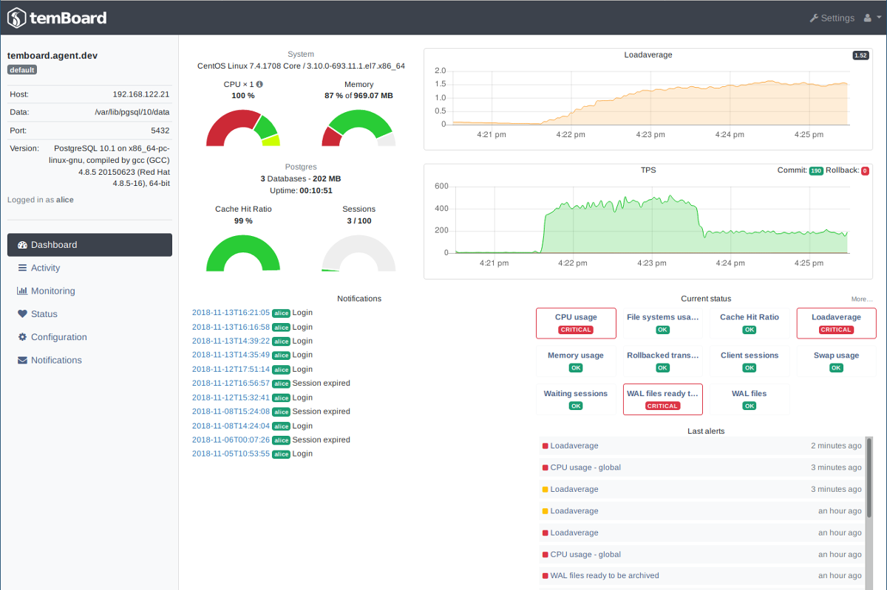

# Supervision en PostgreSQL


<div class="notes">
Photographie de Rad Dougall, licence [CC BY 3.0](https://creativecommons.org/licenses/by/3.0/deed.en),
obtenue sur [wikimedia.org](https://commons.wikimedia.org/wiki/File:The_Big_Boss_Elephant_(190898861).jpeg).

</div>

\newpage

-----
## Au programme

<div class="slide-content">

  * Supervision : quoi et pourquoi ?
  * Trois outils de supervision graphique :
    * PoWA
    * pgBadger
    * temBoard

</div>

<div class="notes">

</div>

-----
## Superviser ?

<div class="slide-content">

**| sy.pɛʁ.vi.ze |**

« _Se placer au-dessus pour voir, remarquer, prendre des mesures_ »

</div>

<div class="notes">

La supervision est la _surveillance du bon fonctionnement d’un système ou
d’une activité_.

Elle permet de surveiller, rapporter et alerter les fonctionnements normaux et
anormaux des systèmes informatiques.

Elle répond aux préoccupations suivantes :

  * technique : surveillance du réseau, de l’infrastructure et des machines ;
  * applicative : surveillance des applications et des processus métiers ;
  * contrat de service : surveillance du respect des indicateurs contractuels ;
  * métier : surveillance des processus métiers de l’entreprise.

</div>

-----
## Que superviser ?

<div class="slide-content">

  * Superviser PostgreSQL et le système
  * Deux types de supervision :
    * automatique,
    * occasionnelle.

</div>

<div class="notes">

Superviser un serveur de bases de données consiste à superviser le SGBD
lui-même mais aussi le système d'exploitation et le matériel. Ces deux
derniers sont importants pour connaître la charge système, l'utilisation des
disques ou du réseau, qui pourraient expliquer des lenteurs au niveau du SGBD.
PostgreSQL propose lui aussi des informations qu'il est important de surveiller
pour détecter des problèmes au niveau de l'utilisation du SGBD ou de sa
configuration.

Un système de supervision automatique est primordial. Il permet de toujours
être notifié en cas de dysfonctionnement. Couplé à un outil de visualisation
graphique, il fournit un aperçu de l'évolution du système dans le temps.

Il peut également être intéressant, en cas de fonctionnement anormal, ou pour
un besoin d'audit, de venir ponctuellement superviser un système en utilisant
un outil précis.

</div>

-----
## Politique de supervision

<div class="slide-content">

  * Pour quoi ?
  * Pour qui ?
  * Quels critères ?
  * Quels outils ?

</div>


<div class="notes">

Il n'existe pas qu'une seule supervision. Suivant la personne concernée par la
supervision, son objectif, les critères de la supervision
seront différents.

Lors de la mise en place de la supervision, il est important de se demander
l'objectif de cette supervision, à qui elle va servir, les critères qui
importent à cette personne.

Répondre à ces questions permettra de mieux choisir l'outil de supervision à
mettre en place, ainsi que sa configuration.

</div>

-----
### Objectifs de la supervision

<div class="slide-content">

  * Améliorer / mesurer les performances
  * Améliorer l'applicatif
  * Anticiper / prévenir les incidents
  * Réagir vite en cas de crash

</div>


<div class="notes">

Généralement, les administrateurs mettant en place la supervision veulent
pouvoir anticiper les problèmes qu'ils soient matériels, de performance, de
qualité de service, etc.

Améliorer les performances du SGBD sans connaître les performances globales du
système est très difficile. Si un utilisateur se plaint d'une perte de
performance, pouvoir corroborer ses dires avec des informations provenant du
système de supervision aide à s'assurer qu'il y a bien un problème de
performances et peut fréquemment aider à résoudre le problème. De plus, il est
important de pouvoir mesurer les gains obtenus après une modification
matérielle ou logicielle.

Une supervision des traces de PostgreSQL permet aussi d'améliorer les
applications qui utilisent une base de données. Toute requête en erreur est
tracée dans les journaux applicatifs, ce qui permet de trouver rapidement les
problèmes que les utilisateurs rencontrent.

Un suivi régulier de la volumétrie ou du nombre de connexions permet de
prévoir les évolutions nécessaires du matériel ou de la configuration :
achat de matériel, création d'index, amélioration de la configuration.

Prévenir les incidents peut se faire en ayant une sonde de supervision des
erreurs disques par exemple. La supervision permet aussi d'anticiper les
problèmes de configuration. Par exemple, surveiller le nombre de sessions
ouvertes sur PostgreSQL permet de s'assurer que ce nombre n'approche pas trop du
nombre maximum de sessions configuré avec le paramètre `max_connections` dans le
fichier `postgresql.conf`.

Enfin, une bonne configuration de la supervision implique d'avoir configuré
finement la gestion des traces de PostgreSQL. Avoir un bon niveau de trace
(autrement dit ni trop ni pas assez) permet de réagir rapidement après un
crash.

</div>

-----
### Acteurs concernés

<div class="slide-content">

  * Développeur
    * correction et optimisation de requêtes
  * Administrateur de bases de données
    * surveillance, performance
    * mise à jour
  * Administrateur système
    * surveillance, qualité de service

</div>


<div class="notes">

Il y a trois types d'acteurs concernés par la supervision.

Le développeur doit pouvoir visualiser l'activité de la base de données. Il
peut ainsi comprendre l'impact du code applicatif sur la base. De plus, le
développeur est intéressé par la qualité des requêtes que son code
exécute. Donc des traces qui ramènent les requêtes en erreur et celles qui ne
sont pas performantes sont essentielles pour ce profil.

L'administrateur de bases de données a besoin de surveiller les bases pour
s'assurer de la qualité de service, pour garantir les performances et pour
réagir rapidement en cas de problème. Il doit aussi faire les mises à jours
mineures dès qu'elles sont disponibles.

Enfin, l'administrateur système doit s'assurer de la présence du service. Il
doit aussi s'assurer que le service dispose des ressources nécessaires, en
terme de processeur (donc de puissance de calcul), de mémoire et de disque
(notamment pour la place disponible).

</div>

-----
### Indicateurs côté système d'exploitation

<div class="slide-content">

  * Charge CPU
  * Entrées/sorties disque
  * Espace disque
  * Sur-activité et inactivité du serveur
  * Temps de réponse

</div>


<div class="notes">

Voici quelques exemples d'indicateurs intéressants à superviser pour la partie
du système d'exploitation.

La charge CPU (processeur) est importante. Elle peut expliquer pourquoi des
requêtes, auparavant rapides, deviennent lentes. Cependant, la suractivité
comme la non-activité sont un problème. En fait, si le service est tombé, le
serveur sera en sous-activité, ce qui est un excellent indice.

Les entrées/sorties disque permettent de montrer un souci au niveau du
système disque : soit PostgreSQL écrit trop à cause d'une mauvaise
configuration des journaux de transactions, soit les requêtes exécutées
utilisent des fichiers temporaires pour trier les données, ou pour une toute
autre raison.

L'espace disque est essentiel à surveiller. PostgreSQL ne propose rien pour
cela, il faut donc le faire au niveau système. L'espace disque peut poser
problème s'il manque, surtout si cela concerne la partition des journaux de
transactions.

Il est possible aussi d'utiliser une requête étalon dont la durée
d'exécution sera testée de temps à autre pour détecter les moments
problématiques sur le serveur.

</div>

-----
### Indicateurs côté base de données

<div class="slide-content">

  * Nombre de connexions
  * Requêtes lentes et/ou fréquentes
  * Nombre de transactions par seconde
  * Ratio d'utilisation du cache
  * Retard de réplication

</div>


<div class="notes">

Il existe de nombreux indicateurs intéressants sur les bases :

  * nombre de connexions : en faisant par exemple la différence entre
    connexions inactives, actives, en attente de verrous,
  * nombre de requêtes lentes et / ou fréquentes,
  * nombre de transactions par seconde
  * volumétrie : en taille, en nombre de lignes,
  * ratio de lecture du cache (souvent appelé _hit ratio_)
  * retard de réplication
  * nombre de parcours séquentiels et de parcours d'index
  * etc.

</div>

-----
### Informations internes

<div class="slide-content">

  * PostgreSQL propose deux canaux d'informations :
    * les statistiques d'activité
    * les traces
  * Mais rien pour les conserver, les historiser

</div>


<div class="notes">

PostgreSQL propose deux canaux d'informations :

  * les statistiques d'activité. À ne pas confondre avec les statistiques sur
les données, à destination de l'optimiseur de requêtes.
  * les traces applicatives (ou « logs »), souvent dans un fichier dont le nom
varie avec la distribution et l'installation.

PostgreSQL stocke un ensemble d'informations dans des tables systèmes. Il peut
s'agir de métadonnées des schémas, d'informations sur les tables et les
colonnes, de données de suivi interne, etc. PostgreSQL fournit également des
vues combinant des informations puisées dans différentes tables systèmes. Ces
vues simplifient le suivi de l'activité de la base.

PostgreSQL est aussi capable de tracer un grand nombre d'informations qui
peuvent être exploitées pour surveiller l'activité de la base de données.

Pour pouvoir mettre en place un système de supervision automatique, il est
essentiel de s'assurer que les statistiques d'activité et les traces
applicatives sont bien configurées et il faut aussi leur associer un outil
permettant de sauvegarder les données, les alertes et de les historiser.

</div>

-----
### Outils externes

<div class="slide-content">

  * Nécessaire pour conserver les informations
  * ... et exécuter automatiquement des actions dessus :
    * Génération de graphiques
    * Envoi d'alertes

</div>


<div class="notes">

Pour récupérer et enregistrer les informations statistiques, les historiser,
envoyer des alertes ou dessiner des graphiques, il faut faire appel à un outil
externe.

Cela peut être fait grâce à des outils de supervision génériques comme Icinga,
munin ou Zabbix. On utilisera des agents ou plugins spécifiques pour ces outils
comme pg-monz, check_pgactivity ou check_postgres.

Nous nous intéresserons durant ce workshop à des outils graphiques spécifiques
pour PostgreSQL.

</div>

-----
### Outils graphiques

<div class="slide-content">

  * Beaucoup d'outils existent
  * Deux types :
    * en temps réel : PoWA et temboard
    * rétro-analyse : pgBadger

</div>


<div class="notes">

Il existe de nombreux programmes qui analysent les traces. On peut distinguer
deux catégories :

  * ceux qui le font en temps réel ;
  * ceux qui le font après coup (de la rétro-analyse en fait).

L'analyse en temps réel d'une instance permet de réagir rapidement en cas de
problème. Par exemple, il est important d'avoir une réaction rapide en cas de
manque d'espace disque, ou bien de pouvoir comprendre les raisons de requêtes
trop lentes. Dans cette catégorie, nous discuterons de deux outils : PoWA et
temboard.

L'analyse après coup permet une analyse plus fine, se terminant généralement
par un rapport, fréquemment en HTML, parfois avec des graphes. Cette analyse
plus fine nécessite des outils spécialisés. Nous étudierons le logiciel
pgBagder.

</div>

-----


\

-----
## pgBadger

<div class="slide-content">

  * Script Perl
  * site officiel : <https://pgbadger.darold.net/>
  * Traite les journaux applicatifs de PostgreSQL
  * Génére un rapport HTML très détaillé

</div>

<div class="notes">

pgBadger est un script Perl écrit par Gilles Darold. Il s'utilise en ligne de
commande : il suffit de lui fournir le ou les fichiers de traces à analyser et
il rend un rapport HTML sur les requêtes exécutées, sur les connexions, sur les
bases, etc. Le rapport est très complet, il peut contenir des graphes
zoomables.

C'est certainement le meilleur outil actuel de rétro-analyse d'un fichier de
traces PostgreSQL.

Le site web de pgBadger se trouve sur <https://pgbadger.darold.net/>

</div>

-----
### Configurer PostgreSQL pour pgBadger

<div class="slide-content">

  * Utilisation des traces applicatives
  * Où tracer ?
  * Quel niveau de traces ?
  * Tracer les requêtes
  * Tracer certains comportements

</div>

<div class="notes">

Il est essentiel de bien configurer PostgreSQL pour que les traces ne soient pas
en même temps trop nombreuses pour ne pas être submergées par les informations
et trop peu pour ne pas savoir ce qu'il se passe. Un bon dosage du niveau des
traces est important. Savoir où envoyer les traces est tout aussi important.

</div>

-----
### Configuration minimale

<div class="slide-content">

  * traces en anglais
    * `lc_messages='C'`
  * ajouter le plus d'information possible
    * `log_line_prefix = '%t [%p]: user=%u,db=%d,app=%a,client=%h '`

</div>


<div class="notes">

Les traces sont enregistrées dans la locale par défaut du serveur. Avoir des
traces en français peut présenter certains intérêts pour les débutants mais
cela présente plusieurs gros inconvénients. Chercher sur un moteur de recherche
avec des traces en français donnera beaucoup moins de résultats qu'avec des
traces en anglais.

De plus, les outils d'analyse automatique des traces se basent principalement
sur des traces en anglais. Donc, il est vraiment préférable d'avoir les traces
en anglais. Cela peut se faire ainsi :

```
lc_messages = 'C'
```

Lorsque la destination des traces est `syslog` ou `eventlog`, elles se voient
automatiquement ajouter quelques informations dont un horodatage, essentiel.
Lorsque la destination est `stderr`, ce n'est pas le cas. Par défaut,
l'utilisateur se retrouve avec des traces sans horodatage, autrement dit des
traces inutilisables. PostgreSQL propose donc le paramètre `log_line_prefix`
qui permet d'ajouter un préfixe à une trace.

Ce préfixe peut contenir un grand nombre d'informations, comme un horodatage,
le PID du processus serveur, le nom de l'application cliente, le nom de
l'utilisateur, le nom de la base. Un paramétrage possible est le suivant :

```
log_line_prefix = '%t [%p]: user=%u,db=%d,app=%a,client=%h '
```

</div>

-----
### Tracer certains comportements

<div class="slide-content">

  * `log_connections`, `log_disconnections`
  * `log_autovacuum_min_duration`
  * `log_checkpoints`
  * `log_lock_waits`
  * `log_temp_files`

</div>


<div class="notes">

En dehors des erreurs et des durées des requêtes, il est aussi possible de
tracer certaines activités ou comportements.

Quand on souhaite avoir une trace de qui se connecte, il est intéressant de
pouvoir tracer les connexions et, parfois aussi, les déconnexions. En activant
les paramètres `log_connections` et `log_disconnections`, nous obtenons les
heures de connexions, de déconnexions et la durée de la session.

`log_autovacuum_min_duration` correspond à `log_min_duration_statement`, mais
pour l'autovacuum. Son but est de tracer l'activité de l'autovacuum si son
exécution demande plus d'un certain temps.

`log_checkpoints` permet de tracer l'activité des checkpoints. Cela ajoute un
message dans les traces pour indiquer qu'un checkpoint commence et une autre
quand il termine. Cette deuxième trace est l'occasion d'ajouter des
statistiques sur le travail du checkpoint :

```
2016-09-01 13:34:17 CEST LOG: checkpoint starting: xlog
2016-09-01 13:34:20 CEST LOG: checkpoint complete: wrote 13115 buffers (80.0%);
                              0 transaction log file(s) added, 0 removed,
                              0 recycled; write=3.007 s, sync=0.324 s,
                              total=3.400 s; sync files=16, 
                              longest=0.285 s,
                              average=0.020 s; distance=404207 kB,
                              estimate=404207 kB
```

Le message indique donc en plus le nombre de blocs écrits sur disque, le nombre
de journaux de transactions ajoutés, supprimés et recyclés. Il est rare que des
journaux soient ajoutés, ils sont plutôt recyclés. Des journaux sont supprimés
quand il y a eu une très grosse activité qui a généré plus de journaux que
d'habitude. Les statistiques incluent aussi la durée des écritures, de la
synchronisation sur disque, la durée totale, etc.

Le paramètre `log_lock_waits` permet de tracer une attente trop importante de
verrous. En fait, quand un verrou est en attente, un chronomètre est
déclenché. Lorsque l'attente dépasse la durée indiquée par le paramètre 
`deadlock_timeout`, un message est enregistré, comme dans cet exemple :

```
2016-09-01 13:38:40 CEST LOG:  process 15976 still waiting for
                               AccessExclusiveLock on relation 26160 of
                               database 16384 after 1000.123 ms
2016-09-01 13:38:40 CEST STATEMENT:  DROP TABLE t1;
```

Plus ce type de message apparaît dans les traces, plus des contentions ont lieu
sur le serveur, ce qui peut diminuer fortement les performances.

Le paramètre `log_temp_files` permet de tracer toute création de fichiers
temporaires, comme ici :

```
2016-09-01 13:41:11 CEST LOG:  temporary file: path
                               "base/pgsql_tmp/pgsql_tmp15617.1", 
                               size 59645952
```

Tout fichier temporaire demande des écritures disques.  
Ces écritures peuvent poser problème pour les performances globales du
système. Il est donc important de savoir si des fichiers temporaires sont créés
ainsi que leur taille.

</div>

-----
### Tracer les requêtes

<div class="slide-content">

  * `log_min_duration_statement`
  * en production, trace les requêtes longues
    * 10000 pour les requêtes de plus de 10 secondes
  * pour un audit, à 0 : trace toutes les requêtes

</div>


<div class="notes">

Le paramètre `log_min_duration_statement`, trace toute requête dont la durée
d'exécution dépasse la valeur du paramètre (l'unité est la milliseconde). Il
trace aussi la durée d'exécution des requêtes tracées. Par exemple, avec une
valeur de 500, toute requête dont la durée d'exécution dépasse 500 ms sera
tracée. À 0, toutes les requêtes se voient tracées. Pour désactiver la trace,
il suffit de mettre la valeur -1 (qui est la valeur par défaut).

Suivant la charge que le système va subir à cause des traces, il est possible
de configurer finement la durée à partir de laquelle une requête est tracée.
Cependant, il faut bien comprendre que plus la durée est importante, plus la
vision des performances est partielle. Il est parfois plus intéressant de
mettre 0 ou une très petite valeur sur une petite durée, qu'une grosse valeur
sur une grosse durée. Cela étant dit, laisser 0 en permanence n'est pas
recommandé. Il est préférable de configurer ce paramètre à une valeur plus
importante en temps normal pour détecter seulement les requêtes les plus
longues et, lorsqu'un audit de la plateforme est nécessaire, passer
temporairement ce paramètre à une valeur très basse (0 étant le mieux).

La trace fournie par `log_min_duration_statement` ressemble à ceci :

```
2018-09-01 17:34:03 CEST LOG:  duration: 136.811 ms  statement: insert into t1
                               values (2000000,'test');
```

</div>

-----
### Création d'un rapport pgBadger

<div class="slide-content">

`$ pgbadger postgresql-11-main.log`

  * Rapport dans le fichier _out.html_
  * Très nombreuses options :
    * fichier de sortie : `--outfile`
    * filtrage par date : `--begin`, `--end`
    * autres filtrages : `--dbname`, `--dbuser`, `--appname`, ...

</div>

<div class="notes">

La façon la plus simple pour créer un rapport pgBadger est de simplement
indiquer au script le fichier de traces de PostgreSQL à analyser.

Il existe énormément d'options. L'aide fournie sur le [site web
officiel](http://pgbadger.darold.net/documentation.html#SYNOPSIS) les cite
intégralement. Il serait difficile de les citer ici, des options étant ajoutées
très fréquemment.

A noter un mode de fonctionnement incrémental. Combiné au format binaire, il
permet de parser régulièrement les fichiers de traces applicatives de
PostgreSQL. Puis, de générer des rapports HTML à la demande.

On peut ainsi créer un fichier chaque heure :

```
pgbadger --last-parsed .pgbadger_last_state -o YY_MM_DD_HH.bin postgresql.log
```

On pourra créer un rapport en précisant les fichiers binaires voulus :

```
pgbadger -o rapport_2018_11_05.html 2018_11_05_**.bin
```

</div>

-----


\

-----
### PoWA

<div class="slide-content">

  * _PostgreSQL Workload Analyzer_
  * site officiel : <https://github.com/powa-team/powa>
  * Capture régulière de métriques diverses
  * Stockage efficace des données
  * Interface graphique permettant d'exploiter ces informations

</div>

<div class="notes">

PoWA (_PostgreSQL Workload Analyzer_) est un outil communautaire, sous
licence PostgreSQL.

L'outil récupére à intervalle régulier les statistiques collectées par diverses
extensions, les stocke et les historise.

L'outil fournit également une interface graphique permettant d'exploiter ces
données. On pourra observer en temps réel l'activité de l'instance. Cette
activité est présentée sous forme de graphiques interactifs et de tableaux
présentant les requêtes normalisées. Ces tableaux peuvent être triés selon
divers critères sur un intervalle de temps sélectionné.

PoWA permet d'afficher de nombreuses informations qui manquent cruellement à
l'écosystème PostgreSQL, par exemple :

  * le taux de lecture dans le cache du système d'exploitation et les
    accès disques physiques
  * l'utilisation processeur de chacune des requêtes

Il est aussi capable de suggérer la création d'index pertinents.

Et tout cela en temps réel.

</div>

-----
### Extensions de collecte

<div class="slide-content">

  * _pg_stat_statements_ : métriques côté PostgreSQL
  * _pg_stat_kcache_ : métriques côté système
  * _pg_qualstats_ : informations sur les prédicats
  * extension en développement (ne pas utiliser en production) :
    * _pg_sortstats_ : informations sur la mémoire pour les tris

</div>

<div class="notes">

La collecte des informations et métriques de PoWA sont fournis par des
extensions de PostgreSQL. Leur mise en place nécessite le préchargement de
bibliothèques dans la mémoire partagée grâce au paramètre
`shared_preload_libraries` dans le fichier _postgresql.conf_. Leur activation
nécessite le redémarrage de l'instance.

`pg_stat_statements` est une extension officielle de PostgreSQL. Elle est
disponible dans les modules _contrib_. Elle permet de récupérer de nombreuses
métriques par requête normalisée, utilisateur et base de données. Ces données
sont par exemple le nombre d'appels, le temps moyen, le nombre de blocs lus dans
le cache de PostgreSQL pour chaque requête normalisée.

`pg_stat_kcache` est une extension développée pour PoWA. Elle fournit des
indicateurs complémentaires à ceux de `pg_stat_statements`, mais côté
système. On a donc a disposition par requête, utilisateur et base de données
l'utilisation du processeur, ainsi que les accès physiques aux disques.

`pg_qualstats` est une extension développée pour PoWA. Elle fournit de
nombreuses informations très pertinentes concernant les prédicats des requêtes
exécutées sur une instance, comme la sélectivité d'un prédicat, les valeurs
utilisées, etc.

`pg_sortstats` est une extension développée pour PoWA. Elle récupère des
statistiques sur les tris et permet d'estimer la quantité de mémoire `work_mem`
nécessaire pour effectuer un tri en mémoire et non sur disque. Voir la [section
consacrée à ce
paramètre](https://cloud.dalibo.com/p/exports/formation/manuels/formations/dba4/dba4.handout.html#configuration---m%C3%A9moire)
dans le chapitre sur l'optimisation de la formation [DBA4 - PostgreSQL
Performances](https://www.dalibo.com/formation-postgresql-performance) pour
plus d'information.  
Cette extension est en phase de développement et ne doit pas être utilisée en
production. Vous êtes encouragés à la tester et à faire des retours aux
développeurs du projet.

Plus d'information dans les documentations :

  * [pg_stat_statements](https://www.postgresql.org/docs/current/static/pgstatstatements.html)
  * [pg_stat_kcache](https://powa.readthedocs.io/en/latest/stats_extensions/pg_stat_kcache.html)
  * [pg_qualstats](https://powa.readthedocs.io/en/latest/stats_extensions/pg_qualstats.html)
  * [pg_sortstats](https://github.com/powa-team/pg_sortstats)

</div>

-----
### PoWA archivist

<div class="slide-content">

  * Extension de PostgreSQL
  * Capture régulière des statistiques
  * Stockage efficace des données

</note>

<div class="notes">

PoWA archivist est l'extension centrale du logiciel PoWA. Son rôle est de
capturer, échantilloner et stocker les informations fournies par les
extensions de collectes.

Les actions de PoWA archivist sont gérées par un background worker, un processus
dédié géré directement par PostgreSQL. Ce processus va capturer de façon
régulière, suivant le paramétrage de l'extension, les métriques des collecteurs
disponibles. Ces métriques sont ensuite échantillonnées grâce à des fonctions
spécifiques. Les résultats sont stockés dans une base de données dédiée de
l'instance. Les données stockées sont purgées pour ne garder que l'historique
configuré.

Plus d'information sur les [clés de
configuration](https://powa.readthedocs.io/en/latest/powa-archivist/configuration.html)
dans la documentation.

</div>

-----
### HypoPG

<div class="slide-content">

  * Extension de PostgreSQL
  * Créer des index hypothétiques
  * Permet la proposition de nouveaux index

</div>

<div class="notes">

`HypoPG` est une extension développée pour PoWA. Elle ne fournit pas de
statistiques supplémentaires. Elle permet de créer des index hypothétiques qui
n'exisent pas sur disque. Leur création est donc instantanée et n'a aucun
impact sur les disques ou la charge CPU. Couplée aux autres extensions de PoWA, HypoPG
permet de tester si un nouvel index pourrait améliorer les performances d'une
requête donnée.

Plus d'information dans la documentation du [projet
HypoPG](https://powa.readthedocs.io/en/latest/stats_extensions/hypopg.html).

</div>

-----
### PoWA-web

<div class="slide-content">

  * Interface graphique web
  * Permet d'observer en temps réel l'activité des requêtes

</div>

<div class="notes">

PoWA fournit une interface web basée sur le framework
[Tornado](https://www.tornadoweb.org/en/stable/) : PoWA-web. Cette interface
permet d'exploiter les données stockées par PoWA archivist, et donc d'observer
en temps réel l'activité de l'instance. Cette activité est présentée sous forme
de graphiques interactifs et de tableaux permettant de trier selon divers
critères les différentes requêtes normalisées sur l'intervalle de temps
sélectionné.

Une démo de cette interface est disponible sur le site :
<http://demo-powa.dalibo.com/>.

</div>

-----
### Points faibles de PoWA

<div class="slide-content">

  * Impact sur les performances
  * Installation de plusieurs extensions
  * Pas d'informations sur les serveurs secondaires

</div>

<div class="notes">

PoWA est efficace car il est au plus près de l'instance. Son utilisation a
cependant un impact indéniable sur les performances. Cet impact est dû à
l'activation de l'extension _pg_stat_statements_ et à la collecte des données
par PoWA. Pour plus d'information, voir [le
comparatif](https://github.com/powa-team/powa/wiki/POWA-vs-pgBadger) fait par
notre équipe.

PoWA s'installe comme une extension de PostgreSQL et stocke ses informations
dans une base de données de l'instance. Une défaillance sur un outil externe ne
posera pas de problème sur l'instance. Un problème sur n'importe quelle
extension de PoWA peut conduire à un crash de votre instance. Il est important
de bien tester l'outil avant de l'installer et de l'utiliser en production.

Les informations étant fournies par des extensions requérant un accès direct au
moteur de chaque instance, l'utilisation de PoWA nécessite le stockage
d'information sur chacune des instances que l'on souhaite gérer. Un serveur
secondaire est en lecture seule. On ne peut donc pas y utiliser PoWA.

</div>

-----
### Points forts de PoWA

<div class="slide-content">

  * Information en temps réel
    * et dans le passé
  * Granularité des informations jusqu'à la requête
    * voire jusqu'au prédicat

</div>

<div class="notes">

En cas d'incident sur une production, PoWA permet de détecter immédiatement la
ou les requêtes posant problème. Il peut proposer des optimisations pour
améliorer la situation.  
Si la conservation d'un historique suffisant a été configuré, il permet de
comparer les performances entre deux périodes données.

Les modules de collectes regroupent leurs métriques par requête normalisée,
utilisateur et base de données. Toutes les informations récoltées par PoWA sont
donc disponibles avec cette granularité.

</div>

-----


\

-----
## temBoard

<div class="slide-content">

  * Adresse: <https://github.com/dalibo/temboard>
  * Console centrale d'administration et de supervision
  * Architecture serveur (interface) / agent
  * Historisation des données et temps réel
  * Extensible

</div>


<div class="notes">

temBoard est une console d'administration et de supervision d'instances
PostgreSQL. Il offre une centralisation des interactions et accès aux
données collectées, s'inscrivant ainsi dans une politique de gestion de parc.

L'outil est constitué de deux composants :

  * un serveur, proposant une interface web au travers de laquelle les DBAs
    vont pouvoir interagir avec les instances Postgres;
  * un agent, devant être déployé sur chaque hôte hébergeant une instance
    Postgres à surveiller.

Le serveur nécessite l'usage de sa propre base de données dans le but
d'historiser les différentes données remontées par les agents.

Chaque fonctionnalité est implémentée sous forme de _plugin_, et peut être
activée ou désactivée par instance.

</div>

-----
### temBoard - Serveur

<div class="slide-content">

  * Interface Web
    * Python 2.7 / Tornado / SQLALchemy
  * Base de données historique et metadonnées
    * PostgreSQL 9.4+
  * Authentification
  * Packagé pour CentOS/RHEL 7

</div>

<div class="notes">

L'interface utilisateur de temboard est développée en python 2.7 et repose sur
le framework web Tornado.

Une base de données, appelée _repository_ est nécessaire à son fonctionnement,
en effet, celle-ci va permettre de stocker :

  * la liste des comptes utilisateurs habilités à se connecter à l'interface;
  * la liste des instances Postgres à gérer;
  * l'historique des données collectées.

L'accès à cette interface est protégée par une authentification utilisateur.

</div>

-----
### temBoard - Agent

<div class="slide-content">

  * Mono-instance
  * Pas de dépendances
  * API REST
  * Authentification
  * Packagé pour centos/RHEL 6 et 7

</div>

<div class="notes">

L'agent temboard doit quant à lui être déployé sur chaque hôte qui héberge une
instance PostgreSQL. Celui-ci ne peut gérer qu'une seule instance PostgreSQL.

Il est développé en python et est compatible avec des versions de la 2.6 à la 3.6.

Il est interrogeable et contrôlable au travers d'une _API REST_ (_HTTPS_) et
peut facilement entrer en interaction avec des outils tiers.

Documentation de l'API :
<https://temboard-agent.readthedocs.io/en/latest/api.html>

L'agent embarque son propre système d'authentification, qui est indépendant de
celui de l'interface utilisateur. La sécurité des échanges est garantie par le
protocole sécurisé _HTTPS_.

</div>

-----
### temBoard - Fonctionnalités

<div class="slide-content">

  * Tableau de bord
  * Configuration Postgres
  * Supervision
  * Activité

</div>

<div class="notes">

4 fonctionnalités sont pour le moment disponibles :

1. Plugin _Dashboard_ (Tableau de bord)

Donne une vision en temps réel (rafraîchissement toutes les 2 secondes) de
l'état du système et de l'instance Postgres en mettant en évidence certaines
données :

  * Métriques système : usage CPU, mémoire, _loadaverage_.
  * Métriques Postgres : Cache Hit Ratio, Sessions, TPS.
  * Statut de chaque métrique calculé selon des seuils (*alerting*).

2. Plugin _Configuration_

Permet un accès simplifié en lecture et écriture aux paramètres de
configuration de l'instance Postgres. La modification des paramètres s'effectue
avec l'ordre SQL `ALTER SYSTEM`.

3. Plugin _Monitoring_ (Supervision)

L'agent collecte périodiquement des données de métrologie que ce soit au niveau
du système (CPU, mémoire, occupation disque, charge) ou au niveau de l'instance
Postgres (TPS, tailles, cache hit ratio, verrous, taux d'écriture des WAL, etc).
Ces données sont ensuite envoyées à l'interface puis historisées dans le
_repository_.

L'interface offre au DBA une consultation de ces données sous forme de
graphiques, navigables dans le temps. Ces données sont également comparées lors
de la réception à des seuils (configurables) afin de déclencher une alerte si
la valeur excède le seuil défini. Ces alertes sont visibles soit sur le
_dashboard_, soit sur une page dédiée appelée _Status_. L'historique des
alertes est également navigable dans le temps.

4. Plugin _Activity_ (Activité)

Ce plugin permet de consulter en temps réel la liste des requêtes SQL en cours
d'exécution, les requêtes bloquées ou les requêtes bloquantes. La liste
affichée des _backends_ contient les informations suivantes :

  * PID du processus,
  * nom de la base,
  * utilisateur,
  * usage CPU,
  * usage mémoire,
  * I/O,
  * si le _backend_ est en attente de verrou,
  * durée d'execution,
  * requête SQL.

Il permet également de mettre en pause le rafraichissement automatique et de
terminer un backend.

</div>

-----
### Points faibles de temBoard

<div class="slide-content">

  * Liste des sondes de supervision pas complète
  * Pas de notifications par e-mail pour les alertes
  * Pas cloud-ready
  * Pas d'accès en lecture seule au niveau de l'agent

</div>

<div class="notes">

temBoard est encore en phase de développement, certaines fonctionnalités
intéressantes ne sont pas encore implémentées mais devraient l'être dans
un avenir proche.

</div>

-----
### Points forts de temBoard

<div class="slide-content">

  * Outil multi-fonctionnalités
  * Accès centralisés
  * Orienté PostgreSQL *uniquement*

</div>

<div class="notes">

L'objectif de temBoard est de proposer un seul et unique outil permettant
l'administration courante et la supervision d'un parc d'instance Postgres.
Le chemin pour atteindre ce but est encore long mais le développement est
actif.

</div>


-----
## Conclusion

<div class="slide-content">

  * Un système est pérenne s'il est bien supervisé
  * Supervision automatique importante
  * Utiliser le bon outil suivant la problématique

</div>


<div class="notes">

Une bonne politique de supervision est la clef de voûte d'un système pérenne.
Pour cela, il faut tout d'abord s'assurer que les traces et les statistiques
sont bien configurées. Ensuite, l'installation d'un outil d'historisation, de
création de graphes et de génération d'alertes, est obligatoire pour pouvoir
tirer profit des informations fournies par PostgreSQL.

Les trois outils graphiques présentés demandent une configuration
préalable. S'ils ne sont pas utiles pour alerter en cas de problèmes, leur
utilisation permet de découvrir rapidement les origines du problème et de le
corriger :

  * pgBadger analyse les logs de l'instance et permet de pointer les erreurs et
    axes d'améliorations des applications.
  * PoWA analyse en temps réel de l'intérieur de l'instance, les requêtes s'y
    exécutant. Il permet de pointer les requêtes lentes et peut même proposer
    la création d'index.
  * temBoard analyse lui aussi en temps réel l'activité de l'instance, mais
    aussi du système l'hébergeant. Il permet également d'agir sur l'instance en
    modifiant ses paramètres ou en stoppant des requêtes.

</div>

-----
## Travaux Pratiques

<div class="notes">

### pgBadger

#### Installation

Suivant les outils à disposition sur votre ordinateur, vous avez 2 moyens à
disposition pour installer le blaireau : récupérer le projet ou utiliser une
image docker.

Si Perl est disponible sur votre ordinateur, vous pouvez opter pour la
récupération du projet sur github et le lancement du script en direct :

```bash
$ git clone https://github.com/darold/pgbadger.git
$ export run_pgbadger="$(pwd)/pgbadger/pgbadger"
$ $run_pgbadger --version
pgBadger version 10.1
```

Si Perl n'est pas disponible, vous pouvez utiliser l'image docker :

```bash
$ docker pull dalibo/pgbadger
$ export run_pgbadger="docker run --rm -v $(pwd):/data dalibo/pgbadger --outdir=/data "
$ $run_pgbadger --version
pgBadger version 10.1
```

Vous pouvez récupérer les logs PostgreSQL utilisés dans le TP en suivant le
lien suivant :
<https://cloud.dalibo.com/p/workshop/workshop_supervision/logs_postgresql.tgz>.

L'archive contient 9 fichiers de traces de 135 Mo chacun :

```bash
$ tar xzf logs_postgresql.tgz
$ cd logs_postgresql
$ du -sh *
135M	postgresql-11-main.1.log
135M	postgresql-11-main.2.log
135M	postgresql-11-main.3.log
135M	postgresql-11-main.4.log
135M	postgresql-11-main.5.log
135M	postgresql-11-main.6.log
135M	postgresql-11-main.7.log
135M	postgresql-11-main.8.log
135M	postgresql-11-main.9.log
```

#### Premier rapport

Nous allons commencer par créer un premier rapport à partir du premier fichier
de logs. L'option `-j` est à fixer à votre nombre de processeurs :

Si vous utiliser le script Perl :

```bash
$ $run_pgbadger -j 4 postgresql-11-main.1.log
```

Le fichier de rapport _out.html_ est créé dans le répertoire courant. Avant de
l'ouvrir dans le navigateur, lançons la création du rapport complet :

```bash
$ $run_pgbadger -j 4 --outfile rapport_complet.html postgresql-11-main.*.log
```

Pendant la création du rapport complet, ouvrez-le fichier _out.html_ dans votre
navigateur. Parcourir les différents onglets et graphiques.

Une fois le rapport complet créé, ouvrez le dans votre navigateur.

On peut observer dans les sections _Connections_ et _Sessions_ un nombre de
sessions et de connexions proches. Chaque session doit ouvrir une nouvelle
connexion. Ceci est assez coûteux, un processus et de la mémoire devant être
alloués.

La section _Checkpoints_ montre une activité d'écriture normale.

La section _Temp Files_ permet, grâce au graphique temporel, de vérifier si un
ralentissement de l'instance est corrélé à un volume important d'écriture de
fichiers temporaires. Le rapport permet également de lister les requêtes ayant
généré des fichiers temporaires.
Suivant les cas, on pourra tenter une optimisation de la requête ou bien un
ajustement de la mémoire de travail, `work_mem`.

La section _Vacuums_ liste les différentes tables ayant fait l'objet d'un
`VACUUM`.

Le section _Locks_ permet d'obtenir les requêtes normalisées ayant le plus fait
l'objet d'attente sur verrou. Le rapport pgBadger ne permet pas toujours de
connaître la raison de ces attentes.

La section _Queries_ fournit une connaissance du type d'activité sur chaque
base de données : _application web_, OLTP, _data warehouse_. Elle permet
également, si le paramètre `log_line_prefix` le précise bien, de connaître la
répartition des requêtes selon la base de données, l'utilisateur, l'hôte ou
l'application.

La section _Top_ est très intéressante. Elle permet de lister les requêtes
normalisées ayant pris le plus de temps. Fixer le paramètre
`log_min_duration_statement` à 0 permet de lister toutes les requêtes
exécutées. Une requête peut ne mettre que quelques dizaines de millisecondes à
s'exécuter. Mais si elle est lancée des millions de fois par heure, une
optimisation de quelques pourcent peut avoir un impact non négligeable.

FIXME
Etude plus précise de la db bank autour de 16:50.


### PoWA

#### Installation

L'installation d'un environnement fonctionnel PoWA se fera au travers des images docker mises à disposition par Dalibo.

Télécharger le fichier `docker-compose.yml` de la version 11 de PostgreSQL :

```bash
$ wget https://raw.githubusercontent.com/dalibo/docker/master/powa/compose/docker-compose-11.yml
```

Téléchargement des images et démarrage des conteneurs docker :

```bash
$ docker-compose -f docker-compose-11.yml up -d
```

Afin de créer de l'activité SQL sur notre environnement PoWA, nous allons initialiser une base de données et générer du trafic SQL via l'outil `pgbench`. Pour cela, il faut ouvrir un shell `bash` sur le conteneur de l'image `powa-archivist` :

```bash
$ docker-compose -f docker-compose-11.yml exec powa-archivist bash
```

Initialisation de la base `bench` :

```bash
# su postgres
$ psql -c "CREATE DATABASE bench;"
$ pgbench -i bench
```

Générer du traffic SQL :

```bash
$ pgbench -c 4 -T 1000 bench
```

Ouvrir votre navigateur à l'adresse http://0.0.0.0:8888

Pour l'authentification, le nom d'utilisateur est `postgres`, mot de passe vide.

### temBoard

L'installation d'un environnement fonctionnel temboard se fera au travers des images docker mises à disposition par Dalibo.

Télécharger le fichier `docker-compose.yml` :

```bash
$ wget https://raw.githubusercontent.com/dalibo/temboard/master/docker/docker-compose.yml
```

Téléchargement des images et démarrage des conteneurs docker :

```bash
$ docker-compose up -d
```

Afin de créer de l'activité SQL sur notre environnement temboard, nous allons initialiser une base de données et générer du trafic SQL via l'outil `pgbench`. Pour cela, il faut ouvrir un shell `bash` sur le service `instance10` :

```bash
$ docker-compose exec instance10 bash
```

Initialisation de la base `bench` :

```bash
# su postgres
$ psql -c "CREATE DATABASE bench;"
$ pgbench -i bench
```

Générer du traffic SQL :

```bash
$ pgbench -c 4 -T 1000 bench
```

Ouvrir votre navigateur à l'adresse https://0.0.0.0:8888

Pour l'authentification, le nom d'utilisateur est `admin`, mot de passe `admin`.

Cliquer sur `instance10.fqdn`

Pour l'authentification, le nom d'utilisateur est `alice`, mot de passe `alice`.

Vous êtes à présent sur le `Dashboard` de l'instance `instance10`.

Nous allons à présent vérrouiller de manière exclusive un table de la base `bench` dans le but de bloquer l'activité. Pour cela, dans un autre onglet du terminal :

```bash
$ docker-compose exec instance10 bash
# su postgres
$ psql bench

bench=# BEGIN;

bench=# LOCK TABLE pgbench_tellers IN EXCLUSIVE MODE;

```

Revenir sur le `Dashboard` temboard, que constate-t-on ?

Aller sur la vue `Activity` et naviguer entre les onglets `Running`, `Waiting`, `Blocking`.

Depuis l'onglet `Blocking`, mettre en pause le rafraissement automatique, cocher la ligne de la requête bloquante, puis cliquer sur `Terminate`, enfin confirmer.

Revenir sur le `Dashboard`. Que constate-t-on ?
</div>


