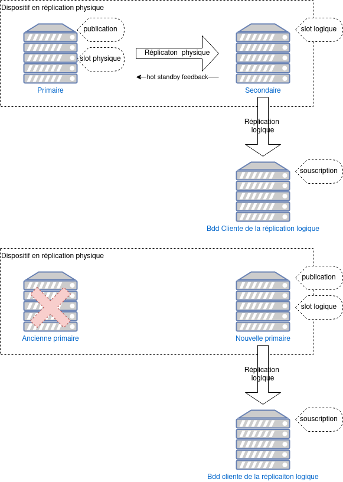

<!--
Les sources pour ce sujet sont :

* https://git.postgresql.org/gitweb/?p=postgresql.git;a=commit;h=6af1793954e
  Infrastructure
* https://git.postgresql.org/gitweb/?p=postgresql.git;a=commit;h=26669757b6a
  Invalidation des slots de réplication
* https://www.postgresql.org/message-id/E1pl4qQ-0021HA-Bw@gemulon.postgresql.org
  Le commit sur $SUBJECT

-->

<div class="slide-content">

  * Permet de :
    + créer un slot de réplication logique sur une standby
    + lancer le décodage logique sur une standby (!= réplication logique)
    + souscrire à une publication créée sur le primaire depuis une standby
  * Invalidation du slot de réplication logique en cas de :
    + conflit de réplication : utiliser un slot de réplication physique et le `hot_standby_feedback`
    + réduction du `wal_level` sur l'instance principale
  * Nouveau champ `confl_active_logicalslot` dans `pg_stat_database_conflicts`
  * Nouveau champ `conflicting` dans `pg_replication_slots`

</div>

<div class="notes">

Dans cette version de PostgreSQL, il est désormais possible de :

* créer un slot de réplication logique sur une standby ;
* lancer le décodage logique sur une standby ;
* souscrire à une publication créée sur le primaire depuis une standby.

Pour cela un certain nombre de changements ont dû être faits au niveau de
l'infrastructure de PostgreSQL.

### Modification de la structure des WAL

Sur une instance primaire, pour éviter de rejouer des modifications du
catalogue qui sont nécessaires à la réplication logique, PostgreSQL utilise
l'information `catalog_xmin` associée au slot de réplication (et que l'on
retrouve dans `pg_replication_slots`).

Si l'on utilise le décodage logique sur une instance secondaire, cette
information ne sera pas toujours disponible depuis l'instance primaire. Cette
dernière risque donc de nettoyer les lignes du catalogue système qui sont
nécessaires au décodage logique.

Deux stratégies de mise en place de la réplication sont concernées par ce
problème :

* `hot_standby_feedback` est désactivé ;
* `hot_standby_feedback` est activé sans slot de réplication, dans ce cas à
  la première déconnexion, la valeur du `catalog_xmin` est perdue.

Il a donc fallu ajouter des informations dans les journaux de transactions pour
marquer les modifications qui concernent le catalogue système et sont
nécessaires au décodage logique.

### Mettre en place une gestion des conflits sur les standby

Deux sources de conflits sont identifiées sur une instance secondaire :

1. des lignes du catalogue nécessaires au décodage logique sont supprimées ;
2. le paramètre `wal_level` est passé de `logical` à `replica` sur la primaire.

Dans ces deux cas, le slot de réplication doit être invalidé.

La colonne `confl_active_logicalslot` a été ajoutée à la vue
`pg_stat_replication_conflicts` pour détecter cette nouvelle source de
conflits.

### Création d'un slot de réplication sur une instance secondaire

Grâce aux modifications décrites précédemment, il est désormais possible
d'activer le décodage logique sur les instances secondaires. Pour cela, il faut
créer un slot de réplication logique.

Lorsque l'on passe la commande suivante, qui crée un slot de réplication
logique avec le plugin `test_decoding`, il est possible que la commande mette
un certain temps à être prise en compte.

```sql
SELECT pg_create_logical_replication_slot('slot_standby', 'test_decoding');
```
```console
 pg_create_logical_replication_slot
------------------------------------
 (slot_standby,0/205A658)
(1 row)
```

Cette attente est due au fait que, pour créer le slot, l'instance secondaire
doit traiter un enregistrement de WAL de type `xl_running_xact`. Cet
enregistrement contient des informations sur le prochain numéro de transaction,
le numéro de transaction active le plus ancien, le numéro de la dernière
transaction qui s'est terminée et un tableau de transactions actives. Pour qu'il
soit envoyé, il faut qu'il y ait de l'activité sur l'instance primaire.

<!--
##### src/include/storage/standbydefs.h
  44  /*
    1  * When we write running xact data to WAL, we use this structure.
    2  */
    3 typedef struct xl_running_xacts
    4 {
    5 >~~~int>>~~~>~~~xcnt;>~~>~~~>~~~/* # of xact ids in xids[] */
    6 >~~~int>>~~~>~~~subxcnt;>~~~>~~~/* # of subxact ids in xids[] */
    7 >~~~bool>~~~>~~~subxid_overflow;>~~~/* snapshot overflowed, subxids missing */
>>  8 >~~~TransactionId nextXid;>~>~~~/* xid from ShmemVariableCache->nextXid */
>>  9 >~~~TransactionId oldestRunningXid; /* *not* oldestXmin */
>> 10 >~~~TransactionId latestCompletedXid;>~~/* so we can set xmax */
   11
>> 12 >~~~TransactionId xids[FLEXIBLE_ARRAY_MEMBER];
   13 } xl_running_xacts;
-->

La commande suivante peut être exécutée sur le primaire afin de forcer
l'écriture d'un tel enregistrement et ainsi débloquer la création du slot.

```sql
SELECT pg_log_standby_snapshot();
```
```console
 pg_log_standby_snapshot
-------------------------
 0/205A658
(1 row)
```

Le slot est bien visible sur l'instance secondaire :

```sql
TABLE pg_replication_slots \gx
```
```console
-[ RECORD 1 ]-------+--------------
slot_name           | slot_standby
plugin              | test_decoding
slot_type           | logical
datoid              | 5
database            | postgres
temporary           | f
active              | f
active_pid          | ¤
xmin                | ¤
catalog_xmin        | 777
restart_lsn         | 0/209E148
confirmed_flush_lsn | 0/209E180
wal_status          | reserved
safe_wal_size       | ¤
two_phase           | f
conflicting         | f
```

### Décodage logique sur les instances secondaires

Si on crée de l'activité dans une table créée au préalable sur le primaire :

```sql
-- Définition de la table : CREATE TABLE matable(i int);
INSERT INTO matable VALUES (1),(2),(3);
DELETE FROM matable WHERE i = 1;
TRUNCATE matable ;
```

Les informations du décodage logique peuvent être consommées, soit : 

* avec la fonction `pg_logical_slot_get_changes()` :

  ```sql
  SELECT *
    FROM pg_logical_slot_get_changes('slot_standby', NULL, NULL, 'include-xids', '0');
  ```
  ```console
      lsn    | xid |                     data
  -----------+-----+-----------------------------------------------
   0/20935A8 | 769 | BEGIN
   0/20935A8 | 769 | table public.matable: INSERT: i[integer]:1
   0/20935E8 | 769 | table public.matable: INSERT: i[integer]:2
   0/2093628 | 769 | table public.matable: INSERT: i[integer]:3
   0/2093698 | 769 | COMMIT
   0/2093698 | 770 | BEGIN
   0/2093698 | 770 | table public.matable: DELETE: (no-tuple-data)
   0/2093700 | 770 | COMMIT
   0/2093700 | 771 | BEGIN
   0/2093978 | 771 | table public.matable: TRUNCATE: (no-flags)
   0/2093A20 | 771 | COMMIT
  (11 rows)
  ```

* en ligne de commande avec l'outil `pg_recvlogical` :

  ```bash
  pg_recvlogical --slot slot_standby --dbname postgres --start --file -
  ```
  ```console
  BEGIN 772
  table public.matable: INSERT: i[integer]:1
  table public.matable: INSERT: i[integer]:2
  table public.matable: INSERT: i[integer]:3
  COMMIT 772
  BEGIN 773
  table public.matable: DELETE: (no-tuple-data)
  COMMIT 773
  BEGIN 774
  table public.matable: TRUNCATE: (no-flags)
  COMMIT 774
  ```

* ou avec un outil développé par vos soins.

### Publications sur une instance secondaire

Il n'est pas encore possible de créer de publication sur une instance
secondaire, car l'instance est ouverte en lecture seule. Mais dans ce cas,
pourquoi peut-on créer un slot de réplication ?

La création d'un slot est possible, car le slot est représenté par un fichier
dans l'arborescence de PostgreSQL. Dans notre cas, c'est
`$PGDATA/pg_replslot/slot_standby/state`. `pg_replication_slot` est une vue qui
permet de visualiser les données de ce fichier.

```sql
-- description de la vue
\sv pg_replication_slots
-- ... et de la foncton associée
SELECT proname, description
  FROM pg_proc p
       INNER JOIN pg_description d ON p.oid = d.objoid
  WHERE proname = 'pg_get_replication_slots' \gx
```
```console
CREATE OR REPLACE VIEW pg_catalog.pg_replication_slots AS
 SELECT l.slot_name,
    l.plugin,
    l.slot_type,
    l.datoid,
    d.datname AS database,
    l.temporary,
    l.active,
    l.active_pid,
    l.xmin,
    l.catalog_xmin,
    l.restart_lsn,
    l.confirmed_flush_lsn,
    l.wal_status,
    l.safe_wal_size,
    l.two_phase,
    l.conflicting
   FROM pg_get_replication_slots() l(slot_name, plugin, slot_type, datoid, temporary, active, active_pid, xmin, catalog_xmin, restart_lsn, confirmed_flush_lsn, wal_status, safe_wal_size, two_phase, conflicting)
     LEFT JOIN pg_database d ON l.datoid = d.oid

-[ RECORD 1 ]-----------------------------------------------------
proname     | pg_get_replication_slots
description | information about replication slots currently in use
```

<!--

[benoit@benoit-dalibo ~]$ less /home/benoit/var/lib/postgres/pgsql-16S/pg_replslot/slot_standby/state
00000000: a11c 0501 bca9 3e52 0300 0000 b800 0000  ......>R........
00000010: 736c 6f74 5f73 7461 6e64 6279 0000 0000  slot_standby....
00000020: 0000 0000 0000 0000 0000 0000 0000 0000  ................
00000030: 0000 0000 0000 0000 0000 0000 0000 0000  ................
00000040: 0000 0000 0000 0000 0000 0000 0000 0000  ................
00000050: 0500 0000 0000 0000 0000 0000 0703 0000  ................
00000060: d082 0902 0000 0000 0000 0000 0000 0000  ................
00000070: d082 0902 0000 0000 0000 0000 0000 0000  ................
00000080: 0074 6573 745f 6465 636f 6469 6e67 0000  .test_decoding..
00000090: 0000 0000 0000 0000 0000 0000 0000 0000  ................
000000a0: 0000 0000 0000 0000 0000 0000 0000 0000  ................
000000b0: 0000 0000 0000 0000 0000 0000 0000 0000  ................
000000c0: 0000 0000 0000 0000                      ........

-->

Une publication est représentée par des méta-données écrites dans une table du
catalogue (`pg_publication`) :

```sql
\dt pg_publication
```
```console
               List of relations
   Schema   |      Name      | Type  |  Owner
------------+----------------+-------+----------
 pg_catalog | pg_publication | table | postgres
(1 row)
```

Il est par contre possible de créer une souscription qui pointe vers l'instance
secondaire. Cette dernière connait les informations de la publication
puisqu'elles sont disponibles dans le catalogue.

Créons une publication sur l'instance primaire :

```sql
CREATE PUBLICATION pub FOR TABLE matable;
```

On voit bien ses méta-données sur l'instance secondaire :

```sql
TABLE pg_publication_tables ;
TABLE pg_publication;
```
```console
 pubname | schemaname | tablename | attnames | rowfilter
---------+------------+-----------+----------+-----------
 pub     | public     | matable   | {i}      | ¤
(1 row)

  oid  | pubname | pubowner | puballtables | pubinsert | pubupdate | pubdelete | pubtruncate | pubviaroot
-------+---------+----------+--------------+-----------+-----------+-----------+-------------+------------
 16409 | pub     |       10 | f            | t         | t         | t         | t           | f
(1 row)
```

Sur une troisième instance, créons une souscription (par soucis de simplicité
la réplication utilise un socket sans authentification et l'utilisateur
`postgres`):

```sql
CREATE TABLE matable(i int);
CREATE SUBSCRIPTION sub
       CONNECTION 'host=/var/run/postgresql port=5439 user=postgres dbname=postgres'
       PUBLICATION pub;
```
```console
CREATE TABLE
NOTICE:  created replication slot "sub" on publisher
CREATE SUBSCRIPTION
```

Comme la souscription crée un slot sur l'instance secondaire, s'il n'y a pas
d'activité sur le primaire, il faudra y exécuter la fonction
`pg_log_standby_snapshot()` pour éviter l'attente.

Les modifications faites sur le primaire seront alors visibles dans la table
sur la troisième instance.

On peut voir que le slot est bien créé sur l'instance secondaire et est
actif :

```sql
TABLE pg_replication_slots \gx
```
```console
-[ RECORD 1 ]-------+--------------
slot_name           | sub
plugin              | pgoutput
slot_type           | logical
datoid              | 5
database            | postgres
temporary           | f
active              | t
active_pid          | 610195
xmin                | ¤
catalog_xmin        | 777
restart_lsn         | 0/209E148
confirmed_flush_lsn | 0/209E180
wal_status          | reserved
safe_wal_size       | ¤
two_phase           | f
conflicting         | f
```

### Conflits de réplication

Si l'on ne prend pas de précautions particulières, une modification du
catalogue peut provoquer un conflit de réplication.

En guise d'exemple, ajoutons une clé primaire sur la table `matable` :

```sql
TRUNCATE matable;
ALTER TABLE matable PRIMARY KEY (i);
INSERT INTO matable(i) VALUES (1);
```

On constate que les informations n'atteignent pas la troisième instance.

En regardant dans les traces de l'instance, on voit le message.

```console
ERROR:  could not receive data from WAL stream: ERROR:  canceling statement due to conflict with recovery
DETAIL:  User was using a logical replication slot that must be invalidated.
LOG:  background worker "logical replication worker" (PID 614482) exited with exit code 1
```

Sur l'instance secondaire, le slot est invalidé :

```sql
TABLE pg_replication_slots \gx
```
```console
-[ RECORD 1 ]-------+----------
slot_name           | sub
plugin              | pgoutput
slot_type           | logical
datoid              | 5
database            | postgres
temporary           | f
active              | f
active_pid          | ¤
xmin                | ¤
catalog_xmin        | 803
restart_lsn         | 0/21A34E8
confirmed_flush_lsn | 0/21AFE88
wal_status          | lost
safe_wal_size       | ¤
two_phase           | f
conflicting         | t
```

Un conflit est aussi visible dans la vue `pg_stat_database_conflicts` :

```sql
SELECT datname, confl_active_logicalslot
  FROM  pg_stat_database_conflicts
 WHERE datname = 'postgres' \gx
```
```console
-[ RECORD 1 ]------------+---------
datname                  | postgres
confl_active_logicalslot | 1
```

L'instance qui porte la souscription tente de se reconnecter en boucle, on
trouve donc le message suivant dans les traces de l'instance secondaire.

```console
STATEMENT:  START_REPLICATION SLOT "sub" LOGICAL 0/21AEEB8 (proto_version '4', origin 'any', publication_names '"pub"')
ERROR:  can no longer get changes from replication slot "sub"
DETAIL:  This slot has been invalidated because it was conflicting with recovery.
```

Il est possible de créer la souscription avec l'option `disable_on_error` afin
d'éviter que la souscription ne se reconnecte en boucle :

```sql
CREATE SUBSCRIPTION sub 
       CONNECTION 'host=/var/run/postgresql port=5439 user=postgres dbname=postgres'
       PUBLICATION pub 
       WITH ( disable_on_error = true );
```

On voit alors le message suivant dans les traces de la troisième instance :

```console
LOG:  subscription "sub" has been disabled because of an error
```

Mettre en place la réplication physique avec un slot de réplication et le
`hot_standby_feedback` permet de se protéger contre ce genre de problème.

### Bascules et décodage logique

Si on déclenche une bascule sur l'instance secondaire, la réplication logique
continue de fonctionner sans interruption, comme le montre le schéma
ci-dessous.

{ height=600 }

Cette fonctionnalité ne permet donc pas de synchroniser les slots de
réplication logique entre primaire et secondaire ce qui permettrait de faire
basculer la réplication logique lors d'un failover (bascule non programmée).
[Patroni] dispose d'une fonctionnalité qui permet de faire cela. Une
[discussion] est en cours sur la mailing list hackers pour rendre cela possible
directement dans PostgreSQL. 

* [Discussion](https://commitfest.postgresql.org/44/4423/)
* [Patroni](https://github.com/zalando/patroni/)

</div>
